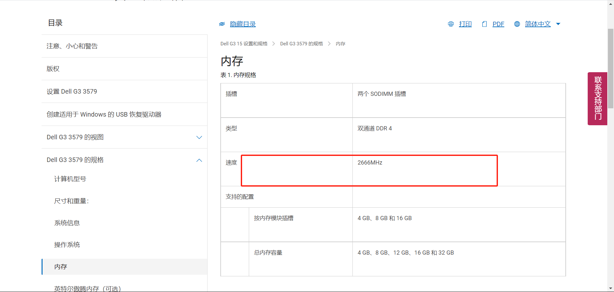

# [装机 | 配置升级] 内存篇

内存也称内存储器和主存储器，它用于暂时存放CPU中的运算数据，与硬盘等外部存储器交换的数据。

## 一、部分内存参数

我们一般能在内存条（SDRAM）的标签上的可以看到型号和参数。型号是内存条厂商自己定义的，不同厂商的定义规则不一致，
一般可以通过型号识别内存参数；同时在内存条标签上同样会标识参数，参数的定义基本遵循行业标准，
可以直观的识别内存的性能。有些厂商不会在内存条上打印参数，对识别内存性能带来一些困难。

正常的表示方法遵循如下格式：“容量 内存颗粒数 代数-速率(标识) 时延 电压”，如4GB 2Rx8 PC3-1200S-11-11-E3

1. 内存容量
   数字越大说明临时存储越大，常见的有16GB、8GB、1GB、512MB、256MB等。

   一般而言，普通家用/商务办公8G内存可以满足全部需要。
   游戏发烧友或者高端用户可以选择16G内存可以满足全部需要。
   特别场景需求的用户根据自己的需求选择32G或者更高的内存。

2. 内存颗粒数
   内存颗粒数表示内存颗粒的数量和焊接面数，格式为aRxb，如2Rx8。1R代表只有单面有内存颗粒，2R代表两面都有内存颗粒；x8代表每面的内存颗粒数。2Rx8代表单面有8个内存颗粒，共有16个。

3. 内存代数
目前为止市场上常见的内存主要为DDR内存，共有五代。表示方式为PC1、PC2、PC3、PC4、PC5。**不同代数之间内存是不兼容的，不能混用，**在金手指插口处做了防呆处理，不同的代数金手指处防呆口的位置不一致。

如后面带有L，则代表低压版本，如PC3L。

4. 内存频率（内存速率）
用来表示内存的速度，它代表着该内存所能达到的最高工作频率。
内存实际工作频率取决于**CPU的内存频率，主板支持的内存频率，内存自身最高频率，**三者的最低值。

笔记本内存频率，由于笔记本拆卸不如台式机方便，而且移动办公的存在，所以对内存的稳定性要求较高，通常不建议安装不同品牌、不同容量、不同频率的内存条。不过鉴于许多用户购买笔记本时间较久，寻找相同的内存条较为不易，所以一般可以考虑不同品牌（建议选购大品牌，产品性能更稳定）不同容量（比如原有为4G，新购8G内存条或者是4G的都没关系，只要系统支持就好）、相同频率的内存即可（内存频率保持一致比较好，买高了会降频使用，浪费资源和性能，买低了会拉低原有内存频率也不好，而且内存频率不一致时发生兼容性问题几率更大）。

## 二、如何确认该购买哪种频率的内存

### 2.1 CPU的内存频率
1. 在 [Intel产品规格页面](https://ark.intel.com/content/www/cn/zh/ark.html)找到自己的产品，查看对应的参数，如下：

2. 使用 ` cat /proc/cpuinfo |grep MHz|uniq ` 命令，该命令中`uniq`是去重效果，效果如下：

Tips：
`cat /proc/cpuinfo |grep MHz` 中的值是`CPU`实际使用主频，与官网的参数不同。

### 2.2 主板支持的内存频率
可以查询笔记本的主板芯片组是那种，然后根据芯片组查询对应的最大频率。

根据笔记本型号在品牌官网查询主板芯片组型号。

### 2.3 查看当前内存条的频率

1. 使用`wmic memorychip get speed`命令查询，结果如下：

### 2.4 也可以根据笔记本型号直接在官网查询支持的内存频率

如下：

> 内容参考：
> 
> [如何查看笔记本内存频率](https://test.crucial.cn/articles/about-memory/how-to-check-a-laptop-memory-frequency "如何查看笔记本内存频率")
> 
> [如何读懂内存条参数(如何读懂内存条参数表)](https://www.luyouqi.com/shezhi/26217.html "如何读懂内存条参数(如何读懂内存条参数表)")
> 
> [探讨内存基础知识和如何选择内存条](https://www.zhihu.com/tardis/zm/art/257286284?source_id=1003 "探讨内存基础知识和如何选择内存条")
> 
> [Linux 查看 CPU 型号及内存频率及其它信息的命令](https://www.jianshu.com/p/184b6fcbef67 "Linux 查看 CPU 型号及内存频率及其它信息的命令")
> 
> [内存的实际工作频率到底和什么有关？什么是标称频率？一文读懂内存频率](https://zhuanlan.zhihu.com/p/342995382 "内存的实际工作频率到底和什么有关？什么是标称频率？一文读懂内存频率")
