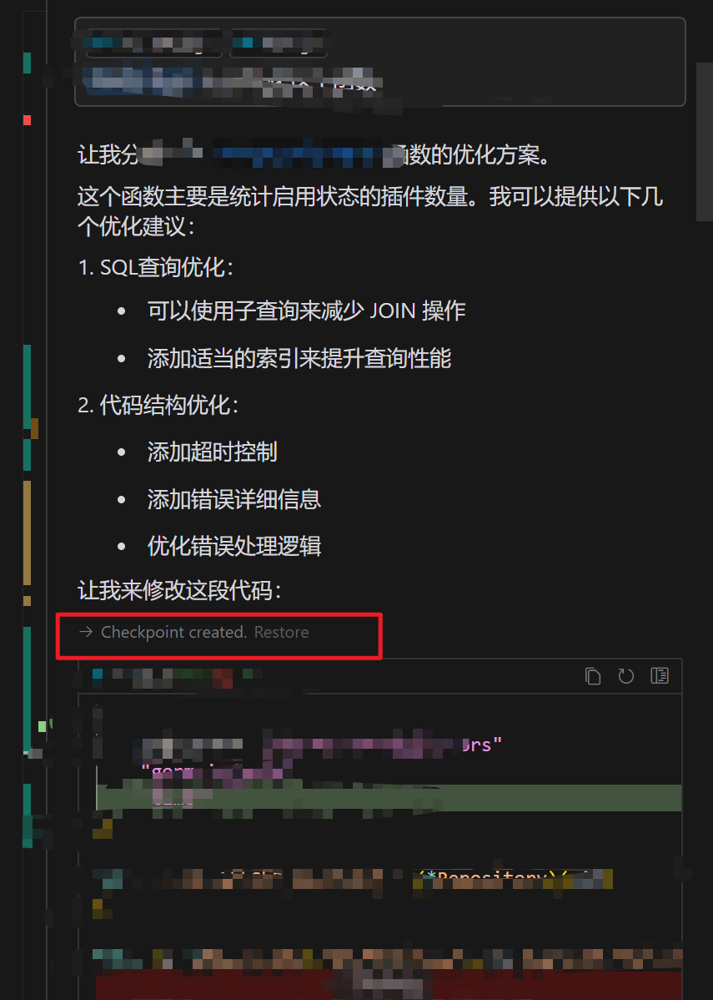
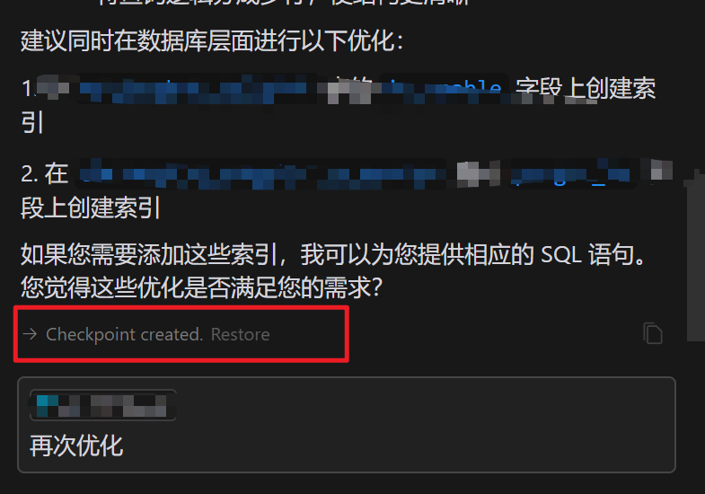
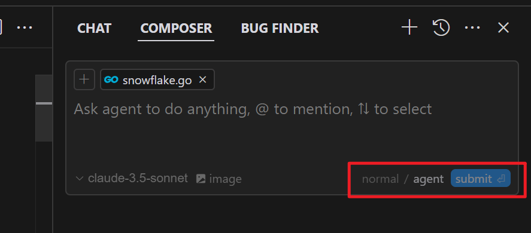
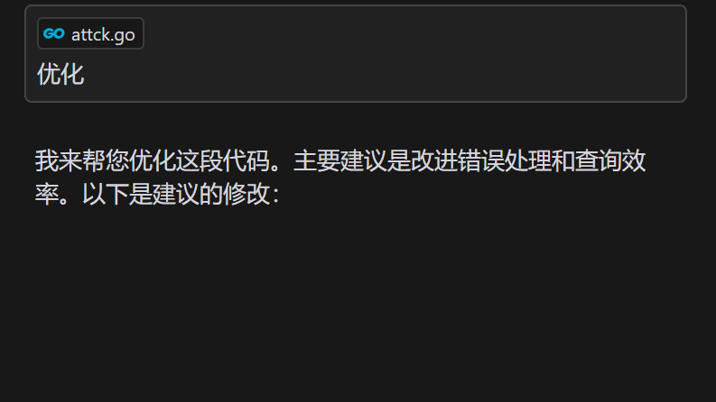
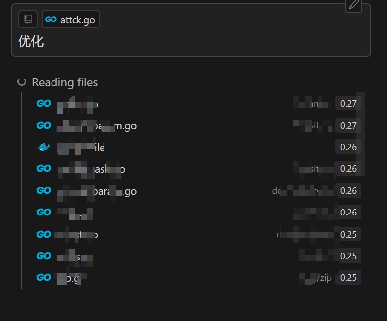
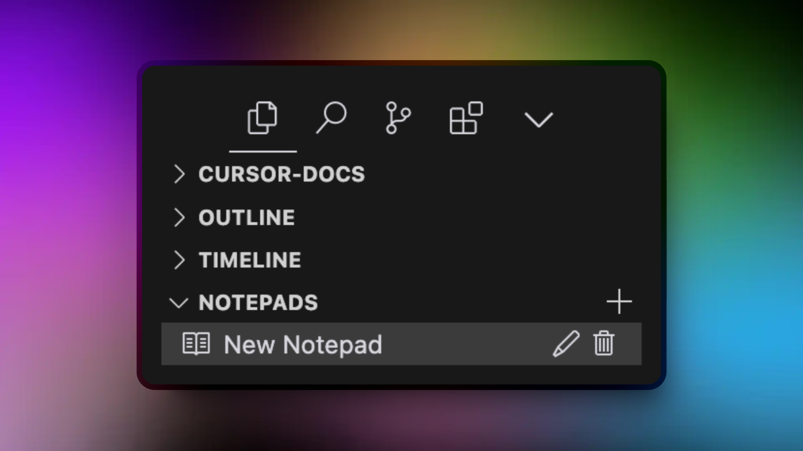

## 一、cursor/vscode 插件推荐

- code runner：代码运行
- error lens：
- gitlens：像 goland 一样，每行提示 git 信息
- Go
- JetBrains IDE Keymap：IDE 快捷键
- Markdown All in One：markdown 插件
  - Ctrl + Shift + V：markdown 预览
- Markdown Previce Nnhanced：
- Paste Image：
- vscode-icons：文件图标
- vscode-proto3：protobuf 插件

## 二、如何在开发过程中使用 cursor

### 1、Tab

- 自动补全

### 2、Composer And Agent

Composer：

- Ctrl + i:打开 composer
- Ctrl + n:创建新 composer/chat（在 composer 打开的情况下使用）
- 包含两种模式：normal/agent（在一个聊天线程使用之前配置，使用过程中不支持切换）
    - normal：读取和写入代码。更快，与所有模型兼容。
    - agent：推理能力及调用 MCP服务器（Model Context Protocol，即上下文）
- checkpoints（检查点）：每次利用该功能生成代码，修改文件，都会生成一个 检查点（checkpoints），可以用检查点回退到检查点时的代码。检查点位置如下：
- 
- 

Agent：代理可访问多个工具，包括阅读与编写代码、搜索代码库、调用 MCP 服务器、运行终端命令。

代理的推理能力使其能够执行许多连续动作，而无需过多监督，从而实现一些非常强大的工作流程

YOLO 模式：启用 Yolo 模式后，Agent 可以自行执行终端命令。这在运行测试套件时特别有用。
向 Agent 下达任务以及如何验证更改（运行测试），它将一直继续，直到任务完成。（可以设置终端可以执行哪些命令，禁止执行哪些命令）

下图中标注了更改 normal\agent 模式的位置：

> chat 和 composer 的区别：
> chat 帮助您搜索和理解您的代码。使用它来探索您的代码库，提问并获得解释。
> Composer 帮助您编写和编辑代码。它提供了一个工作区，您可以在其中生成新代码并将更改直接应用到您的文件中。

在 chat 和 composer 模式下，输入内容之后，有两种确定内容的方式：
- 使用 Enter 确定内容

- 使用 Ctrl + Enter 确定内容
  - Chat 会扫描您的索引代码库以找到相关代码片段。这通常有助于快速将代码片段纳入对话的上下文中。为了更好地控制代码库搜索并提高准确性，您可以使用 @codebase 。
  

### 3. Ctrl + K

行内生成，使用 Ctrl + K 在光标所在行生成代码。
- 如果您按下 Ctrl/Cmd K 时没有选择代码，光标将根据您在提示栏中输入的提示生成新的代码。
- 如果您按下 Ctrl/Cmd K 时选择代码，光标将根据您在提示栏中输入的提示修改选中的代码。

在终端（Terminal）使用 Ctrl + K。描述自己想要执行的操作，终端（Terminal）会生成对应命令：
- 按下 Esc 将关闭 AI终端，但是不会清除在终端（Terminal）生成的命令
- 按下 Ctrl + Enter 会立即运行命令。
- 默认情况下，终端 Cmd K 会看到你的最近终端历史、你的指令以及你在提示栏中输入的任何内容作为上下文。

### 4. 测试功能

#### 4.1 Notepads（笔记本）

记事本是 Cursor 中强大的上下文共享工具，它弥合了创作者与聊天互动之间的差距。把它们想象为超越了 .cursorrules 功能的增强型参考文档，让您能够为您的开发工作流程创建可重复使用的上下文。

便签用于收集想法、规则和文档，可以是：
- 共享于您的开发环境的不同部分
- 引用方式为 @ 语法
- 增强文件附件
- 用作各种开发场景的动态模板

#### 4.2 使用方式

#### 4.3 关键特性

- 上下文共享：无缝在作曲家和聊天之间共享上下文
- 文件附件：附加文档和参考文件（在 .cursorrules 中不可用）
- 动态引用：使用 @ 提及链接到其他资源
- 灵活内容：根据您的需求编写和结构化信息

#### 4.3 常见用例

- 动态模板生成
  - 创建常见代码模式的模板
  - 存储特定项目的脚手架规则
  - 保持团队代码结构一致
- 架构文档
  - 前端规范
  - 后端设计模式
  - 数据模型文档
  - 系统架构指南
- 开发指南
  - 编码规范
  - 项目特定规则
  - 最佳实践
  - 团队规范

#### 4.4 应该写什么？不应该写什么

应该写什么：
- 项目架构决策
- 开发指南和标准
- 可重用代码模板
- 文档需要频繁引用
- 团队特定惯例和规则

不应该写什么：
- 临时笔记或草稿
- 信息属于版本控制（如 git）
- 敏感数据或凭证
- 高度波动且频繁变化的信息

> [cursor 快捷键]([URL](https://docs.cursor.com/kbd) "cursor 快捷键")

> 参考链接：
>
> [史上最全的Cursor IDE教程 _](https://www.cnblogs.com/ProsperousEnding/p/18660153 "史上最全的Cursor IDE教程 _")