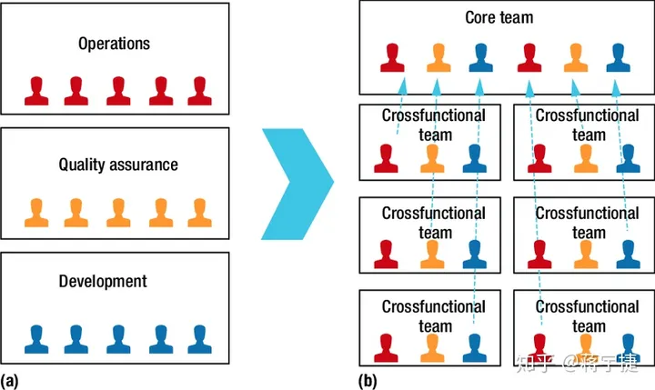
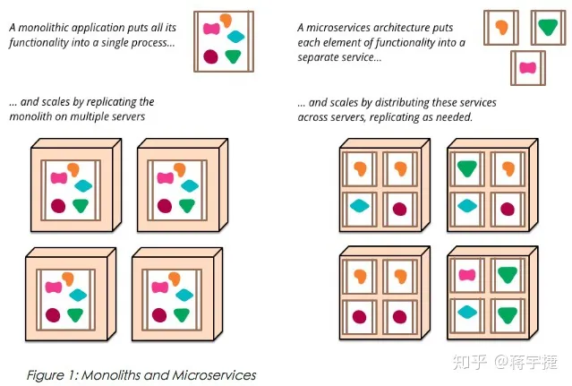

什么是云原生

云原生的特点

为什么选择云原生

云原生技术栈

云原生岗位类别

微服务的拆分，其实是组织形式的拆分。

在某些文章中，认为微服务的切割应该按照组织架构来划分，我反而觉得应该按微服务的分割方式来划分组织架构，因为归根结底，组织架构应该为业务服务，而不是业务为组织服务，组织需要贯彻执行微服务的理念，就必须由微服务驱动组织业务的不断迭代演进。

待读清单：

> [已来到 “后云原生时代” 的我们，如何规模化运维？](https://www.infoq.cn/article/xlvgbzrvawlwhibhdboi "已来到 “后云原生时代” 的我们，如何规模化运维？")
> [云原生时代](https://zhuanlan.zhihu.com/p/149658062 "云原生时代")
> [从数字化转型到云原生](https://blog.51cto.com/ITEvan/6461730 "从数字化转型到云原生")
> [微服务资源指南](https://blog.wangheng.ca/2018/08/06/2018-08-06-Microservices-Resource-Guide/ "微服务资源指南")
> [微服务](https://blog.cuicc.com/blog/2015/07/22/microservices/#%E8%BF%9B%E5%8C%96%E5%BC%8F%E8%AE%BE%E8%AE%A1 "微服务")

> 参考链接：
>
> [云原生时代](https://zhuanlan.zhihu.com/p/149658062 "云原生时代")
>
> [英文博客](URL "英文博客")
> 
> [英文博客](URL "英文博客")
> 
> [英文博客](URL "英文博客")
> 
> [英文博客](URL "英文博客")
> 