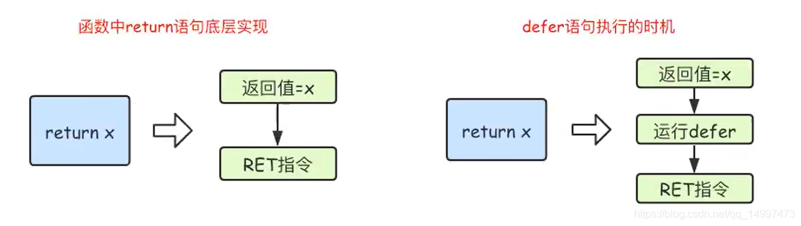

## 二、[Go基础] 一文讲透 Go 中的 defer 延迟调用

## 1、defer 的特性

1. **延迟执行**：`defer` 声明时会先计算确定参数的值，`defer` 推迟执行的仅是其函数体
```go
func printA(a int) {
	fmt.Println("value of a in deferred function", a)	// value of a in deferred function 5
}
func main() {
	a := 5
	defer printA(a)
	a = 10
	fmt.Println("value of a before deferred function call", a) // value of a before deferred function call 10
}
```
2. **后进先出**：先声明的 `defer` 后执行（倒序执行 `defer` 语句）
3. `defer` 的**值拷贝和值引用**：
   - 如果没有定义传参，那就是用 `defer` 外的同名变量，而且是采用值引用的方式
   - 如果定义了传参，那就是值拷贝，不影响 `defer` 外边的变量
4. `defer` 的**执行条件**：`defer` 会在包含 `defer` 的函数执行完毕时触发，不管是正常执行完还是 `panic`
   - 正常 `return`
   - `panic`（会执行 `panic` 之前的所有 `defer`，然后引发崩溃）
   - 主动调用 `os.Exit(int)` 退出进程时，`defer` 将不再被执行。

## 2、defer 的应用

- **资源管理**：在打开文件、数据库连接或网络连接等资源后，使用 `defer` 确保在函数执行完毕后及时关闭资源，避免资源泄漏。

- **清理和维护**：用于执行清理操作，例如在函数执行后处理临时变量、释放锁或清理临时状态。

- **异常处理**：可用于处理函数中的异常或错误，通过 `recover()` 捕获 `panic`，在 `defer` 中进行处理。

- **日志记录**：可以用于记录函数的开始和结束信息，类似于函数的入口和出口日志。

- **性能分析**：用于统计函数执行时间或其他性能相关数据，例如在函数开始和结束时记录时间戳。

## 3、前置知识 —— 深入了解为什么会造成defer的坑

在讲解`defer`使用中的坑之前，需要一些铺垫知识。我们先讲解一下**匿名返回值**与**命名返回值**，以及 **`return`的执行**。

### 3.1 return 的执行

关于`go`中`retuen`的执行，与 `defer` 的执行顺序息息相关。`return` 的执行并**不是原子性**的，而是分为两步执行，第一步先对返回值
进行**赋值操作**，第二步再执行**返回操作**。而 `defer` 则执行在这两步中间。


### 3.2 匿名返回值

顾名思义，匿名返回值即在函数定义时不定义返回值变量，而只用类型作为占位符。如下：

```go
func a() int {
	i := 1
	return i // 
}
```

对于匿名返回值的 `return` 来说，第一步赋值操作会新建一个**临时变量**来存储返回值，对于该示例来说，即会创建一个临时变量比如说为 `x` ，
`x=i=1`。

### 3.3 命名返回值

相对于匿名返回值，命名返回值即在函数定义时，为函数返回值指定变量名称。如下：
```go
func a() (x int) {
	i := 1
	return i // 
}
```

对于命名返回值的 `return` 来说，第一步赋值操作会**更改已命名返回值变量的值**，对于该示例来说，即`x=i=1`。

理解了这些前置知识，那么我们来看一看不同场景下的“坑”是怎么来的吧！


## 4、defer 中的坑

## 4.1 defer 结合匿名返回值

## 4.1.1 结合匿名返回值

```go
func main() {
	aa := a()
	fmt.Println("main :", aa) // main : 0
}
func a() int {
	i := 0
	defer func() {
		i++
		fmt.Println("defer", i) // defer : 1
	}()
	return i
}
```

解释：结合前面的知识，该示例的 `return` 步骤应该是：
1. 临时变量（假设为`x`） `x = i = 0`（这里为赋值操作，`x`和`i`不是同一块内存地址，只是将`0`存储到`x`的内存地址）
2. 执行`defer i++`
3. 返回临时变量`x = 0`

### 4.1.2 结合引用类型

```go
func main() {
	aa := a()
	fmt.Println("main :", *aa) // main : 1
}
func a() *int {
	i := 0
	defer func() {
		i++
		fmt.Println("defer", i) // defer : 1
	}()
	return &i
}
```

解释：结合前面的知识，该示例的return步骤应该是：
1.  临时变量（假设为`x`）`x = &i = 0xc00000a0c8` （这里为赋值操作，将`i`的地址存储到给`x`的内存地址）
2. 执行`defer i++`
3. 返回变量`x = &i = 0xc00000a0c8`

## 4.2 defer 结合命名返回值

### 4.2.1 结合命名返回值

```go
func main() {
	aa := a()
	fmt.Println("main :", aa) // main : 1
}
func a() (x int) {
	defer func() {
		x++
		fmt.Println("defer :", x) // defer : 1
	}()
	return x
}
```

解释：结合前面的知识，该示例的`return`步骤应该是：
1.  `x = x = 0`（这里为赋值操作，`x`是同一块内存地址，将`0`赋值到`x`的内存地址）
2. 执行`defer x++`（这里改变的是`x`的内存地址中存储的数值）
3. 返回变量`x = x = 1`

### 4.2.2 结合局部变量

```go
func main() {
	aa := a()
	fmt.Println("main :", aa) // main : 0
}
func a() (x int) {
	i := 0
	defer func() {
		i++
		fmt.Println("defer", i) // defer : 1
	}()
	return i
}
```

解释：结合前面的知识，该示例的`return`步骤应该是：
1. `x = i = 0`（这里为赋值操作，`x`和`i`不是同一块内存地址，将`0`赋值到`x`的内存地址）
2. 执行`defer i++`
3. 返回变量 `x = 0`

### 4.2.2 结合defer局部变量

```go
func main() {
	aa := a()
	fmt.Println("main :", aa) // main : 0
}
func a() (x int) {
	defer func(x int) {
		x++
		fmt.Println("defer :", x)  // defer : 1
		fmt.Println("defer :", &x) // defer : 0xc00000a0e8
	}(x)
	fmt.Println("a :", &x) // a : 0xc00000a0c8
	return x
}
```

解释：结合前面的知识，该示例的`return`步骤应该是：
1. `x = x = 0`（这里为赋值操作，`x`是同一块内存地址，将`0`赋值到`x`的内存地址）
2. 执行`defer x++` (这里`defer`进行了参数命名，这里会生成一个局部变量 `x` ，这个`x`是`defer`作用域下的`x`，和`defer`外的不是一个`x`)
3. 返回变量 `x = 0`


> 参考链接：
> 
> [3.4 defer关键字](https://tiancaiamao.gitbooks.io/go-internals/content/zh/03.4.html "3.4 defer关键字")
> 
> [Golang defer详解](https://zhuanlan.zhihu.com/p/621817134 "Golang defer详解")
> 
> [Golang return操作深入理解](https://blog.csdn.net/qq_14997473/article/details/116449166 "Golang return操作深入理解")
> 
> [Go的匿名返回值和命名返回值](https://yunsonbai.top/2022/01/12/go-return/ "Go的匿名返回值和命名返回值")
> 
> [go语言中匿名返回值和命名返回值对defer的影响](https://blog.csdn.net/MrQkeil/article/details/104359630 "go语言中匿名返回值和命名返回值对defer的影响")
