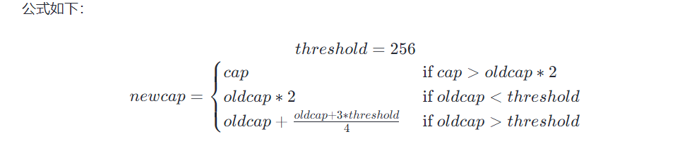

## 三、[Go基础] Slice切片

切片是 `Golang` 中非常独特的一种内置类型。它基于数组，比数组更灵活，使用范围更广。

## 1、数组

在 `Golang` 中，数组有如下特性：

1. 大小固定：数组是固定大小的，一旦定义了大小，就无法更改。
2. 数据类型相同：数组中的元素类型必须相同。
3. 直接使用数组名：可以直接使用数组名引用整个数组。
4. 值传递：将数组传递给函数时会进行值拷贝。
5. 长度是类型的一部分：不同长度的数组是不同类型的。

## 2、`Slice` 切片

### 2.1 切片的构成

在 `Go` 中，切片是对数组片段的引用。切片包含以下组成部分：

1. 指针（Pointer）：指向切片中的第一个元素。
2. 长度（Length）：切片中的元素数量。
3. 容量（Capacity）：底层数组中从切片的第一个元素开始到数组末尾的元素数量。

指针指向第一个 `slice` 元素对应的底层数组元素的地址，要注意的是 **`slice` 的第一个元素并不一定就是数组的第一个元素**。

### 2.2 切片的特性

1. 动态大小：切片是对数组的动态视图，可以根据需要调整大小。
2. 引用底层数组：切片引用了底层数组的一部分。
3. 长度和容量：切片有长度和容量，长度是指切片当前包含的元素个数，容量是指底层数组中可容纳的元素个数。
4. 引用传递：切片作为参数传递时，实际传递的是底层数组的引用。
5. `append` 函数：用于向切片末尾添加元素，如果底层数组容量不够，会创建一个新的底层数组并将元素复制过去。

### 2.3 切片的扩容机制

切片的扩容机制在 `Go1.18` 之后做了修改。

#### 2.3.1 `Go1.18` 之前

- 当新切片需要的容量 `cap` 大于两倍扩容的容量，则直接按照新切片需要的容量扩容；
- 当原 `cap(slice) < 1024` 的时候，新 `slice` 容量变成原来的 `2` 倍；
- 当原 `cap(slice) > 1024`，进入一个循环，每次容量变成原来的 `1.25` 倍,直到大于期望容量。


#### 2.3.2 `Go1.18` 之后

- 当新切片需要的容量 `cap` 大于两倍扩容的容量，则直接按照新切片需要的容量扩容；
- 当原 `cap(slice) < threshold` 的时候，新 `slice` 容量变成原来的 `2` 倍；
- 当原 `cap(slice) > threshold` 的时候，进入一个循环，每次容量增加`（旧容量+3*threshold）/4`。



### 2.4 `nil`切片和`len(slice)==0`的切片的区别

`nil`切片是只进行了声明，但是未进行初始化操作，没有分配内存空间；`len(slice)==0`为分配了内存空间，但是没有元素。

```go
package main

import "fmt"

func main() {

	var aa []int

	fmt.Println(aa == nil)

	aa = append(aa, 1)

	bb := make([]int, 0)

	fmt.Println(bb == nil)

	cc := []int{}

	fmt.Println(cc == nil)

}

```

输出结果：

```text
true
false
false
```

## 3、数组和切片的异同

1. 内部结构：数组在内存中是一段连续的内存空间，元素的类型和长度都是固定的。切片在内存中由一个指向底层数组的指针、长度和容量组成，长度表示切片当前包含的元素个数，容量表示切片可以扩展的最大元素个数。
2. 长度：数组的长度在创建时指定，不能更改。切片的长度可以动态扩展或收缩，可以根据需要自由调整。
3. 引用类型：切片是引用类型，传递时会传递指向底层数组的引用；数组是值类型，传递时会复制其值。


### 3.1 数组和切片的 `for...range`

`for...range`会复制一个副本，然后对副本进行取值，这里可能会有一些“坑”。

#### 3.1.1 数组

```go
package main

import "fmt"

func main() {

	aa := [5]int{1, 2, 3, 4, 5}

	for i, v := range aa {
		fmt.Printf("Value: %d Value-Addr: %X ElemAddr: %X\n", v, &v, &aa[i])
		aa[2] = 222
	}

	fmt.Println(aa)

}

```

输出结果：

```text
Value: 1 Value-Addr: C00000A0C8 ElemAddr: C00000C360
**Value: 2 Value-Addr: C00000A0C8 ElemAddr: C00000C368**    因为数组是值类型，副本是range的时候复制的，循环中的修改不会影响副本的值
Value: 3 Value-Addr: C00000A0C8 ElemAddr: C00000C370
Value: 4 Value-Addr: C00000A0C8 ElemAddr: C00000C378
Value: 5 Value-Addr: C00000A0C8 ElemAddr: C00000C380
[1 2 222 4 5]   
```

#### 3.1.2 切片

```go
package main

import "fmt"

func main() {

	aa := []int{1, 2, 3, 4, 5}

	for i, v := range aa {
		fmt.Printf("Value: %d Value-Addr: %X ElemAddr: %X\n", v, &v, &aa[i])
		aa[2] = 222
	}

	fmt.Println(aa)

}
```

输出结果：

```text
Value: 1 Value-Addr: C00000A0C8 ElemAddr: C00000C360
Value: 2 Value-Addr: C00000A0C8 ElemAddr: C00000C368  
**Value: 222 Value-Addr: C00000A0C8 ElemAddr: C00000C370**  因为切片是引用类型，复制的副本也是引用类型，循环中的修改会影响副本的值
Value: 4 Value-Addr: C00000A0C8 ElemAddr: C00000C378  
Value: 5 Value-Addr: C00000A0C8 ElemAddr: C00000C380  
[1 2 222 4 5]
```

> 参考链接：
>
> [Go 1.18 全新的切片扩容机制](https://juejin.cn/post/7101928883280150558 "Go 1.18 全新的切片扩容机制")
>
> [Go 语言切片是如何扩容的？](https://www.51cto.com/article/750934.html "Go 语言切片是如何扩容的？")

