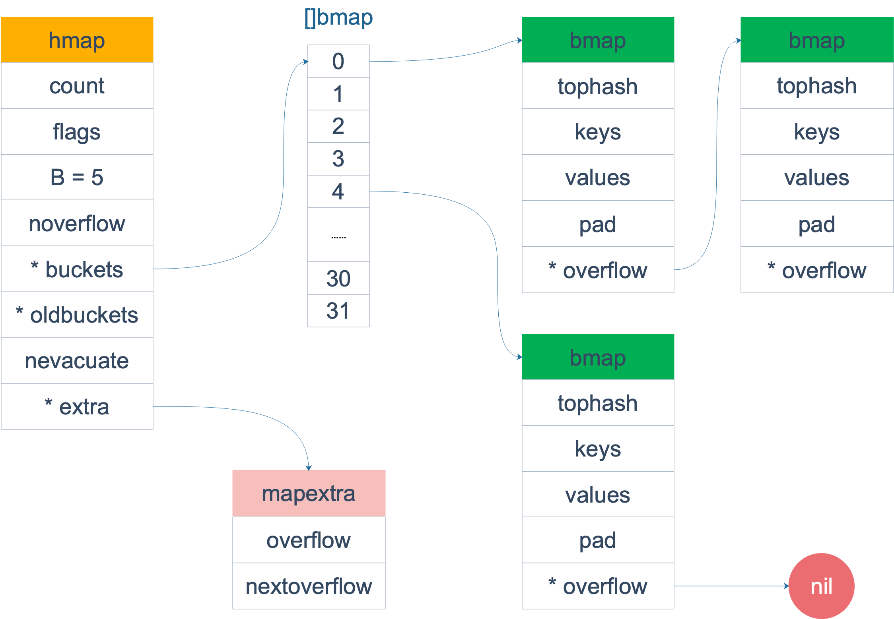

## 四、[Go基础] 一文讲透 Go 中的 map

## 0. 前言

因为本文编写时间跨度较大，有些名词可能不相符，这里做些提醒：

- bucket 和桶是一个意思
- oldXXX 是扩容前的字段数值，newXXX 是扩容后的字段数值（为了方便写文章，我自己写的），相对典型的就是 oldB 和 newB ，分别指扩容前的 B 和扩容后的 B。

## 1、map 的概念

map 是 key-value 结构，其中 key 是可比较的类型，在每一个 map 中 key 都是唯一的。

## 2、map 的使用

当使用 Go 语言中的 map 时，你可以按照以下步骤进行操作：

### 2.1 初始化声明

````go
// 1. 使用make初始化一个空map，容量可以省略
myMap := make(map[keyType]valueType, 10)

// 2. 直接声明和初始化
myMap := map[keyType]valueType{
key1: value1,
key2: value2,
// ...
}
````

> Tips:
> 只声明不初始化，则为nil，代表没有初始化内存空间，map 为 nil时，不能向其添加元素，会直接panic。
> 在初始化map时，要估算好map的容量，避免在程序运行期间在动态扩容（动态扩容会影响程序运行效率）

### 2.2 增加元素

```go
myMap[key] = value // 直接给指定键设置对应的值
```

### 2.3 删除元素

```go
delete(myMap, key) // 根据键删除元素，删除不存在的key也不会报错
```

### 2.4 修改元素

```go
myMap[key] = newValue // 直接修改指定键对应的值
```

### 2.5 获取元素

```go
value, ok := myMap[key] // 根据键获取值，ok 为是否找到的标志位
```

> Tips
> map 查询不存在的 key 不会报错的，返回了类型零值
> 逗号 ok 模式(comma ok idiom)：可以返回值是否存在

### 2.6 遍历 map

```go
for key, value := range myMap {
// 处理每对键值
}
```

> Tips:
> map 的遍历是无序的

这些是常见的 map 操作方式，通过这些方法可以完成对 map 数据结构的基本操作。

## 3、map 的底层原理

### 3.1 map 的实现方案

map 有两种实现方案：

1. 哈希（hash）表：哈希函数是将输入的任意大小的数据映射为固定大小的数据输出的函数。哈希函数的输出通常作为数组的索引，
   这样数据可以直接存储在对应索引的位置上。 但是，由于哈希函数的输出空间通常比输入空间小得多，所以可能会出现多个不同的输入映射到相同的输出位置，
   这就是哈希碰撞问题。
    1. 解决哈希碰撞的两种主要方法是链表法和开放地址法：
        1. 链表法：
            - 当多个键散列到同一个位置时，这些键被存储在同一个位置上的链表中。也就是说，在哈希表的每个槽位上都会存储一个链表，而不只是一个数据项。
            - 当需要查找特定键时，首先使用哈希函数确定其位置，然后在该位置的链表上进行线性搜索，直到找到匹配的键或者达到链表的末尾。
        2. 开放地址法：
            - 当发生哈希碰撞时，该方法试图寻找另一个空闲的位置来存储冲突的键。
            - 如果哈希表的某个槽位已经被占用，使用探测序列（如线性探测、二次探测或双重散列等）来找到下一个可用的槽位，并将冲突的键存储在那里。
            - 这种方法要求更多的空间来解决冲突，因为不仅要存储数据，还需要额外的空间来解决碰撞。
    2. 选择哪种方法通常取决于应用程序的特定需求。链表法相对简单，适用于存储大量数据的情况，但可能会导致链表过长，影响查找效率。
       开放地址法不需要额外的数据结构存储链表，但可能会浪费一些空间，并且在填充度较高时性能可能下降。
2. 搜索树：搜索树法一般采用自平衡搜索树，包括：AVL 树，红黑树。

根据实现的不同，从而具有不同的特性以及存取效率。

go 中 map 的实现采用了哈希查找表，同时采用链表解决哈希冲突。这种方案本质上就是使用数组+链表实现。

### 3.2 map 的底层数据结构

在 go 中，map的数据结构是 hmap，具体数据结构如下：

```go
package main

import "unsafe"

// A header for a Go map.
type hmap struct {
	// Note: the format of the hmap is also encoded in cmd/compile/internal/reflectdata/reflect.go.
	// Make sure this stays in sync with the compiler's definition. 
	// count 表示当前哈希表中存活的键值对数量，即哈希表的大小。这个字段也被 len() 内置函数使用来获取 map 的长度。
	count int // # live cells == size of map.  Must be first (used by len() builtin)
	// flags 是一些标志位，用于记录和管理 map 的状态和属性。
	flags uint8
	// B 表示哈希表桶的数量为 2 的 B 次方。B 是用来计算哈希表桶的大小的对数值。
	B uint8 // log_2 of # of buckets (can hold up to loadFactor * 2^B items)
	// noverflow 是一个大概的溢出桶的数量的近似值。在哈希表的扩容时会用到。
	noverflow uint16 // approximate number of overflow buckets; see incrnoverflow for details
	// hash0 是哈希种子，用于生成哈希值。
	hash0 uint32 // hash seed

	// buckets 是一个指向 Bucket 数组的指针，Bucket 是实际存储键值对的地方。Bucket 的数据结构即下面的 bmap。
	buckets unsafe.Pointer // array of 2^B Buckets. may be nil if count==0.
	// oldbuckets 在哈希表扩容时，保存旧的桶数组的指针（是新的桶数组大小的一半）。新元素会逐步从旧的桶数组迁移到新的桶数组。
	oldbuckets unsafe.Pointer // previous bucket array of half the size, non-nil only when growing
	// nevacuate 表示扩容时的迁移进度计数器。小于这个值的桶已经完成了迁移。
	nevacuate uintptr // progress counter for evacuation (buckets less than this have been evacuated)

	// extra 是一个指向 mapextra 结构体的指针，用于存储一些额外的字段和信息。
	extra *mapextra // optional fields
}

// mapextra holds fields that are not present on all maps.
// 包含一些并非所有 map 结构上都存在的字段
type mapextra struct {
	// If both key and elem do not contain pointers and are inline, then we mark bucket
	// type as containing no pointers. This avoids scanning such maps.
	// However, bmap.overflow is a pointer. In order to keep overflow buckets
	// alive, we store pointers to all overflow buckets in hmap.extra.overflow and hmap.extra.oldoverflow.
	// overflow and oldoverflow are only used if key and elem do not contain pointers.
	// overflow contains overflow buckets for hmap.buckets.
	// oldoverflow contains overflow buckets for hmap.oldbuckets.
	// The indirection allows to store a pointer to the slice in hiter.

	// 如果键（key）和元素（elem）都不包含指针并且是内联的，那么我们将桶类型标记为不包含指针。这样可以**避免扫描**这样的 map。
	// 但是，bmap.overflow 是一个指针。为了保证溢出桶的存在，我们在 hmap.extra.overflow 和 hmap.extra.oldoverflow 中存储所有溢出桶的指针。
	// overflow 和 oldoverflow 只在键和元素不包含指针时才会被使用。
	// overflow 包含了 hmap.buckets 的溢出桶。
	// oldoverflow 包含了 hmap.oldbuckets 的溢出桶。
	// 这种间接性允许在 hiter（map中用于迭代的结构体） 中存储指向切片的指针。
	overflow    *[]*bmap
	oldoverflow *[]*bmap

	// nextOverflow holds a pointer to a free overflow bucket.
	// nextOverflow 存储指向空闲溢出桶的指针
	nextOverflow *bmap
}

// A bucket for a Go map.
type bmap struct {
	// tophash generally contains the top byte of the hash value
	// for each key in this bucket. If tophash[0] < minTopHash,
	// tophash[0] is a bucket evacuation state instead. 
	// tophash 数组用来存储哈希桶中键的哈希值的高位字节（8位）。对于每个桶，tophash 
	// 数组的每个元素存储对应键的哈希值的高位字节。如果 tophash[0] < minTopHash，
	// 则 tophash[0] 表示桶的疏散状态而不是哈希值的高位字节。
	tophash [bucketCnt]uint8
	// Followed by bucketCnt keys and then bucketCnt elems.
	// NOTE: packing all the keys together and then all the elems together makes the
	// code a bit more complicated than alternating key/elem/key/elem/... but it allows
	// us to eliminate padding which would be needed for, e.g., map[int64]int8.
	// Followed by an overflow pointer.
	// 然后是 bucketCnt 个键（keys），紧接着是 bucketCnt 个元素（elems）。
	// 注意：将所有的 key 和 elem 放在一起会比连续的key/elem/key/elem... 的代码复杂一些
	// 但这样做允许了更高效的内存布局。通过这种方式，避免了对结构进行填充，例如对于 map[int64]int8 这样的结构。
	// 然后是溢出桶（overflow）指针

}

const bucketCnt = 8 // 这里直接写了结果，源码中其实使用其它常量计算得出，但是也是固定值

```

```text
// 上面的 bmap 只是表面(src/runtime/hashmap.go)的结构，编译期间会给它加料，动态地创建一个新的结构：
type bmap struct {
   topbits  [8]uint8     // 这里存储哈希值的高八位，用于在确定key的时候快速试错，下文中有时称呼这个为 tophash
   keys     [8]keytype   // bmap 最多存储8个键值对，这里是key
   values   [8]valuetype    // bmap 最多存储8个键值对，这里是kvalue
   pad      uintptr
   overflow uintptr
}
```

整体数据结构如图：


在 hmap 数据结构中有一个字段 `B` ，这个字段关系到我们存储位置的确定，map 容量的确定，但是很多博客没有讲清楚 B 是如何确定的，这里我们进行一下简单的讲解，
方便下文内容更好的理解。

B 的增加是跟扩容机制相关的，而扩容触发机制分为两种情况：

1. 负载因子 > 6.5
2. 溢出桶太多

扩容机制的触发时机如下：

1. map 初始化时
2. map 新增元素时

所以，在 map 初始化以及新增元素时，可能会触发B的增加，那到底是如何判断 B 是否需要增加的呢？

让我们来看看关于如何判断 B 是否需要增加的代码：

```text
func overLoadFactor(count int, B uint8) bool {
    return count > bucketCnt && uintptr(count) > loadFactorNum*(bucketShift(B)/loadFactorDen)
}
```

代码的意思是：如果目标容量 < 8 ，则 返回 false ；如果容量 > 8，
则判断 `uintptr(count) > loadFactorNum*(bucketShift(B)/loadFactorDen)` ，
即容量是是否大于 6.5 * 2^B，容量大于 6.5 * 2^B，则返回true（这里就是判断负载因子是否大于6.5）。

外层代码会循环调用该函数，直到扩容到负载因子小于 6.5。

接下来我们看看 bmap 数据结构的图示：


其中 HOB Hash 指的就是 高位哈希（top hash）。 注意到 key 和 value 是各自放在一起的，
并不是 key/value/key/value/... 这样的形式。源码里说明这样的好处是在某些情况下可以省略掉 padding 字段， 节省内存空间。

例如，有这样一个类型的 map：

```text 
map[int64]int8
```

如果按照 key/value/key/value/... 这样的模式存储，那在每一个 key/value 对之后都要额外 padding 7 个字节；
而将所有的 key，value 分别绑定到一起，这种形式 key/key/.../value/value/...，则只需要在最后添加 padding。

好了，关于 map 的数据结构大概就是如上内容，接下俩我们讲讲 map 的相关操作逻辑。

### 3.3 元素的插入

我们先讲一下元素插入的大概逻辑：

1. 计算哈希值
2. 获取哈希值的 低B位
3. 判断当前是否正在扩容中，如果是则进行迁移工作 
4. 根据 低B位 确定该元素需要插入哪个桶，同时获取哈希值的 高8位 
5. 遍历该桶，先遍历本桶再遍历溢出桶，遍历过程中会对第一个空位进行标记，同时会判断插入的 key 是否存在桶中 
6. 如果存在桶中，则更新对应的 value 并退出遍历，否则桶遍历完之后，将元素插入标记的第一个空位 
7. 如果当前可以扩容（当前不处于扩容中，且负载因子大于 6.5 或溢出桶太多）则进行扩容，扩容完之后回到第 2 步
8. 如果第 6 步没有空位存在，则新建一个溢出桶，将元素插入到溢出桶中

核心就是一个双层循环，外层遍历 bucket 和它的 overflow bucket，内层遍历整个 bucket 的各个 cell。

那么第 5 步中，我们是如何快速判断是否存在相同 key 的?

在遍历的过程中，获取到桶之后，会先访问 bmap 中的 topbits 数组，进行哈希高8位的比较，如果 topbits 的某个元素为空且当前并没有标记空位，
则将该空位进行标记，如果存储的 哈希高8位 和当前 key 符合，则进一步进行完整 key 的比较，如果是相同的 key，则对该 key 的 value 进行更新，否则继续遍历

我们将加了注释的代码贴到下面：
```text
// Like mapaccess, but allocates a slot for the key if it is not present in the map.
func mapassign(t *maptype, h *hmap, key unsafe.Pointer) unsafe.Pointer {
	if h == nil {
		panic(plainError("assignment to entry in nil map"))
	}
	if raceenabled {
		callerpc := getcallerpc()
		pc := abi.FuncPCABIInternal(mapassign)
		racewritepc(unsafe.Pointer(h), callerpc, pc)
		raceReadObjectPC(t.Key, key, callerpc, pc)
	}
	if msanenabled {
		msanread(key, t.Key.Size_)
	}
	if asanenabled {
		asanread(key, t.Key.Size_)
	}
	if h.flags&hashWriting != 0 {
		fatal("concurrent map writes")
	}
	// 获取 key 的 hash 值
	hash := t.Hasher(key, uintptr(h.hash0))

	// Set hashWriting after calling t.hasher, since t.hasher may panic,
	// in which case we have not actually done a write.
	h.flags ^= hashWriting

	if h.buckets == nil {
		h.buckets = newobject(t.Bucket) // newarray(t.Bucket, 1)
	}

again:
	// bucketMask(h.B) 是获取 1<<b - 1
	// hash & bucketMask(h.B) 是获取 hash 的后 B 位，以确定 key 属于哪个bucket
	bucket := hash & bucketMask(h.B)
	// 该 map 是否正在扩容
	if h.growing() {
		// 进行迁移工作
		growWork(t, h, bucket)
	}
	// 获取 bucket 的地址
	b := (*bmap)(add(h.buckets, bucket*uintptr(t.BucketSize)))
	// 获取 hash 的高 8 位
	top := tophash(hash)

	// 这个是中间变量，用来标记 bucket 中出现的第一个空位的
	var inserti *uint8         // 标记 tophash
	var insertk unsafe.Pointer // 标记 key
	var elem unsafe.Pointer    // 标记 elem
bucketloop:
	for {
		for i := uintptr(0); i < bucketCnt; i++ {
			// 根据 hash 的高 8 位进行快速试错比较
			if b.tophash[i] != top {
				// 如果某个空位的 tophash 是空且 inserti 为 nil，则对上文中提到的中间变量赋值
				if isEmpty(b.tophash[i]) && inserti == nil {
					inserti = &b.tophash[i]
					insertk = add(unsafe.Pointer(b), dataOffset+i*uintptr(t.KeySize))
					elem = add(unsafe.Pointer(b), dataOffset+bucketCnt*uintptr(t.KeySize)+i*uintptr(t.ValueSize))
				}
				// 如果整个桶没有数据（包括溢出桶）
				if b.tophash[i] == emptyRest {
					break bucketloop
				}
				continue
			}
			// 如果 hash 的高 8 位对上了，则进行如下逻辑
			// 获取当前遍历到的 k
			k := add(unsafe.Pointer(b), dataOffset+i*uintptr(t.KeySize))
			if t.IndirectKey() {
				k = *((*unsafe.Pointer)(k))
			}
			// 对比当前 k 和所插入的 key 是否相同
			if !t.Key.Equal(key, k) {
				continue
			}
			// already have a mapping for key. Update it.
			// map 已经存在要插入的 key，则更新它
			if t.NeedKeyUpdate() {
				typedmemmove(t.Key, k, key)
			}
			// 确定 elem 的地址
			elem = add(unsafe.Pointer(b), dataOffset+bucketCnt*uintptr(t.KeySize)+i*uintptr(t.ValueSize))
			goto done
		}
		// 继续遍历溢出桶
		ovf := b.overflow(t)
		if ovf == nil {
			break
		}
		b = ovf
	}

	// Did not find mapping for key. Allocate new cell & add entry.
	// 如果没有找到要插入的 key，则插入一个新的元素

	// If we hit the max load factor or we have too many overflow buckets,
	// and we're not already in the middle of growing, start growing.
	// 如果超过最大负载因子或者有太多的溢出桶，并且当前不处于扩容中，开始扩容
	if !h.growing() && (overLoadFactor(h.count+1, h.B) || tooManyOverflowBuckets(h.noverflow, h.B)) {
		// 扩容
		hashGrow(t, h)
		// 重新开始，因为扩容会导致 key 的位置变动
		goto again // Growing the table invalidates everything, so try again
	}

	// 如果没有空位
	if inserti == nil {
		// The current bucket and all the overflow buckets connected to it are full, allocate a new one.
		// 创建一个溢出桶
		newb := h.newoverflow(t, b)
		// 对这三个中间变量重新赋值
		inserti = &newb.tophash[0]
		insertk = add(unsafe.Pointer(newb), dataOffset)
		elem = add(insertk, bucketCnt*uintptr(t.KeySize))
	}

	// store new key/elem at insert position
	// 插入 key/elem 到指定位置
	if t.IndirectKey() {
		kmem := newobject(t.Key)
		*(*unsafe.Pointer)(insertk) = kmem
		insertk = kmem
	}
	if t.IndirectElem() {
		vmem := newobject(t.Elem)
		*(*unsafe.Pointer)(elem) = vmem
	}
	typedmemmove(t.Key, insertk, key)
	*inserti = top
	h.count++

done:
	if h.flags&hashWriting == 0 {
		fatal("concurrent map writes")
	}
	h.flags &^= hashWriting
	if t.IndirectElem() {
		elem = *((*unsafe.Pointer)(elem))
	}
	// 返回值
	return elem
}
```

注意事项：

函数首先会检查 map 的标志位 flags。如果 flags 的写标志位此时被置 1 了，说明有其他协程在执行“写”操作，进而导致程序 panic。这也说明了 map 对协程是不安全的。

老 bucket 里的 key 都要迁移到新的 bucket 中来（分裂到 2 个新 bucket），才能在新的 bucket 中进行插入或者更新的操作。

另外，有一个重要的点要说一下。前面说的找到 key 的位置，进行赋值操作，实际上并不准确。我们看 mapassign 函数的原型就知道，函数并没有传入 value 值，所以赋值操作是什么时候执行的呢？

```text
func mapassign(t *maptype, h *hmap, key unsafe.Pointer) unsafe.Pointer
```

答案还得从汇编语言中寻找。我直接揭晓答案，有兴趣可以私下去研究一下。mapassign 函数返回的指针就是指向的 key 所对应的 value 值位置，有了地址，就很好操作赋值了。

### 3.4 元素的获取

同样的，我们先对逻辑进行大概的表述：
1. 求 key 的 hash值
2. 获取 hash值的后B位，获取需要遍历的 起点bucket 的地址
3. 判断 当前oldBucket 是否为空，即判断当前是否正在扩容中
4. 扩容中则判断是否正在进行 2 倍扩容，如果是，则将遍历起点减少 2^oldB。这里下面详细介绍。
5. 获得最终遍历 起点bucket，获取哈希值的 高8位
6. 以最终遍历 起点bucket 开始，遍历所有桶（包括溢出桶），这里遍历的操作和插入一样，先根据高位哈希快速试错，然后比对 key 是否相同
7. 如果最后没有找到 key，则返回类型对应的零值

关于第 4 步中为什么 2倍扩容 需要将遍历起点减少 2^oldB，这里做一下阐述：

1. 在 2倍扩容 的时候，一个 bucket 的元素会分别放到两个 bucket 中，称为 x桶和 y桶，x桶编号和当前桶一样，y桶编号则增加了 2^oldB（这是由于 2倍扩容 重新计算 hash低位 造成的，详细情况请看下面的扩容机制内容）
2. 如果所查元素 hash值 扩容之后增加的那位为 0（由 B 扩容到 B+1，取的哈希低位会多一位），则 bucket编号 不变；如果为 1，编号增加 2^oldB
3. 当遍历的时候，所查元素的哈希新增的那位有可能为 0，也可能为 1，这里为了确保能够遍历到可能的位置，统一将旧桶遍历起点减少 2^oldB
4. 假如哈希新增的那位为 1，这一操作会将遍历起点置为 x桶，如果为 0，则会多遍历一些数据

这里贴出带注释的源码:

```tetx
// mapaccess1 returns a pointer to h[key].  Never returns nil, instead
// it will return a reference to the zero object for the elem type if
// the key is not in the map.
// NOTE: The returned pointer may keep the whole map live, so don't
// hold onto it for very long.
// 返回 h[key] 的指针，如果 key 不存在，则返回该类型的零值
// 注意：返回的指针会保持整个 map 的存活，所以尽量不要长时间持有
func mapaccess1(t *maptype, h *hmap, key unsafe.Pointer) unsafe.Pointer {
	if raceenabled && h != nil {
		callerpc := getcallerpc()
		pc := abi.FuncPCABIInternal(mapaccess1)
		racereadpc(unsafe.Pointer(h), callerpc, pc)
		raceReadObjectPC(t.Key, key, callerpc, pc)
	}
	if msanenabled && h != nil {
		msanread(key, t.Key.Size_)
	}
	if asanenabled && h != nil {
		asanread(key, t.Key.Size_)
	}
	if h == nil || h.count == 0 {
		if err := mapKeyError(t, key); err != nil {
			panic(err) // see issue 23734
		}
		return unsafe.Pointer(&zeroVal[0])
	}
	if h.flags&hashWriting != 0 {
		fatal("concurrent map read and map write")
	}
	// 求 key 对应的 hash值
	hash := t.Hasher(key, uintptr(h.hash0))
	// 返回 1<<B - 1 。用于后面与 hash 值进行 & 操作取 hash 后 B 位
	m := bucketMask(h.B)
	// 确定所查 key 的地址
	b := (*bmap)(add(h.buckets, (hash&m)*uintptr(t.BucketSize)))
	// 判断当前oldBucket是否为空，即判断当前是否处于扩容中
	if c := h.oldbuckets; c != nil {
		// 如果正在进行 2 倍扩容
		if !h.sameSizeGrow() {
			// There used to be half as many buckets; mask down one more power of two.
			// 有一半的元素可能在靠前的旧桶位置（旧桶x），所以这里对 m 除以 2。为了确保能够遍历到所有可能存在的位置
			// 这里详细解释一下：
			// 1. 在2倍扩容的时候，一个bucket的元素会分别放到两个bucket中，称为x桶和y桶，x桶编号和当前桶一样，y桶编号则增加了2^oldB（这是由于2倍扩容重新计算hash低位造成的，详细情况请看下面的扩容机制内容）
			// 2. 如果所查元素hash值2倍扩容之后增加的那位为 0（由B扩容到B+1，取的哈希低位会多一位），则bucket编号不变；如果为 1，编号增加2^oldB
			// 3. 当遍历的时候，所查元素的哈希新增的那位有可能为0，也可能为1，这里为了确保能够遍历到可能的位置，统一将旧桶遍历起点减少2^oldB
			// 4. 假如哈希新增的那位为1，这一操作会将遍历起点置为x桶，如果为0，则会多遍历一些数据
			// fixme 注：这里为什么不判断一下当前b是否大于2^oldB，如果大于不就证明是 y桶，再执行除2不是更好吗？
			m >>= 1
		}
		// 获取旧桶位置
		oldb := (*bmap)(add(c, (hash&m)*uintptr(t.BucketSize)))
		// 如果旧桶还没有迁移完毕
		if !evacuated(oldb) {
			// 将 b 赋值位旧桶 oldb
			b = oldb
		}
	}
	// 计算 hash 的高 8 位
	top := tophash(hash)
bucketloop:
	// 根据上面计算得到的 b，从 b 开始遍历所有的 bucket（包括溢出桶）
	for ; b != nil; b = b.overflow(t) {
		for i := uintptr(0); i < bucketCnt; i++ {
			// 先根据 hash 高 8 位进行快速试错比较
			if b.tophash[i] != top {
				// 判断整个桶是否为空，包括溢出桶
				if b.tophash[i] == emptyRest {
					break bucketloop
				}
				continue
			}
			// 确定 k 的内存地址
			k := add(unsafe.Pointer(b), dataOffset+i*uintptr(t.KeySize))
			// 如果 k 不是 k 本身，而是 k 的指针的话，对 k 进行特殊处理以获取 k 本身
			if t.IndirectKey() {
				k = *((*unsafe.Pointer)(k))
			}
			// 如果找到了 k
			if t.Key.Equal(key, k) {
				// 获取值（e）的地址
				e := add(unsafe.Pointer(b), dataOffset+bucketCnt*uintptr(t.KeySize)+i*uintptr(t.ValueSize))
				// 如果 e 不是 e 本身，而是 e 的指针的话，对 e 进行特殊处理以获取 e 本身
				if t.IndirectElem() {
					e = *((*unsafe.Pointer)(e))
				}
				// 返回 e
				return e
			}
		}
	}
	// 如果没有找到 k，返回类型对应的零值
	return unsafe.Pointer(&zeroVal[0])
}
```


### 3.5 Map的扩容机制

map 扩容的条件判断：

1. 首先要满足当前不处于扩容中
2. 其次要满足下面两点中的一点：
    1. 装载因子超过阈值，源码里定义的阈值是 6.5。
    2. overflow 的 bucket 数量过多：当 B 小于 15，也就是 bucket 总数 2^B 小于 2^15 时，如果 overflow 的 bucket 数量超过
       2^B；当 B >= 15，也就是 bucket 总数 2^B 大于等于 2^15，如果 overflow 的 bucket 数量超过 2^15。

对应源码为：

```text
if !h.growing() && (overLoadFactor(h.count+1, h.B) || tooManyOverflowBuckets(h.noverflow, h.B)) {
    hashGrow(t, h)
    goto again // Growing the table invalidates everything, so try again
}

func overLoadFactor(count int, B uint8) bool {
    return count > bucketCnt && uintptr(count) > loadFactorNum*(bucketShift(B)/loadFactorDen)
}

func tooManyOverflowBuckets(noverflow uint16, B uint8) bool {

    if B > 15 {
        B = 15
    }
	
    return noverflow >= uint16(1)<<(B&15)
}

```

解释一下为什么要选择以上两个条件来作为扩容时机的判断：
1. 对于第一点，装载因子超过阈值，说明 map 中的空间已经很满了，官方注释中写到 “如果阈值太大，会有很多溢出桶；如果阈值太小，我们会浪费很多空间”，而且这时候的插入效率和查询效率已经比较低了。
2. 对于第二点，正是对第一点的补充，在大量插入和删除 map 中的元素时，会有大量的空间浪费，虽然占据了很多的内存，但是其实并没有很多的元素，也会导致查询和插入的效率降低，同时对内存空间也是很大的浪费，
但是因为元素数量总数不多，负载因子根本到不了阈值，第二点正是对这种情况的补充。

对于以上两种不同的条件触发的扩容机制，对之后的扩容操作其实没有本质上的影响，代码走的都是一套逻辑，两种条件影响的唯一字段就是 hmap 中的 B，
不管是哪种情况，go 底层都会创建一个 newbuckets，将老的 buckets 赋值给 h.oldbuckets，将 newbuckets赋值给 h.buckets，
如果是第一种情况，h.B 会 +1，创建的 newbuckets 就会变成老的 buckets 的两倍，这也是为什么很多帖子都说第一种扩容会扩容两倍的原因，
对于第二种情况 h.B 不会改变，所以创建的 newbuckets 的容量跟老的 buckets 一致，这就是扩容机制。注意！扩容只是改变了 map 的容量，
数据还是在 oldbuckets 中，数据迁移是其他的机制进行的。

扩容机制代码如下（逻辑理解的关键部分已经写了注释，其他部分都是一些赋值操作）：

```text
func hashGrow(t *maptype, h *hmap) {
	// If we've hit the load factor, get bigger.
	// Otherwise, there are too many overflow buckets,
	// so keep the same number of buckets and "grow" laterally.
	// 先默认 2倍扩容
	bigger := uint8(1)
	// 判断是不是负载因子超过阈值引起的，如果不是，则将 bigger 置为 0
	if !overLoadFactor(h.count+1, h.B) {
		bigger = 0
		h.flags |= sameSizeGrow
	}
	// 旧bucket、新bucket 创建及赋值
	oldbuckets := h.buckets
	newbuckets, nextOverflow := makeBucketArray(t, h.B+bigger, nil)

	flags := h.flags &^ (iterator | oldIterator)
	if h.flags&iterator != 0 {
		flags |= oldIterator
	}
	// commit the grow (atomic wrt gc)
	// 更改 map 的 B，以及赋值一些字段
	h.B += bigger
	h.flags = flags
	h.oldbuckets = oldbuckets
	h.buckets = newbuckets
	h.nevacuate = 0
	h.noverflow = 0

	// 溢出桶赋值
	if h.extra != nil && h.extra.overflow != nil {
		// Promote current overflow buckets to the old generation.
		if h.extra.oldoverflow != nil {
			throw("oldoverflow is not nil")
		}
		h.extra.oldoverflow = h.extra.overflow
		h.extra.overflow = nil
	}
	if nextOverflow != nil {
		if h.extra == nil {
			h.extra = new(mapextra)
		}
		h.extra.nextOverflow = nextOverflow
	}

	// the actual copying of the hash table data is done incrementally
	// by growWork() and evacuate().
	// 哈希表数据的实际迁移是通过 growWork() 和 evacuate() 增量完成的，即渐进式完成，而不是一次性完成。
}
```
简单来说，就是先判断扩容是由于负载因子超过阈值（6.5）还是因为溢出桶太多造成的，然后执行相应的逻辑（逻辑都一致，主要就是 newB 的大小对 newbuckets 的容量有影响）

### 3.6 map 的渐进式迁移

迁移的代码如下：

```text
// 数据迁移
func growWork(t *maptype, h *hmap, bucket uintptr) {
	// make sure we evacuate the oldbucket corresponding
	// to the bucket we're about to use
	// 确认搬迁老的 bucket 对应正在使用的 bucket
	// bucket&h.oldbucketmask() 中 bucket 是哈希值的后 newB 位，oldbucketmask()的作用是获取 2^oldB-1
	// bucket&h.oldbucketmask() 整体的作用是 获取 bucket 的后 oldB 位，其实也就是哈希值的 oldB 位
	// 这是为了获取 newBucket 对应的 oldBucket 的地址
	evacuate(t, h, bucket&h.oldbucketmask())

	// evacuate one more oldbucket to make progress on growing
	// 再搬迁一个 bucket，以加快搬迁进程
	if h.growing() {
		evacuate(t, h, h.nevacuate)
	}
}
```
其中，oldbucketmask()函数 是求 2^oldB-1，然后与 bucket 求 &，即求 bucket 的后 oldB 位，即获取旧 bucket 的地址用于迁移。

```text
// oldbucket 代表需要搬迁的 bucket 的地址
func evacuate(t *maptype, h *hmap, oldbucket uintptr) {
	// 老的 bucket 的地址
	b := (*bmap)(add(h.oldbuckets, oldbucket*uintptr(t.BucketSize)))
	// 老的 bucket 的 2^B
	newbit := h.noldbuckets()
	// 如果 b 没有搬迁过
	if !evacuated(b) {
		// TODO: reuse overflow buckets instead of using new ones, if there
		// is no iterator using the old buckets.  (If !oldIterator.)

		// xy contains the x and y (low and high) evacuation destinations.
		// xy 包含x和y（低位和高位桶：在2倍扩容时，一个 bucket 的数据会迁移到两个 bucket，一个为当前桶编号（低位桶），而另一个比当前桶编号大 newbit（高位桶） ）搬迁目的地
		var xy [2]evacDst
		// 对 x（低位桶搬迁目的地） 进行赋值
		x := &xy[0]
		x.b = (*bmap)(add(h.buckets, oldbucket*uintptr(t.BucketSize)))
		x.k = add(unsafe.Pointer(x.b), dataOffset)
		x.e = add(x.k, bucketCnt*uintptr(t.KeySize))

		if !h.sameSizeGrow() {
			// Only calculate y pointers if we're growing bigger.
			// Otherwise GC can see bad pointers.
			// 只有在2倍扩容时
			// 才对 y（高位桶迁移目的地） 进行赋值
			y := &xy[1]
			y.b = (*bmap)(add(h.buckets, (oldbucket+newbit)*uintptr(t.BucketSize)))
			y.k = add(unsafe.Pointer(y.b), dataOffset)
			y.e = add(y.k, bucketCnt*uintptr(t.KeySize))
		}

		for ; b != nil; b = b.overflow(t) {
			k := add(unsafe.Pointer(b), dataOffset)
			e := add(k, bucketCnt*uintptr(t.KeySize))
			for i := 0; i < bucketCnt; i, k, e = i+1, add(k, uintptr(t.KeySize)), add(e, uintptr(t.ValueSize)) {
				top := b.tophash[i]
				// 先根据 hashtop 数组，判断当前 bucket 是否已经被搬迁完了
				if isEmpty(top) {
					// 如果是空，则标记为已经搬迁完了
					b.tophash[i] = evacuatedEmpty
					continue
				}
				if top < minTopHash {
					throw("bad map state")
				}
				k2 := k
				if t.IndirectKey() {
					k2 = *((*unsafe.Pointer)(k2))
				}
				var useY uint8
				if !h.sameSizeGrow() {
					// Compute hash to make our evacuation decision (whether we need
					// to send this key/elem to bucket x or bucket y).
					// 如果是2倍扩容，则重新计算 hash 来判断该元素是该放到 x桶 还是 y桶
					hash := t.Hasher(k2, uintptr(h.hash0))
					// 这里判断 key 是不是特殊情况，只有在 float 变量的 NaN() 情况下是特殊情况
					if h.flags&iterator != 0 && !t.ReflexiveKey() && !t.Key.Equal(k2, k2) {
						// If key != key (NaNs), then the hash could be (and probably
						// will be) entirely different from the old hash. Moreover,
						// it isn't reproducible. Reproducibility is required in the
						// presence of iterators, as our evacuation decision must
						// match whatever decision the iterator made.
						// Fortunately, we have the freedom to send these keys either
						// way. Also, tophash is meaningless for these kinds of keys.
						// We let the low bit of tophash drive the evacuation decision.
						// We recompute a new random tophash for the next level so
						// these keys will get evenly distributed across all buckets
						// after multiple grows.
						// 如果 key != key（NaNs），那么哈希值可能会与旧哈希值完全不同（且很可能如此）。
						// 此外，它是不可重现的。在迭代器存在的情况下，必须保证可重现性，因为我们的重新分布
						// 决策必须与迭代器做出的决策相匹配。幸运的是，我们有自由将这些键按照两种方式之一重新分布。
						// 另外，对于这些类型的键，tophash 是没有意义的。我们让 tophash 的最低位来决定重新分布的决策。
						// 我们重新计算下一级别的新随机 tophash，以便这些键在多次扩容后可以均匀分布在所有桶中。
						// 取 top 的最低位（只取一位）
						useY = top & 1
						top = tophash(hash)
					} else {
						// hash & newbit 可以判断出来从 oldB 到 newB，B+1的变化导致的取 hash 低 B 位是怎样的
						// 这里详细解释一下：
						// 假设 oldB = 5，newB = 6，则当 oldB 时，我们需要取 hash 低 5 位；当 newB 时，我们需要取 hash 低 6 位
						// 这两者之间只差了从低到高的第六位，而二进制只有两种状态（0和1），所以当前元素分配到新桶的x还是y，只需要判断第六位就可以
						// 如果是 1，则桶编号增加 2^oldB，如果是 0，则桶编号不变
						if hash&newbit != 0 {
							useY = 1
						}
					}
				}

				if evacuatedX+1 != evacuatedY || evacuatedX^1 != evacuatedY {
					throw("bad evacuatedN")
				}

				b.tophash[i] = evacuatedX + useY // evacuatedX + 1 == evacuatedY
				// dst 就是迁移目的地的地址，所以下面对 dst 的赋值就是将数据迁移到目的地的操作
				dst := &xy[useY] // evacuation destination

				// 如果是第 8 个元素（即最后一个），赋值并增加溢出桶
				if dst.i == bucketCnt {
					dst.b = h.newoverflow(t, dst.b)
					dst.i = 0
					dst.k = add(unsafe.Pointer(dst.b), dataOffset)
					dst.e = add(dst.k, bucketCnt*uintptr(t.KeySize))
				}
				dst.b.tophash[dst.i&(bucketCnt-1)] = top // mask dst.i as an optimization, to avoid a bounds check
				if t.IndirectKey() {
					*(*unsafe.Pointer)(dst.k) = k2 // copy pointer
				} else {
					typedmemmove(t.Key, dst.k, k) // copy elem
				}
				if t.IndirectElem() {
					*(*unsafe.Pointer)(dst.e) = *(*unsafe.Pointer)(e)
				} else {
					typedmemmove(t.Elem, dst.e, e)
				}
				dst.i++
				// These updates might push these pointers past the end of the
				// key or elem arrays.  That's ok, as we have the overflow pointer
				// at the end of the bucket to protect against pointing past the
				// end of the bucket.
				dst.k = add(dst.k, uintptr(t.KeySize))
				dst.e = add(dst.e, uintptr(t.ValueSize))
			}
		}
		// Unlink the overflow buckets & clear key/elem to help GC.
		// 断开溢出桶 & 帮助 GC 清除 key/elem
		if h.flags&oldIterator == 0 && t.Bucket.PtrBytes != 0 {
			b := add(h.oldbuckets, oldbucket*uintptr(t.BucketSize))
			// Preserve b.tophash because the evacuation
			// state is maintained there.
			ptr := add(b, dataOffset)
			n := uintptr(t.BucketSize) - dataOffset
			memclrHasPointers(ptr, n)
		}
	}

	// 更新迁移进度
	if oldbucket == h.nevacuate {
		advanceEvacuationMark(h, t, newbit)
	}
}

// 预先迁移进度标记。用于更新迁移进度
func advanceEvacuationMark(h *hmap, t *maptype, newbit uintptr) {
	h.nevacuate++
	// Experiments suggest that 1024 is overkill by at least an order of magnitude.
	// Put it in there as a safeguard anyway, to ensure O(1) behavior.
	// 个人认为这里加 1024 是为了下面判断的时候， bucketEvacuated(t, h, h.nevacuate) 这个可以生效。
	stop := h.nevacuate + 1024
	if stop > newbit {
		// 代表已经迁移完了，将 stop = 2^oldB（oldbuckets数量），即所有搬迁桶数量
		stop = newbit
	}
	// 这里是为了找到未迁移的 bucket，更新搬迁进度
	for h.nevacuate != stop && bucketEvacuated(t, h, h.nevacuate) {
		h.nevacuate++
	}
	if h.nevacuate == newbit { // newbit == # of oldbuckets
		// Growing is all done. Free old main bucket array.
		// 所有的搬迁工作都结束了
		h.oldbuckets = nil
		// Can discard old overflow buckets as well.
		// If they are still referenced by an iterator,
		// then the iterator holds a pointers to the slice.
		if h.extra != nil {
			h.extra.oldoverflow = nil
		}
		h.flags &^= sameSizeGrow
	}
}
```

上面的代码看着很长，但是迁移相关逻辑注释已经写的很清楚了，耐心看完很好理解。

我们这里简单描述一下整个过程：
1. 获取待迁移的旧 bucket 的地址，判断该 bucket 是否迁移过，没有迁移过则进行迁移相关操作，迁移过则更新迁移进度
2. 获取迁移目的地 x bucket 和 y bucket 的地址
3. 遍历旧bucket的数据，根据相关条件判断将元素迁移到 x 还是 y
4. 迁移完成之后清除 bucket 的内存
5. 更新迁移进度

### 3.7 元素的遍历

扩容过程不是一个原子的操作，它每次最多只搬运 2 个 bucket，所以如果触发了扩容操作，那么在很长时间里，
map 的状态都是处于一个中间态：有些 bucket 已经搬迁到新家，而有些 bucket 还待在老地方。
因此，遍历如果发生在扩容的过程中，就会涉及到遍历新老 bucket 的过程。

即使是对一个写死的 map 进行遍历，每次出来的结果也是无序的。

下面代码是元素遍历无序的根本原因：

```text
	// decide where to start
	// 决定从哪里开始（随机决定）
	r := uintptr(rand())
	// 选择从哪个 bucket 开始遍历
	it.startBucket = r & bucketMask(h.B)
	// 选择从 bucket 的哪个元素开始遍历
	it.offset = uint8(r >> h.B & (bucketCnt - 1))
```

完整代码如下：

```text
// mapiterinit initializes the hiter struct used for ranging over maps.
// The hiter struct pointed to by 'it' is allocated on the stack
// by the compilers order pass or on the heap by reflect_mapiterinit.
// Both need to have zeroed hiter since the struct contains pointers.
// 用于遍历 maps 时初始化迭代器
func mapiterinit(t *maptype, h *hmap, it *hiter) {
	if raceenabled && h != nil {
		callerpc := getcallerpc()
		racereadpc(unsafe.Pointer(h), callerpc, abi.FuncPCABIInternal(mapiterinit))
	}

	it.t = t
	if h == nil || h.count == 0 {
		return
	}

	if unsafe.Sizeof(hiter{})/goarch.PtrSize != 12 {
		throw("hash_iter size incorrect") // see cmd/compile/internal/reflectdata/reflect.go
	}
	it.h = h

	// grab snapshot of bucket state
	// 抓取桶状态的快照
	it.B = h.B
	it.buckets = h.buckets
	if t.Bucket.PtrBytes == 0 {
		// Allocate the current slice and remember pointers to both current and old.
		// This preserves all relevant overflow buckets alive even if
		// the table grows and/or overflow buckets are added to the table
		// while we are iterating.
		h.createOverflow()
		it.overflow = h.extra.overflow
		it.oldoverflow = h.extra.oldoverflow
	}

	// decide where to start
	// 决定从哪里开始（随机决定）
	r := uintptr(rand())
	it.startBucket = r & bucketMask(h.B)
	it.offset = uint8(r >> h.B & (bucketCnt - 1))

	// iterator state
	it.bucket = it.startBucket

	// Remember we have an iterator.
	// Can run concurrently with another mapiterinit().
	// 请记住我们有一个迭代器，可以同时跑另一个 mapiterinit()
	if old := h.flags; old&(iterator|oldIterator) != iterator|oldIterator {
		atomic.Or8(&h.flags, iterator|oldIterator)
	}
	// 这上面的代码都是在给迭代器 it 赋值

	mapiternext(it)
}

// 真正的遍历函数
func mapiternext(it *hiter) {
	h := it.h
	if raceenabled {
		callerpc := getcallerpc()
		racereadpc(unsafe.Pointer(h), callerpc, abi.FuncPCABIInternal(mapiternext))
	}
	if h.flags&hashWriting != 0 {
		fatal("concurrent map iteration and map write")
	}
	t := it.t
	bucket := it.bucket
	b := it.bptr
	i := it.i
	checkBucket := it.checkBucket

next:
	// 如果当前遍历到的 bucket 是 nil
	if b == nil {
		// 如果当前 bucket 是刚开始遍历时的 bucket 且遍历完了
		if bucket == it.startBucket && it.wrapped {
			// end of iteration
			it.key = nil
			it.elem = nil
			return
		}
		// 如果是等量扩容
		if h.growing() && it.B == h.B {
			// Iterator was started in the middle of a grow, and the grow isn't done yet.
			// If the bucket we're looking at hasn't been filled in yet (i.e. the old
			// bucket hasn't been evacuated) then we need to iterate through the old
			// bucket and only return the ones that will be migrated to this bucket.
			// 迭代器在扩容的中间阶段，扩容还未完成。
			// 如果我们正在查看的桶还没有填充（即旧桶尚未被清空），那么我们需要遍历旧桶，并且仅返回将迁移到当前桶的元素。
			oldbucket := bucket & it.h.oldbucketmask()
			b = (*bmap)(add(h.oldbuckets, oldbucket*uintptr(t.BucketSize)))
			if !evacuated(b) {
				// 如果还没搬迁完
				// 需要检查元素是否放到新 bucket 中，所以这里 checkBucket 就是新 bucket 的编号
				checkBucket = bucket
			} else {
				// 如果搬迁完了
				// b 直接赋值为新 bucket 编号，从新 bucket 开始遍历
				// 而且因为直接从新 bucket 开始遍历，所以不用检查该元素是否放到新 bucket 中，所以 checkBucket = noCheck
				b = (*bmap)(add(it.buckets, bucket*uintptr(t.BucketSize)))
				checkBucket = noCheck
			}
		} else {
			// 如果是 2 倍扩容
			// 这里也是要从新桶开始遍历，所以 checkBucket = noCheck
			b = (*bmap)(add(it.buckets, bucket*uintptr(t.BucketSize)))
			checkBucket = noCheck
		}
		// 这里是确定下一个需要遍历的 bucket
		bucket++
		if bucket == bucketShift(it.B) {
			// 如果 bucket 是最后一个，则置为 0（即第一个）
			bucket = 0
			// 表示遍历已经从头开始了
			it.wrapped = true
		}
		// question:这里为什么对 i 进行再一次赋值，函数结尾不是已经 i=0 了吗
		i = 0
	}
	for ; i < bucketCnt; i++ {
		// 确定遍历开始时的偏移量
		offi := (i + it.offset) & (bucketCnt - 1)
		// 先利用 tophash 快速判断元素是否存在 或 被迁移
		if isEmpty(b.tophash[offi]) || b.tophash[offi] == evacuatedEmpty {
			// TODO: emptyRest is hard to use here, as we start iterating
			// in the middle of a bucket. It's feasible, just tricky.
			continue
		}
		// 找到 key
		k := add(unsafe.Pointer(b), dataOffset+uintptr(offi)*uintptr(t.KeySize))
		if t.IndirectKey() {
			k = *((*unsafe.Pointer)(k))
		}
		// 找到 value
		e := add(unsafe.Pointer(b), dataOffset+bucketCnt*uintptr(t.KeySize)+uintptr(offi)*uintptr(t.ValueSize))
		// 如果 checkBucket 不是 nil 且 不是等量扩容
		if checkBucket != noCheck && !h.sameSizeGrow() {
			// Special case: iterator was started during a grow to a larger size
			// and the grow is not done yet. We're working on a bucket whose
			// oldbucket has not been evacuated yet. Or at least, it wasn't
			// evacuated when we started the bucket. So we're iterating
			// through the oldbucket, skipping any keys that will go
			// to the other new bucket (each oldbucket expands to two
			// buckets during a grow).
			// 特殊情况：在扩容到更大尺寸时（2倍扩容）开始了迭代，但扩容还未完成。我们正在处理一个尚未被迁移的旧桶。
			// 至少在我们开始处理这个桶的时候，它还没有被迁移。因此我们正在遍历这个旧桶，
			// 跳过任何会被放到另一个新桶中的键（在扩容过程中，每个旧桶都会扩展为两个新桶）。
			// 这里是处理不是 NaN 的情况
			if t.ReflexiveKey() || t.Key.Equal(k, k) {
				// If the item in the oldbucket is not destined for
				// the current new bucket in the iteration, skip it.
				// 如果旧桶中的元素不属于当前迭代中的当前新桶，就跳过它。
				hash := t.Hasher(k, uintptr(h.hash0))
				if hash&bucketMask(it.B) != checkBucket {
					continue
				}
			} else {
				// 这里是专门处理 NaN 的情况
				// Hash isn't repeatable if k != k (NaNs).  We need a
				// repeatable and randomish choice of which direction
				// to send NaNs during evacuation. We'll use the low
				// bit of tophash to decide which way NaNs go.
				// NOTE: this case is why we need two evacuate tophash
				// values, evacuatedX and evacuatedY, that differ in
				// their low bit.
				// 哈希在 k != k（NaN）的情况下不可重复。
				// 我们需要一种可重复且随机选择的方式来确定在疏散时将 NaN 发送到哪里。我们将使用 tophash 的低位来决定 NaN 的走向。
				// 注意：这个情况是为什么我们需要两个 evacuate tophash 值 evacuatedX 和 evacuatedY，它们的低位不同的原因。
				if checkBucket>>(it.B-1) != uintptr(b.tophash[offi]&1) {
					continue
				}
			}
		}
		// 检查当前数据的哈希值是否不等于被撤离到新桶的哈希值A以及B
		// 检查键值对中键的情况，如果不是反射键（ReflexiveKey）或者键不等于自己（k ！= k），则执行条件判断结果为真。
		if (b.tophash[offi] != evacuatedX && b.tophash[offi] != evacuatedY) ||
			!(t.ReflexiveKey() || t.Key.Equal(k, k)) {
			// This is the golden data, we can return it.
			// OR
			// key!=key, so the entry can't be deleted or updated, so we can just return it.
			// That's lucky for us because when key!=key we can't look it up successfully.
			// 这是正确数据，我们可以返回它
			// 或者
			// key ！= key（这里指 key 为 NaN 时），所以这个元素我们不能进行删除或者更新，我们只能返回它
			// 对我们来说很幸运，因为当 key!=key 时，我们无法成功查找它。
			it.key = k
			if t.IndirectElem() {
				e = *((*unsafe.Pointer)(e))
			}
			it.elem = e
		} else {
			// The hash table has grown since the iterator was started.
			// The golden data for this key is now somewhere else.
			// Check the current hash table for the data.
			// This code handles the case where the key
			// has been deleted, updated, or deleted and reinserted.
			// NOTE: we need to regrab the key as it has potentially been
			// updated to an equal() but not identical key (e.g. +0.0 vs -0.0).
			// 自迭代器启动以来，哈希表已经扩容。对于这个键的正确数据现在在别的地方。
			// 检查当前哈希表的数据。
			// 这段代码处理了键可能已经被删除、更新或删除并重新插入的情况。
			// 注意：我们需要重新获取键，因为它可能已经被更新为一个相等但不是完全相同的键（例如，+0.0 和 -0.0）
			rk, re := mapaccessK(t, h, k)
			if rk == nil {
				continue // key has been deleted
			}
			it.key = rk
			it.elem = re
		}
		it.bucket = bucket
		if it.bptr != b { // avoid unnecessary write barrier; see issue 14921
			it.bptr = b
		}
		it.i = i + 1
		it.checkBucket = checkBucket
		return
	}
	// 遍历溢出桶
	b = b.overflow(t)
	i = 0
	goto next
}
```

大概的主体核心流程如下：
1. 遍历新 buckets
    1. 确认新buckets对应的旧buckets是否还有数据。如果有，则遍历旧buckets中将分配到该新buckets中的数据；如果没有，则遍历该新buckets
2. 遍历新 buckets 中的下一个 bucket，继续以上操作

详细讲解一下上面代码的逻辑流程:
1. 参数初始化
2. 判断当前 bucket 是否为空；如果是，则判断当前 bucket 是否为开始遍历的 起始bucket 且已经遍历完成；如果不是则下一步
3. 判断是否正在执行等量扩容；如果是，则将 旧bucket 作为遍历对象
4. 判断当前 bucket 是否迁移完成；如果是，将遍历对象设置为 新bucket，设置 checkBucket=noCheck；如果不是，设置 checkBucket 为新bucket
5. 设置下次要遍历的对应 bucket，如果 bucket 到末尾了，则设置为开头第一个 bucket，并设置 wrapped=true
6. 开始遍历，获取偏移量，根据 tophash 数组和偏移量快速判断当前元素是否存在或者被迁移了；如果不存在则退出当前迭代，进入下一个迭代；否则获取key和value
7. 如果 checkBucket 不是 nil 且 不是等量扩容；判断是否是我们要的元素
   1. 依据一：key 在旧桶扩容后，是不是会分到当前新桶，是就获取，不是就跳过
   2. 依据二：当 key 为 math.NaN() 时，情况特殊，是使用hash的最低位（只取一位）来判断是否分到当前新桶
8. 获取key和value，对迭代器进行重新赋值
9. 遍历结束之后，遍历当前桶的溢出桶（从第二步开始继续遍历）

## 4、其它重要知识点

### 4.1 map 为什么是无序的

在 Go 语言中，map 是一种无序的数据结构，这是因为 map 的实现方式决定了其无序性。
在面试中碰到这个问题，可以从以下几个角度来回答：

1. 哈希表实现：map 在内部使用哈希表（hash table）来存储键值对。哈希表使用哈希函数将键映射到一个桶（bucket），
   然后在桶中存储对应的值。由于哈希函数的随机性，键值对在哈希表中的存储位置是无序的。

2. 哈希冲突：由于哈希函数的映射范围通常比键的数量要小，不同的键可能会映射到相同的桶中，这就是哈希冲突。为了解决冲突，
   哈希表使用链表或其他数据结构来存储同一个桶中的多个键值对。这导致了键值对的顺序在桶内是不确定的。

3. 哈希表的动态调整：为了保持哈希表的高效性能，当哈希表的负载因子（load factor）超过一定阈值时，会触发哈希表的扩容操作。
   扩容会重新计算哈希函数，重新分配桶的数量，并重新分配键值对的存储位置。这个过程会导致键值对的存储位置发生变化，
   进一步增加了 map 的无序性。

综上所述，map 的无序性是由哈希表的实现方式决定的。在使用 map 时，我们不能依赖于键值对的顺序，
因为它们在哈希表中的存储位置是不确定的。如果需要有序的键值对集合，可以考虑使用 slice 或其他有序的数据结构来存储。

### 4.2 如何顺序遍历Map

> map没有直接排序的内置方法

下面介绍一种排序思路：

我们取出 map 的 key，存储到切片中，对 key 进行排序，再根据排序后的 key 取出 map 中的值。

实现思路如下；

```go
package main

import (
	"fmt"
	"sort"
)

func main() {
	var testMap = make(map[string]string)

	testMap["B"] = "B"
	testMap["A"] = "A"
	testMap["D"] = "D"
	testMap["C"] = "C"
	testMap["E"] = "E"

	for key, value := range testMap {
		fmt.Println(key, ":", value)
	}

	var testSlice []string
	//得到map的所有key并放到切片中
	for k, _ := range testMap {
		testSlice = append(testSlice, k)
	}
	//对包含key的切片进行排序
	sort.Strings(testSlice)
	//遍历排序后的切片并按顺序输出
	for _, key := range testSlice {
		if v, ok := testMap[key]; ok {
			fmt.Println(v)
		}
	}
}
```


### 4.3 如何获取 map 中 B 的大小

```go
package main

import (
	"fmt"
	"unsafe"
)

type hmap struct {
	count      int
	flags      uint8
	B          uint8
	hash0      uint32
	buckets    unsafe.Pointer
	oldbuckets unsafe.Pointer
}

func main() {
	var testMap = make(map[int]string, 8)

	for i := 0; i < 9; i++ {
		testMap[i] = "s"
	}

	fmt.Println(testMap)

	fmt.Println(getInfo(testMap))

}

func getInfo(m map[int]string) (int, int) {
	point := (**hmap)(unsafe.Pointer(&m))
	value := *point
	return value.count, int(value.B)
}

```

### 4.4 map 特殊的键 math.NaN()

有一个特殊情况是：有一种 key，每次对它计算 hash，得到的结果都不一样。这个 key 就是 math.NaN() 的结果，
它的含义是 not a number，类型是 float64。当它作为 map 的 key，在搬迁的时候，会遇到一个问题： 
再次计算它的哈希值和它当初插入 map 时的计算出来的哈希值不一样！

你可能想到了，这样带来的一个后果是，这个 key 是永远不会被 Get 操作获取的！当我使用 m[math.NaN()] 语句的时候，
是查不出来结果的。这个 key 只有在遍历整个 map 的时候，才有机会现身。所以，可以向一个 map 插入任意数量的 math.NaN() 作为 key。

当搬迁碰到 math.NaN() 的 key 时，只通过 tophash 的最低位决定分配到 X part 还是 Y part（如果扩容后是原来 buckets 数量的 2 倍）。
如果 tophash 的最低位是 0 ，分配到 X part；如果是 1 ，则分配到 Y part。

示例如下：

```text
func main() {
	var testMap = make(map[float64]string, 8)

	for i := 0; i < 3; i++ {
		testMap[math.NaN()] = "s"
	}

	fmt.Println("get value", testMap[math.NaN()])

	for i, s := range testMap {
		fmt.Println(i, s)
	}

	fmt.Println(testMap)

}
```

### 4.5 map 的扩缩容
map 在删除元素时，并不会释放内存，使得分配的总内存不断增加。如果一个不小心，拿 map 来做大 key/value 的存储，也不注意管理，很容易就内存爆了。

若要实现 ”真缩容“，Go Contributor @josharian 表示目前唯一可用的解决方法是：**创建一个新的 map 并从旧的 map 中复制元素。**

### 4.6 map 是并发安全的吗？

在 Golang 中，map 在并发情况下不是安全的。在多个 goroutine 并发读写同一个 map 时，
可能会导致数据竞态（data race）和未定义的行为。因为 map 不是并发安全的数据结构，它的读写操作没有内置的同步机制来保护并发访问。

为了在并发环境中安全使用 map，可以考虑以下几种方式：

1. 加锁： 使用 sync.Mutex 等锁机制来保护 map，确保在读写时只有一个 goroutine 可以访问 map。
2. 使用并发安全的 sync.Map： 在 Go 1.9 及以上版本中，标准库提供了 sync.Map，它是一种并发安全的 map 实现，可以在并发环境中安全地读写键值对。
   一般来说，在并发场景中，除非有特殊需求，最好使用加锁或者 sync.Map 来确保 map 的并发安全性。

### 4.7 map 中 key 的限制

Go 语言中只要是可比较的类型都可以作为 key。除开 slice，map，functions 这几种类型，其他类型都是 OK 的。
具体包括：布尔值、数字、字符串、指针、通道、接口类型、结构体、只包含上述类型的数组。这些类型的共同特征是支持 == 和 != 操作符，
k1 == k2 时，可认为 k1 和 k2 是同一个 key。如果是结构体，则需要它们的字段值都相等，才被认为是相同的 key。

顺便说一句，任何类型都可以作为 value，包括 map 类型。

当用 float64 作为 key 的时候，先要将其转成 unit64 类型，再插入 key 中。

float 型作为 key，由于精度的问题，会导致一些诡异的问题，慎用之。

关于 float64 作为 key 的内容详见第一篇参考链接文章最后的map进阶部分，此处不在赘述。

> 参考链接：
>
> [深度解密 Go 语言之 map](https://qcrao.com/post/dive-into-go-map/ "深度解密 Go 语言之 map")
> 
> [Golang - Map 内部实现原理解析](https://www.cnblogs.com/yinbiao/p/15819230.html "Golang - Map 内部实现原理解析")
> 
> [大话图解golang map源码详解](https://www.linkinstars.com/post/60d021b9.html "大话图解golang map源码详解")
> 
> [Go map 如何缩容？](https://eddycjy.com/posts/go/map-reset/ "Go map 如何缩容？")
> 
> [map的自动扩容与手动缩容](https://studygolang.com/articles/30937#reply0 "map的自动扩容与手动缩容")
> 
> [Go 的位操作](https://learnku.com/go/t/23460/bit-operation-of-go "Go 的位操作")