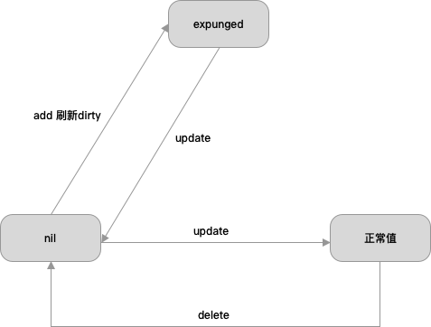

## 五、[Go基础] gopher不得不知的 sync.map

上篇文章中通过源码详细讲解了 `map` 的原理和流程以及一些面试中常问的问题，比如为什么 `map` 的遍历是无序的？同时也因为篇幅的问题，
将 `sync.map` 的内容重新开一篇文章来讲解。

在上篇文章中，我们分析了 `map` 的使用方式；在源码层面，`map` 的底层数据结构；`map` 如何实现插入、遍历等功能的；
`map` 的扩容机制以及渐进式迁移机制。还有就是我们知道了 `map` 是不支持并发安全的。

那么在这篇文章中，我们会详细讲解 `sync.map` 的使用方式；在没有 `sync.map` 前 `map` 是如何满足并发安全的场景；`sync.map`
如何实现的并发安全；
'sync.map' 的应用场景等问题。

**欢迎大家在观看文章的同时提出自己的疑问和观点在评论区讨论。**

**注：以下源码均基于 [go 仓库](https://github.com/golang/go) master 分支 2023 年 12 月 27 日 的代码**。

## 1、map 和 sync.map

### 1.1 如何并发安全的使用 map

在官方没有支持 `sync.map` 之前，一般并发使用 `map` 有两种方式：

1. 加读写锁。在读操作时，使用读锁(RLock)，在写操作时，使用写锁(Lock)。当有协程对 `map` 中的 `key`
   进行修改操作时，会锁定整个 `map`，这会导致其它协程无法对 `map` 进行读写操作。
2. 分片加锁。这种解决思路是将这个 `map` 分成 `n` 块，每个片段拥有自己的锁，不同的 goroutine
   可以在不同的片段上进行并发操作，减少了锁的粒度，提高了并发性能。

对于分片加锁。比较知名的三方库为：[orcaman/concurrent-map](https://github.com/orcaman/concurrent-map "orcaman/concurrent-map")

分片加锁应用场景：适用于并发访问频繁，对 `map` 读写都比较频繁的场景。相对于简单的 `map` 加锁，这种方式能够更好地提高并发性能。

### 1.2 sync.map：官方支持的并发安全的 map

`go` 中的 `map` 的并发读是支持的，并发读写是不支持的。

在 Go v1.9 中，`go` 官方提供了并发安全的 `map`，`sync.map`。

`sync.map` 通过读写分离和写加锁等机制实现了并发读写的功能。但是只适合**读多写少**的情况，若出现写多/并发多的场景，
会导致 `read map` 缓存失效，需要加锁，冲突变多，性能急剧下降。这是他的重大缺点。

## 2、sync.map 的使用

`sync.map` 是线程安全的，读取，插入，删除也都保持着常数级的时间复杂度。

`sync.map` 的零值是有效的，并且零值是一个空的 `map`。在第一次使用之后，不允许被拷贝。

```go
package main

import (
	"fmt"
	"sync"
)

func main() {
	var m sync.Map
	// 1. 写入
	m.Store("qcrao", 18)
	m.Store("stefno", 20)

	// 2. 读取
	age, _ := m.Load("qcrao")
	fmt.Println(age.(int))

	// 3. 遍历
	m.Range(func(key, value interface{}) bool {
		name := key.(string)
		age := value.(int)
		fmt.Println(name, age)
		return true
	})

	// 4. 删除
	m.Delete("qcrao")
	age, ok := m.Load("qcrao")
	fmt.Println(age, ok)

	// 5. 读取或写入。如果存在则读取，不存在则写入
	m.LoadOrStore("stefno", 100)
	age, _ = m.Load("stefno")
	fmt.Println(age)

	// 6. 读取并删除
	age, _ = m.LoadAndDelete("stefno")
	fmt.Println(age)
	fmt.Println(m.Load("stefno"))
}

```

## 3、sync.map 的结构

```text
type Map struct {
	mu Mutex
	// 记录了在map中并发读安全的数据
	// 支持安全读取，但是更新等操作需要加锁
	read atomic.Pointer[readOnly]
	// 包含需要加锁才能访问的元素
	// 包括所有在read字段中但未被expunged（删除）的元素以及新加的元素
	dirty map[any]*entry
	misses int  // 主要记录read读取不到数据加锁读取read map以及dirty map的次数，当misses等于dirty的长度时，会将dirty复制到read
}

// readOnly 是以原子方式存储在 Map.read 字段中的不可变结构。
type readOnly struct {
	m       map[any]*entry
	amended bool // dirty map 中的一些key，如果read map中没有，则为true.
}

// An entry is a slot in the map corresponding to a particular key.
type entry struct { 
	p atomic.Pointer[any]   // 指针，指向实际存储value值的地方
}
```

注意，这里 read map 和 dirty map 中存储的是指向同一个 entry 的指针。下图为整体的数据结构图：


其中 entry 存储的 p 也是一个指向具体数据的指针，有如下三种状态：


当 p == nil 时，说明这个键值对已被删除，并且 m.dirty == nil，或 m.dirty[k] 指向该 entry。

当 p == expunged 时，说明这条键值对已被删除，并且 m.dirty != nil，且 m.dirty 中没有这个 key。

其他情况，p 指向一个正常的值，表示实际 interface{} 的地址，并且被记录在 m.read.m[key] 中。如果这时 m.dirty 不为 nil，那么它也被记录在 m.dirty[key] 中。两者实际上指向的是同一个值。

主要是两个操作会引起p状态的变化：Store(新增/修改) 和 删除

我们先来看看第一个操作 Store(新增/修改)
> - 在Store更新时，如果key在read中存在，并且被标记为已删除，会将kv加入dirty，此时read中key的p指向的是expunged，经过unexpungeLocked函数，read中的key的p指向会从expunged改为nil，然后经过storeLocked更新value值，p从指向nil，改为指向正常
> - (p->expunged) =====> (p->nil) =====> (p->正常)

> - 在Store增加时，如果需要从read中刷新dirty数据，会将read中未删除的元素加入dirty，此时会将所有指向nil的p指针，改为指向expunged
> - (p->nil) =====> (p->expunged)

我们再来看看第二个操作：
> - 在Delete时，删除value时，p从指向正常值，改为指向nil
> - (p->正常) =====> (p->nil)

p的状态转换如下：



我们知道，read map 和 dirty map 中含有相同的部分；也有 read map 中有而 dirty map 中没有的，是 expunged 状态；
也有 dirty map 中有，read map 中没有的，即新增的 entry。

read map 是用来进行 lock free 操作的（其实可以读写，但是不能做删除操作，因为一旦做了删除操作，就不是线程安全的了，
也就无法 lock free），而 dirty map 是用来在无法进行 lock free 操作的情况下，需要 lock 来做一些更新工作的对象。

## 4、sync.map 源码解析

### 4.1 Store 存储

```text
// Store sets the value for a key.
// 为 key 设置一个 value
func (m *Map) Store(key, value any) {
	_, _ = m.Swap(key, value)
}

// Swap swaps the value for a key and returns the previous value if any.
// The loaded result reports whether the key was present.
// 如果key存在值，swap 更新 key 的值并返回之前的旧值
// loaded 代表 key 之前是否存在值
func (m *Map) Swap(key, value any) (previous any, loaded bool) {
	read := m.loadReadOnly()
	// read优先：先查看read中是否存在key的值，
	if e, ok := read.m[key]; ok {
		// 如果read中存在，尝试更新值
		if v, ok := e.trySwap(&value); ok {
			if v == nil {
				return nil, false
			}
			return *v, true
		}
	}

	// 双检查机制：如果不存在，则加锁再查看一次read中是否存在
	m.mu.Lock()
	read = m.loadReadOnly()
	if e, ok := read.m[key]; ok {
		if e.unexpungeLocked() {
			// The entry was previously expunged, which implies that there is a
			// non-nil dirty map and this entry is not in it.
			// 这个 entry 已经删除（expunged）了，这意味着有一个 non-nil 的 dirty 且 这个 entry 不在 dirty 里面
			m.dirty[key] = e
		}
		// 更新 entry 的值
		if v := e.swapLocked(&value); v != nil {
			loaded = true
			previous = *v
		}
	} else if e, ok := m.dirty[key]; ok {
		// 如果 read 中不存在， dirty 中存在
		// 更新 dirty 中的值
		if v := e.swapLocked(&value); v != nil {
			loaded = true
			previous = *v
		}
	} else {
		// 如果都不存在，判断 read 是否完整
		if !read.amended {
			// 如果 read 完整
			// We're adding the first new key to the dirty map.
			// Make sure it is allocated and mark the read-only map as incomplete.
			// 添加新 key 到 dirty
			// 确保它被分配且标记 read 是不完整的

			// 将 read 中的未删除的 entry 复制到 dirty
			m.dirtyLocked()
			// 更新 read 的状态为不完整
			m.read.Store(&readOnly{m: read.m, amended: true})
		}
		// 创建新 entry 加入到 dirty
		m.dirty[key] = newEntry(value)
	}
	m.mu.Unlock()
	return previous, loaded
}
```

简述过程：
1. read 优先：先从 read 中查找，如果存在，则尝试更新值，不存在则下一步
2. 加锁，执行双检查机制：检查 read 中是否存在，存在则检查是否为 expunged，是改为 nil 并加入 dirty 中，然后更新 entry 的值
3. 不存在则查看 dirty 中是否存在，dirty 中存在则更新其中的值
4. 都不存在，判断 read 是否完整，完整则将 read 复制给 dirty，更新 read 为不完整
5. 创建新 entry 插入到 dirty
6. 解锁，返回值

### 4.2 Load 获取

```text
// Load returns the value stored in the map for a key, or nil if no
// value is present.
// The ok result indicates whether value was found in the map.
// 返回存储的值，如果没有则返回nil
// ok 的结果是该值是否在 map 中被找到
func (m *Map) Load(key any) (value any, ok bool) {
	read := m.loadReadOnly()
	// read优先：先从 read 中取值
	e, ok := read.m[key]
	if !ok && read.amended {
		// 如果不存在且 read 不完整，则加锁访问
		m.mu.Lock()
		// Avoid reporting a spurious miss if m.dirty got promoted while we were
		// blocked on m.mu. (If further loads of the same key will not miss, it's
		// not worth copying the dirty map for this key.)
		// 尽量避免在我们被m.mu阻塞时，如果m.dirty被提升，导致不必要的缺失报告。
		// 如果相同键的后续加载不会缺失，那么为了这个键复制 dirty 是不值得的。
		// 双检查机制：先加锁再访问一遍read
		// 如果read还没有再访问dirty
		read = m.loadReadOnly()
		e, ok = read.m[key]
		if !ok && read.amended {
			e, ok = m.dirty[key]
			// Regardless of whether the entry was present, record a miss: this key
			// will take the slow path until the dirty map is promoted to the read
			// map.
			// 无论 entry 是否存在，都记录一次缺失：该键将采取缓慢的路径，直到 dirty 提升到 read。
			m.missLocked()
		}
		m.mu.Unlock()
	}
	if !ok {
		return nil, false
	}
	return e.load()
}
```
简述过程：
1. read 优先。先从 read 中尝试获取，如果获取不到且 read 不完整，下一步
2. 加锁，执行双检查机制。再从 read 中尝试获取一次，如果获取不到且 read 不完整，下一步
3. 从 dirty 中获取，对 misses 进行记录，解锁
4. 最后如果没有获取到，返回 nil，false；否则返回值

### 4.3 LoadOrStore 获取或存储（原子操作）

```text
// LoadOrStore returns the existing value for the key if present.
// Otherwise, it stores and returns the given value.
// The loaded result is true if the value was loaded, false if stored.
// LoadOrStore 如果键存在，则返回该键的现有值。
// 否则，会存储该值并返回这个值
// 如果获取到了值则 loaded 为 true；存进去了值为 false
func (m *Map) LoadOrStore(key, value any) (actual any, loaded bool) {
	// Avoid locking if it's a clean hit.
	// 如果可以 clean 命中，避免锁定
	// read优先：优先在 read 中进行尝试
	read := m.loadReadOnly()
	if e, ok := read.m[key]; ok {
		// 尝试获取或更新 value
		actual, loaded, ok := e.tryLoadOrStore(value)
		if ok {
			return actual, loaded
		}
	}

	// 如果在 read 中没有获取到值
	// 则加锁
	m.mu.Lock()
	// 双检查机制：防止在锁阻塞的时候，dirty 升级为 read
	// 再次在 read 中尝试获取
	read = m.loadReadOnly()
	if e, ok := read.m[key]; ok {
		// 如果 key 被标记为 expunged，则添加到 dirty 中
		if e.unexpungeLocked() {
			// 这里加入 dirty 的 e 的状态是 nil，而不是 expunged
			m.dirty[key] = e
		}
		// 尝试获取或者存储 value
		actual, loaded, _ = e.tryLoadOrStore(value)
	} else if e, ok := m.dirty[key]; ok {
		// 如果 read 中不存在，则直接获取 dirty 中
		actual, loaded, _ = e.tryLoadOrStore(value)
		m.missLocked()
	} else {
		// 如果 dirty 中也没有 且 read 是完整的
		if !read.amended {
			// We're adding the first new key to the dirty map.
			// Make sure it is allocated and mark the read-only map as incomplete.
			// 我们将添加一个新 key 到 dirty 中
			// 确保它被分配（存储）并且标记 read 为不完整
			// 将 read 复制给 dirty
			m.dirtyLocked()
			// 标记 read 为不完整
			m.read.Store(&readOnly{m: read.m, amended: true})
		}
		// 在 dirty 中新增一个 entry
		m.dirty[key] = newEntry(value)
		actual, loaded = value, false
	}
	m.mu.Unlock()

	return actual, loaded
}
```

简述过程：
1. read 优先：先从 read 中查找，如果查不到，下一步
2. 加锁，执行双检查机制：再在 read 中查找一遍，如果找到了，判断是否为 `expunged` 状态，是则切换状态为 nil 并 将其加入 dirty，最后执行尝试获取或存储操作
3. read 还是不存在，则直接查 dirty，尝试获取或存储，记录 misses，如果 dirty 还不存在，下一步
4. 如果 read 是完整的，将 read 复制给 dirty，并标记 read 为不完整，下一步
5. 在 dirty 中插入一个新 entry
6. 解锁，结束

### 4.4 Delete 删除

```text
// Delete deletes the value for a key.
func (m *Map) Delete(key any) {
	m.LoadAndDelete(key)
}
```

Delete 调用的是下面的 LoadAndDelete，详见下一小节。

### 4.5 LoadAndDelete 获取并删除

```text
// LoadAndDelete deletes the value for a key, returning the previous value if any.
// The loaded result reports whether the key was present.
// LoadAndDelete 如果之前存在值，返回之前的值，并删除指定 key 的 value，
// loaded 代表这个 key 之前是否存在值
func (m *Map) LoadAndDelete(key any) (value any, loaded bool) {
	read := m.loadReadOnly()
	// read优先：优先从 read 中读取值
	e, ok := read.m[key]
	if !ok && read.amended {
		// 如果 read 中不存在且 read 不完整，加锁
		m.mu.Lock()
		// 双检查机制：再次读一遍 read
		read = m.loadReadOnly()
		e, ok = read.m[key]
		if !ok && read.amended {
			// 如果 read 中不存在，且 read 不完整
			// 从 dirty 中读
			e, ok = m.dirty[key]
			// 删除 dirty 中的 key
			delete(m.dirty, key)
			// Regardless of whether the entry was present, record a miss: this key
			// will take the slow path until the dirty map is promoted to the read
			// map.
			// 记录 misses
			m.missLocked()
		}
		m.mu.Unlock()
	}
	// 如果 read 存在，获取值并将 read 中的 entry 状态置为 nil（即是删除）
	if ok {
		return e.delete()
	}
	return nil, false
}
```

简述过程：
1. read 优先：先从 read 中读取，能读取到，删除 read 中的 entry（这里延迟删除，entry的状态置 nil）；读取不到且 read 不完整，下一步
2. 加锁，执行双检查机制：再读一遍 read，读取不到且 read 不完整，下一步
3. 从 dirty 读，删除 dirty 中的 entry，记录 misses，
4. 解锁，返回值

### 4.6 Range 遍历

```text

// Range calls f sequentially for each key and value present in the map.
// If f returns false, range stops the iteration.
//
// Range does not necessarily correspond to any consistent snapshot of the Map's
// contents: no key will be visited more than once, but if the value for any key
// is stored or deleted concurrently (including by f), Range may reflect any
// mapping for that key from any point during the Range call. Range does not
// block other methods on the receiver; even f itself may call any method on m.
//
// Range may be O(N) with the number of elements in the map even if f returns
// false after a constant number of calls.

// Range 依次对 map 中每个键值对调用函数 f。如果 f 返回 false，range 将停止迭代。
//
// Range 不一定对应于 Map 内容的任何一致快照：不会多次访问同一个键，但是如果任何键的值同时被存储或删除（包括在 f 中），
// Range 可能反映 Range 调用期间该键的任何映射。Range 不会阻止接收器上的其他方法；即使 f 本身也可以调用 m 上的任何方法。
//
// Range 的时间复杂度可能为 O(N)，其中 N 是 map 中的元素数量，即使在 f 返回 false 后只经过常数次调用。
func (m *Map) Range(f func(key, value any) bool) {
	// We need to be able to iterate over all of the keys that were already
	// present at the start of the call to Range.
	// If read.amended is false, then read.m satisfies that property without
	// requiring us to hold m.mu for a long time.
	// 我们需要能够迭代 Range 调用开始时已经存在的所有键。
	// 如果 read.amended 为 false，则 read.m 满足该属性，而无需我们长时间持有 m.mu。
	read := m.loadReadOnly()
	// read优先：判断 read 是否不完整
	if read.amended {
		// m.dirty contains keys not in read.m. Fortunately, Range is already O(N)
		// (assuming the caller does not break out early), so a call to Range
		// amortizes an entire copy of the map: we can promote the dirty copy
		// immediately!
		// m.dirty 包含不在 read.m 中的键。幸运的是，Range 已经是 O(N)（假设调用者不会早退出），
		// 因此对 Range 的调用会摊销整个 map 的复制：我们可以立即提升 dirty！
		// 不完整，则加锁
		m.mu.Lock()
		read = m.loadReadOnly()
		// 双检查机制：再次判断 read 是否不完整
		if read.amended {
			// read 不完整
			// 升级 dirty 到 read，将 dirty 复制到 read，并重置 dirty
			read = readOnly{m: m.dirty}
			copyRead := read
			m.read.Store(&copyRead)
			m.dirty = nil
			m.misses = 0
		}
		m.mu.Unlock()
	}

	// 遍历 read
	for k, e := range read.m {
		v, ok := e.load()
		if !ok {
			continue
		}
		if !f(k, v) {
			break
		}
	}
}
```

简述过程：
1. 判断 read 是否完整，不完整，则下一步
2. 加锁，执行双检查机制。再次判断 read 是否完整，不完整，则将 dirty 复制给 read，将 dirty 置空，解锁（这里直接将 dirty 升级到 read 是因为顺便升级）
3. 遍历 read ，对 read 中的元素调用函数 f


## 5、总结

`sync.map` 的特性：

1. 读写分离，空间换时间。采用空间冗余减少并发读的阻塞，提高并发读的效率。
2. 双检查机制。通过额外的一次检查操作，来避免在第一次检查操作完成后，其他的操作使得检查条件产生突然符合要求的可能。也是为了尽量减少对 `dirty`
的操作。
3. 延迟删除。Delete 只是把被删除的 key 标记成 nil，新增 key-value 的时候，标记成 enpunged；这样的好处是 dirty 变成 read 之前，这些 key 都会命中 read，而 read 不需要加锁，无论是读还是更新，性能都很高。
4. read优先。需要进行读取，删除，更新操作时，优先操作read，因为read无锁的，更快，实在在read中得不到结果，再去dirty中。
5. 状态机机制。entry 的指针 p，是有状态的，nil，expunged(指向被删除的元素)，正常，三种状态.
6. 动态调整。新写入的 key 都只存在 dirty 中，如果 dirty 中的 key 被多次读取，dirty 就会上升成不需要加锁的 read。

----

> 参考链接：
>
> [Go sync.Map 看一看](https://segmentfault.com/a/1190000018657984 "Go sync.Map 看一看")
> 
> [Golang - sync.map 设计思想和底层源码分析 ](https://www.cnblogs.com/yinbiao/p/15838957.html#_label2/ "Golang - sync.map 设计思想和底层源码分析 ")
> 
> [深度解密 Go 语言之 sync.map](https://qcrao.com/post/dive-into-go-sync-map/ "深度解密 Go 语言之 sync.map")
> 
> [Go 并发之三种线程安全的 map](https://zhuanlan.zhihu.com/p/356739568 "Go 并发之三种线程安全的 map")
> 
> [Go sync.Map 实现](https://wudaijun.com/2018/02/go-sync-map-implement/ "Go sync.Map 实现")
