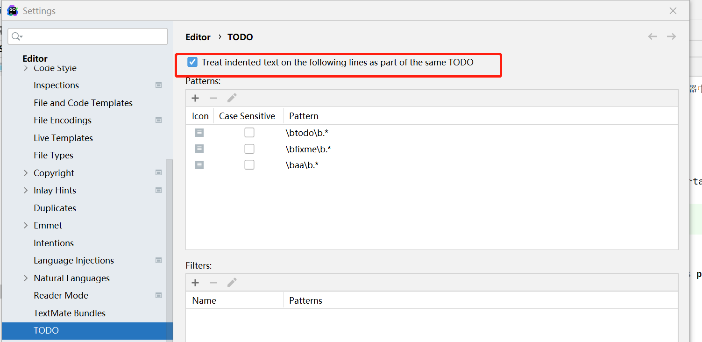
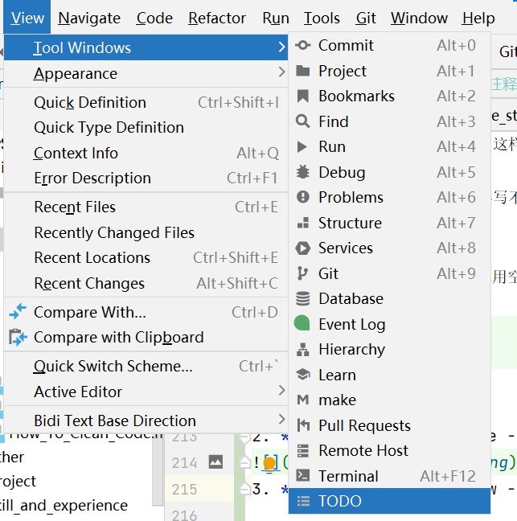

## 二、如何编写优秀的注释

> Good code has lots of comments, bad code requires lots of comments. (好的代码有很多注释，坏代码需要很多注释。) — Dave Thomas and Andrew Hunt (The Pragmatic Programmer)

### 2.1 思考

#### 2.1.1 什么是**好的注释**？

简洁；有效；思路清晰；描述简单易懂。

#### 2.1.2 注释的**作用**是什么？

1)解释**变量的含义**；

2)解释**函数的作用**。

- 2.1) 对入参、返回值做出说明，增强**可读性**；

- 2.2) 解释函数的步骤，即函数是**如何实现**的；

### 2.2 如何写出好的注释

注释是影响**代码可读性**的一大因素。注释应该做的三件事中的一件，而且**只做一件**：

1. The comment should explain what the thing does（注释应该解释具体做什么）
2. The comment should explain how the thing does what it does（注释应该解释是如何做的）
3. The comment should explain why the thing is why it is（注释应该解释为什么是这样的）

第一种形式的完美应用是**公共符号的注释**：

```go
// Open opens the named file for reading.
// If successful, methods on the returned file can be used for reading.
```

第二种形式非常适合在**方法中的注释**：

```go
// queue all dependant actions
var results []chan error
for _, dep := range a.Deps {
results = append(results, execute(seen, dep))
}
```

第三种形式是为了**在代码中交代上下文**，交代代码的外部因素。即**解释为什么是这样的**

```go
return &v2.Cluster_CommonLbConfig{
// Disable HealthyPanicThreshold
HealthyPanicThreshold: &envoy_type.Percent{
Value: 0,
},
}
```

在此示例中，无法清楚地明白  `HealthyPanicThreshold` 设置为零百分比的效果。 需要注释` 0 `值将禁用 `panic` 阈值。

### 2.2.1 变量和常量的注释**应描述其内容**而非其目的

我之前说过，变量或常量的名称应该描述他的作用。当你为变量或常量添加一个注释时，应该描述他的内容，而不是他的作用。

```go
const randomNumber = 6 // determined from an unbiased die
```

上面例子中，描述了变量`randomNumber`**为什么是6，以及6从哪来**，而不是描述`randomNumber`在哪里使用。还有一些例子如下：

```go
const (
StatusContinue = 100           // RFC 7231, 6.2.1
StatusSwitchingProtocols = 101 // RFC 7231, 6.2.2
StatusProcessing = 102 // RFC 2518, 10.1

StatusOK = 200 // RFC 7231, 6.3.1
```

在HTTP的上下文中，数字 100 被称为 `StatusContinue`，如 `RFC 7231` 第 6.2.1 节中所定义。

> 贴士: 对于**没有初始值**的变量，注释应**描述谁负责初始化此变量**。

```go
// sizeCalculationDisabled indicates whether it is safe
// to calculate Types' widths and alignments. See dowidth.
var sizeCalculationDisabled bool
```

这里的注释让读者知道 `dowidth` 函数负责维护 `sizeCalculationDisabled` 的状态。

隐藏在众目睽睽下 这个提示来自Kate Gregory[3]。有时你会发现一个更好的变量名称隐藏在注释中。

```go
// registry of SQL drivers
var registry = make(map[string]*sql.Driver)
```

注释是由作者添加的，因为 registry 没有充分解释其目的 - 它是一个注册表，但注册的是什么？

通过将变量重命名为 sqlDrivers，现在可以清楚地知道此变量的目的是保存SQL驱动程序。

```go
var sqlDrivers = make(map[string]*sql.Driver)
```

之前的注释就是多余的，可以删除。

### 2.2.2 **公共符号**始终要注释

因为 godoc 是你的包的文档，所以应该为包中声明的每个**公共标识符** —​ 变量、常量、函数以及公共的方法添加注释。

这里是两条`Google Style`

- 任何**不简短且不清晰**的**公共函数**都需要注释
- 不管长度或者复杂度如何，库中的函数都必须注释

这条规则有一个例外; 您不需要注释实现接口的方法。 具体不要像下面这样做：

```go
// Read implements the io.Reader interface
func (r *FileReader) Read(buf []byte) (int, error)
```

这个注释什么也没说。 它没有告诉你这个方法做了什么，更糟糕是它告诉你去看其他地方的文档。 在这种情况下，我建议完全删除该注释。

这是 `io` 包中的一个例子

```go
// LimitReader returns a Reader that reads from r
// but stops with EOF after n bytes.
// The underlying implementation is a *LimitedReader.
func LimitReader(r Reader, n int64) Reader { return &LimitedReader{r, n} }

// A LimitedReader reads from R but limits the amount of
// data returned to just N bytes. Each call to Read
// updates N to reflect the new amount remaining.
// Read returns EOF when N <= 0 or when the underlying R returns EOF.
type LimitedReader struct {
R Reader // underlying reader
N int64  // max bytes remaining
}

func (l *LimitedReader) Read(p []byte) (n int, err error) {
if l.N <= 0 {
return 0, EOF
}
if int64(len(p)) > l.N {
p = p[0:l.N]
}
n, err = l.R.Read(p)
l.N -= int64(n)
return
}
```

请注意，`LimitedReader` 的声明就在使用它的函数之前，而 `LimitedReader.Read` 的声明遵循 `LimitedReader` 本身的声明。 尽管 `LimitedReader.Read`
本身没有文档，但它清楚地表明它是 `io.Reader` 的一个实现。

> **贴士:** 在编写函数之前，请编写描述函数的注释。 如果你发现很难写出注释，那么这就表明你将要编写的代码很难理解。

### 2.2.3 不要注释不好的代码，将它**重写**

粗劣的代码的注释高亮显示是不够的。 如果你遇到其中一条注释，则应提出问题，以提醒您稍后重构。 只要技术债务数额已知，它是可以忍受的。

标准库中的惯例是注意到它的人用 TODO(username) 的样式来注释。

```go
// TODO(dfc) this is O(N^2), find a faster way to do this.
```

注释 `username` 不是该人承诺要解决该问题，但在解决问题时他们可能是最好的人选。 其他项目使用 `TODO` 与**日期**或**问题编号**来注释。

### 2.2.4 与其注释一段代码，不如重构它

> Good code is its own best documentation. As you’re about to add a comment, ask yourself, 'How can I improve the code so that this comment isn’t needed?' Improve the code and then document it to make it even clearer. 好的代码是最好的文档。 在即将添加注释时，请问下自己，“如何改进代码以便不需要此注释？' 改进代码使其更清晰。 — Steve McConnell

**函数应该只做一件事**。 如果你发现自己在注释一段与函数的其余部分无关的代码，请考虑将其提取到它自己的函数中。

除了更容易理解之外，较小的函数更易于**隔离测试**，将代码隔离到函数中，其名称可能是所需的所有文档。

## 2.3 利用**工具**更好的编写注释

### 2.3.1 浅析高亮注释

在代码中，注释大部分都是灰色的。但是GoLand可以设置一些特殊的注释时高亮显示的。比如，大家熟悉的`TODO`，除了`TODO`，还有一个`FIXME`，这两个都是官方定义的**高亮注释**，大小写都不敏感。作用一般如下：

1. TODO：一般用于逻辑或者功能待实现。
2. FIXME：该标识说明标识处的代码是错误的，有待修正。

```go
// todo 这里的逻辑待实现
// fixme 这里的代码错误待修复
```

除了官方定义的两个高亮注释，我们也可以加入自己的高亮注释。

在GoLand的 file -> settings -> editor -> todo 处可以自定义高亮注释，定制自己希望的高亮注释。


> 注：1、自定义高亮注释后，需要将**GoLand重启**来加载设置
>    2、可以使用正则表达式来自定义高亮注释（其实是模式。叫高亮注释更简单一些）

### 2.3.2 深入了解高亮注释的设置和使用

|        |                                        |
|:------:|:--------------------------------------:|
| 默认高亮注释 |               TODO、FIXME               |
|  在哪配置  | Settings/Preferences -> Editor -> TODO |
|  如何使用  |      View -> Tool Windows -> TODO      |

有时，您需要**标记部分代码**以供将来参考：**优化和改进**的地方、**可能的更改**、**要讨论的问题**等等。 GoLand 允许您添加特殊类型的注释，这些注释在编辑器中突出显示、
索引并在 TODO 工具窗口中列出。这样您和您的团队成员就可以跟踪需要注意的问题。

GoLand官方提供两种模式，及**大小写不敏感**的 `todo` 和 `fixme`。你可以修改默认模式或增加自己的模式。

**用法：**
**1.** 你可以**创建高亮注释**：使用空格或者tab键缩进注释就可以高亮多行【任意缩进两个，即两个空格、两个tab机或者一个空格一个tab可以实现】
```go
// todo 
//  sss 
//      sss
```
**2.** **禁用**多行高亮：点击file -> setting -> editor -> todo， 取消 **Treat indented text on the following lines as part of the same TODO** 选项

**3.** **查看**高亮注释：点击View -> Tool Windows -> TODO。可以在弹出的界面上选择要查看的范围，可以单击进入注释所在的文件。


**4.** 添加**自定义**的模式以及todo过滤器：
   - 添加自定义**模式**：这在2.3.2节我们已经讲过了。
   - 添加**过滤器**：过滤器的作用是当你查看高亮注释时，可以过滤你想要看的注释。我们可以使用下图中的方式添加过滤器。


----
> 内容学习于该博客：[英文博客](https://dave.cheney.net/practical-go/presentations/qcon-china.html#_comments_on_variables_and_constants_should_describe_their_contents_not_their_purpose)
>
> 同时借鉴于该翻译：[中文翻译](https://github.com/llitfkitfk/go-best-practice/blob/master/README.md)
> 
> 高亮注释部分借鉴于官方文档：[官方文档](https://www.jetbrains.com/help/go/using-todo.html)