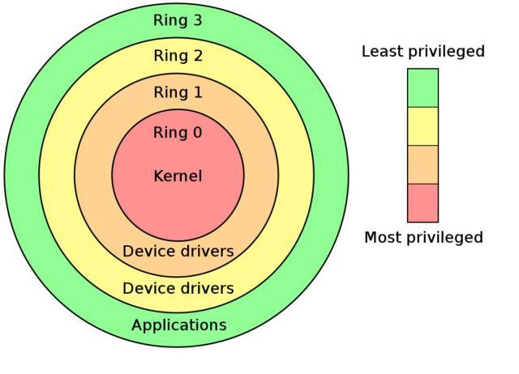
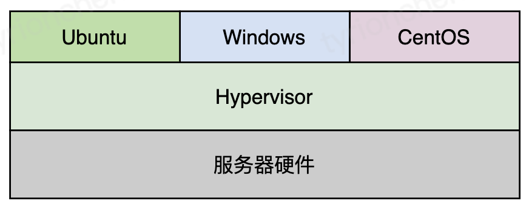
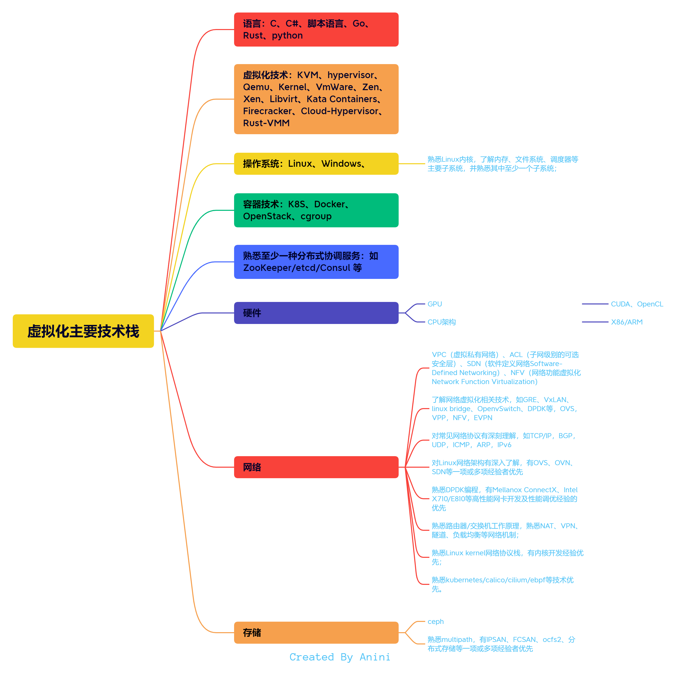

## 一、虚拟化介绍

## 1、认识虚拟化

### 1.1 什么是虚拟化

维基百科定义：在计算机技术中，虚拟化（技术）或虚拟技术（英语：Virtualization）是一种资源管理技术，是将计算机的各种实体资源
（CPU、内存、磁盘空间、网络适配器等），予以抽象、转换后呈现出来并可供分割、组合为一个或多个电脑配置环境。
由此，打破实体结构间的不可切割的障碍，使用户可以比原本的配置更好的方式来应用这些电脑硬件资源。
这些资源的新虚拟部分是不受现有资源的架设方式，地域或物理配置所限制。一般所指的虚拟化资源包括计算能力和资料存储。

虚拟化技术实际上就是对物理硬件资源的一种调度（组合重用）。

### 1.2 虚拟化技术解决了什么问题

虚拟化技术主要用来解决**高性能的物理硬件产能过剩**和**老的旧的硬件产能过低**的重组重用，透明化底层物理硬件，
从而**最大化的利用物理硬件，对资源充分利用（资源利用、资源重组）。** 提高资源的利用率以及实现商业价值。

比如，对于高性能的硬件，某公司的业务其实并不需要这些性能，只需要使用20%就够了，此时就会有80%的性能损失，那如果
是通过虚拟化技术来调度资源，就可以把这个80%的性能给别的公司使用；同理，对于老旧的硬件资源，单个机器的资源不足以支撑
业务系统的运行，但是通过组合多个老旧硬件的资源抽象出一个大资源，这时候就可以支撑业务系统的运行。

## 2. 虚拟化的分类

### 2.1 按虚拟的对象分类

根据虚拟化的定义，虚拟化就是一种资源管理技术，将实体资源抽象化，将多个实体的资源凑到一个大池子里，然后提供给客户使用。这就是虚拟化，
那么有多少种实体资源，理论上来说相对应的就有多少种虚拟化，比如存储虚拟化、GPU虚拟化、虚拟内存、网络虚拟化、操作系统虚拟化等等。。。

这部分的内容维基百科记录的很细，但是那么多虚拟化并不需要都记住，只要对虚拟化这个概念有理解，就自然能够理解。

### 2.2 按照抽象程度分类

#### 2.2.1 硬件抽象层等级的虚拟化

通过软件来模拟不同架构的处理器、内存、总线、磁盘IO等硬件设备，被模拟的机器上可以安装不同的系统。运行时，软件会将虚拟机所发出的指令，
转换成物理机能够执行的指令，在物理机上执行。这种级别的虚拟化对于模拟相同架构的平台有很好的兼容性，因为相同架构的指令集是相同的，
但如果模拟的是不同架构，运行时的开销会比较大。

#### 2.2.2 操作系统等级的虚拟化

即我们常说的容器化，由操作系统提供支持，运行多个用户态的实例，每个实例有自己的运行环境，
拥有自己的文件系统、CPU、内存、磁盘等，但不是一个完整的操作系统，只是一个被隔离的进程。这种技术目前最热门的应用就是Docker，
比起虚拟机，Docker资源占用少、体积小、启动快，能够动态伸缩扩容，方便组建微服务架构，在持续集成上常用来提供构建环境。

#### 2.2.3 函式库等级的虚拟化

应用软件最终都是使用系统库函数完成功能的，不同的操作系统有不同的函数接口，函数库的虚拟化就是虚拟操作系统的函数接口，
从而实现让软件不需要修改就能运行在原本没有库函数的操作系统上。这一技术的典型应用就是Wine，他能够在linux上运行windows程序。

#### 2.2.4 进程层面的虚拟化

教材上叫编程语言层面的虚拟化，本质上是系统的一个进程，是模拟出来的一台抽象计算机，被设计用来在平台无关的环境中执行程序指令，
有处理器、堆栈、寄存器等，但和硬件上的计算机体系结构不同，它是另外一套体系结构。这一类的应用有Java的JVM，Andriod上的Dailvik和ART等。

## 3. 虚拟化技术

### 3.1 虚拟机技术

虚拟机是指通过软件模拟的具有完整硬件系统功能的、运行在一个完全隔离环境中的完整计算机系统。

在物理机和虚拟机操作系统之间有一个虚拟机管理程序（也叫虚拟机监视器。英文：VMM，Virtual Machine Monitor，又称 Hypervisor）。
它的作用是让虚拟机操作系统认为自己是运行在物理机上，也就是给虚拟机操作系统模拟一个物理机的环境。

在Intel处理器中划分了四个特权级别ring 0 ~ ring 3，其中ring 0是最高级别，ring 3是最低级别，一般操作系统内核运行在ring 0上，
这样就能运行处理器的所有指令，但是应用程序则运行在ring 3上，有部分指令（特权指令）是运行不了的。

#### 3.1.1 I 型虚拟化和 II 型虚拟化

1974年的一篇文章 Formal requirements for virtualizable third generation architectures 将Hypervisor按实现结构分成了两种类型，
这个划分方法影响至今。

第一种Hypervisor是直接跑在宿主机上面作为操作系统的，特点是需要硬件支持、程序作为操作系统运行、效率高。客户机操作系统跑在上面对底层资源的访问都会
被Hypervisor拦截，由它代为操作并返回结果，从而实现对系统资源的隔离。采用这种类型的虚拟机软件有VMware ESXi、 Xen等。

第二种Hypervisor是作为应用程序跑在操作系统上的，客户端机操作系统跑在他上面所有访问也会被拦截，由于Hypervisor不直接访问硬件资源，
因此运行效率通常比第一种低。采用这种类型的虚拟机软件有VMware Workstation、VirtualBox等。

#### 3.1.2 全虚拟化

Hypervisor 将虚拟机的指令翻译为物理机可以执行的指令，优点是不用修改虚拟机操作系统；缺点是性能比较差。

#### 3.1.3 半虚拟化

在 Hypervisor 中添加了一些接口函数，然后修改虚拟机操作系统，在特权指令等需要修改的地方修改虚拟机操作系统的代码（打补丁）以便支持虚拟化。
好处就是性能变好了，但是坏处就是需要给虚拟机操作系统打补丁。

#### 3.1.4 硬件辅助的虚拟化

硬件辅助的虚拟化指的是在处理器中直接加入虚拟化指令支持（比如Intel的VT-x或者AMD的SVM），处理器引入了新的虚拟化模式，
例如在Intel处理器上是VMX root模式与VMX non-root模式，两种模式都支持ring 0 ~ ring 3，虚拟机管理程序运行在VMX root模式下，
而虚拟机操作系统则运行在VMX non-root模式下。

当虚拟机执行非特权指令时，可以在VMX non-root模式下，直接执行相关指令；当虚拟机执行特权指令时，需要切换到VMX root模式，
由 Hypervisor 通过CPU提供的编程接口，配置对哪些指令的劫持和捕获，从而完成指令的执行。

### 3.2 容器技术

实际使用场景中，我们使用虚拟化技术其实是为了按需分配资源来完成服务的部署和使用，同时对服务所依赖的环境进行隔离，不被其它服务感知或干扰。
为此启动一个 GuestOS（客户机，即虚拟机） 并不是必需的，为什么不考虑让多个虚拟机公用一个操作系统内核，只隔离开服务运行环境同时控制服务使用的系统资源呢？
基于容器的虚拟化就是这样一种技术。

容器是没有 GuestOS 的轻量级虚拟机，多个容器共享一个 OS 内核，容器中包含需要部署的应用和它依赖的系统环境，容器大小通常只有几十到几百
MB。由于共享操作系统内核，所以容器依赖于底层的操作系统，各个操作系统大都有自己的容器技术和容器工具。

由于容器技术的设计理念决定了容器技术的隔离级别很低，会导致一些安全及逃逸漏洞。在公有云环境容器，应用不得不也运行在虚拟机中，从而满足多租户安全隔离要求。
而分配、管理、运维这些传统虚拟机与容器轻量、灵活、弹性的初衷背道而驰，同时在资源利用率、运行效率上也存浪费。AWS同样有这样的问题，随着服务的增长，
AWS开发团队意识到需要一个新技术提供高服务的安全性、灵活性和效率的运行时环境，所以开发了 AWS Firecracker。

### 3.3 超轻虚拟化 firecracker

AWS Firecracker是一款由 AWS开源的轻量级虚拟化运行环境，旨在为Serverless计算和容器工作负载提供安全、高性能的虚拟化环境，客户可以在
AWS 云上和本地环境中使用它。
Firecracker MicroVM（轻量级虚拟机，没有模拟完整的计算机硬件设备，只实现了运行现代化工作负载的必要功能）同时具备传统虚拟机的安全性和工作负载隔离能力以及容器的速度和资源利用率。

基于 Firecracker 的容器运行时有哪些优势呢？

- 提升了应用负载的隔离性，每个 MicroVM 内部仅运行一个应用容器，或者仅运行一个应用 Pod。
- 较高的安全性。使用内存安全的Rust语言实现，同时为了减少可能得攻击面，基于 crosvm 使用极简设备模型，只实现了最小化的虚拟化功能。
- 超轻量化设计，保证高性能和低开销。

### 3.4 虚拟化技术的区别

1. 虚拟机技术：
    - 隔离级别： 每个虚拟机都有自己的操作系统和完整的用户空间，隔离性最好。
    - 资源占用： 每个虚拟机需要独立的操作系统和运行时环境，因此会占用较多的系统资源，包括内存和存储空间。
    - 启动时间： 因为需要加载整个操作系统和运行时环境，启动较慢。
    - 灵活性： 虚拟机可以运行各种不同的 OS。
2. 容器技术：
    - 隔离级别： 隔离性较弱。容器技术通过在宿主机上创建独立的用户空间来实现虚拟化，所有容器共享宿主机的操作系统内核。
    - 资源占用： 占用的资源更少。容器共享宿主机的内核和系统资源，所以资源占用较少。
    - 启动时间： 启动较快。容器直接使用宿主机的内核，无需加载整个操作系统。
    - 灵活性： 容器只能支持和宿主机内核相同的操作系统，容器适合于部署轻量级、独立的应用程序组件。
3. firecracker：
    - 隔离级别：隔离级别较强。实现了简易版VM，有效增强了隔离性。
    - 资源占用：资源占用较少。采用轻量化设计，只实现了最简单的虚拟化，资源占用少。
    - 启动时间：启动时间较快。超轻量化设计，资源占用少，启动速度快。
    - 灵活性：提供了良好的性能和可伸缩性。它可以在低延迟和高吞吐量的情况下运行大量的虚拟机实例，满足各种不同工作负载的需求。

## 4. 总结

虚拟化技术分为很多方面，包括硬件、操作系统、应用软件、网络、存储等等。

总的来说，虚拟机技术提供了较高的隔离性和安全性，适用于运行复杂的、不同类型的应用程序；而容器技术则更加轻量级和灵活，
适用于构建和部署独立的、可移植的应用程序组件。

在技术层面，有虚拟机技术、容器技术、超轻虚拟化 firecracker。
虚拟机技术采用在宿主机上模拟一个客户机，需要模拟出一个完整的操作系统及相关的硬件设施；
容器技术共用宿主机操作系统，隔离性较差；
firecracker 则是在采用虚拟机技术和容器技术中间的技术，既不实现完整虚拟化，也不是共用宿主机，而是实现了虚拟化的最小支持，在效率和隔离性上取得了一个平衡。

**持续更新go语言及K8S等go相关生态的文章、前沿技术趋势及概念，欢迎大家点赞收藏，关注后续文章。**

最后附一张从根据招聘网站虚拟化岗位总结的技术栈总结图，如下。

> 参考链接：
>
> [后端技术杂谈6：白话虚拟化技术](https://aijishu.com/a/1060000000033460 "后端技术杂谈6：白话虚拟化技术")
>
> [懂了！VMware/KVM/Docker原来是这么回事儿](https://mp.weixin.qq.com/s/joEt3a_cKx-XXbKtttpptA?spm=a2c6h.12873639.article-detail.7.5f0a42c9Eem1NU "懂了！VMware/KVM/Docker原来是这么回事儿")
>
> [「深度小课堂」虚拟化技术入门科普](https://zhuanlan.zhihu.com/p/80901355 "「深度小课堂」虚拟化技术入门科普")
>
> [漫谈云计算、虚拟化、容器化--云平台技术栈05](https://blog.csdn.net/g6U8W7p06dCO99fQ3/article/details/96472439 "漫谈云计算、虚拟化、容器化--云平台技术栈05")
>
> [深入理解虚拟化](https://zhuanlan.zhihu.com/p/441287815 "深入理解虚拟化")
>
> [kvm-qemu-libvirt-virtio的理解](https://zhuanlan.zhihu.com/p/259571918 "kvm-qemu-libvirt-virtio的理解")
>
> [【KVM】一张图看懂KVM虚拟化](https://blog.csdn.net/weixin_42319496/article/details/119372101 "【KVM】一张图看懂KVM虚拟化")
>
> [虚拟化技术概念学习总结](https://cloud.tencent.com/developer/article/1782543 "虚拟化技术概念学习总结")
>
> [Serverless 与轻量级虚拟化 Firecracker · NSDI '20](https://draveness.me/papers-firecracker/ "Serverless 与轻量级虚拟化 Firecracker · NSDI '20")
>
> [深度解析 AWS Firecracker 原理篇 – 虚拟化与容器运行时技术](https://aws.amazon.com/cn/blogs/china/deep-analysis-aws-firecracker-principle-virtualization-container-runtime-technology/ "深度解析 AWS Firecracker 原理篇 – 虚拟化与容器运行时技术")
>