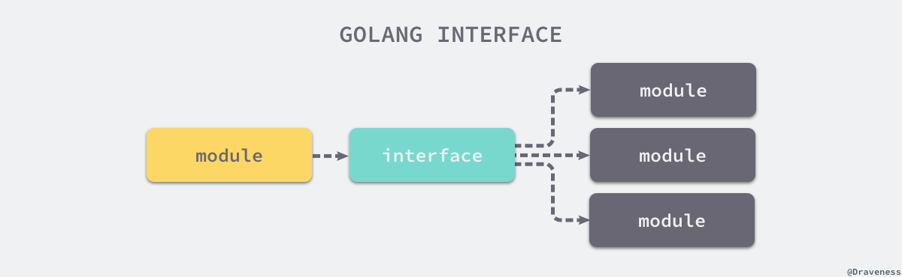

# 一、如何写出优雅的Go语言代码

参考文章：https://draveness.me/golang-101/

- 容易阅读和理解；
- 容易测试、维护和扩展；
- 命名清晰、无歧义、注释完善清楚；

## 1、代码规范
### 1.1 代码规范
官方：[Go Code Review Comments](https://github.com/golang/go/wiki/CodeReviewComments)

### 1.2 辅助工具
**『尽量自动化一切能够自动化的步骤，让工程师审查真正重要的逻辑和设计』**

1) [goimports](https://godoc.org/golang.org/x/tools/cmd/goimports)
官方工具。它能够为我们自动格式化 Go 语言代码并对所有引入的包进行管理，包括自动增删依赖的包引用、将依赖包按字母序排序并分类。
相当于[gofmt](https://golang.org/cmd/gofmt/)加上依赖包管理。
2) golint
官方工具。不支持定制化功能。推荐的方法是在基础库或者框架中使用 golint 进行静态检查（或者同时使用 golint 和 [golangci-lint](https://github.com/golangci/golangci-lint)
），在其他的项目中使用可定制化的 golangci-lint 来进行静态检查，因为在基础库和框架中施加强限制对于整体的代码质量有着更大的收益。

### 1.3 自动化
无论是用于检查代码规范和依赖包的 goimports 还是静态检查工具 glint 或者 golangci-lint，只要我们在项目中引入这些工具就一定要在代码的 CI 流程中加入对应的自动化检查：
- 在 GitHub 上我们可以使用 [Travis CI](https://travis-ci.org/) 或者 [CircleCI](https://circleci.com/) ；
- 在 Gitlab 上我们可以使用 [Gitlab CI](https://about.gitlab.com/product/continuous-integration/) ；
  在自建的或者其他的代码托管平台上也应该想尽办法寻找合适的工具，现代的代码托管工具应该都会对 CI/CD 有着非常不错的支持；我们需要通过这些 CI 工具将代码的自动化检查变成 PR 合并和发版的一个前置条件，减少工程师 Review 代码时可能发生的疏漏。

## 2、最佳实践
### 2.1 目录结构
[golang-standards/project-layout](https://github.com/golang-standards/project-layout) 项目中就定义了一个比较标准的目录结构。
```text
├── LICENSE.md
├── Makefile
├── README.md
├── api
├── assets
├── build
├── cmd
├── configs
├── deployments
├── docs
├── examples
├── githooks
├── init
├── internal
├── pkg
├── scripts
├── test
├── third_party
├── tools
├── vendor
├── web
└── website
```
简单介绍其中几个比较常见并且重要的目录和文件:
#### 2.1.1 /pkg
这个目录中存放的就是项目中可以**被外部应用使用的代码库**，**其他的项目**可以直接通过 import 引入这里的代码，
所以当我们将代码放入 pkg 时一定要慎重，不过如果我们开发的是 HTTP 或者 RPC 的接口服务或者公司的内部服务，
将私有和公有的代码都放到 /pkg 中也没有太多的不妥，因为作为最顶层的项目来说很少会被其他应用直接依赖，
当然严格遵循公有和私有代码划分是非常好的做法，作者也建议各位开发者对项目中公有和私有的代码进行妥善的划分。

#### 2.1.2 私有代码
私有代码推荐放到 /internal 目录中，真正的项目代码应该写在 /internal/app 里，
同时这些内部应用依赖的代码库应该在 /internal/pkg 子目录和 /pkg 中。就是说，项目代码应该在
/internal/app 中，而其中只能依赖 /internal/pkg 子目录和 /pkg 的包。

下图展示了一个使用 /internal 目录的项目结构：

当我们在其他项目引入包含 internal 的依赖时，Go 语言会在编译时报错：
```text
An import of a path containing the element “internal” is disallowed
if the importing code is outside the tree rooted at the parent of the 
"internal" directory.
```
这种错误只有在被引入的 internal 包不存在于当前项目树中才会发生，如果在同一个项目中引入该项目的 internal 包并不会出现这种错误。

#### 2.1.3 /src
作为一个 Go 语言的开发者，我们不应该允许项目中存在 /src 目录。

最重要的原因其实是 Go 语言的项目在默认情况下都会被放置到 $GOPATH/src 目录下，这个目录中存储着我们开发和依赖的全部项目代码，如果我们在自己的项目中使用 /src 目录，该项目的 PATH 中就会出现两个 src：
```text
$GOPATH/src/github.com/draveness/project/src/code.go
```
上面的目录结构看起来非常奇怪，这也是我们在 Go 语言中不建议使用 /src 目录的最重要原因。这种可以使用，但是不推荐。

#### 2.1.3 平铺
另一种在 Go 语言中组织代码的方式就是项目的根目录下放项目的代码，这种方式在很多框架或者库中非常常见，
如果想要引入一个使用 pkg 目录结构的框架时，我们往往需要使用 github.com/draveness/project/pkg/somepkg，
当代码都平铺在项目的根目录时只需要使用 github.com/draveness/project，**很明显地减少了引用依赖包语句的长度。**

所以对于一个 Go 语言的框架或者库，将代码平铺在根目录下也很正常，
但是在一个 Go 语言的服务中使用这种代码组织方法可能就没有那么合适了。

#### 2.1.4 /cmd
**/cmd 目录中存储的都是当前项目中的可执行文件**，该目录下的每一个子目录都应该包含我们希望有的可执行文件，
如果我们的项目是一个 grpc 服务的话，可能在 /cmd/server/main.go 中就包含了启动服务进程的代码，
编译后生成的可执行文件就是 server。

我们不应该在 /cmd 目录中放置太多的代码，我们应该将公有代码放置到 /pkg 中并将私有代码放置到 /internal 中并在 /cmd 中引入这些包，
**保证 main 函数中的代码尽可能简单和少。**

#### 2.1.5 /api
/api 目录中存放的就是当前项目对外提供的各种不同类型的 API 接口定义文件了，其中可能包含类似 /api/protobuf-spec、/api/thrift-spec 
或者 /api/http-spec 的目录，这些目录中包含了当前项目对外提供的和依赖的所有 API 文件：
```text
$ tree ./api
api
└── protobuf-spec
    └── oceanbookpb
        ├── oceanbook.pb.go
        └── oceanbook.proto
```
二级目录的主要作用就是在一个项目同时提供了多种不同的访问方式时，用这种办法避免可能存在的潜在冲突问题，也可以让项目结构的组织更加清晰。

#### 2.1.6 Makefile
最后要介绍的 Makefile 文件也非常值得被关注，在任何一个项目中都会存在一些需要运行的脚本，
这些脚本文件应该被放到 /scripts 目录中并由 Makefile 触发，将这些经常需要运行的命令固化成脚本减少『祖传命令』的出现。

### 2.2 模块拆分
#### 2.2.1 按层拆分
这是一种 Web 框架的最常见架构方式，将服务中的不同组件分成了 Model、View 和 Controller 三层。

这种按层拆分模块的设计其实有以下的几方面原因：
- MVC 架构模式 — MVC 本身就强调了按层划分职责的设计，所以遵循该模式设计的框架自然有着一脉相承的思路；
- 扁平的命名空间 — 无论是 Spring MVC 还是 Rails，同一个项目中命名空间非常扁平，跨文件夹使用其他文件夹中定义的类或者方法不需要引入新的包，使用其他文件定义的类时也不需要增加额外的前缀，多个文件定义的类被『合并』到了同一个命名空间中；
- 单体服务的场景 — Spring MVC 和 Rails 刚出现时，SOA 和微服务架构还不像今天这么普遍，绝大多数的场景也不需要通过拆分服务；

#### 2.2.2 按职责拆分
Go 语言的项目往往都按照职责对模块进行拆分：

对于一个比较常见的博客系统，使用 Go 语言的项目会按照不同的职责将其纵向拆分成 post、user、comment 三个模块，每一个模块都对外提供相应的功能，post 模块中就包含相关的模型和视图定义以及用于处理 API 请求的控制器（或者服务）：
```text
$ tree pkg
pkg
├── comment
├── post
│   ├── handler.go
│   └── post.go
└── user
```
**Go 语言项目中的每一个文件目录都代表着一个独立的命名空间，也就是一个单独的包**，当我们想要引用其他文件夹的目录时，首先需要使用 import 关键字引入相应的文件目录，再通过 pkg.xxx 的形式引用其他目录定义的结构体、函数或者常量，如果我们在 Go 语言中使用 model、view 和 controller 来划分层级，你会在其他的模块中看到非常多的 model.Post、model.Comment 和 view.PostView。

这种划分层级的方法在 Go 语言中会显得非常冗余，并且如果对项目依赖包的管理不够谨慎时，很容易发生引用循环，出现这些问题的最根本原因其实也非常简单：
- **Go 语言对同一个项目中不同目录的命名空间做了隔离，整个项目中定义的类和方法并不是在同一个命名空间下的**，这也就需要工程师自己维护不同包之间的依赖关系；
- **按照职责垂直拆分的方式在单体服务遇到瓶颈时非常容易对微服务进行拆分**，我们可以直接将一个负责独立功能的 package 拆出去，对这部分性能热点单独进行扩容；

Go 语言项目的最佳实践就是按照职责对模块进行垂直拆分，将代码按照功能的方式分到多个 package 中，这并不是说 Go 语言中不存在模块的水平拆分，只是因为 package 作为一个 Go 语言访问控制的最小粒度，所以我们应该遵循顶层的设计使用这种方式构建高内聚的模块。

### 2.3 显式与隐式
Go 语言社区对于显式的初始化、方法调用和错误处理非常推崇。 Go 语言社区虽然达成了很多的共识与约定，但是从语言的设计以及工具上的使用我们就能发现显式地调用方法和错误处理是被鼓励的。

#### 2.3.1 init
我们在这里先以一个非常常见的函数 init 为例，介绍 Go 语言社区对显式调用的推崇；相信很多人都在一些 package 中阅读过这样的代码：
```go
var grpcClient *grpc.Client

func init() {
    var err error
    grpcClient, err = grpc.Dial(...)
    if err != nil {
        panic(err)
    }
}

func GetPost(postID int64) (*Post, error) {
    post, err := grpcClient.FindPost(context.Background(), &pb.FindPostRequest{PostID: postID})
    if err != nil {
        return nil, err
    }
    
    return post, nil
}
```
这种代码虽然能够通过编译并且正常工作，然而这里的 init 函数其实隐式地初始化了 grpc 的连接资源，如果另一个 package 依赖了当前的包，那么引入这个依赖的工程师可能会在遇到错误时非常困惑，因为**在 init 函数中做这种资源的初始化是非常耗时并且容易出现问题的**。

一种更加合理的做法其实是这样的，首先我们定义一个新的 Client 结构体以及一个用于初始化结构的 NewClient 函数，这个函数接收了一个 grpc 连接作为入参返回一个用于获取 Post 资源的客户端，GetPost 成为了这个结构体的方法，每当我们调用 client.GetPost 时都会用到结构体中保存的 grpc 连接：
```go
// pkg/post/client.go
type Client struct {
    grpcClient *grpc.ClientConn    
}

func NewClient(grpcClient *grpcClientConn) Client {
    return &Client{
        grpcClient: grpcClient,
    }
}

func (c *Client) GetPost(postID int64) (*Post, error) {
    post, err := c.grpcClient.FindPost(context.Background(), &pb.FindPostRequest{PostID: postID})
    if err != nil {
        return nil, err
    }
    
    return post, nil
}
```
初始化 grpc 连接的代码应该放到 main 函数或者 main 函数调用的其他函数中执行，如果我们在 main 函数中显式的初始化这种依赖，对于其他的工程师来说就非常易于理解，我们从 main 函数开始就能梳理出程序启动的整个过程。
```go
// cmd/grpc/main.go
func main() {
    grpcClient, err := grpc.Dial(...)
    if err != nil {
        panic(err)
    }
    
    postClient := post.NewClient(grpcClient)
    // ...
}
```
各个模块之间会构成一种树形的结构和依赖关系，上层的模块会持有下层模块中的接口或者结构体，不会存在孤立的、不被引用的对象。

上图中出现的两个 Database 其实是在 main 函数中初始化的数据库连接，在项目运行期间，它们可能表示同一个内存中的数据库连接

当我们使用 golangci-lint 并开启 gochecknoinits 和 gochecknoglobals 静态检查时，它其实严格地限制我们对 init 函数和全局变量的使用。

当然这并不是说我们一定不能使用 init 函数，作为 Go 语言赋予开发者的能力，因为它能在包被引入时隐式地执行了一些代码，所以我们更应该慎重地使用它们。

一些框架会在 init 中判断是否满足使用的前置条件，但是对于很多的 Web 或者 API 服务来说，大量使用 init 往往意味着代码质量的下降以及不合理的设计。

```go
func init() {
    if user == "" {
        log.Fatal("$USER not set")
    }
    if home == "" {
        home = "/home/" + user
    }
    if gopath == "" {
        gopath = home + "/go"
    }
    // gopath may be overridden by --gopath flag on command line.
    flag.StringVar(&gopath, "gopath", gopath, "override default GOPATH")
}
```
上述代码其实是 Effective Go 在介绍 init 方法使用是展示的实例代码，这是一个比较合理地 init 函数使用示例，**我们不应该在 init 中做过重的初始化逻辑，而是做一些简单、轻量的前置条件判断。**

#### 2.3.2 error
另一个要介绍的就是 Go 语言的错误处理机制了，虽然 Go 语言的错误处理被开发者诟病已久，但是工程师每天都在写 `if err != nil { return nil, err }` 的错误处理逻辑其实就是在显式地对错误处理，关注所有可能会发生错误的方法调用并在无法处理时抛给上层模块。

很少有人会在代码中使用 panic 和 recover 来实现错误和异常的处理，与 init 函数一样，Go 语言对于 panic 和 recover 的使用也非常谨慎。

当我们在 Go 语言中处理错误相关的逻辑时，最重要的其实就是以下几点：
- **使用 error 实现错误处理** — 尽管这看起来非常啰嗦；
- **将错误抛给上层处理** — 对于一个方法是否需要返回 error 也需要我们仔细地思考，向上抛出错误时可以通过 errors.Wrap 携带一些额外的信息方便上层进行判断；
- **处理所有可能返回的错误** — 所有可能返回错误的地方最终一定会返回错误，考虑全面才能帮助我们构建更加健壮的项目；

作者在使用 Go 语言的这段时间，能够深刻地体会到它对于显式方法调用与错误处理的鼓励，这不仅能够帮助项目的其他开发者快速地理解上下文，也能够帮助我们构建更加健壮、容错性与可维护性更好的工程。

### 2.4 面向接口
面向接口编程是一个老生常谈的话题，[接口](https://draveness.me/golang-interface) 的**作用其实就是为不同层级的模块提供了一个定义好的中间层，上游不再需要依赖下游的具体实现，充分地对上下游进行了解耦。**

这种编程方式不仅是在 Go 语言中是被推荐的，在几乎所有的编程语言中，我们都会推荐这种编程的方式，它为我们的程序提供了非常强的灵活性，想要构建一个稳定、健壮的 Go 语言项目，不使用接口是完全无法做到的。

如果一个略有规模的项目中没有出现任何 type ... interface 的定义，那么作者可以推测出这在很大的概率上是一个**工程质量堪忧并且没有多少单元测试覆盖的项目**，我们确实需要认真考虑一下如何使用接口对项目进行重构。

**单元测试是一个项目保证工程质量最有效并且投资回报率最高的方法之一**，作为静态语言的 Go，想要写出 **覆盖率足够（最少覆盖核心逻辑）** 的单元测试本身就比较困难，因为我们不能像动态语言一样随意修改函数和方法的行为，而接口就成了我们的救命稻草，写出抽象良好的接口并通过接口隔离依赖能够帮助我们有效地提升项目的质量和可测试性，我们会在下一节中详细介绍如何写单元测试。
```go
package post

var client *grpc.ClientConn

func init() {
    var err error
    client, err = grpc.Dial(...）
    if err != nil {
        panic(err)
    }
}

func ListPosts() ([]*Post, error) {
    posts, err := client.ListPosts(...)
    if err != nil {
        return []*Post{}, err
    }
    
    return posts, nil
}
```
上述代码其实就不是一个设计良好的代码，它**不仅在 init 函数中隐式地初始化了 grpc 连接这种全局变量**，**而且没有将 ListPosts 通过接口的方式暴露出去**，**这会让依赖 ListPosts 的上层模块难以测试**。

我们可以使用下面的代码改写原有的逻辑，使得同样地逻辑变得更容易测试和维护：
```go
package post

type Service interface {
    ListPosts() ([]*Post, error)
}

type service struct {
    conn *grpc.ClientConn
}

func NewService(conn *grpc.ClientConn) Service {
    return &service{
        conn: conn,
    }
}

func (s *service) ListPosts() ([]*Post, error) {
    posts, err := s.conn.ListPosts(...)
    if err != nil {
        return []*Post{}, err
    }
    
    return posts, nil
}
```
- 通过接口 Service 暴露对外的 ListPosts 方法；
- 使用 NewService 函数初始化 Service 接口的实现并通过**私有的结构体 service** 持有 grpc 连接；
- ListPosts 不再依赖全局变量，而是**依赖接口体 service 持有的连接**；

当我们使用这种方式重构代码之后，就可以在 main 函数中显式的初始化 grpc 连接、创建 Service 接口的实现并调用 ListPosts 方法：
```go
package main

import ...

func main() {
    conn, err = grpc.Dial(...）
    if err != nil {
        panic(err)
    }
    
    svc := post.NewService(conn)
    posts, err := svc.ListPosts()
    if err != nil {
        panic(err)
    }
    
    fmt.Println(posts)
}
```
这种使用接口组织代码的方式在 Go 语言中非常常见，我们应该在代码中尽可能地使用这种思想和模式对外提供功能：
- 使用大写的 Service 对外暴露方法；
- 使用小写的 service 实现接口中定义的方法；
- 通过 NewService 函数初始化 Service 接口；

  当我们使用上述方法组织代码之后，其实就对不同模块的依赖进行了解耦，也正遵循了软件设计中经常被提到的一句话 — 『依赖接口，不要依赖实现』，也就是面向接口编程。

## 3、单元测试
一个代码质量和工程质量有保证的项目一定有比较合理的单元测试覆盖率，没有单元测试的项目一定是不合格的或者不重要的，单元测试应该是所有项目都必须有的代码，每一个单元测试都表示一个可能发生的情况，**单元测试就是业务逻辑。**

作为软件工程师，**重构现有的项目**对于我们来说应该是一件比较正常的事情，如果项目中没有单元测试，我们很难在不改变已有业务逻辑的情况对项目进行重构，一些业务的边界情况很可能会在重构的过程中丢失，当时参与相应 case 开发的工程师可能已经不在团队中，而项目相关的文档可能也消失在了归档的 wiki 中（更多的项目可能完全没有文档），我们能够在重构中相信的东西其实只有当前的代码逻辑（很可能是错误的）以及单元测试（很可能是没有的）。

简单总结一下，单元测试的缺失不仅会意味着较低的工程质量，而且意味着重构的难以进行，一个有单元测试的项目尚且不能够保证重构前后的逻辑完全相同，一个没有单元测试的项目很可能本身的项目质量就堪忧，更不用说**如何在不丢失业务逻辑的情况下进行重构了。**

### 3.1 可测试
写代码并不是一件多困难的事情，不过想要在项目中写出可以测试的代码并不容易，而**优雅的代码一定是可以测试的**，我们在这一节中需要讨论的就是什么样的代码是可以测试的。

如果想要想清楚什么样的才是可测试的，我们首先要知道测试是什么？作者对于测试的理解就是控制变量，在我们隔离了待测试方法中一些依赖之后，当函数的入参确定时，就应该得到期望的返回值。

**如何控制待测试方法中依赖的模块是写单元测试时至关重要的**，控制依赖也就是对目标函数的依赖进行 Mock 消灭不确定性，为了减少每一个单元测试的复杂度，我们需要：
- 尽可能减少目标方法的依赖，让目标方法只依赖必要的模块；
- 依赖的模块也应该非常容易地进行 Mock；

**单元测试的执行不应该依赖于任何的外部模块**，无论是调用外部的 HTTP 请求还是数据库中的数据，我们都应该想尽办法模拟可能出现的情况，因为**单元测试不是集成测试的，它的运行不应该依赖除项目代码外的其他任何系统。**

### 3.1.1 接口
在 Go 语言中如果我们完全不使用接口，是写不出易于测试的代码的，作为静态语言的 Go，只有我们使用接口才能脱离依赖具体实现的窘境，接口的使用能够为我们带来更清晰的抽象，帮助我们思考如何对代码进行设计，也能让我们更方便地对依赖进行 Mock。

我们再来回顾一下上一节对接口进行介绍时展示的常见模式：
```go
type Service interface { ... }

type service struct { ... }

func NewService(...) (Service, error) {
    return &service{...}, nil
}
```
上述代码在 Go 语言中是非常常见的，如果你不知道应不应该使用接口对外提供服务，这时就应该无脑地使用上述模式对外暴露方法了，这种模式可以在绝大多数的场景下工作，至少作者到目前还没有见到过不适用的。

### 3.1.2 函数简单
另一个建议就是**保证每一个函数尽可能简单**，这里的简单不止是指**功能上的简单、单一**，还意味着函数**容易理解并且命名能够自解释**。

一些语言的 lint 工具其实会对函数的理解复杂度（PerceivedComplexity）进行检查，也就是检查函数中出现的 if/else、switch/case 分支以及方法的调用的数量，一旦超过约定的阈值就会报错，Ruby 社区中的 Rubocop 和上面提到的 golangci-lint 都有这个功能。

Ruby 社区中的 Rubocop 对于函数的长度和理解复杂度都有着非常严格的限制，在默认情况下函数的行数不能超过 10 行，理解复杂度也不能超过 7，除此之外，Rubocop 其实还有其他的复杂度限制，例如循环复杂度（CyclomaticComplexity），这些复杂度的限制都是为了保证函数的简单和容易理解。

### 3.2 组织方式
如何对测试进行组织也是一个值得讨论的话题，Go 语言中的单元测试文件和代码都是与源代码放在同一个目录下按照 package 进行组织的，server.go 文件对应的测试代码应该放在同一目录下的 server_test.go 文件中。

如果文件不是以 _test.go 结尾，当我们运行 go test ./pkg 时就不会找到该文件中的测试用例，其中的代码也就不会被执行，这也是 Go 语言对于测试组织方法的一个约定。

#### 3.2.1 Test
单元测试的最常见以及默认组织方式就是写在以 _test.go 结尾的文件中，所有的测试方法也都是以 Test 开头并且只接受一个 testing.T 类型的参数：
```go
func TestAuthor(t *testing.T) {
    author := blog.Author()
    assert.Equal(t, "draveness", author)
}
```
如果我们要给函数名为 Add 的方法写单元测试，那么对应的测试方法一般会被写成 TestAdd，为了同时测试多个分支的内容，我们可以通过以下的方式组织 Add 函数相关的测试：
```go
func TestAdd(t *testing.T) {
    assert.Equal(t, 5, Add(2, 3))
}

func TestAddWithNegativeNumber(t *testing.T) {
    assert.Equal(t, -2, Add(-1, -1))
}
```
除了这种将一个函数相关的测试分散到多个 Test 方法之外，我们可以使用 for 循环来减少重复的测试代码，这在逻辑比较复杂的测试中会非常好用，能够减少大量的重复代码，不过也需要我们小心地进行设计：
```go
func TestAdd(t *testing.T) {
    tests := []struct{
        name     string
        first    int64
        second   int64
        expected int64
    } {
        {
            name:     "HappyPath":
            first:    2,
            second:   3,
            expected: 5,
        },
        {
            name:     "NegativeNumber":
            first:    -1,
            second:   -1,
            expected: -2,
        },
    }
    
    for _, test := range tests {
        t.Run(test.name, func(t *testing.T) {
            assert.Equal(t, test.expected, Add(test.first, test.second))
        })
    }
}
```
这种方式其实也能生成**树形的测试结果**，将 Add 相关的测试分成一组方便我们进行观察和理解，**不过这种测试组织方法需要我们保证测试代码的通用性**，当函数依赖的上下文较多时往往需要我们写很多的 if/else 条件判断语句影响我们对测试的快速理解。

作者通常会在测试代码比较简单时使用第一种组织方式，而在依赖较多、函数功能较为复杂时使用第二种方式，不过这也不是定论，我们需要根据实际情况决定如何对测试进行设计。

#### 3.2.2 Suite
第二种比较常见的方式是按照簇进行组织，其实就是对 Go 语言默认的测试方式进行简单的封装，我们可以使用 [stretchr/testify](https://github.com/stretchr/testify) 中的 suite 包对测试进行组织：
```go
import (
    "testing"
    "github.com/stretchr/testify/suite"
)

type ExampleTestSuite struct {
    suite.Suite
    VariableThatShouldStartAtFive int
}

func (suite *ExampleTestSuite) SetupTest() {
    suite.VariableThatShouldStartAtFive = 5
}

func (suite *ExampleTestSuite) TestExample() {
    suite.Equal(suite.VariableThatShouldStartAtFive, 5)
}

func TestExampleTestSuite(t *testing.T) {
    suite.Run(t, new(ExampleTestSuite))
}
```
我们可以使用 suite 包，**以结构体的方式对测试簇进行组织**，suite 提供的 SetupTest/SetupSuite 和 TearDownTest/TearDownSuite 是执行测试前后以及执行测试簇前后的钩子方法，**我们能在其中完成一些共享资源的初始化，减少测试中的初始化代码**。

#### 3.2.3 BDD(行为驱动开发)
最后一种组织代码的方式就是使用 BDD 的风格对单元测试进行组织，[ginkgo](https://github.com/onsi/ginkgo) 就是 Go 语言社区最常见的 BDD 框架了，这里提到的**行为驱动开发（BDD）和测试驱动开发（TDD）**都是一种保证工程质量的方法论。想要在项目中实践这种思想还是需要一些**思维**上的转变和适应，也就是**先通过写单元测试或者行为测试约定方法的 Spec**，再实现方法让我们的测试通过，这是一种比较科学的方法，它能为我们带来比较强的信心。

我们虽然不一定要使用 BDD/TDD 的思想对项目进行开发，但是却可以使用 BDD 的风格方式组织非常易读的测试代码：
```go
var _ = Describe("Book", func() {
    var (
        book Book
        err error
    )

    BeforeEach(func() {
        book, err = NewBookFromJSON(`{
            "title":"Les Miserables",
            "author":"Victor Hugo",
            "pages":1488
        }`)
    })

    Describe("loading from JSON", func() {
        Context("when the JSON fails to parse", func() {
            BeforeEach(func() {
                book, err = NewBookFromJSON(`{
                    "title":"Les Miserables",
                    "author":"Victor Hugo",
                    "pages":1488oops
                }`)
            })

            It("should return the zero-value for the book", func() {
                Expect(book).To(BeZero())
            })

            It("should error", func() {
                Expect(err).To(HaveOccurred())
            })
        })
    })
})
```
BDD 框架中一般都包含 Describe、Context 以及 It 等代码块，其中 Describe 的作用是描述代码的独立行为、Context 是在一个独立行为中的多个不同上下文，最后的 It 用于描述期望的行为，这些代码块最终都构成了类似『描述……，当……时，它应该……』的句式帮助我们快速地理解测试代码。

### 3.3 Mock 方法
**项目中的单元测试应该是稳定的并且不依赖任何的外部项目**，它只是对项目中函数和方法的测试，所以我们需要在单元测试中对所有的第三方的不稳定依赖进行 Mock，也就是**模拟这些第三方服务的接口**；除此之外，为了简化一次单元测试的上下文，在同一个项目中我们也会对其他模块进行 Mock，模拟这些依赖模块的返回值。

单元测试的**核心就是隔离依赖并验证输入和输出的正确性**，Go 语言作为一个静态语言提供了比较少的运行时特性，这也让我们在 Go 语言中 Mock 依赖变得非常困难。

**Mock 的主要作用就是保证待测试方法依赖的上下文固定**，在这时无论我们对当前方法运行多少次单元测试，如果业务逻辑不改变，它都应该返回完全相同的结果，在具体介绍 Mock 的不同方法之前，我们首先要清楚一些常见的依赖，一个函数或者方法的常见依赖可以有以下几种：
- 接口
- 数据库
- HTTP 请求
- Redis、缓存以及其他依赖

这些不同的场景基本涵盖了写单元测试时会遇到的情况，我们会在接下来的内容中分别介绍如何处理以上几种不同的依赖。

#### 3.3.1 接口
首先要介绍的其实就是 Go 语言中最常见也是最通用的 Mock 方法，也就是能够对接口进行 Mock 的 [golang/mock](https://github.com/golang/mock) 框架，它能够根据接口生成 Mock 实现，假设我们有以下代码：
```go
package blog

type Post struct {}

type Blog interface {
	ListPosts() []Post
}

type jekyll struct {}

func (b *jekyll) ListPosts() []Post {
 	return []Post{}
}

type wordpress struct{}

func (b *wordpress) ListPosts() []Post {
	return []Post{}
}
```
我们的博客可能使用 jekyll 或者 wordpress 作为引擎，但是它们都会提供 ListsPosts 方法用于返回全部的文章列表，在这时**我们就需要定义一个 Post 接口，接口要求遵循 Blog 的结构体必须实现 ListPosts 方法。**

**当我们定义好了 Blog 接口之后，上层 Service 就不再需要依赖某个具体的博客引擎实现了，只需要依赖 Blog 接口就可以完成对文章的批量获取功能：**
```go
package service

type Service interface {
	ListPosts() ([]Post, error)
}

type service struct {
    blog blog.Blog
}

func NewService(b blog.Blog) *Service {
    return &service{
        blog: b,
    }
}

func (s *service) ListPosts() ([]Post, error) {
    return s.blog.ListPosts(), nil
}
```
如果我们想要对 Service 进行测试，我们就可以使用 gomock 提供的 mockgen 工具命令生成 MockBlog 结构体，使用如下所示的命令：
```go
$ mockgen -package=mblog -source=pkg/blog/blog.go > test/mocks/blog/blog.go

$ cat test/mocks/blog/blog.go
// Code generated by MockGen. DO NOT EDIT.
// Source: blog.go

// Package mblog is a generated GoMock package.
...
// NewMockBlog creates a new mock instance
func NewMockBlog(ctrl *gomock.Controller) *MockBlog {
	mock := &MockBlog{ctrl: ctrl}
	mock.recorder = &MockBlogMockRecorder{mock}
	return mock
}

// EXPECT returns an object that allows the caller to indicate expected use
func (m *MockBlog) EXPECT() *MockBlogMockRecorder {
	return m.recorder
}

// ListPosts mocks base method
func (m *MockBlog) ListPosts() []Post {
	m.ctrl.T.Helper()
	ret := m.ctrl.Call(m, "ListPosts")
	ret0, _ := ret[0].([]Post)
	return ret0
}

// ListPosts indicates an expected call of ListPosts
func (mr *MockBlogMockRecorder) ListPosts() *gomock.Call {
	mr.mock.ctrl.T.Helper()
	return mr.mock.ctrl.RecordCallWithMethodType(mr.mock, "ListPosts", reflect.TypeOf((*MockBlog)(nil).ListPosts))
}
```
这段 mockgen 生成的代码非常长的，所以我们只展示了其中的一部分，它的功能就是帮助我们验证任意接口的输入参数并且模拟接口的返回值；而在生成 Mock 实现的过程中，作者总结了一些可以分享的经验：
- 在 test/mocks 目录中放置所有的 Mock 实现，子目录与接口所在文件的二级目录相同，在这里源文件的位置在 pkg/blog/blog.go，它的二级目录就是 blog/，所以对应的 Mock 实现会被生成到 test/mocks/blog/ 目录中；
- 指定 package 为 mxxx，默认的 mock_xxx 看起来非常冗余，上述 blog 包对应的 Mock 包也就是 mblog；
- mockgen 命令放置到 Makefile 中的 mock 下统一管理，减少祖传命令的出现；
```shell
mock：
rm -rf test/mocks

    mkdir -p test/mocks/blog
    mockgen -package=mblog -source=pkg/blog/blog.go > test/mocks/blog/blog.go
```
当我们生成了上述的 Mock 实现代码之后，就可以使用如下的方式为 Service 写单元测试了，这段代码通过 NewMockBlog 生成一个 Blog 接口的 Mock 实现，然后通过 EXPECT 方法控制该实现会在调用 ListPosts 时返回空的 Post 数组：
```go
func TestListPosts(t *testing.T) {
	ctrl := gomock.NewController(t)
	defer ctrl.Finish()

 	mockBlog := mblog.NewMockBlog(ctrl)
 	mockBlog.EXPECT().ListPosts().Return([]Post{})
  
 	service := NewService(mockBlog)
  
 	assert.Equal(t, []Post{}, service.ListPosts())
}
```
由于当前 Service 只依赖于 Blog 的实现，所以在这时我们就能够断言当前方法一定会返回 []Post{}，这时我们的方法的返回值就只与传入的参数有关（虽然 ListPosts 方法没有入参)，我们能够减少一次关注的上下文并保证测试的稳定和可信。

**这是 Go 语言中最标准的单元测试写法**，所有依赖的 package 无论是项目内外都应该使用这种方式处理（在有接口的情况下），如果没有接口 Go 语言的单元测试就会非常难写，这也是为什么从项目中是否有接口就能判断工程质量的原因了。

#### 3.3.2 SQL
另一个项目中比较常见的依赖其实就是数据库，在遇到数据库的依赖时，我们一般都会使用 [sqlmock](https://github.com/DATA-DOG/go-sqlmock) 来模拟数据库的连接，当我们使用 sqlmock 时会写出如下所示的单元测试：
```go
func (s *suiteServerTester) TestRemovePost() {
entry := pb.Post{
Id: 1,
}

rows := sqlmock.NewRows([]string{"id", "author"}).AddRow(1, "draveness")

s.Mock.ExpectQuery(`SELECT (.+) FROM "posts"`).WillReturnRows(rows)
s.Mock.ExpectExec(`DELETE FROM "posts"`).
WithArgs(1).
WillReturnResult(sqlmock.NewResult(1, 1))

response, err := s.server.RemovePost(context.Background(), &entry)

s.NoError(err)
s.EqualValues(response, &entry)
s.NoError(s.Mock.ExpectationsWereMet())
}
```
最常用的几个方法就是 ExpectQuery 和 ExpectExec，前者主要用于模拟 SQL 的查询语句，后者用于模拟 SQL 的增删，从上面的实例中我们可以看到这个这两种方法的使用方式，建议各位先阅读相关的 [文档](https://github.com/DATA-DOG/go-sqlmock) 再尝试使用。

#### 3.3.3 HTTP
HTTP 请求也是我们在项目中经常会遇到的依赖，[httpmock](https://github.com/jarcoal/httpmock) 就是一个用于 Mock 所有 HTTP 依赖的包，它使用模式匹配的方式匹配 HTTP 请求的 URL，在匹配到特定的请求时就会返回预先设置好的响应。
```go
func TestFetchArticles(t *testing.T) {
	httpmock.Activate()
	defer httpmock.DeactivateAndReset()

	httpmock.RegisterResponder("GET", "https://api.mybiz.com/articles",
		httpmock.NewStringResponder(200, `[{"id": 1, "name": "My Great Article"}]`))

	httpmock.RegisterResponder("GET", `=~^https://api\.mybiz\.com/articles/id/\d+\z`,
		httpmock.NewStringResponder(200, `{"id": 1, "name": "My Great Article"}`))

	...
}
```
如果遇到 HTTP 请求的依赖时，就可以使用上述 [httpmock](https://github.com/jarcoal/httpmock) 包模拟依赖的 HTTP 请求。

### 3.4 猴子补丁
最后要介绍的猴子补丁其实就是一个大杀器了，[bouk/monkey](https://github.com/bouk/monkey) 能够**通过替换函数指针的方式修改任意函数的实现**，所以如果上述的几种方法都不能满足我们的需求，我们就只能够通过猴子补丁这种比较 hack 的方法 Mock 依赖了：
```go
func main() {
	monkey.Patch(fmt.Println, func(a ...interface{}) (n int, err error) {
		s := make([]interface{}, len(a))
		for i, v := range a {
			s[i] = strings.Replace(fmt.Sprint(v), "hell", "*bleep*", -1)
		}
		return fmt.Fprintln(os.Stdout, s...)
	})
	fmt.Println("what the hell?") // what the *bleep*?
}
```
然而这种方法的使用其实有一些限制，由于它是**在运行时替换了函数的指针**，所以如果遇到一些简单的函数，例如 rand.Int63n 和 time.Now，编译器可能会直接将这种函数内联到调用实际发生的代码处并不会调用原有的方法，**所以使用这种方式往往需要我们在测试时额外指定 -gcflags=-l 禁止编译器的内联优化**。
```shell
$ go test -gcflags=-l ./...
```
[bouk/monkey](https://github.com/bouk/monkey) 的 README 对于它的使用给出了一些注意事项，除了内联编译之外，我们需要注意的是**不要在单元测试之外的地方使用猴子补丁**，我们应该只在必要的时候使用这种方法，例如依赖的第三方库没有提供 interface 或者修改 time.Now 以及 rand.Int63n 等内置函数的返回值用于测试时。

从理论上来说，通过猴子补丁这种方式我们能够在运行时 Mock Go 语言中的一切函数，这也为我们提供了单元测试 Mock 依赖的最终解决方案。

### 3.5 断言
在最后，我们简单介绍一下辅助单元测试的 [assert](https://github.com/stretchr/testify) 包，它提供了非常多的断言方法帮助我们快速对期望的返回值进行测试，减少我们的工作量：
```go
func TestSomething(t *testing.T) {
  assert.Equal(t, 123, 123, "they should be equal")

  assert.NotEqual(t, 123, 456, "they should not be equal")

  assert.Nil(t, object)

  if assert.NotNil(t, object) {
    assert.Equal(t, "Something", object.Value)
  }
}
```
在这里我们也是简单展示一下 assert 的示例，更详细的内容可以阅读它的相关文档，在这里也就不多做展示了。

### 3.6 小结
如果之前完全没有写过单元测试或者没有写过 Go 语言的单元测试，相信这篇文章已经给了足够多的上下文帮助我们开始做这件事情，我们要知道的是单元测试其实并不会阻碍我们的开发进度，它能够为我们的上线提供信心，也是质量保证上投资回报率最高的方法。

学习写好单元测试一定会有一些学习曲线和不适应，甚至会在短期内影响我们的开发效率，但是熟悉了这一套流程和接口之后，单元测试对我们的帮助会非常大，每一个单元测试都表示一个业务逻辑，每次提交时执行单元测试就能够帮助我们确定新的代码大概率上不会影响已有的业务逻辑，能够明显地降低重构的风险以及线上事故的数量

## 4. 总结
在这篇文章中我们从三个方面分别介绍了如何写优雅的 Go 语言代码，作者尽可能地给出了最容易操作和最有效的方法：
- 代码规范：使用辅助工具帮助我们在每次提交 PR 时自动化地对代码进行检查，减少工程师人工审查的工作量；
- 最佳实践
  - 目录结构：遵循 Go 语言社区中被广泛达成共识的 目录结构，减少项目的沟通成本；
  - 模块拆分：按照职责对不同的模块进行拆分，Go 语言的项目中也不应该出现 model、controller 这种违反语言顶层设计思路的包名；
  - 显示与隐式：尽可能地消灭项目中的 init 函数，保证显式地进行方法的调用以及错误的处理；
  - 面向接口：面向接口是 Go 语言鼓励的开发方式，也能够为我们写单元测试提供方便，我们应该遵循固定的模式对外提供功能；
    1. 使用大写的 Service 对外暴露方法；
    2. 使用小写的 service 实现接口中定义的方法；
    3. 通过 func NewService(...) (Service, error) 函数初始化 Service 接口；
- 单元测试：保证项目工程质量的最有效办法；
  - 可测试：意味着面向接口编程以及减少单个函数中包含的逻辑，使用『小方法』；
  - 组织方式：使用 Go 语言默认的 Test 框架、开源的 suite 或者 BDD 的风格对单元测试进行合理组织；
  - Mock 方法：四种不同的单元测试 Mock 方法；
    - gomock：最标准的也是最被鼓励的方式；
    - sqlmock：处理依赖的数据库；
    - httpmock：处理依赖的 HTTP 请求；
    - monkey：万能的方法，但是只在万不得已时使用，类似的代码写起来非常冗长而且不直观；
  - 断言：使用社区的 testify 快速验证方法的返回值；

想要写出优雅的代码本身就不是一件容易的事情，它需要我们不断地对自己的知识体系进行更新和优化，推倒之前的经验并对项目持续进行完善和重构，而只有真正经过思考和设计的代码才能够经过时间的检验（代码是需要不断重构的），随意堆砌代码的行为是不能鼓励也不应该发生的，每一行代码都应该按照最高的标准去设计和开发，这是我们保证工程质量的唯一方法。

作者也一直在努力学习如何写出更加优雅的代码，写出好的代码真的不是一件容易的事情，作者也希望能通过这篇文章帮助使用工程师写出更有 Go 语言风格的项目。