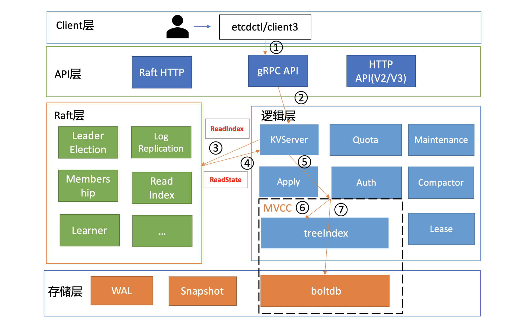
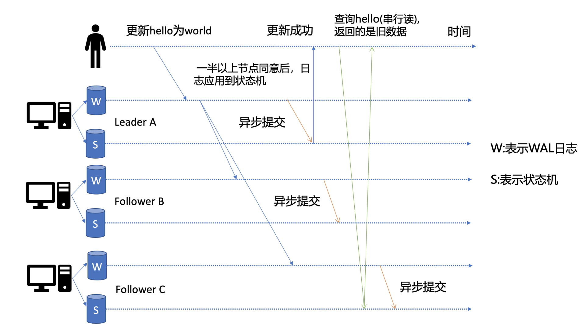

## 二、一个读请求是如何执行的

### 1、基础架构

功能模块：


etcd 默认读模式（线性读）的执行流程：



### 2、串行读与线性读

串行读(Serializable)：直接读状态机数据返回、无需通过 Raft 协议与集群进行交互的模式。它具有**低延时、高吞吐量**的特点，适合对数据一致性要求不高的场景。



线性读(默认)：一旦一个值更新成功，随后任何通过线性读的 client 都能及时访问到。延时和吞吐量上相比串行读略差一点，适用于对**数据一致性要求高**的场景。

虽然集群中有多个节点，但 client 通过线性读就如访问一个节点一样。因为它需要经过 Raft 协议模块，反应的是集群共识。


#### 2.1 线性读之 ReadIndex

线性读模式可能会读取到从机未更新的状态，而 ReadIndex 就是为了解决这个问题，大概流程如下：
1. 当从机收到一个线性读时，会从主机获取**集群最新的已提交的日志索引**（ReadIndex 请求）
2. 主机收到 ReadIndex 请求之后，为了防止脑裂等异常，会像从机发送心跳，一半从机以上确认主机身份之后才将最新日志索引返回给从机
3. 从机收到最新日志索引，等待从机本身的日志索引大于等于从主机获取的集群最新已提交日志索引之后，返回对应数据

### 3. ETCD 中的 MVCC

#### 3.1 MVCC 解决了哪些问题

- etcd v2 是一个内存型的视线，仅保留最新版本的数据，但是 Watch 机制又依赖历史版本，为了缓解这个问题，etcd 维护了一个 1000 条变更事件滑动窗口，
但是在写请求较多时，仍然不能保证可靠的 Watch 机制。
- 多 key 事务


#### 3.2 MVCC 的原理

MVCC 是多版本并发控制的简称。

##### 3.2.1 数据结构

```go
// A revision indicates modification of the key-value space.
// The set of changes that share same main revision changes the key-value space atomically.
type revision struct {
    // main is the main revision of a set of changes that happen atomically.
    main int64

    // sub is the the sub revision of a change in a set of changes that happen
    // atomically. Each change has different increasing sub revision in that
    // set.
    sub int64
}
```

- main：对应事务 ID，全局递增不重复，它在 etcd 中被当做一个逻辑时钟来使用。
- sub：代表一次事务中不同的修改操作（如 put 和 delete ）编号，从 0 开始依次递增。

在一次事务中，每一个修改操作所绑定的 revision 依次为 {txID, 0}, {txID, 1}, {txID, 2} …


```go
type keyIndex struct {
    key         []byte      // 具体值
    modified    revision    // 最后一次修改的事务 ID
    generations []generation    // key 的多个生命周期
}

// generation contains multiple revisions of a key.
type generation struct {
ver     int64
created revision        // 在该生命周期内，第一次 put 创建时的版本号
revs    []revision      // 版本更替记录
}
```

示例：
```text
key: "foo"      // key 的值
modified: {10, 0}   // 最后一次修改的版本
generations:
    [{2, 0}, {4, 2}, {6, 0}(t)],    // 第一个生命周期
    [{8, 0}, {10, 0}]               // 第二个生命周期
```

在 Etcd 中，内存中的 treeIndex 存储了 [key，revision] 的对应关系，而 [revision，{key，value}] 存储在磁盘上的 boltdb 上，boltdb 是个基于 B+ tree 实现的 key-value 键值库，支持事务，提供 Get/Put 等简易 API 给 etcd 操作。


> 参考链接：
>
> [02 基础架构：etcd一个读请求是如何执行的？](https://lianglianglee.com/%e4%b8%93%e6%a0%8f/etcd%e5%ae%9e%e6%88%98%e8%af%be/02%20%e5%9f%ba%e7%a1%80%e6%9e%b6%e6%9e%84%ef%bc%9aetcd%e4%b8%80%e4%b8%aa%e8%af%bb%e8%af%b7%e6%b1%82%e6%98%af%e5%a6%82%e4%bd%95%e6%89%a7%e8%a1%8c%e7%9a%84%ef%bc%9f.md "02 基础架构：etcd一个读请求是如何执行的？")
> 
> [MVCC 在 etcd 中的实现](https://blog.betacat.io/post/mvcc-implementation-in-etcd/ "MVCC 在 etcd 中的实现")
> 
> [《kubernetes 系列》7. etcd 是如何基于 MVCC 实现 key 的历史变更的？ ](https://www.cnblogs.com/traditional/p/17449105.html "《kubernetes 系列》7. etcd 是如何基于 MVCC 实现 key 的历史变更的？ ")
> 
> [英文博客](URL "英文博客")
> 
> [英文博客](URL "英文博客")