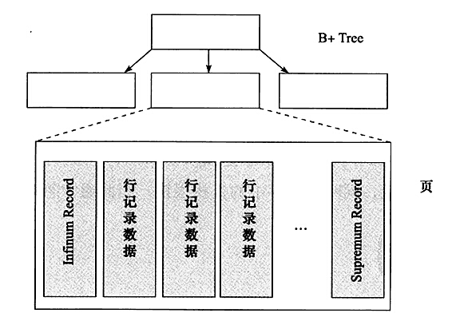

# MySQL技术内幕：InnoDB存储引擎 基于mysql 5.6 精华版总结

标题：《MySQL技术内幕：InnoDB存储引擎》知识总结

## 三、文件

文件的种类：

- 参数文件：一些初始化参数
- 日志文件：如错误日志文件、二进制日志文件、慢查询日志文件、查询日志文件等
- socket 文件
- pid 文件
- MySQL 表结构文件：存放 MySQL 表结构定义文件
- 存储引擎文件：每个存储引擎都会有自己的文件

### 3.1 参数文件

参数分 **动态参数** 和 **静态参数**。动态参数可以在 MySQL 实例运行中进行更改，静态参数在整个实例生命周期内不得更改。

### 3.2 日志文件

- 错误日志（error log）：对 MySQL 的启动、运行、关闭过程进行记录，记录所有错误信息及部分告警和正确信息。
- 二进制日志（binlog）：记录了对 MySQL 执行**更改的所有操作**，不管更改操作是否使数据库发生了变化。
    - 二进制日志有以下几种作用：恢复、复制、审计
    - 二进制日志文件默认关闭，需要手动启动
    - 对于支持事务的存储引擎，会在事务提交之前先将二进制日志存入缓存中，等事务提交之后再写入二进制文件
    - MySQL 5.1 开始引入了 binlog_format 参数，该参数可以设置 STATEMENT、ROW、MIXED
        - STATEMENT 格式和之前 MySQL 版本一样，记录逻辑 SQL 语句
        - MIXED，默认采用 STATEMENT ，有些情况采用 ROW
        - ROW 记录表的行更改情况，通常情况设置为 ROW
            - 优点：可以为数据库恢复和复制带来更好的可靠性
            - 缺点：1. 文件大小会增加 2. 语句执行时间会变长 3. 复制是采用传输二进制文件实现，所以网络开销也会增大
- 慢查询日志（slow query log）：记录超过时间阈值（启动时设置）和没有使用索引的查询语句
    - 阈值可以通过 long_query_time 设置
    - 默认不开启，用户需要手动开启
    - MySQL 5.1 开始，可以将慢查询日志放入一张表中， mysql 架构下的 slow_log 表
- 查询日志（log）：记录所有对 MySQL 数据库**请求的信息**，无论是否得到了正确的执行
    - MySQL 5.1 开始，可以将查询日志放入 mysql 架构下的 general_log 表中

### 3.3 InnoDB 存储引擎文件

#### 3.3.1 表空间文件

InnoDB 采用**将存储的数据按表空间进行存放的设计**，默认配置下会有一个初始大小为 10MB 名为 ibdatal 的文件，该文件就是默认表空间文件。

还有一个参数是 innodb_file_per_table ，若设置了该参数，则每张表会生成一个独立表空间。这些单独的表空间文件仅存储该表的数据、索引和插入缓冲
BITMAP 等信息，其余信息还是存放在默认的表空间中。

#### 3.3.2 重做日志文件（redo log）

redo log 可以用来保证数据的完整性。

重做日志（redo log）和二进制日志（bin log）的区别：

- bin log 是数据库层的日志，包括其它存储引擎的日志；redo log 是 InnoDB 的日志，只记录本身的事务日志。
- bin log 记录的是关于一个事务的具体操作内容，即该日志是逻辑日志；redo log 记录的是关于某页的更改的物理情况。
- 写入时间也不同，bin log 仅在事务提交前进行提交，只写磁盘一次；在事务提交过程中，却不断有重做日志条目（redo
  entry）被写入到重做日志文件中。

写入重做日志不是直接写，而是先写入一个重做日志缓冲中。而且是按照一个扇区的大小（512 字节）写入的，因为扇区是写入的最小单位，所以不需要
doublewrite。

## 四、表

### 4.1 索引组织表

InnoDB 中，表都是根据**主键顺序**组织存放点额，这种存储方式的表称为索引组织表。

每张表都有主键，如果没有显式创建，则按照如下方式判断：

- 判断表中是否有非空唯一索引，有则为主键；如果有多个，则按照**定义索引的顺序**来选择第一个
- 如果没有，InnoDB 会自动创建一个 6 字节的指针作为主键

#### 4.2 InnoDB 逻辑存储结构

所有数据都被**逻辑地**存放在一个空间，称为表空间。表空间又由段（segment）、区（extent）、页（page）组成。如下图所示：

##### 4.2.1 表空间

表空间可以看做是 InnoDB 存储引擎逻辑结构的最高层，所有数据都放在表空间中。

每张表的表空间只存放数据、索引和插入缓冲 Bitmap 页，其它类的数据，如回滚信息、插入缓冲索引页、系统事务信息、二次写缓冲等还是
存放在原来的共享表空间内。

##### 4.2.2 段

常见的段有数据段、索引段、回滚段等。数据段即 B+ 树的叶子结点，索引段即 B+ 树的非索引节点。

##### 4.2.3 区

区是连续的页组成的空间，在任何情况下每个区的大小都为 1MB。为了保证区中页的连续性，InnoDB 一次从磁盘中申请 4-5 哥区。
默认情况下，InnoDB 页的大小为 16KB，一个区中有 64 个连续的页。

InnoDB 1.0.x 引入了压缩页，页的大小可以变化为 2K、4K、8K，此时每个区中页的数量应该为 512、256、128。

InnoDB 1.2.x 引入了参数 innodb_page_size ，可以调整默认页的大小，但是不管怎么变，区的大小永远都是 1MB。

##### 4.2.4 页

页（也可以成为块）是 InnoDB 磁盘管理的最小单位。

InnoDB 1.2.x 引入了参数 innodb_page_size ，可以调整默认页的大小为 4K、8K、16K。

##### 4.2.5 行

每个页最多允许存放 16KB/2 - 200 个行记录，也就是 7992 个。

#### 4.3 InnoDB 行记录格式

InnoDB 提供了 Compact 和 Redundant 两种格式来存放行记录数据。Redundant 是为了兼容之前的版本保留的。

##### 4.3.1 Compact 行记录格式

Compact 行记录是 MySQL 5.0 中引入的，设计目标是高效地存储数据。一个页中存放的行数据越多，其性能就越高。Compact 行记录的存储格式如下：

其中的字段含义如下：
- 变长字段长度列表：就是行记录中非 NULL 的变长字段的大小的列表，并且按照列的顺序逆序放置。
  - 对于每个非NULL可变长度字段，记录头包含 1 或 2 个字节的列长度。
  - 仅当列的部分内容存储在溢出页中或最大长度超过 255（2^8 - 1） 字节且实际长度超过 127 字节时，才需要两个字节。
  - 对于外部存储列，2 字节长度表示内部存储部分的长度加上指向外部存储部分的 20 字节指针的长度。内部部分为 768 字节，所以长度为 768+20。20 字节指针存储列的真实长度。
  - 变长字段的长度最大不可以超过 2 字节，这是因为 MySQL 数据库中 VARCHAR 类型的最大长度限制为 65535。
- NULL 标志位：指示了该行数据中是否有 NULL 值，有则用 1 表示。NULL 标志位也是逆序。
  - 举个例子，假设 NULL 表示为 06，则二进制为 00000110 ，则表示第 2 列和第 3 列的数据为 NULL。
  - 不管是 CHAR 还是 VARCHAR 类型，在 compact 格式下，NULL 值都不占用任何存储空间。
- 记录头信息，写几个重要的：
  - deleted_flag：改行是否已经被删除
  - record_type：记录类型。
  - next_record：页中下一条记录的相对位置
- 最后部分就是实际存储每个列的数据，除了用户定义的列之外，还有两个隐藏列：
  - 事务 ID 列（trx_id）：6 字节。
  - 回滚指针列（roll_pointer）：7 字节，记录上一个版本的指针。
  - 若没有指定主键，则还会增加一个 6 字节的 rowid 列。

固定长度 CHAR 字段在未能占用其长度空间时，会用 0x20 来填充。

> MySQL 中变长字段有：VARCHAR、VARBINARY、TEXT、BLOB、多字节字符编码的 CHAR 类型（CHAR 的长度是字符长度，而不是字节长度）。

##### 4.3.2 Redundant 行记录格式

因为 Redimdant 为 MySQL 5.0 版本之前的格式，目前没有太多应用，且精力有限，暂时不写。

##### 4.3.3 行溢出数据

行溢出数据：InnoDB 存储引擎可以将一条记录中的某些数据存储在真正的数据页面之外。

通过实际测试，能存放 VARCHAR 类型的最大长度为 65532（设置非 NULL，则为65533）。

VARCHAR（N） 中的 N 指的是字符的长度，而上文中说 VARCHAR 的最大长度中的单位是 字节。对于不同的编码方式，一个字符对应的字节大小是不同的。

MySQL 官方手册中定义的 65535 长度是指所有 VARCHAR 列的长度总和，如果总和超过这个长度，依然无法创建。

InnoDB 的数据一般都是存放在 B-tree node 中，但是当发生行溢出时，数据存放在页类型为 Uncompress BLOB 页中。对于行溢出数据，存储格式如下：

那多长的 VARCHAR 是保存在单个数据页中的，从多长开始会保存在 BLOB 页中呢？ 

InnoDB 存储引擎表是索引组织的，即 B+Tree 结构，这样每个页中至少应该有两条行记录（否则失去了 B+Tree 的意义，变成链表了）。因此：
- 如果页中只能放下一条记录，那么 InnoDB 存储引擎会总将行数据存放到溢出页中。
- 如果可以在一个页中至少放入两行数据，那么 VARCHAR 类型的行数据就不会存放到 BLOB 页中去。

这个长度的阈值是 8098。对于 TEXT、BLOB的数据类型，也是这样的。但是一般用户使用了 BLOB 类型，也不会存放长度这么小的数据，
因此多数请款比不过 BLOB 的行数据还是会发生行溢出，实际数据保存在 BLOB 中，数据页只保存在数据的前 768 字节。

##### 4.3.4 Compressed 和 Dynamic 行记录格式

InnoDB 1.0.x 版本引入了新的文件格式（file format，用户可以理解为新的页格式），称为 Barracuda 文件格式。
该文件格式包含两种新的行记录格式：Compressed 和 Dynamic。上面讲到的两种行记录格式属于 Antelope 文件格式。

新的两种记录格式对于行溢出的情况采用了完全的行溢出方式，在数据页中只存放了 20 个字节的指针，实际的数据都存放在了 Off Page 中，如下：

Compressed 行记录格式的另一个功能是：存储在其中的行数据会以 zlib 的算法进行压缩，所以对于 BLOB、TEXT、VARCHAR 这类大长度类型的数据
能够进行非常有效的存储。

#### 4.4 CHAR 的行结构存储

MySQL 4.1 版本开始，CHAR（N） 中的 N 指的是字符的长度，而不是之前版本的字节的长度。

对于多字节的字符编码，CHAR 类型不再代表固定长度（这里指的是字节）的字符串了。例如对于 UTF-8 CHAR（10）类型的列，
其最小可以存储 10 字节的字符，最大可以存储 30 字节的字符。因此在多字节字符编码下，InnoDB 将 CHAR 视为 变长字符类型，
所以变长长度列表中会记录 CHAR 数据类型的长度。

> 多字节字符编码：一种字符编码方案，用于表示字符集中的字符，其中一个字符可能由多个字节组成。
> 
> 举例来说，UTF-8 是一种常见的多字节字符编码方案。在 UTF-8 编码中，一个字符的编码长度可以是1到4个字节不等，其中拉丁字符通常只需要一个字节来表示，而一些特殊字符可能需要多个字节。例如，中文汉字“你”在 UTF-8 编码中被表示为三个字节的序列：E4 B8 89。
> 
> 单字节字符编码：一种字符编码方案，其中每个字符都用一个字节来表示。
> 
> 举例来说，ASCII（American Standard Code for Information Interchange）是一种常见的单字节字符编码方案，其中每个字符都用一个字节（8位）来表示，共计128个字符（8位只用了7位）。例如，大写字母“A”的 ASCII 编码是65，用一个字节表示为二进制01000001。

#### 4.5  InnoDB 数据页结构

页是 InnoDB 数据引擎管理数据库的最小磁盘单位。页类型为 B-tree Node 的页存放的即是表中行的实际数据了。

InnoDB 数据页由以下 7 个部分组成：
- File Header（文件头）：固定大小，38 字节。
- Page Header（页头）：固定大小，56 字节。
- Infimum 和 Supremum Records
- User Records（用户记录，即行记录）：实际存储行记录的内容，InnoDB 存储引擎表总是 B+ 树索引组织的
- Free Space（空闲空间）：是个链表数据结构，在一条记录被删除后，该空间会被加入到空闲链表中
- Page Directory（页目录）：存放了记录的相对位置（这里存放的是页相对位置，而不是偏移量）.
- File Trailer（文件结尾信息）：固定大小，8 字节。作用是检测页是否已完整地写入磁盘，通过 LSN + checksum 算法比较

其中 User Records、Free Space、Page Directory 这些部分为实际的行记录存储空间，因此大小是动态的。

Infimum（最小值）：Infimum 记录位于 B+ 树中每个页的最底部，它的作用是作为所有数据行的起始点。
Infimum 记录的键值是一个虚拟值，比实际数据的键值都要小，因此 Infimum 记录位于 B+ 树索引的最左侧，
表示当前页中所有数据行的起始位置。

Supremum（最大值）：Supremum 记录位于 B+ 树中每个页的最顶部，它的作用是作为所有数据行的结束点。
Supremum 记录的键值是一个虚拟值，比实际数据的键值都要大，因此 Supremum 记录位于 B+ 树索引的最右侧，
表示当前页中所有数据行的结束位置。

结构如下：

B+ 树索引本身并不能找到具体的一条记录，能找到只是该记录所在的页。数据库把页载入到内存中，然后通过 Page Directory 再进行二叉查找。

#### 4.6 Named File Formats 机制

该机制是为了解决不同版本下页结构兼容性问题。

InnoDB 将 1.0.x 版本之前的文件格式（file format）定义为 Antelope，将这个版本支持的文件格式定义为 Barracuda，关系如下：

#### 4.7 约束

数据库中的约束是用于强制保证数据完整性和一致性的规则或条件。约束可以应用于表的列或表之间的关系，它们定义了数据的有效性和规范性，
限制了用户对数据库的操作，确保数据的正确性和可靠性。

**实体完整性**保证表中有一个主键。可以通过如下方式完成：
- 主键（Primary Key）
- 唯一键（Unique Key）
- 触发器

**域完整性**保证数据每列的值满足特定的条件。可以通过如下方式完成：
- 通过合适的数据类型确保一个数据值满足特定条件
- 外键（Foreign Key）约束
- 触发器
- 考虑用 DEFAULT（默认值？） 约束作为强制域完整性的一个方面

**参照完整性**保证两张表之间的关系，可以通过如下方式完成：
- 外键（Foreign Key）
- 触发器

对于 InnoDB 存储引擎本身而言，提供了如下几种约束：
- 主键（Primary Key）：默认约束名为 PRIMARY
- 唯一键（Unique Key）：默认约束名和列名一样
- 外键（Foreign Key）
- 默认值（Default）
- 非空（NOT NULL）

约束可以采用以下两种方式创建：
- 表建立时就进行约束定义
- 利用 ALTER TABLE 命令来进行创建约束

约束和索引的区别：约束是一个逻辑的概念，用来保证数据的完整性；而索引是一个数据结构，既有逻辑的概念，在数据库中还代表着物理存储的方式。

如果用户想通过约束对数据库非法数据的插入或更新，即 MySQL 数据库提示报错而不是警告，那么用户需要设置 sql_mode 参数。

MySQL 不支持传统的 CHECK 约束，但是可以通过 ENUM 和 SET 类型解决部分这样的约束需求，但是对于复杂的榆树需要使用触发器实现。

触发器的作用是在执行 INSERT、DELETE、UPDATE 命令之前或者之后自动调用 SQL 命令或存储过程。一个表最多可以建立 6 个触发器，
即分别为 INSERT、DELETE、UPDATE 的 BEFORE 和 AFTER 各定义一个。当前 MySQL 只支持 FOR EACH ROW 的触发方式，即按每行记录进行触发。

外键一般用来保证参照完整性。被引用的表称为父表，引用的表称为子表，外键定义时的 ON DELETE 和 ON UPDATE 表示在对父表进行 DELETE 和UPDATE
操作时，对子表所做的操作，可定义的子表操作有：
- CASCADE：当父表发生 DELETE 或 UPDATE 操作时，子表中数据也进行 DELETE 或 UPDATE 操作
- SET NULL：当父表发生 DELETE 或 UPDATE 操作时，子表更新为 NULL
- NO ACTION：当父表发生 DELETE 或 UPDATE 操作时，抛出错误，不允许发生
- RESTRICT：默认值，与 NO ACTION 作用相同

MySQL 数据库的外键约束是即时检查，InnoDB 存储引擎在外键建立时会自动为建立外键的列添加索引。

外键的缺点是，在数据导入时，会在外键约束的检查上花费大量时间，因为外键是即时检查的，所以对导入的每一行都会进行外键检查，
但是用户在导入过程中忽视外键的检查。

#### 4.8 视图

在 MySQL 中，视图是一个命名的虚表，视图中的数据没有实际的物理存储，MySQL 中不存在物化视图。

视图的主要用途之一是被用作一个抽象装置，使程序不需要关心基表的结构，而只需要按照视图定义来取数据或者更新数据。

对视图的更新，本质上就是通过视图的定义来更新基本表。

Oracle 支持物化视图，但是 MySQL 不支持，但是用户可以使用触发器实现简单的物化视图。

物化视图可以用于预先计算并保存多表的链接（JOIN）或聚集（GROUP BY）等耗时较多的 SQL 操作结果，避免耗时操作。

查询重写：当对物化视图的基表进行查询时，数据库会自动判断该操作是否能通过查询物化视图查询，如果可以就查物化视图，提高了效率。

物化视图的刷新：
- ON DEMAND：在用户需要的时候进行刷新
- ON COMMIT：在用户对基表的 DML 操作提交的同时进行刷新

刷新的方法：
- FAST：增量刷新
- COMPLETE：完全刷新
- FORCE：判断是会否可以 FAST，如果可以则 FAST，否则 COMPLETE。
- NEVER：不进行任何刷新

#### 4.9 分区

分区并不是在存储引擎层完成的，所以不只是 InnoDB 支持分区，但是也有部分存储引擎不支持分区。

分区就是将一个表或索引分解成多个更小、更可管理的部分。对访问数据库的应用来说，逻辑上还是一个表或者一个索引，但是在物理上，
这个表或者索引可能是由数十个物理分区组成的。

MySQL 支持水平分区，不支持垂直分区；支持局部分区索引（一个分区中既存放了数据又存放了索引），不支持全局分区（数据存放在各个分区中，
但是所有数据的索引放在一个对象中。）

分区主要用于数据库高可用性的管理。在 OLTP（在线事务处理） 应用中，应该非常谨慎的使用分区。

当前 MySQL 支持以下几种类型的分区：
- RANGE 分区：行数根据给定的连续区间被放入分区。MySQL 5.5 开始支持 RANGE COLUMNS 的分区。
- LIST 分区：行数据根据给定的值集合（非连续，离散的）被放入分区。MySQL 5.5 开始支持 LIST COLUMNS 的分区。
- HASH 分区：根据**用户自定义**的表达式的返回值来进行分区，返回值不能是负值。
- KEY 分区：根据 MySQL 提供的哈希函数进行分区。

不论创建何种类型的分区，如果表中存在主键或者唯一索引时，分区列必须是唯一索引的一部分。唯一索引可以是允许 NULL 值的。

如果没有指定主键、唯一索引，可以指定任何一个列为分区列。MySQL5.5 版本之前，不支持 COLUMNS 分区之前，分区的列必须是整形（interger），如果不是整形，
需要通过函数将其转换为整形，如 YEAR()、TO_DAYS()、MONTH() 等函数。0000

##### 4.9.1 RANGE 分区

本质上就是根据一个给定的连续的范围来进行分区。表分区之后就不再由一个 ibd 文件组成了，而是各个分区 ibd 文件组成。0

当插入的值不在创建表是给定的范围内时，MySQL 会抛出一个异常。这个问题，可以设置一个 MAXVALUE 的分区来解决，可以理解为正无穷分区。

RANGE 分区主要用于日期列的分区，有如下好处：
- 便于表的管理，比如对于 sales 表，我们要删除 2008 年的数据，只需要删除该分区就行
- 可以加快某些查询操作，对于查询 2008 年的销售额，我们只需要查询 2008 年的分区就行（这里我们需要根据分区的特性来优化 SQL 语句的编写）

> 注意：对于 RANGE 分区的查询，优化器只能对 YEAR()、TO_DAYS()、TO_SECONDS()、UNIX_TIMESTAMP() 这类函数进行优化选择。

##### 4.9.2 LIST 分区 

LIST 和 RANGE 很相似，RANGE 是连续的区间，LIST 是离散的集合。

插入的值不在分区的定义内，MySQL 也会报错。

如果在用 INSERT 插入多行的过程中遇到分区未定义的值时，MyISAM 引擎会将之前的数据插入，但是之后的数据不会插入；InnoDB 引擎都不会插入。 

##### 4.9.3 HASH 分区

HASH 分区的目的是**将数据均匀地**分布到预先定义的各个分区中。用户需要给予将要进行哈希分区的列值指定一个列值或表达式以及**分区数量（默认为1）**。

MySQL 还支持一种称为 LINEAR HASH 的分区，他使用一个更加复杂的算法来确定新行插入到已经分区的表中的位置。只需要将 HASH 改为 LINEAR HASH。

##### 4.9.4 KEY 分区

KEY 和 HASH 相似，但是 HASH 使用用户定义的函数进行分区，KEY 使用 MySQL 提供的函数进行分区。KEY 分区也有对应的 LINEAR KEY 分区方式。 

##### 4.9.5 COLUMNS 分区

前面四种分区，分区的条件是：数据必须是整型（interger），如果不是整型，需要通过函数转化为整型。

MySQL 5.5 版本开始支持 COLUMNS 分区，可视为 RANGE 和 LIST 分区的进化。COLUMNS 分区可以直接使用非整型数据进行分区，
分区根据类型直接比较而得，不需要转化为整形。此外，**RANGE COLUMNS 分区可以对多个列的值进行分区。**

COLUMNS 分区支持以下的数据类型：
- 所有的整形类型，如 INT、SMALLINT、TINYINT、BIGINT。FLOAT 和 DECIMAL 则不支持。
- 日期类型。如 DATE 和 DATETIME。其余的日期类型不支持。对于日期类型不再需要YEAR()、TO_DAYS()函数了，可以直接使用 COLUMNS。
- 字符串类型，如 CHAR、VARCHAR、BINARY 和 VARBINARY。BLOB 和 TEXT 则不支持。

##### 4.9.6 子分区

子分区是在分区的基础上再进行分区，也称复合分区。MySQL 允许在 RANGE 和 LIST 分区上再进行 HASH 和 KEY 的子分区。

子分区的建立需要注意如下问题：
- 每个子分区的数量必须相同
- 要在一个分区表上的任何分区上使用 SUBPARTITION 来明确定义任何子分区，就必须定义所有的子分区。
- 每个 SUBPARTITION 子句必须包括子分区的一个名字（还有啥参数吗？）
- 子分区的名字必须是唯一的

##### 4.9.7 分区中的 NULL 值

MySQL 数据库的分区总是认为 NULL 值小于任何一个非 NULL 值，这和 MySQL 数据库中处理 NULL 值的 ORDER BY 操作是一样的。

分区对 NULL 值的处理：
- RANGE 分区：将该值放入最左边的分区，如果删除该分区，则会连 NULL 一起删除。
- LIST 分区：在该分区下使用 NULL ，必须显式声明 NULL 值属于哪个分区，不声明则报错。
- HASH 分区、KEY分区：任何分区函数都将 NULL 值的记录返回为 0。

##### 4.9.8 分区和性能

数据库类型分为两类：
- OLTP（在线事务处理）：比如Blog、电子商务、网络游戏等。
- OLAP（在线分析处理），如数据仓库、数据集市。

在一个实际的应用中，可能既有 OLTP 的应用，又有 OLAP 的应用。

对于 OLAP 的应用，分区确实可以很好地提高查询的性能。因为这种应用大多数查询需要频繁地扫描一张很大的表。分区可以提高查询效率。

对于 OLTP 的应用，分区要小心使用。这种应用通常不可能会获取一张大表中 10% 的数据，大部分是通过索引返回几条记录即可。
而根据 B+ 树索引的原理，一张大表，一般的 B+ 树需要 2-3 次的磁盘 IO，因此 B+ 树可以很好的完成操作，不需要分区的帮助。不好的分区甚至还会降低性能。

对于一张 1000w 行的表，如果对主键进行 HASH 分区，分为 10 个区。

对于使用主键进行查询的操作确实会变快，因为只需要在 100w 中查询，但是 100w 和 1000w 的数据本身构成的 B+ 树的层次可能都是一样的，那上述的分区并不会带来性能的提升。
如果执行 SELECT * FROM TABLE WHERE KEY= @key （KEY不是主键），这时对于 KEY 的查询需要扫描所有的 10 个分区，
即使每个分区的查询开销为 2 次 IO，则一共需要 20 次 IO，这比分区之前的 2 次 IO 还要耗费性能。

使用主键进行 HASH 分区，也不能保证分区数据的均匀，因为插入的自增长 ID 并非总是连续的，如果主键因为某种原因回滚了，则该值不会再次被自动使用。

所以设计分区时要明确数据的访问模式，确定是否适合使用分区。

