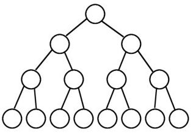
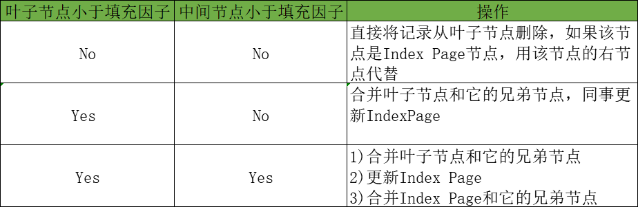
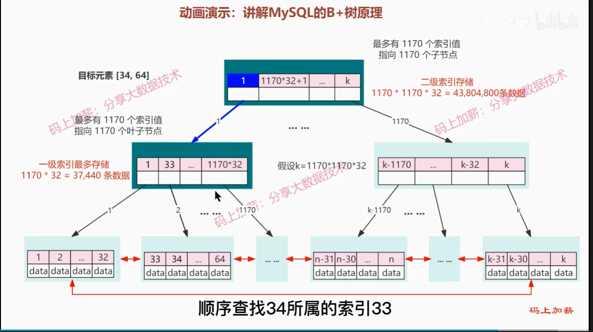
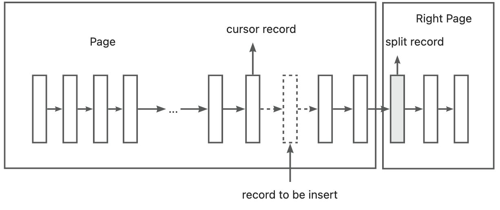
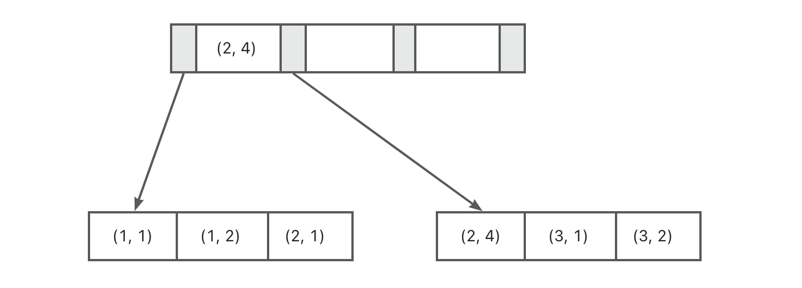

# MySQL技术内幕：InnoDB存储引擎 基于mysql 5.6 精华版总结

标题：《MySQL技术内幕：InnoDB存储引擎》索引篇 知识总结

## 五、索引与算法

如果知道数据的使用，从一开始就应该在需要的地方添加索引

### 5.1 InnoDB 存储引擎索引概述

InnoDB 支持如下几种常见索引：

- B+ 树索引：B 代表平衡而不是二叉
- 全文索引
- 哈希索引：自适应哈希索引，不需要用户认为干预

B+ 树索引并不能找到一个对给定键值的具体行。B+ 树索引能找到的只是被查找数据行**所在的页**，然后数据库把页读到内存，
再在内存中进行查找，最后得到要查找的数据。

### 5.2 数据结构与算法

本节介绍 B+ 树的数据结构及其常用算法。

#### 5.2.1 二分查找法

用来查找一组**有序**的记录数组中的某一记录。

在前面的章节中，Page Directory 中的槽是按照主键的顺序存放的，对于某一条具体记录的查询是通过对 Page Directory 进行二分查找得到的。

#### 5.2.2 二叉查找树和平衡二叉树

B+ 树是通过二叉查找树，再由平衡二叉树，B 树演化而来。

二叉查找树 -> 平衡二叉树 -> B 树 -> B+ 树

- 二叉查找树：左子树的键值总是小于根的键值，根的键值总是小于右子树的键值。中序遍历得到键值的排序输出。
    - 在极端的情况下，二叉查找树会变成一条链表，所以引出了平衡二叉树
- 平衡二叉树（AVL 树）：在二叉查找树的基础上，必须满足任何节点的两个子树高度的最大差为 1。
    - 平衡二叉树的查询性能是比较高的，但不是最高的。最好的性能需要建立一棵最优二叉树。最优二叉树的建立和维护需要大量的操作。
    - 平衡二叉树的查询速度的确很快，但是维护一棵平衡二叉树的代价是非常大的，需要通过左旋和右旋完成，但是多用于内存结构对象中，维护的开销相对可以接受。
- 完全二叉树：若设二叉树的深度为k，除第 k 层外，其它各层 (1～k-1) 的节点数都达到最大个数，第k 层所有的节点都连续集中在最左边，这就是完全二叉树。
- 满二叉树:一棵二叉树的节点要么是叶子节点，要么它有两个子节点（如果一个二叉树的层数为K，且节点总数是(2^k) -1，则它就是满二叉树。）
- 最优二叉树：最优二叉树又称哈夫曼树，是带权路径最短的二叉树。根据节点的个数，权值的不同，最优二叉树的形状也不同。




### 5.3 B+ 树

B+ 树是基于 B 树（也叫 B- 树）演化而来。

B+ 树是为**磁盘**或**其它直接存储辅助设备**设计的一种**平衡查找树**。

B+ 树中，所有记录节点都是**按键值的大小顺序**存放在**同一层的叶子节点中**，由**各叶子节点指针进行连接**。

#### 5.3.1 B+ 树的操作

B+ 树的插入操作必须保证插入后叶子节点中的记录依然有序。

下图中的 Leaf Page 指叶子页（也就是数据页，叶子节点）；Index Page 指索引页（非叶子节点）。


页的拆分意味着磁盘的操作，在插入过程中，B+ 树为了减少页的拆分操作，同样提供了类似于平衡二叉树的旋转功能。



具体的插入操作和删除操作请看 [MySQL Index的操作](https://www.cnblogs.com/xibuhaohao/p/10910947.html "MySQL Index的操作")

### 5.4 B+ 树索引

#### 5.4.1 聚集索引和辅助索引

B+ 树索引在数据库中的一个特点是**高扇出性**，因此在数据库中，B+ 树的高度一般都在 2-4 层。
假设主键 ID 的数据类型是 bigint ，bigint 占据 8 字节，索引指针占据 6 字节，一行索引占据 14（6+8） 字节。
而一个 Page 为 16KB，则一级索引最多存储 1170（16KB/14b）条索引。



首先明确：**非叶子节点也叫索引页，聚集索引的叶子节点也叫数据页。** 下文中不再赘述，且一致使用非叶子节点和叶子节点进行讲述。

数据库中的 B+ 树索引分为：

- 聚集索引：
    - 按照每张表的**主键**构造一张 B+ 树，同时叶子节点中存放的即是整张表的行记录数据。这一特性决定了索引组织表中数据也是索引的一部分。每个叶子节点都通过一个
      **双向链表**来链接。
    - **每张表只有一个聚集索引**，优化器倾向于直接使用聚集索引，因为可以直接找到数据。
    - 聚集索引的叶子节点是**顺序存放**的且使用**双向链表**链接，所以**对主键的排序查找和范围查询很快**。
    - 叶子节点存放的是完整的每行的记录；非叶子节点中存放的仅仅是主键键值以及指向叶子节点（数据页，这里用数据页更容易懂，所以添加备注）的偏移量。
    - 聚集索引的存储并不是物理上连续的，而是逻辑上连续的。
- 辅助索引：也称 非聚集索引。
    - 叶子节点并不包含行记录的全部数据，而是包含索引列键值以及一个书签（相应行数据的聚集索引建，用来告诉 InnoDB 引擎去哪里找数据）
    - 每张表可以有多个辅助索引
    - InnoDB 引擎用辅助索引查找数据时的过程叫做**回表**，过程如下：
        - 先遍历辅助索引并通过叶子节点的书签**获得指向聚集索引的主键的值**
        - 然后通过聚集索引找到一个完整的行记录

聚集索引和辅助索引都是 B+ 树，都是高度平衡，且叶子节点存放着所有的数据。聚集索引和辅助索引不同的是，叶子节点存放的是否是一整行的信息。
**聚集索引中存放的是一整行的信息，辅助索引存放的是索引列的信息以及聚集索引的指针。**


#### 5.4.2 B+ 树索引的分裂

B+ 树索引页的分裂并不总是从页的中间记录开始，这样可能会**导致页空间的浪费**。

比如下面这个记录：

```text
1、2、3、4、5、6、7、8、9
```

由于插入是以自增的顺序进行的，若这时插入第10条记录然后进行页的分裂操作，那么根据上一节的方法，会将 5 作为分割点，得到下面两个页：

```text
P1: 1、2、3、4
P2: 5、6、7、8、9、10
```

然而由于插入是顺序的，P1 这个页中将不会再有记录插入，从而导致空间浪费。而 P2 又会再次进行分裂。

InnoDB 存储引擎的 Page Header 中有以下几个部分用来保存插入的顺序信息：

- PAGE_LAST_INSERT: 最后插入记录的位置
- PAGE_DIRECTION: 最后插入的方向。可能的取值为 PAGE_LEFT（0x01），PAGE_RIGHT（0x02），
- PAGE_SAME_REC（0x03），PAGE_SAME_PAGE（0x04），PAGE_NO_DIRECTION（0x05）。
- PAGE_N_DIRECTION: 一个方向连续插入记录的数量

通过这几个信息，InnoDB 可以决定是向左还是向右进行分裂，同时决定将哪个作为分裂点。

若插入是随机的，则取页的中间记录作为分裂点，这和之前介绍的是相同的。
若往同一方向插入的记录数量 (PAGE_N_DIRECTION) 为 5，并且目前已经定位（cursor）到的记录（InnoDB 存储引擎插入时，
首先需要进行定位，定位到的记录为待插入记录的前一条记录）之后还有 3 条记录，则分裂点的记录为定位到的记录后的第三条记录，
否则分裂点记录就是待插入的记录。

来看一个向右分裂的例子，并且定位到的记录之后还有 3 条记录，则分裂点记录如下图所示：


上图向右分裂且定位到的记录之后还有 3 条记录，split record 为分裂点记录最终向右分裂的到如下图所示的情况：



而对于下图，分裂点就是插入记录本身，向右分裂后仅插入记录本身，这在自增插入时是普遍存在的一种情况：


[参考链接](https://zhuanlan.zhihu.com/p/428108724 "参考链接")

#### 5.4.3 B+ 树索引的管理

##### 5.4.3.1 索引管理

索引的创建和删除有两种方法：

- ALTER TABLE
- CREATE/DROP INDEX

用户可以设置对整个列的数据进行索引，也可以只索引一个列的开头部分数据。

可以使用 SHOW INDEX FROM 命令查看表上的索引，其中有一个字段 Cardinality 比较重要，表示索引中**唯一值的数目**的估计值，
简单点说，就是这个列有多少不重复的值，这个值越接近总记录行数，也就是该列值的重复率越低，索引越高效。如果该值特别小，那么用户可以删除该索引。
这个值不是实时更新的，所以只是大概的值。如果要更新 Cardinality，可以使用 ANALYZE TABLE 命令。

建议在非高峰时间，对应用程序下的几张核心表做 ANALYZE TABLE 操作，这能使优化器和索引更好地为你工作。

##### 5.4.3.2 Fast Index Creation

MySQL 5.5 版本之前（不包括5.5），对于索引的添加或者删除这类的 DDL 操作，MySQL 的操作过程为：
1. 首先建立一张临时表，表结构为通过命令 ALTER TABLE 新定义的结构
2. 将原表数据导入到临时表
3. 删除原表
4. 把临时表重命名为原表的名字

如果对一张大表进行索引的添加和删除，会耗费大量的时间。而且，若有大量事务需要访问正在被修改的表，这意味着数据库服务不可用。

InnoDB 存储引擎从 InnoDB 1.0.x 版本开始支持 Fast Index Creation（快速索引创建）的索引创建方式 —— 简称 FIC。

- 对于辅助索引的创建，InnoDB 会对创建索引的表加上一个 S 锁（共享锁，可读不可写）。且 InnoDB 删除辅助索引时不需要重建表，
只需要更新内部视图，并将辅助索引的空间标记为可用，同时删除 MySQL 数据库内部视图上对该表的索引定义即可。
  - 因为加了 S 锁，所以只能读，如果有大量写，也会导致服务不可用。且该方式只适用于辅助索引，聚集索引还是按照创建临时表的方式。

##### 5.4.3.3 Online Schema Change（在线架构改变，简称 OSC）

所谓 “在线” 是指在事务创建过程中，可以有读写事务对表进行操作，这提高了原有 MySQL 数据库在 DDL 操作时的并发性。

Facebook 采用 PHP 脚本来实现 OSC，而不是通过修改 InnoDB 源码的方式。实现 OSC 的步骤如下：

1. init，初始化阶段，对创建表做一些验证工作：检查是否有主键，是否存在触发器或者外键等。
2. createCopyTable，创建和原始表结构一样的新表。 
3. alterCopyTable：对创建的新表进行 ALTER TABLE 操作，如添加索引或列等。 
4. createDeltasTable，创建 deltas 表，该表的作用是为下一步创建的触发器所使用。之后对原表的所有 DML 操作操作会被记录到 createDeltasTable 中。
5. createTriggers，对原表创建 INSERT、UPDATE、DELETE 操作的触发器。触发操作产生的记录被写入到 deltas 表。
6. startSnapshotXact，开始 OSC 操作的事务。
7. selectTableIntoOutfile，将原表中的数据写入到新表。为了减少对原表的锁定时间，这里通过分片（ chunked）将数据输出到多个外部文件，然后将外部文件的数据导入到 copy 表中。分片的大小可以指定，默认值是 500000。
8. dropNCIndexs，在导入到新表前，删除新表中所有的辅助索引。
9. loadCopyTable，将导出的分片文件导入到新表。
10. replayChanges，将 OSC 过程中原表 DML 操作的记录并应用到新表中，这些记录被保存在 deltas 表中。
11. recreateNCIndexes，重新创建辅助索引。
12. replayChanges，再次进行 DML 日志的回放操作，这些日志是在上述创建辅助索引过程中新产生的日志。
13. swapTables，将原表和新表交换名字，整个操作需要锁定 2 张表，不允许新的数据产生。由于改名是一个很快的操作，因此阻塞的时间非常短。

上述只是简单介绍了 OSC 的实现过程，实际脚本非常复杂。同时 OSC 所做的操作不会同步 slave 服务器，可能导致主从不一致的情况。

##### 5.4.3.4 Online DDL

MySQL5.6 版本开始支持 Online DDL 操作，其允许辅助索引创建的同时，还允许其他诸如 INSERT、UPDATE、DELETE 这类 DML 操作，这极大地提高了 MySQL 数据库在生产环境中的可用性。

此外，不仅是辅助索引，以下这几类 DDL 操作都可以通过“在线”的方式进行操作：

- 索引的创建与删除
- 改变自增长值
- 添加或删除外键约束
- 列的重命名

通过新的ALTER TABLE语法，用户可以选择索引的创建方式：

```sql
ALTER TABLE tbl_name
| ADD {INDEX|KEY} [index_name]
[index_type] (index_col_name,...) [index_option] ...
ALGORITHM [=] {DEFAULT|INPLACE|COPY}
LOCK [=] {DEFAULT|NONE|SHARED|EXCLUSIVE}
```

ALGORITHM 指定了创建或删除索引的算法：
- COPY：表示按照 MySQL5.1 版本之前的工作模式，即创建临时表的方式。
- INPLACE：默认值。表示索引创建或删除操作不需要创建临时表。
- DEFAULT：表示根据参数 old_alter_table 来判断是通过 INPLACE 还是 COPY 的算法。

LOCK 部分为索引创建或删除时对表添加锁的情况，可有的选择为：

- NONE：执行索引创建或者删除操作时，**对目标表不添加任何的锁**，即事务仍然可以进行读写操作，不会受到阻塞。因此这种模式可以获得**最大的并发度**。
- SHARE：这和之前的 FIC 类似，执行索引创建或删除操作时，**对目标表加上一个 S 锁（共享锁）**。对于**并发地读事务，依然可以执行，但是遇到写事务，就会发生等待操作**。如果存储引擎不支持 SHARE 模式，会返回一个错误信息
- EXCLUSIVE：该模式下，执行索引创建或删除操作时，**对目标表加上一个 X 锁（互斥锁）**。读写事务都不能进行，因此**会阻塞所有的线程**。和 COPY 的状态类似，但不需要像 COPY 方式那样创建一张临时表。
- DEFAULT：首先判断当前操作是否可以使用 NONE 模式，若不能则判断是否可以使用 SHARE 模式，最后判断是否可以使用 EXCLUSIVE 模式。也就是说，**DEFAULT 会通过判断事物的最大并发来判断执行 DDL 的模式**。

InnoDB 实现 Online DDL 的原理是在执行创建或者删除操作的同时，**将 INSERT、UPDATE、DELETE 这类 DML 操作日志写入到一个缓存中**。等完成索引创建后再将重做应用到表上，以此达到数据的一致性。

这个缓存的大小由参数 innodb_online_alter_log_max_size 控制，默认的大小是 128MB。

### 5.4.5 Cardinality 值

一般经验是，在访问表中很少一部分时使用 B+ 树索引才有意义。对于性别字段、地区字段、类型字段，他们的可取值范围很小，**称为低选择性。**

对于性别字段，只有男女，那么添加 B+ 树索引是完全没有必要的。

如果某个字段的取值范围很广，几乎没有重复，即属于**高选择性，** 则比较适合使用 B+ 树索引。

可以根据 Cardinality 值来判断是否是高选择性。Cardinality 表示索引中不重复记录数量的预估值，该值越接近总记录行数，选择性越高。

Cardinality 值的统计是通过采样完成的。

Cardinality 统计信息的更新发生在两个操作中：INSERT 和 UPDATE。不可能在每次执行这些操作时更新，更新策略如下：
- 表中 1/16 的数据已经发生过变化。
- stat_modified_counter（InnoDB 引擎内部的计数器，表示发生变化的次数） > 2 000 000 000（20亿）：对第一种情况的补充

默认 InnoDB 对 8 个叶子节点（Leaf Page）进行采样。采样的过程如下：
1. 取得 B+ 树索引中叶子节点的数量，即为 A。
2. 随机取得 B+ 树索引中的 8 个叶子节点。统计**每个页不同记录的个数**，记为 P1, P2, ..., P8。
3. 根据采样信息给出 Cardinality 的预估值：Cardinality =（P1+P2+...+P8) * （A/8）。

在 InnoDB 中，Cardinality 值时通过对 8 个叶子节点预估而得的，**不是一个实际精确的值**。且每次抽取 8 个叶子节点，故每次更新的值可能是不同的。
但是当表足够小，叶子节点数量小于等于 8 个，则是相同的。

当执行 ANALYZE TABLE、SHOW TABLE STATUS、HOW INDEX 以及访问 INFORMATION——SCHEMA 架构下的表 TABLES和STATISTICS 时会导致 InnoDB 引擎去重新计算索引的 Cardinality 值。
若表中的数据量非常大，且表中存在多个辅助索引时，执行上述操作可能非常慢。

### 5.5 B+ 树索引的使用

#### 5.5.1 联合索引

联合索引就是对多个列建立的索引。

比如对列（a,b）建立联合索引，则会先根据 a 进行排序，然后对相同的 a 值下的 b 进行排序。
所以情况可能是：(1, 1)、(1, 2)、(2, 1)、(2, 4)、(3, 1)、 (3, 2)。具体结构如下图：



#### 5.5.2 覆盖索引

InnoDB支持覆盖索引（covering index，或称索引覆盖），即从辅助索引中就可以得到要查询的记录，避免了回表的产生，减少了 IO 次数，显著提升性能。

总的来说就是，联合索引本身的叶子节点上有你想要获取的数据，那么你就直接拿走就行了，就不需要去聚集索引去找了。

#### 5.5.3 优化器选择不使用索引的情况

有时候数据库不会使用辅助索引去查找数据，而是使用聚集索引，也就是直接进行全表扫描来得到数据。

这种情况多发生于**范围查找、JOIN链接操作**等情况。

造成这样的原因如下：使用辅助索引如果不能命中覆盖索引，则还需要进行回表操作，而回表操作是离散读（离散读的速度远远小于顺序读），
所以当搜索的数据数量比较大（一般是全表 20%）时，优化器会选择通过聚集索引来查找数据。

这是由于机械硬盘的特性决定的，如果用户使用的是固态硬盘，同时有自信确认辅助索引的性能更好，可以使用 FORCE INDEX 来强制使用某个索引。

#### 5.5.4 索引提示

MySQL 支持显式的告诉优化器使用哪个索引，一般在下面两种情况下使用：
1. MySQL 优化器选择了错误的索引，导致SQL语句运行的很慢（非常少见）
2. **某个 SQL 语句可选择的索引非常多**，这时**优化器选择执行计划时间的开销可能大于 SQL 语句本身**。例如，优化器分析 RANGE 查询本身就是比较耗时的操作。

#### 5.5.5 Multi-Range Read 优化（MRR）

MySQL5.6 版本开始支持 Multi-Range Read（MRR）优化。

优化的**目的**是：
1. 为了减少磁盘的随机访问
2. 将随机的访问转化为较为顺序的数据访问

MRR 优化可适用于 range、ref、rq_ref 类型的查询。

MRR 优化有以下几个好处：
1. MRR 使数据访问变得较为顺序，在查询辅助索引时，首先根据得到的查询结果，**按照主键进行排序**，并**按照主键排序的顺序进行书签查找**。
2. 减少缓冲池中页被替换的次数（若缓存池不够大，不能存放下一张表中的所有数据，频繁的离散读操作会导致缓存中的页被替换出缓冲池，然后又不断地读入缓存池，若是按照主键顺序读取，则可以将此重复行为降到最低）
3. 批量处理对键值的查询操作（将某些范围查询，拆分为键值对，避免取出无效数据，例子见 P225）

对于 InnoDB 和 MyISAM 存储引擎的**范围查询**和**JOIN查询操作**，MRR 的工作方式如下：
1. 将D查询得到的辅助索引键值存放到一个缓存汇总，这时缓存中的数据是根据辅助索引键值排序的。
2. 将缓存中的键值根据 RowID 来进行排序
3. 根据 RowID 的排序顺序来访问实际的数据文件

**是否启用 Multi-Range Read 优化**可以**通过参数 optimizer_switch 中的标记（flag）来控制**。
当 mrr 为 on 时，表示启用了 MRR 优化。mrr_cost_based 标记表示是否通过 cost based 的方式来选择是否启用 mrr。
若将 mrr 设为 on，mrr_cost_based 设为 off，则总是启用 Multi-Range Read 优化。

参数 read_rnd_buffer_size 用来**控制键值的缓冲区大小**，当大于该值时，则执行器对已经缓存的数据根据 RowID 进行排序，并通过 RowID 来取得行数据。该值默认为 256k。

#### 5.5.6 Index Condition Pushdown (ICP)优化

ICP 优化也是从 MySQL 5.6 开始支持的一种根据索引进行查询的优化方式。

当 MySQL 版本不支持 ICP 时，当进行索引查询时：
1. 首先根据索引来查找记录
2. 然后再根据 WHERE 条件来过滤记录。

在支持 Index Condition Pushdown（ICP）后，MySQL 数据库会在**取出索引的同时**，
判断是否可以进行 WHERE 条件的过滤（WHERE 可以过滤的条件是要该索引可以覆盖到的范围，也就是叶子节点中包含的数据），
也就是**将 WHERE 的部分过滤操作放在了存储引擎层**。在某些查询条件下，可以**大大减少上层 SQL 层对记录的索取（fetch），
从而提高数据库的整体性能**。

### 5.6 哈希算法

时间复杂度 O(1) 的字典操作。

#### 5.6.1 哈希表

哈希表（Hash Table）也称散列表。由直接寻址表改进而来。

哈希表：在哈希方式下，利用哈希函数将关键字映射到哈希表中的槽位（位置）上。

哈希碰撞：对两个不同的关键字使用哈希函数之后映射到了同一个槽位上。

数据库中一般使用链接法解决哈希碰撞。将发生碰撞的关键字放到一个链表中。

#### 5.6.2 InnoDB 存储引擎中的哈希算法

哈希算法采用除法散列方式，冲突机制采用链表方式。

对于缓冲池页的哈希表来说，在缓冲池中的 Page 页都有一个 chain 指针，它指向相同哈希函数值的页。

#### 5.6.3 自适应哈希索引

自适应哈希索引是 InnoDB 存储引擎自己控制的，用户不能干预。

哈希索引只能用来搜索等值查询。

可以通过参数 innodb_adaptive_hash_index 来禁用或启用该特性。

### 5.7 全文检索

全文检索是将存储于数据库中的整本书或整篇文章中的任意内容信息查找出来的技术。

从 InnoDB 1.2.x 版本开始，InnoDB 开始支持全文检索。

#### 5.7.1 倒排索引

全文检索通常使用倒排索引来实现。他在**辅助表**中存储了**单词**自身在一个或多个文档中**所在位置**之间的映射。这通常利用**关联数组**实现。
其有两种表现形式：
- inverted file index，表现形式为 {单词，单词所在文档的 ID}
- full inverted index，表现形式为 {单词，（单词所在文档 ID，在具体文档中的位置）}

对于下图所示的数据来说（DocumentId 表示进行全文检索文档的 Id，Text 表示存储的内容），示例如下：


注意，下表中 Number 为 1，对应的 Text 应为 cold，系打印错误。


#### 5.7.2 InnoDB 全文检索

InnoDB 采用 full inverted index 的方式。

倒排索引需要将 分词（word）存放到一张表中，这个表称为**辅助表（Auxiliary Table）**，InnoDB 为了提高并行性能，
共有 6 张辅助表。InnoDB 中，将（DocumentId，Position）视为一个 “ilist”。因此在全文检索表中，有两个列，
一个是 word 字段，另一个是 ilist 字段，且在 word 字段上设有索引。

辅助表是存在与磁盘上的持久化的表，由于磁盘 IO 比较慢，因此提供 FTS Index Cache（全文检索索引缓存）来提高性能。
FTS Index Cache 是一个红黑树结构，根据（word, ilist）排序，在有数据插入时，索引先更新到缓存中，而后 InnoDB 存储引擎会批量进行更新到辅助表中。

当数据库宕机时，尚未落盘的索引缓存数据会自动读取并存储，配置参数 innodb_ft_cache_size 控制缓存的大小，默认为 32M，提高该值，
可以提高全文检索的性能，但在故障时，需要更久的时间恢复。

在删除数据时，InnoDB 不会删除索引数据，而是保存在 DELETED 辅助表中，因此一段时间后，索引会变得非常大，
可以通过 optimize table 命令**手动删除无效索引记录**。如果需要删除的内容非常多，会影响应用程序的可用性，
参数 innodb_ft_num_word_optimize 控制每次删除的分词数量，默认为 2000，用户可以调整该参数来控制删除幅度。

全文检索存在一个黑名单列表（stopword list），该列表中的词**不需要进行索引分词**，默认共有 36 个，如the单词。你可以自行调整。

InnoDB 的全文检索还有如下限制：
- 每张表只能有一个全文检索索引
- 多列组合的全文检索索引必须使用相同的字符集和排序规则
- 不支持没有单词界定符（delimiter）的语言，如中文、日语、韩语等

#### 5.7.3 全文检索

MySQL 通过 MATCH()...AGAINST() 语法支持全文检索的查询，MATCH 指定需要被查询的列，AGAINST 指定使用何种方法进行查询。

有两种查询方法：
- Natural Language：默认方式，表示查询带有指定 word 的文档。
- Boolean：MySQL 允许使用 IN BOOLEN MODE 修饰符来进行全文检索，使用该模式时，字符串的前后字符会有特殊含义（相当于正则一样）。

对于 InnoDB 的全文检索，还需要考虑以下因素：
- 查询的 word 在 stopword 列中，忽略该字符串的查询
- 查询的 word 字符长度是否在区间 [innodb_ft_min_token_size,innodb_ft_max_token_size] 内，前者默认为 3，后者默认为 84。

