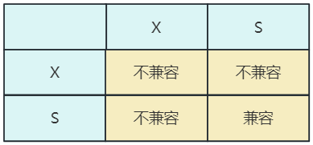
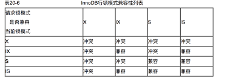
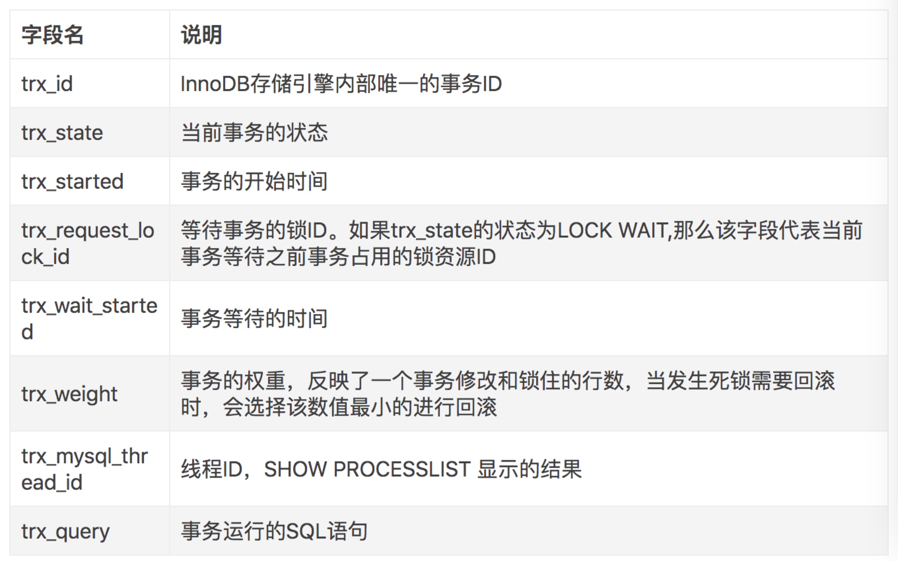
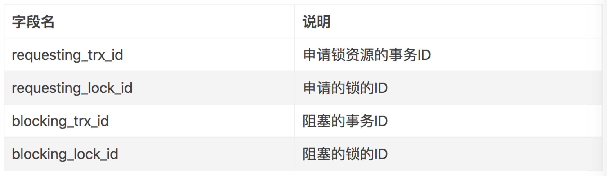
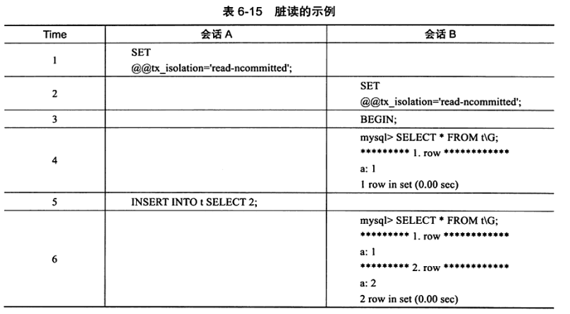
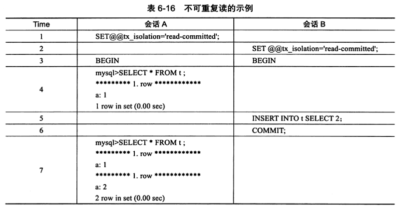

# MySQL技术内幕：InnoDB存储引擎 基于mysql 5.6 精华版总结

标题：《MySQL技术内幕：InnoDB存储引擎》锁篇 知识总结

## 六、锁

数据库系统使用锁是**为了支持对共享资源进行并发访问**，提供**数据的完整性和一致性**

MyISAM 的锁是表锁设计，并发读没有问题，但是并发插入性能较差。

InnoDB 提供一致性的非锁定读、行锁支持。

### 6.1 lock 和 latch

在数据库中，lock 和 latch 都可以称为锁，但是两者有着截然不同的含义，**本章主要关注的是 lock。**

latch 一般成为闩锁（轻量级的锁），因为其要求锁定的时间必须非常短。在 InnoDB中，latch 又可以分为 mutex（互斥量）和 rwlock（读写锁）。
其目的是为了保证并发线程操作临界资源的正确性，并且通常没有死锁检测的机制。

**lock 的对象是事务**。用来锁定的是**数据库中的对象**，如表、页、行。

lock 的对象一般在事务 commit 或 rollback 后进行释放（不同事务隔离级别释放的时间可能不同）。lock 有死锁机制。

### 6.2 InnoDB 存储引擎中的锁

#### 6.2.1 锁的类型

InnoDB 实现了两种标准的**行级锁:**
1. **共享锁（S Lock）**，允许事务读一行数据。
2. **排他锁（X Lock）**，允许事务删除或更新一行数据。



S 锁和 X 锁都是**行锁**，兼容是指对同一记录（row）锁的兼容性情况。

InnoDB 支持多粒度锁定，这种锁定允许事务在行级上的锁和表级上的锁同时存在。为了支持在不同粒度上进行加锁操作，InnoDB 支持**意向锁。**

**意向锁**是在更粗粒度对象上的加锁行为。举例来说，如果需要对页上的记录 r 进行上 X 锁，那么分别需要对数据库 A，表、页上意向锁 IX，最后对记录 r 上 X 锁。

InnoDB 支持意向锁设计比较简练，其意向锁即为**表级别**的锁。**设计目的**主要是为了在一个事务中揭示下一行将被请求的锁类型。支持两种意向锁：
1. **意向共享锁（IS Lock）：** 事务想要获得一张表中某几行的共享锁
2. **意向排他锁（IX Lock）：** 事务想要获得一张表中某几行的排它锁

由于 InnoDB 支持的是**行级别**的锁，因此**意向锁其实不会阻塞除全表扫描以外的任何请求**。故表级意向锁与行级锁的兼容性如下：



总结起来就是：**X 都不兼容，意向都兼容，S、IX 不兼容，S、IS 兼容。**

InnoDB 1.0 之后，在 INFORMATION_SCHEMA 架构下添加了表 INNODB_TRX、INNODB_LOCKS、INNODB_LOCK_WAITS。
通过这三张表，用户可以更简单地监控当前事务并分析可能存在的锁问题。
1. INNODB_TRX：这个表显示了当前运行的 InnoDB 事务
2. INNODB_LOCKS：这个表可以清晰地看到当前锁的信息
3. INNODB_LOCK_WAITS：这个表可以直观地反映当前事务的等待，通过该表，用户可以直观地看到是哪个事务阻塞了另一个事务。

三个表的字段如下：






#### 6.2.2 一致性非锁定读

一致性非锁定读是指 InnoDB 通过**行多版本控制**的方式来**读取**当前执行时间数据库中**行的数据**。之所以称为非锁定读，是因为不需要等待访问的行上的 X 锁释放。

如果读取的行正在执行 DELETE 或 UPDATE 操作，这时读取操作不会因此去等待行上锁的释放。相反地，InnoDB 会去读取行的一个**快照数据。**

快照数据指的是该行之前版本的数据，是通过 undo 段来实现的，undo 段用来在事务中回滚数据，所以快照数据本身是没有额外的开销的。
读取快照数据也是不需要上锁的，因为没有事务要对历史的数据进行修改操作。

非锁定读机制极大提高了数据库的并发性。

一个行记录可能有不止一个快照数据，称这种技术为**行多版本技术**。由此带来的并发控制，称为**多版本并发控制（MVCC）**。

在事务隔离级别 READ COMMITTED（读已提交） 和 REPEATABLE READ（可重复读，InnoDB默认隔离级别）下，InnoDB 使用非锁定一致读。
在 READ COMMITTED（读已提交）级别下，对于快照数据，非一致性读总是**读取被锁定行的最新一份快照数据**；在 REPEATABLE READ（可重复读）
级别下，对于快照数据，非一致性读总是**读取事务开始时的行数据版本**。

#### 6.2.3 一致性锁定读

在默认配置下，即事务的隔离级别为 **REPEATABLE READ 模式下**，InnoDB 的 **SELECT 操作使用一致性非锁定读**。
但是在某些情况下，用户需要显式地对数据库读取操作进行加锁以保护数据逻辑的一致性。

InnoDB 对于 SELECT 语句支持两种一致性锁定读的操作：
1. SELECT...FOR UPDATE （X 锁）
2. SELECT...LOCK IN SHARE MODE （S 锁）

对于**一致性非锁定读**，即使读取的行已被执行了 SELECT...FOR UPDATE，也是可以进行读取的。

#### 6.2.4 自增长与锁

在 InnoDB 存储引擎的内存结构中，对每个含有自增长值的表都有一个自增长计数器。

插入操作会依据这个自增长的计数器增加 1 赋予自增长列。这个实现方式称作 **AUTO-INC Locking**。这种锁采用了一种**特殊的表锁机制**，为了提高插入的性能，
锁不是在一个事务完成后才释放，而是在完成对自增长值插入的 SQL 语句后立即释放。

AUTO-INC Locking 优点：
- 提高了并发插入的效率

AUTO-INC Locking 缺点：
- 对于有自增长值的列的并发插入性能较差，事务必须等待前一个插入的完成（虽然不用等待事务的完成）
- 对于 INSERT...SELECT 的大数据量的插入会影响插入的性能。因为另一个事务的插入会被阻塞。

从 MySQl 5.1.22 版本开始，InnoDB 存储引擎中提供了一种更轻量级互斥量的自增长实现机制，这种机制大大提高了自增长值插入的性能。
并且从该版本开始，InnoDB 存储引擎提供了一个参数 innodb_autoinc_lock_mode 来控制自增长的模式，该参数的默认值是 1。

InnoDB 的自增长的实现和 MyISAM 不同，MyISAM 是表锁设计，自增长不用考虑并发插入的问题。因此在 master 上用 InnoDB 存储引擎，在 slave
上用 MyISAM 存储引擎的 replication 架构下，需要考虑这种情况。

在 InnoDB 中，自增长的列**必须是索引**，而且必须是索引的第一个列。在 MyISAM 就没有这个限制。

#### 6.2.5 外键与锁

在 InnoDB 中，如果没有显式地对这个列加索引，InnoDB 会自动对其加一个索引，因为这样可以**避免表锁**。

对于外键值的插入或更新，首先需要查询父表中的记录，即 SELECT 父表，但是对于父表的 SELECT 操作，不是使用一致性非锁定读的方式，
因为这样会发生数据不一致的问题。

### 6.3 锁的算法

#### 6.3.1 行锁的 3 种算法

InnoDB 有 3 种行锁的算法，分别如下：
- Record Lock：单个行记录上的锁
- Gap Lock：间隙锁，锁定一个范围，但不包含记录本身
- Next-Key Lock：Record Lock + Gap Lock，锁定一个范围，并且锁定记录本身

Record Lock 总是会去锁住**索引记录表**，如果 InnoDB 在建立的时候没有设置任何索引，那么这时 InnoDB 存储引擎会使用隐式的主键来进行锁定、

Next-Key Lock 是锁定**左开右闭的范围区间**，举例如下：加入有一个索引有 10,11,13 和 20 这四个值，那么该索引可能被 Next-Key Lock 的区间为：
- (-无穷，10]
- (10,11]
- (11,13]
- (13,20]
- (20，+无穷]

采用 Next-Key Lock 的锁定技术称为 Next-Key Locking。其设计的目的是**为了解决幻像问题。**

除了 next-key Locking 技术，还有 previous-key Locking，该技术是锁定左闭右开区间。

当查询的索引有唯一属性时，InnoDB 会对 Next-Key Lock 进行优化，将其降级为 Record Lock，即仅锁住索引本身，提高应用的并发性。

假如表 z 有 (a,b) 两个字段，表内数据如下：(1,1)，(3,1)，(5,3)，(7,6)，(10,8)，其中 a 为主键索引，b 为非唯一辅助索引。

执行如下 SQL 语句：
```sql
SELECT * FROM z WHERE b=3 FOR UPDATE 
```

通过索引 b 进行查询，因此使用传统的 Next-Lock Locking 技术加锁，并且由于有两个索引，其需要分别进行锁定。对于主键索引，
仅对列 a=5 的索引加上 Record Lock。而对于辅助索引，其加上的是 Next-Key Lock，锁定的范围是 (1,3]，而且，
InnoDB 还会对辅助索引下一个键值加上 gap lock，即还有一个辅助索引范围为 (3,6) 的锁。

Gap Lock 的作用是为了**防止多个事务将记录插入到同一个范围内**，而这会导致 幻像 问题的产生。

用户可以通过以下两种方式来显式地关闭 Gap Lock：
- 将事务的隔离级别设置为 READ COMMITTED
- 将参数 innodb_locks_unsafe_for_binlog 设置为 1 

在上述的配置下，除了外键约束和唯一性检查依然需要使用 Gap Lock，其余情况仅适用 Record Lock 进行锁定。但是会破坏事务的隔离性，
并且对于 replication，可能会导致主从数据不一致。

#### 6.3.2 解决幻像问题

在默认的事务隔离级别爱，即 REPEATABLE READ 下，InnoDB 存储引擎采用 Next-Key Locking 机制来避免幻像问题。

幻像问题是指在同一事务下，连续两次执行相同的 SQL 语句可能导致不同的结果，第二次的 SQL 语句可能会返回之前不存在的行。

### 6.4 锁问题

#### 6.4.1 脏读

脏读指的就是在不同的事务下，当前事务可以读到另外事务**未提交的数据**。

这个另外事务未提交的数据，就是脏数据，**这违反了数据库的隔离性。**

脏数据和我们之前提到的脏页不同，我们来复习下脏页的概念：脏页指的是缓冲池中已经被修改的页，但是还没有刷到磁盘中，即内存中页的数据和磁盘中页的数据不一致。

将数据库的隔离级别设置为 READ UNCOMMITTED（读未提交），就可能发生脏读，如下为示例：



可以发现，在会话 B 中，两次相同的查询获得了不同的结果，且这 2 条记录是在会话 A 中未提交的数据。

#### 6.4.2 不可重复读

不可重复读指在一个事务内多次读取同一个数据集合，但是数据集合不一样的情况。数据集合不一样的原因是：当前事务还没结束，另一个事务也在访问该数据集合，并且做了一些 DML 操作。

脏读和不可重复读的区别是：**脏读是读到未提交的数据**，**不可重复读是读到了已经提交的数据**，**违反了数据库事务一致性的要求。**



在该示例中，数据库的隔离级别为 READ COMMITTED（读已提交）。

在 InnoDB 中，通过使用 Next-Key Lock 算法来避免不可重复读。在 MySQL 官方文档中将不可重复度的问题定义为 Phantom Problem，即幻像问题。

#### 6.4.3 丢失更新

丢失更新：就是一个事务的更新操作会被另一个事务的更新操作所覆盖，从而导致数据的不一致。

在生产应用中有一种逻辑意义的丢失更新问题：

1. 事务 1 查询一行数据放在本地缓存，并且显示给用户 user1
2. 事务 2 查询同样的一行数据放在本地缓存，并且显示给用户 user2
3. 用户 user1 修改这条数据，并且更新提交数据库
4. 用户user2修改显示的数据，并且更新提交数据库

显然上面 user1 更新的数据丢失了，这也是更新覆盖，比如用户转账的操作。a 账户总共 1000，事务 1 和事务 2 查询账户都是1000，
然后事务 1 账户扣减 100，提交。事务 2 扣减 800 提交。这时候账户余额为 200，事务 1 扣减的 100 会不翼而飞，这会导致严重的问题。

两种解决办法：

解决办法 1：使用悲观锁（串行化），对查询操作加写锁。

解决办法 2: 使用乐观锁，给表中加一个版本号字段，根据版本号的异同来保证数据的一致。

### 6.5 阻塞

因为不同锁之间的兼容性关系，在有些时刻一个事务中的锁需要等待另一个事务中的锁释放它所占用的资源，这就是阻塞。

参数 innodb_lock_wait_timeout 用来控制等待的时间（默认 50s，动态的，运行时可以调整）；
参数 innodb_rollback_on_timeout（静态的，不可在运行时调整） 用来设定是否在等待超时时对进行中的事务进行回滚操作（默认是 OFF，代表不回滚）。

在默认情况下，InnoDB 是不会回滚超时引发的错误异常的，InnoDB 在大部分情况下都不会对异常进行回滚。

### 6.6 死锁

死锁指**两个或两个以上的事务**在执行过程中，因**抢夺锁资源**而造成的一种**互相等待的现象**。

解决死锁问题的最简单方法就是不要有等待，将任何的等待都转换为回滚，并且事务重新开始。但是这会导致并发性能下降，甚至任何一个事务都不能进行。这比死锁更严重，很难发现并且浪费资源。

还有一种方法是超时，两个事务互相等待时。当一个等待时间超过设置的阈值时，其中一个事务回滚，另一个继续。

超时机制虽然简单，但是在其回滚的事务选择上，根据 FIFO 的顺序选择，有可能会选择回滚成本高（undo 较多）的事务。

数据库还采用 wait-for graph（等待图）的方式进行死锁检测，InnoDB 也采用这种方式，这种方式要求存储如下两种信息：
- 锁的信息链表
- 事务等待链表

通过以上链表就可以构造出一张图，而在这个图中若存在回路，就代表存在死锁。

wait-fof graph 是一种较为**主动的死锁检测机制**，在每个事务请求锁并等待时都会判断是否存在回路，若存在则有死锁，
通常来说 InnoDB 都会选择回滚 undo 量最小的事务。

wait-fof graph 的死锁检测通常采用**深度优先**的算法实现。

#### 6.6.1 死锁的示例

死锁只存在于并发的情况，而数据库本身就是一个并发运行的程序，因此可能发生死锁。

一种情况时 A 等待 B 释放资源，B 等待 A 释放资源，导致死锁，这种死锁问题被称为 AB-BA 死锁。

InnoDB 不会回滚大部分的错误异常，但是死锁除外。发现死锁之后，InnoDB 会马上回滚一个事务。

#### 6.6.2 锁升级

锁升级是指将当前锁的粒度降低。

数据库可以把一个表的 1000 个行锁升级为一个页锁，或者将页锁升级为表锁。

InnoDB 不存在锁升级的问题，InnoDB 是根据每个事务访问的每个页对锁进行管理的，采用的是位图的方式。
因此不管是一个事务锁住页中一个记录还是多个记录，其开销通常都是一样的。
