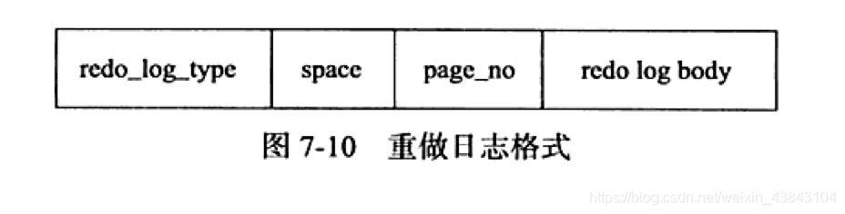

# MySQL技术内幕：InnoDB存储引擎 基于mysql 5.6 精华版总结

标题：《MySQL技术内幕：InnoDB存储引擎》事务篇 知识总结

## 七、事务

事务是数据库区别于文件系统的重要特性之一。

数据库引入事务的**主要目的**是：**将数据库从一种一致性状态转换为另一种一致状态**。

事务的特性：

- 原子性（atomicity）：指**整个数据库事务**是**不可分割的工作单位**。要么都提交，要么都回滚。
- 一致性（consistency）：指事务将数据库**从一种状态转变为下一种一致性状态。**
- 隔离性（isolation）：也叫做并发控制、可串行化、锁等。**要求每个读写事务的对象对其他事务的操作对象能互相分离，即该事务提交前对其他事务都不可见
  **，通常使用锁来实现。
- 持久性（durability）：**事务一旦提交，其结果就是永久性的。**持久性保证事务系统的高可靠性，而不是高可用性（不保证磁盘损坏等原因造成的丢失）。

### 7.1 认识事务

事务是**访问并变更数据库中各种数据项**的一个**程序执行单元**。在事务中的操作，要么**都做修改**，要么**都不做**，这就是事务的目的。

对 InnoDB 存储引擎来说，默认事务隔离级别为 READ REPEATABLE，完全遵循和满足事务的 ACID 特性。

#### 7.1.1 分类

- 扁平事务：最简单、使用最频繁。整个事务是一体的，要么整体回滚，要么整体执行。
    - 缺点：不能呢个提交或回滚事务的某一部分，或分几个步骤提交。
- 带有保存点的扁平事务：在扁平事务上加上几个保存点，保存点是回滚的标记，类似于游戏存档，可以回滚部分操作。
    - 特点：保存点在事务内部是递增的。
    - 缺点：保存点不是持久的，系统崩溃时，保存点都消失，这意味着退化为扁平事务，只能从最开重新开始。
- 链事务：保存点模式的一种变体。在提交一个事务时，释放不需要的数据对象，将必要的处理上下文隐式地传给下一个要开始的事务。
    - 注意：提交事务操作和开始下一个事务操作将合并为一个原子操作，提交上一个事务和开始下一个事务这两个操作时没有逻辑操作的。
    - 链事务中的回滚仅限于当前事务。链事务在执行 COMMIT 后即释放了当前事务所持有的锁；而带有保存点的扁平事务不影响迄今为止所持有的锁。
- 嵌套事务：树状结构。有一个顶层事务（根节点），控制各个层次子事务（子树）。
    - 子树既可以是嵌套事务，可以是扁平事务。
        - 叶节点可以提交也可以回滚
        - 叶节点提交只有父事务提交后才生效，所以只有顶层事务（根节点）提交之后，子事务才真正提交。
        - 任何一个事务的回滚都会导致他的所有子事务回滚，所以子事务不具有持久性。
    - 叶节点的事务是扁平事务。实际的工作是交由叶子结点来完成的。只有叶子结点才能访问数据库、发送下消息、获取资源，其他的节点都是逻辑控制。
- 分布式事务：在分布式环境下运行的扁平事务。

对于 InnoDB 引擎来说，支持扁平事务、带有保存点的事务、链事务、分布式事务。
不支持嵌套事务，但是用户可以通过带有保存点的事务来模拟串行的嵌套事务。

### 7.2 事务的实现

事务隔离性由 锁 实现。原子性、一致性、持久性通过 redo log（重做日志）和 undo log 来完成。
redo log 保证事务的原子性和持久性；undo log 保证事务的一致性。

redo 恢复提交事务修改的页操作；undo 回滚行记录到某个特定版本。

redo 是物理日志，记录页的物理修改操作；undo 是逻辑日志，根据每行记录进行记录。

#### 7.2.1 redo

redo log 用来实现事务的持久性。由两部分组成，一是内存中的重做日志缓冲（redo log buffer），是易失的；二是重做日志文件（redo log
file），是持久的。

InnoDB 通过 Force Log at Commit 机制实现事务的持久性。当事务提交时，需先将事务的所有日志（ redo log 和 undo
log）写入到重做日志文件进行持久化，
等事务的 COMMIT 操作完成才算完成。redo 实现持久性，undo 帮助事务回滚以及 MVCC 功能。

redo 基本上是顺序写，在数据库运行时不需要对 redo log 文件进行读取操作；undo 需要进行随机读写。

InnoDB 允许用户手工设置非持久性的情况发生。参数 innodb_flush_log_at_trx_commit 来控制 redo log 刷新到磁盘的策略。

- 值为 1：默认值。每次事务提交必须调用一次 fsync 操作。
- 值为 0：事务提交时不进行写入 redo 日志的操作，仅在 master thread 中每秒执行一次。
- 值为 2：事务提交时将重做日志写入重做日志文件，但仅写入文件系统的缓存中，不进行 fsync 操作。这个设置下，数据库宕机不会导致事务丢失，但是操作系统宕机会丢失。

造成这个现象的主要原因就是：大大减少了 fsync 的次数，从而提高了数据库的性能。

但是设置 0 或 2 会丧失事务的 ACID 特性。对于上述插入 50w 行记录的操作，应该放入一个事务，而不是每个插入操作都执行一次
COMMIT 操作。

binlog 的作用：1）用来进行 POINT-IN-TIME（PIT）的恢复及主从复制环境的建立。

binlog 和 redo log 的区别：

1. redo log 是在 InnoDB 存储引擎层产生的，而 binlog 是在 MySQL 数据库的上层产生的，每种引擎都有。
2. redo log 是物理格式日志，记录的是对于每个页的修改，比如某某行修改了某某字段为某某；binlog 是逻辑日志，对应的是 SQL 语句。
   所以，redo log 具有幂等性，binlog 不具有，比如，对于一条 INSERT 日志，重复执行，binlog 会插入重复数据，redo log 不会。
   物理日志恢复的速度比逻辑日志块。
3. 写入磁盘的时间点不同，binlog 只在事务完成后进行一次写入；redo log 在事务进行中不断被写入。

redo log 日志都是以 512 字节进行存储的，包括 redo log 日志缓存、redo log 日志文件都是以块（block）的方式进行保存的，每块的大小是
512 字节。

由于 redo log 日志块的大小和磁盘扇区大小一样，都是 512 字节，因此 redo log 日志的写入可以保证原子性，不需要 doublewrite 技术。

redo log 日志除了日志本身信息外，还包括日志块头（12 字节）、日志块尾（8 字节），所以每块实际可以存储的大小为 492 字节。

有一个 log group 的概念，是一个逻辑上的概念。由多个重做日志文件组成。

每个 log group 的第一个 redo log file 会存储一些其他信息（2KB），非第一个 redo log file 会留下 2KB 的空间，但是不会存储这些数据，具体如下：

正因为保存了这些信息，就意味着对 redo log file 的写入并不是完全顺序的，因为需要更新这个数据。

不同的数据库操作会有对应的 redo log 日志格式，但是有通用的头部格式，字段如下：

- redo_log_type：重做日志的类型。
- space：表空间 ID。
- page_on：页的偏移量。

LSN（Log Sequence Number），代表的是日志序列号，代表的含义有：

- redo log 日志写入的总量（单位是字节）
- checkpoint 的位置
- 页的版本

LSN 不仅记录在 redo log 日志中，还存在每个页的头部，表示该页最后刷新时 LSN 的大小。因为 redo log 日志记录的是每个页的日志，
因此页中的 LSN 用来判断页是否需要进行恢复操作。

InnoDB 在启动时不管上次数据库运行时是否正常关闭，都会尝试进行恢复操作。

#### 7.2.2 undo

undo 用于事务的回滚及 MVCC。

undo 存放在数据库内部的一个特殊字段中，这个段称为 undo 段。undo 段位于共享表空间内。undo 是逻辑日志。

InnoDB 存储引擎在回滚时，实际上做的是与之前相反的工作，比如：对于 INSERT 就是一个 DELETE。

对于 MVCC，当用户读取一行记录时，若该记录已经被其他事务占用，当前事务可以通过 undo 读取之前的行版本信息，以此实现非锁定读。

InnoDB 对 undo 的管理采用段的方式。

事务提交时，InnoDB 会做以下两件事：

- 将 undo log 放入列表中，以供之后的 purge 操作
- 判断 undo log 所在的页是否可以重用，若可以分配给下个事务使用

事务提交后并不能马上删除 undo log 及 undo log 所在的页。因为可能还有其他事务需要通过 undo log 来得到行记录之前的版本。
故事务提交时将 undo log 放入一个链表中，是否可以最终删除 undo log 及 undo log 躲在页由 purge 线程判断。

InnoDB 中 undo 页可以重用。当事务提交时，首先将 undo log 放入链表中，然后判断 undo 页的抵用空间是否小于 3/4，
若是则表示该 undo 页可以被重用，之后新的 undo log 记录在当前 undo log 的后面。

在 InnoDB 中，undo log 分为：

- insert undo log：在 insert 中产生的 undo log。因为 insert 操作的记录，对其他事务不可见（隔离性），所以可以在事务提交后删除。
- update undo log：记录 delete 和 update 操作产生的 undo log。可能需要提供 MVCC 机制，不能在事务提交后进行删除，提交时放入
  undo log 链表。

因为 InnoDB 支持 MVCC，delete 和 update 操作可能并不直接删除原有的数据，而是在 purge 时最终完成，这是为了防止其他事务在使用
undo 中的历史版本。

若事务为非只读事务，则每次事务提交时需要进行一次 fsync 操作，以此保证重做日志都已经写入磁盘。当数据库发生宕机时，可以通过重做日志进行恢复，
但是大量的 fsync 操作会导致很差的性能问题。所以推出了 group commit 功能。

关于 group commit 功能。该功能是为了减少 fsync 的次数，具体效果为：一次 fsync 将多个事务日志写入文件。

在 InnoDB 1.2 版本之前，在开启二进制日志后，该功能会失效。因为在线环境多使用 replication 环境，都会开启二进制，
所以 group commit 会失效，严重影响了数据库的性能。

这里面的原因是什么？我们接下来讲一下。

这是因为 prepare_commit_mutex 锁造成的。

而这个锁是为了保证二进制日志的写入顺序和 InnoDB 层的事务提交顺序一致，为什么要保证顺序一致呢？

因为只有保证顺序一致，才能保证用户根据二进制文件进行备份恢复时顺利进行，否则可能会导致事务数据的丢失。

在 MySQL 5.6 通过实现 Binary Log Group Commit（BLGC）的方式来解决这个问题。

在 MySQL 数据库上层进行提交时首先按顺序将其放入一个队列中，队列中的第一个事务称为 leader，其他事务成为 follower，leader 控制着
follower 的行为，步骤如下：

1. Flush 阶段：将每个事务的二进制日志写入内存中
2. Sync 阶段，将内存中的二进制日志刷新到磁盘，若队列中有多个事务，那么仅一次 fsync 操作就完成了二进制日志的写入，这就是
   BLGC。
3. Commit 阶段：leader 根据顺序调用在存储引擎层事务的提交，InnoDB 存储引擎本就支持 group commit，因此修复了原先由于锁
   prepare_commit_mutex 导致失效的问题。

当有一组事务在进行 Commit 阶段时，其他新事务可以进行 Flush 阶段，从而使 group commit 不断生效。

参数 binlog_max_flush_queue_time 用来控制 Flush 阶段中等待的时间，默认为 0，推荐设置为 0，
除非用户的 MySQL 数据库系统中有着大量的连接（如 100 个连接），并且不断地在进行事务的写入或更新操作。

### 7.3 事务控制语句

在 MySQL 命令行的默认设置下，事务都是自动提交的。即执行 SQL 语句后就会马上执行 COMMIT 操作。

因此显式地开启一个事务需使用命令 BEGIN、START TRANSACTION，或者执行命令 SET AUTOCOMMIT=0，禁用当前会话的自动提交。
注意：每个数据库厂商自动提交的设置都不相同。

用户可以使用的事务控制语句：

- START TRANSACTION| BEGIN:显式地开启一个事务。
- COMMIT:与 COMMIT WORK 几乎等价。COMMIT 会提交事务，并使得已对数据库做的所有修改成为永久性的。
- ROLLBACK:与 ROLLBACK WORK 几乎等价。回滚会结束用户的事务，并撤销正在进行的所有未提交的修改。
- SAVEPOINT identifier: SAVEPOINT 在事务中创建一个保存点，一个事务中可以有多个 SAVEPOINT。
- RELEASE SAVEPOINT identifier:删除一个事务的保存点，当没有一个保存点执行这句语句时，会抛出一个异常。
- ROLLBACK TO [SAVEPOINT] identifier:这个语句与 SAVEPOINT 命令一起使用。把事务回滚到标记点。
- SET TRANSACTION:设置事务的隔离级别。 InnoDB 存储引擎提供的事务隔离级别有: READ UNCOMMITTED、READ COMMITTED、REPEATABLE
  READ、 SERIALIZABLE。

COMMIT和 COMMIT WORK 语句基本是一致的，都是用来提交事务。不同之处在于 COMMIT WORK可以控制事务结束后的行为是 CHAN 还是
RELEASE 的。
如果是CHAIN方式，那么事务就变成了链事务。
用户可以通过参数 completion_type 来进行控制，参数如下：

- 0：默认值。表示没有任何操作。 COMMIT 和 COMMIT WORK 完全等价。
- 1：COMMIT WORK 等同于 COMMIT AND CHAIN，表示马上自动开启个相同隔离级别的事务。
- 2：COMMIT WORK等同于 COMMIT AND RELEASE。在事务提交后会自动断开与服务器的连接。

隐式提交的 SQL 语句：

- DDL 语句:ALTERDATABASEUPGRADEDATADIRECTORYNAME、ALTEREVENT、ALTERPROCEDURE、ALTERTABLE、ALTERVIEW、CREATE
  DATABASE、CREATEEVENT、CREATEINDEX、CREATEPROCEDURE、CREATETABLE、CREATETRIGGER、CREATEVIEW、DROPDATABASE、DROP
  EVENT、DROPINDEX、DROPPROCEDURE、DROPTABLE、DROPTRIGGER、DROPVIEW、RENAMETABLE、TRUNCATETABLE。
- 用来隐式地修改 MySQL 架构的操作: CREATE USER、 DROP USER、 GRANT 、RENAME USER、 REVOKE、 SET PASSWORD。
- 管理语句: ANALYZE TABLE、 CACHE INDEX、 CHECK TABLE、 LOAD INDEX INTO CACHE、 OPTIMIZE TABLE、 REPAIR TABLE。

### 7.4 事务的隔离级别

SQL标准定义的四个隔离级别为:

- READ UNCOMMITTED：读未提交
- READ COMMITTED：读已提交
- REPEATABLE READ：可重复度。InnoDB 默认级别，使用 Next-Key Lock 锁的算法，避免幻像问题。
- SERIALIZABLE：可序列化

隔离级别越低，事务请求的锁越少或保持锁的时间就越短。

在 SERIALIZABLE 的事务隔离级别， InnoDB 会对每个 SELECT 语句后自动加上 LOCK IN SHARE MODE，即为每个读取操作加一个共享锁，
所以不支持一致性的非锁定读。

因为 InnoDB 存储引擎在 REPEATABLE READ 隔离级别下就可以达到 3° 的隔离，因此一般不在本地事务中使用 SERIALIZABLE 的隔离级别。
SERIALIZABLE 的事务隔离级别主要用于 InnoDB存储引擎的分布式事务。

### 7.5 分布式事务

InnoDB 提供 XA 事务的支持，并通过 XA 事务支持实现分布式事务。
分布式事务指的是允许多个独立的事务资源(transactional resources)参与到一个全局的事务中。
事务资源通常是关系型数据库系统，但也可以是其他类型的资源。

在使用分布式事务时， InnoDB 的事务隔离级别必须设置为 SERIALIZABLE。
XA 事务允许不同数据库之间的分布式事务，如一台服务器是 MySQL 数据库的，另台是 Oracle 数据库的，
又可能还有一台服务器是 SQL Server 数据库的，只要参与在全局事务中的每个节点都支持 XA 事务。

比较典型的分布式事务是银行系统之间的转账。

XA 事务由一个或多个资源管理器(Resource Managers)、一个事务管理器(Transaction Manager)以及一个应用程序(Application Program)组成。
- 资源管理器:提供访问事务资源的方法。通常一个数据库就是一个资源管理器。
- 事务管理器:协调参与全局事务中的各个事务。需要和参与全局事务的所有资源管理器进行通信。
- 应用程序:定义事务的边界，指定全局事务中的操作。

在 MySQL 数据库的分布式事务中，资源管理器就是 MySQL 数据库，事务管理器为连接 MySQL 服务器的客户端。

分布式事务使用两段式提交(two- phase commit)的方式。
1. 在第一阶段，所有参与全局事务的节点都开始准备(PREPARE)，告诉事务管理器它们准备好提交了。
2. 在第二阶段，事务管理器告诉资源管理器执行 ROLLBACK 还是 COMMIT。如果任何一个节点显示不能提交，则所有的节点都被告知需要回滚。

### 7.6 不好的事务习惯

- 在循环中提交。
  - 错误未知：假如在插入 100 条数据的循环中每次插入都提交一次，如果发生了错误，用户其实并不知道是在 50 条发生了错误还是在 60 条发生了错误。
  - 性能问题：每次提交都会写一次重做日志，会导致性能很差。
- 使用自动提交。
  - 可能使一些开发人员有错误的理解，导致上面提到的在循环中提交的问题。
  - 我们应该显式地开启事务。
  - 注意：对于不同语言的 API，自动提交是不同的。
  - 注意：在编写应用程序开发时，最好把事务的控制权限交给开发人员，即在程序端进行事务的开始和结束。
- 使用自动回滚。
  - 会导致开发人员不知道发生了错误，因为事务进行了自动回滚，回滚操作不会返回错误。
  - 如果发生了错误，先回滚然后返回 -1，表示运行有错误，运行正常返回 1。这时候开发人员知道有错误，但是不知道具体错误是什么。
  - 所以，应该将事务的控制权限交给开发人员在程序员端完成，这样用户就可以知道具体的错误是什么。

### 7.7 长事务

长事务，就是执行时间较长的事务。

对于长事务，可以通过转化为小批量的事务来进行处理，好处如下：
- 如果事务中出现了错误，重新开始事务的代价比较低，更容易让用户接受。
- 用户可以知道长事务大概进行到了什么阶段。