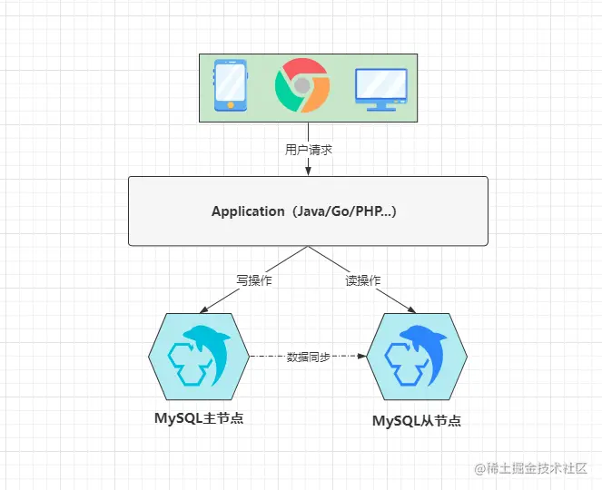

## 一、MySQL 性能调优

### 1.1 引言

在一个业务系统中，性能优化其实可以从多个角度出发考虑，如 **架构优化、前端调优、中间件调优、网关调优、容器调优、JVM调优、接口调优、服务器调优、数据库调优....
** 等，从优化类型上而言，主体可以分为三类：

- ①结构/架构优化：优化应用系统整体架构做到性能提升的目的。如：读写分离、集群热备、分布式架构、引入缓存/消息/搜索中间件、分库分表、中台架构（大数据中台、基础设施中台）等。
- ②配置/参数优化：调整应用系统中各层面的配置文件、启动参数达到优化性能的目标。如：JVM、服务器、数据库、操作系统、中间件、容器、网关参数调整等。
- ③代码/操作优化：开发者编写程序时，从代码、操作方面进行调节，达到效率更高的初衷。如：代码中使用更优秀的算法思想/设计模式、SQL优化、对中间件的操作优化等。

### 1.2 系统中性能优化的核心思维

- 单个节点层面调优的核心思想：在考虑性能优化时，必然不能让 **CPU、内存、磁盘**等资源的使用率达到 95%+，一般而言，最大利用率控制在
  80-85% 左右的最佳状态。
- 优秀且适用的系统架构胜过千万次调优
- 预防大于一切，调优并非“临时抱佛脚”
- 无需追求完美，理性权衡利弊

性能调优的通用核心步骤：

- ①发现性能瓶颈：如有监控系统，那它会主动发出警报；如若没有，那出现瓶颈时应用肯定会出问题，如：无响应、响应缓慢、频繁宕机等。
- ②排查瓶颈原因：排查瓶颈是由于故障问题导致的，还是真的存在性能瓶颈。
- ③定位瓶颈位置：往往一个系统都会由多个层面协同工作，然后对外提供服务，当发现性能瓶颈时，应当确定瓶颈的范围，如：网络带宽瓶颈、Java
  应用瓶颈、数据库瓶颈等。
- ④解决性能瓶颈：定位到具体的瓶颈后对症下药，从结构、配置、操作等方面出发，着手解决瓶颈问题。

### 1.3 MySQL 的性能优化实践

#### 1.3.1 MySQL 调优的五个维度

- ①客户端与连接层的优化：调整客户端 DB 连接池的参数和 DB 连接层的参数。
- ② MySQL 结构的优化：合理的设计库表结构，表中字段根据业务选择合适的数据类型、索引。
- ③ MySQL 参数优化：调整参数的默认值，根据业务将各类参数调整到合适的大小。
- ④整体架构优化：引入中间件减轻数据库压力，优化 MySQL 架构提高可用性。
- ⑤编码层优化：根据库表结构、索引结构优化业务 SQL 语句，提高索引命中率。

#### 1.3.2 MySQL连接层优化策略

- 客户端的连接池大小该如何设置：最大连接数 = (CPU核心数 * 2) + 有效磁盘数（SSD 固态硬盘）
    - 最佳配置：服务器的硬件配置为 **CPU：16core**、硬盘类型：**SSD**（最佳最大 33，常驻可调整为 30），这组配置绝对是当前场景下的最佳配置。
    - 等待队列：想要处理足够高的并发，那应该再配备一个较大的等待队列，也就是当目前池中无可用连接时，其他的用户请求/待执行的SQL语句则会加入队列中阻塞等待。
    - 大事务单独池：大事务会影响其他正常的SQL，因此想要完美的解决这类问题，最好再单独开一个连接池，为大事务或执行耗时较长的SQL提供服务。

现在我们基本上都是使用云服务器，就会涉及服务器配置选型，选择**高频 CPU（复杂 SQL 处理）** 和 **内存（开辟缓存池来存放数据）**。一般数据库服务器的硬件配置的重要性高于应用服务器配置。

##### 1.3.2.1 偶发高峰类业务的连接数配置

类似滴滴打车，早晚上下班、周末假期时间段，流量相对平常比较高。

这类业务，常驻线程数不适合太多：

- 并发来临，会创建大量连接
- 并发过后，一直保持数据库连接会导致资源被占用

优化：

- 将最大连接数按之前的公式配置
- 常驻连接数则可以配成CPU核数+1
- 缩短连接的存活时间，及时释放空闲的数据库连接，以此确保资源的合理分配

##### 1.3.2.2 分库分表情况下的连接数配置

数据库部署了多节点的情况下，请记得根据每个节点的硬件配置，来规划出合理的连接数。

##### 1.3.2.3 连接层调优小结

对于连接层的调优，实际上是指调整它的参数，即**常驻连接数、最大连接数、空闲连接存活时间**以及**等待队列的容量**
，在这里聊到过一点：合理的连接数才是最好的，而并非越大越好。

对于最佳连接数的计算，首先要把CPU核数放首位考虑，紧接着是磁盘，最后是网络带宽，因为带宽会影响SQL执行时间，综合考虑后才能计算出最合适的连接数大小。

#### 1.3.3 MySQL 结构的优化方案

所谓的 MySQL 结构优化，主要是指三方面，即**表结构、字段结构**以及**索引结构**。对于结构的优化，一般在项目的库表设计之初就要考虑。

##### 1.3.3.1 表结构的优化

- 表结构设计时的第一条也是最重要的一条，字段数量一定不要太多（最多 30 个）。
    - InnoDB引擎基本上都会将数据操作放到内存中完成，而当一张表的字段数量越多，那么能载入内存的数据页会越少，当操作时数据不在内存，又不得不去磁盘中读取数据，这显然会很大程度上影响MySQL性能
- 主键的选择一定要合适。首先一张表中必须要有主键，其次主键最好是**顺序递增**的数值类型，最好为 int 类型。
- 对于实时性要求不高的数据建立中间表。对于基于多表统计数据的情况，可以这样，减少连表查询开销，提高性能。比如游戏战力排行。
- 根据业务特性为每张不同的表选择合适的存储引擎。

##### 1.3.3.2 字段结构的优化

- ①在保证足够使用的范围内，选择最小数据类型，因为它们会占用更少的磁盘、内存和 CPU 缓存，同时在处理速度也会更快。
- ②尽量避免索引字段值为 NULL，定义字段时应尽可能使用 NOT NULL 关键字，因为字段空值过多会影响索引性能。
- ③在条件允许的情况下，尽量使用最简单的类型代替复杂的类型，如 IP 的存储可以使用 int 而并非 varchar，因为简单的数据类型，操作时通常需要的 CPU 资源更少。

##### 1.3.3.3 索引结构的优化

索引结构优化主要是指根据业务创建更合适的索引：

- ①索引字段的组成尽量选择多个，如果一个表中需要建立多个索引，应适当根据业务去将多个单列索引组合成一个联合索引。
    - 节省磁盘空间
    - 还可以充分使用索引覆盖的方式查询数据
- ②对一个值较长的字段建立索引时，可以选用字段值的前N个字符创建索引，也就是对于值较长的字段尽量建立前缀索引，而不是通过完整的字段值建立索引
    - 索引字段值越小，单个 B+Tree 的节点中能存储的索引键会越多，索引树会越矮，查询性能自然会越高
- ③索引类型的选择一定要合理，对于经常做**模糊查询**的字段，可以建立**全文索引**来代替普通索引，全文索引的方式做模糊查询效率会更高更快。

#### 1.3.4 MySQL 参数优化的选项

##### 1.3.4.1 调整 InnoDB 缓冲区（Buffer Pool）

参数：innodb_buffer_pool_size。

- 最佳比例应该控制在 70~75% 左右。
- 每个缓冲区实例必须大于 1GB。InnoDB 缓冲区空间大于 1GB 时，InnoDB会自动将缓冲区划分为多个实例空间，这样做的好处在于：**多线程并发执行时，可以减少并发冲突**。

那如何评估缓冲池大小是否合理？

我们可以通过计算缓存命中率来判断，公式为：`(1-innodb_buffer_pool_reads/innodb_buffer_pool_read_request) * 100`

一般来说，当缓存命中率低于 90% 就说明需要加大缓冲池了。

##### 1.3.4.2 调整工作线程的缓冲区

线程私有区域：sort_buffer、read_buffer、join_buffer。

- sort_buffer_size：排序缓冲区大小，影响group by、order by...等排序操作。
- read_buffer_size：读取缓冲区大小，影响select...查询操作的性能。
- join_buffer_size：联查缓冲区大小，影响join多表联查的性能。

根据机器内存来设置为一到两倍 MB。比如 4GB 的内存，建议将其调整为 4/8MB、8GB 的内存，建议将其调整为 8/16MB（最大不超过
64MB，线程执行完之后就会释放）

- max_length_for_sort_data：这个参数关乎着 MySQL
  排序的方式，如果排序字段值的最大长度小于该值，则会将所有要排序的字段值载入内存排序，但如果大于该值时，则会一批一批的加载排序字段值进内存，然后一边加载一边做排序。

##### 1.3.4.3 调整临时表空间

##### 1.3.4.4 调整空闲线程的存活时间

wait_timeout、interactive_timeout两个参数，这两个参数必须一同设置，否则不会生效。默认 8 h，我们可以手动调整成 30min~1h
左右，可以让无用的连接能及时释放，减少资源的占用。

##### 1.3.4.5 MySQL 参数调优小结

##### 1.3.5 架构优化与SQL优化

##### 1.3.5.1 引入中间件解决读写压力

对于架构优化主要牵扯两块，一方面是从整个项目的角度出发，引入一些中间件来优化整体性能。另一方面则是调整 MySQL
的部署架构，以此来确保可承载更大的流量访问，提高数据层的整体吞吐，下面逐个介绍一些常用的架构。

- 引入缓存中间件解决读压力（Redis）
- 引入消息中间件解决写压力（MQ 消息中间件削峰填谷）

##### 1.3.5.2 MySQL 架构优化

MySQL 的架构优化方案，分别是指三种：**主从架构、双主架构、分库分表架构。**

- 主从复制（适合读大于写）：一台主（负责写），一台从（负责读）。主节点发生故障，从节点可以替换主节点。

- 双主双写热备（写大于读）：两台都可以读写，互相同步数据。

- 分库分表：分布式存储的思想。

上述是分库分表的一种情况，这种分库的模式被称为**垂直分库**，也就是**根据业务属性的不同，会创建不同的数据库**，
然后由不同的业务连接不同的数据库，各自之间数据分开存储，节点之间数据不会同步，以这种方式来部署 MySQL，
即提高了数据库的整体吞吐量和并发能力，同时也不存在之前的存储容量的木桶问题。

### 1.4 MySQL 优化篇总结

对于MySQL数据库的一些调优策略，到这里就大致讲述完毕了，其中能够带来最大收益的方案则是优化项目架构和数据库架构，但这种方案成本也是最高的，一方面需要解决新的问题，同时还需要额外的部署成本，所以在无需使用更高规格的架构处理并发时，就不必提前做这些架构设计，因为能够根据业务特性控制成本，也是作为一个优秀的高级开发/架构师必备的思想。

> 参考链接：
>
> [(十六)MySQL调优篇：单机数据库如何在高并发场景下健步如飞？](https://juejin.cn/post/7163894728201601060#heading-18 "(十六)MySQL调优篇：单机数据库如何在高并发场景下健步如飞？")
> 
> [18 如何才能优化 MySQL 性能？](https://learn.lianglianglee.com/%e4%b8%93%e6%a0%8f/%e8%af%b4%e9%80%8f%e6%80%a7%e8%83%bd%e6%b5%8b%e8%af%95/18%20%20%e5%a6%82%e4%bd%95%e6%89%8d%e8%83%bd%e4%bc%98%e5%8c%96%20MySQL%20%e6%80%a7%e8%83%bd%ef%bc%9f.md "18 如何才能优化 MySQL 性能？")
> 

