## 一、Redis 对象

## 1、 基础信息

## 1.1 Object 是什么？

Redis 是 key-value 存储，key 和 value 在 Redis 中都被抽象为对象，key 只能是 String 对象，而 Value
支持丰富的对象种类，包括 String、List、Set、Hash、Sorted Set、Stream 等。

## 1.2 Object 在内存中是什么样子

redisObject 定义如下：

```text
// from Redis 5.0.5
#define LRU_BITS 24

typedef struct redisObject {
    unsigned type:4;        // type：是哪种Redis对象
    unsigned encoding:4;    // 表示用哪种底层编码，用OBJECT ENCODING [key] 可以看到对应的编码方式
    unsigned lru:LRU_BITS;  /* LRU time or   
                            * LFU data 
                            * 记录对象访问信息，用于内存淘汰，这个可以先忽略，后续章节会详细介绍。*/
    int refcount;           // 引用计数，用来描述有多少个指针，指向该对象
    void *ptr;              // 内容指针，指向实际内容
} robj;
```

## 1.3 对象与数据结构

实际操作的主要有 6 个 Redis 对象，他们底层依赖一些数据结构，包括字符串、跳表、哈希表、压缩列表、双端链表等，不同对象可能有依赖相同数据结构。

## 2、Redis 对象之 String

### 2.1 是什么？

String 就是字符串，它是 Redis 中最基本的数据对象，**最大为 512MB**，我们可以通过配置项 proto-max-bulk-len
来修改它，一般来说是不用主动修改的。

### 2.2 适用场景

一般可以用来存**字节数据、文本数据、序列化后的对象数据**等。

也就是说只要是字符串，都可以往里存。再具体点的例子：

- 缓存场景：Value 存 Json 字符串等信息
- 计数场景：因为 Redis 处理命令是**单线程**，所以执行命令的过程是原子的。因此 String 数据类型适合计数场景，比如
  **计算访问次数、点赞、转发、库存数量**等等。

### 2.3 常用操作


- set 命令会覆盖 key 的 value，同时抹除 key 上的过期时间

### 2.4 底层实现

#### 2.4.1 三种编码方式

String看起来简单，但实际有三种编码方式，如下图所示：

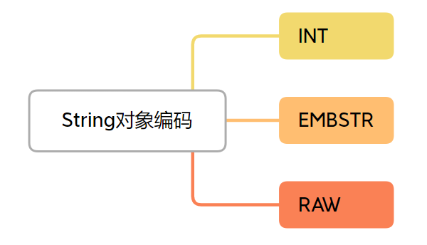

- INT 编码：这个很好理解，就是存一个整型，可以用 long 表示的整数就以这种编码存储;
- EMBSTR 编码：如果**字符串小于等于阈值字节**，使用 EMBSTR 编码；
- RAW 编码：**字符串大于阈值字节**，则用 RAW 编码。

对于上文提到的阈值，在 Redis 中是常量 OBJ_ENCODING_EMBSTR_SIZE_LIMIT（5.0.5 大小是 44 字节）

EMBSTR 和 RAW 都是由 redisObject 和 SDS 两个结构组成。**它们的差异在于**，EMBSTR 下 redisObject 和 SDS 是连续的内存，RAW
编码下 redisObject 和 SDS 的内存是分开的。

EMBSTR 优点是 redisObject 和 SDS 两个结构**可以一次性分配空间**，缺点在于如果重新分配空间，整体都需要再分配，代价更高，所以
EMBSTR 设计为只读，任何写操作之后 EMBSTR 都会变成 RAW，**理念是发生过修改的字符串通常会认为是易变的**。

EMBSTR 内存（下图中 alloc 应该是 45，该结构不预留内存）：


RAW 内存：


随着我们的操作，编码可能会转换：

- INT -> RAW：当存的内容不再是整数，或者大小超过了 long 的时候；
- EMBSTR->RAW：**任何写操作之后** EMBSTR 都会变成 RAW，原因前面有解释。

字符串编码 EMBSTR 和 RAW 都包含一个结构叫 SDS，它是 Simple Dynamic String 的缩写，即**简单动态字符串（可以预分配空间，可以扩容。因为封装，上层无感知）
**，
这是 Redis 内部作为基石的字符串封装，十分重要，下面我们详细介绍下 SDS。

#### 2.4.2 为什么要 SDS?

在 C 语言中，字符串用一个 '\0' 结尾的 char 数组表示。
比如 "hello niuniu" 即 "hello niuniu\0" 。
C 语言作为一个比较亲和底层的语言，很多基建就是这么简单，但是，对于某个应用来说不一定好用：

1. 每次计算字符串长度的复杂度为 O(N)：需要遍历字符串来获取长度；
2. 对字符串进行追加，需要重新分配内存：没有预留空间；
3. 非二进制安全：对于 \0 不能很好的支持。

在 Redis 内部，**字符串的追加和长度计算很常见**，这两个简单的操作不应该成为性能的瓶颈，
于是 Redis 封装了一个叫 SDS 的字符串结构，用来解决上述问题。下面我们来看看它是怎样的结构。

Redis 中 SDS 分为 sdshdr8、sdshdr16、sdshdr32、sdshdr64，它们的字段属性都是一样，**区别在于应对不同大小的字符串**，我们以
sdshdr8 为例：

```text
// from Redis 7.0.8
// 预留空间 = alloc（全部） - len（已使用）
struct __attribute__ ((__packed__)) sdshdr8 {
    uint8_t len; /* used 被使用的内存大小*/
    uint8_t alloc; /* excluding the header and null terminator 整体大小*/
    unsigned char flags; /* 3 lsb of type, 5 unused bits 【sds 类型】*/
    char buf[]; // 数据本身
};
```

1. 增加长度字段 len，快速返回长度；
2. 增加空余空间（alloc-len），为后续追加数据留余地；
3. 不再以 '\0' 作为判断标准，二进制安全。

这里可能会想，SDS 可以预留空间，那么预留空间有多大呢，规则如下：

- len 小于 1M 的情况下，alloc = 2倍*len，即预留 len 大小的空间；
- len 大于 1M 的情况下，alloc = 1M+len，即预留 1M 大小的空间。
- 简单来说，预留空间为 min(len，1M)

### 2.4 String 面试与分析

## 3、Redis 对象之 List

### 3.1 是什么？

Redis List是一组连接起来的字符串集合。

List 最大元素个数是 2^32 - 1 (4,294,967,295)，新版本已经是 2^64-1了。

### 3.2 适用场景

List 作为一个列表存储，属于比较底层的数据结构，可以使用的场景非常多，比如**存储一批任务数据，存储一批消息**等。

### 3.3 常用操作

除了通过 DEL 进行删除，4.0 引入了 UNLINK 命令进行对象删除。

del 命令同步删除命令，会阻塞客户端，直到删除完成。 unlink 命令是异步删除命令，
只是取消 Key 在键空间的关联，让其不再能查到，删除是异步进行，所以**不会阻塞客户端**。


### 3.4 底层实现

#### 3.4.1 编码方式

3.2 版本之前，List 对象有两种编码方式，一种 ZIPLIST，另一种是 LINKEDLIST。


当满足如下条件时，用 ZIPLIST 编码，如果不满足 ZIPLIST 编码的条件，则使用 LINKEDLIST 编码：

1. 列表对象保存的所有字符串对象长度都小于 64 字节；
2. 列表对象元素个数少于 512 个，注意，这是 LIST 的限制，而不是 ZIPLIST 的限制；

ZIPLIST 底层用压缩列表实现。

假设列表中包含"hello"、"niuniu"、 "mart"三个元素，两种编码方式结构如下：

ZIPLIST 编码示意如下：
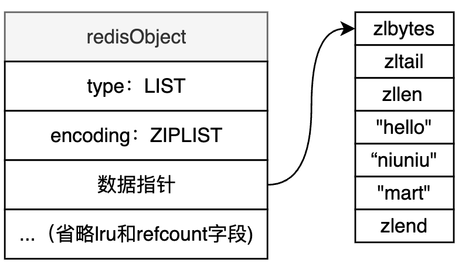

ZIPLIST 编码**内存排列得很紧凑，可以有效节约内存空间。**

- 节约指针的开销
- 更加的紧凑(减少内存碎片产生的可能性)，也就是让内存的利用率会更高
  甚至是一些特殊的编码类型，让 ziplist 拥有不同程度的节约内存，但会**牺牲一点解开编码的速度**

一般经验值是，用 ziplist 大概只占有原本的 1/3 的内存，能省一大半内存，还是很可观的(但也要知道使用 ziplist 会牺牲一些速度)

LINKEDLIST 编码示意如下：
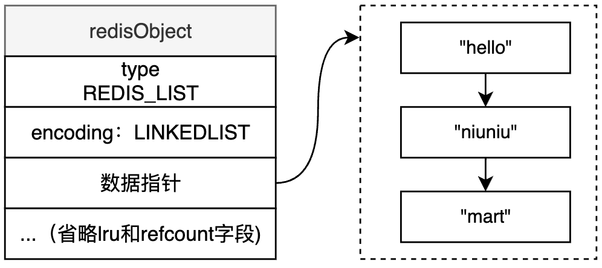

LINKEDLIST 编码下，数据是以**链表的形式**连接在一起，实际上**删除更为灵活**，但是内存不如 ZIPLIST 紧凑，所以*
*只有在列表个数或节点数据长度比较大的时候**，
才会使用 LINKEDLIST 编码，以加快处理性能，一定程度上牺牲了内存。

#### 3.4.2  QUICKLIST 横空出世

ZIPLIST 是为了在数据较少时节约内存，数据稍多时插入数据会导致很多内存复制

LINKEDLIST 是为了数据多时提高更新效率，节点非常多的情况，LINKEDLIST 链表的节点就很多，会占用不少的内存。

3.2 版本就引入了 QUICKLIST。QUICKLIST 其实就是 ZIPLIST 和 LINKEDLIST 的结合体。

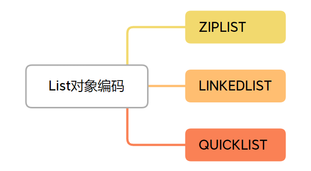

LINKEDLIST 原来是单个节点，只能存一个数据，现在单个节点存的是一个 ZIPLIST，即多个数据。

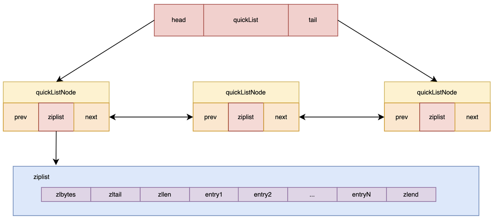

这种方案其实是用 ZIPLIST、LINKEDLIST 综合的结构，取代二者本身。

- 当数据较少的时候，QUICKLIST 的节点就只有一个，此时其实相当于就是一个 ZIPLIST；
- 当数据很多的时候，则同时利用了 ZIPLIST 和 LINKEDLIST 的优势。

#### 3.4.3 ZIPLIST 优化

ZIPLIST 本身存在一个**连锁更新的问题**，所以 Redis 7.0 之后，使用了 LISTPACK 的编码模式取代了 ZIPLIST，
而他们其实本质都是一种压缩的列表，所以其实可以**统一叫做压缩列表**。

## 4、底层数据结构之压缩列表

### 4.1 压缩列表是什么？

压缩列表，顾名思义，就是排列紧凑的列表。

压缩列表在 Redis 中有两种编码方式：

- ZIPLIST：平常说的压缩列表其实一般就是指 ZIPLIST
- LISTPACK：LISTPACK 是在 Redis 5.0 引入，直到 Redis7.0 完全替换了 ZIPLIST，可以说是 ZIPLIST 的进阶版本

### 4.2 压缩列表解决什么问题？

压缩列表主要用做为底层数据结构提供紧凑型的数据存储方式.

- 能节约内存（节省链表指针的开销）
- 小数据量的时候遍历访问性能好（连续 + 缓存命中率友好）

### 4.3 ZIPLIST 整体结构

```text
* The general layout of the ziplist is as follows:
*
* <zlbytes> <zltail> <zllen> <entry> <entry> .. <entry> <zlend>
```

比如这就是有 3 个节点的 ziplist 结构：


- zlbytes：表示该 ZIPLIST **一共占了多少字节数**，这个数字是包含 zlbytes 本身占据的字节的。
- zltail：**ZIPLIST 尾巴节点相对于 ZIPLIST 的开头（起始指针）偏移的字节数**。
    - 通过这个字段可以快速定位到尾部节点，例如现在有一个 ZIPLIST，zl 指向它的开头，如果要获取 tail 尾巴节点，即 ZIPLIST
      里的最后一个节点，可以 zl + zltail的值，这样定位到它。如果没有尾节点，就定位到 zlend
- zllen：**表示有多少个数据节点**，在本例中就有 3 个节点。
- entry1~entry3：表示**压缩列表数据节点**。
- zlend：一个特殊的 entry 节点，**表示 ZIPLIST 的结束**。

### 4.3 ZIPLIST 节点结构

```text
 <prevlen> <encoding> <entry-data>
```

- prevlen：表示**上一个节点的数据长度**。
    - 通过这个字段可以定位上一个节点的起始地址（或者说开头）也就是就是 p - prevlen 可以跳到前一个节点的开头位置，**实现从后往前操作
      **，所以压缩列表才可以从后往前遍历。
    - 如果前一节点的长度，也就是前一个 ENTRY 的大小，小于 254 字节， 那么 prevlen 属性需要用 1 字节长的空间来保存这个长度值，255
      是特殊字符，被 zlend 使用了
    - 如果前一节点的长度大于等于 254 字节，那么 prevlen 属性需要用 5 字节长的空间来保存这个长度值，注意 5 个字节中中第一个字节为
      11111110，也就是 254，标志这是个 5 字节的 prelen 信息，剩下 4 字节来表示大小。
- encoding：**编码类型**。编码类型里还包含了一个 entry 的长度信息，可用于正向遍历
- entry-data：**实际的数据**。

#### 4.3.1. encoding说明

encoding 字段是一个**整型数据**，其**二进制编码**由**内容数据的类型**和**内容数据的字节长度**两部分组成，根据内容类型有如下几种情况：

字符串类型：

| 编码                                           | encoding 字段大小 | 类型                                                                                       |
|----------------------------------------------|---------------|------------------------------------------------------------------------------------------|
| 00pppppp                                     | 1字节           | String 类型，且字符串长度小于 2^6，即小于等于 63                                                          |
| 01pppppp/qqqqqqqq                            | 2字节           | String 类型，长度小于 2^14 次方，即小于等于 16383                                                       |
| 10000000/qqqqqqqq/rrrrrrrr/ssssssss/tttttttt | 5字节           | String 类型，长度小于 2^32 次方                                                                   |
| 11000000                                     | 1字节           | 2 个字节的 int16 类型                                                                          |
| 11010000                                     | 1字节           | 4 个字节的 int32 类型                                                                          |
| 11111110                                     | 1字节           | 8 个字节的 int64 类型                                                                          |
| 1111xxxx                                     | 1字节           | xxxx 从 1 到 13 一共 13 个值，这时就用这 13 个值来表示真正的数据。注意，这里是表示真正的数据，而不是数据长度了，这种情况 <entry-data> 就没有了 |


注意，如果是 String 类型，那么 encoding 有两部分，一般是**前几位标识类型**、**后几位标识长度**。

但如果是 int 类型，整体 1 字节编码，就只是标识了类型，为什么没有大小呢，因为 int 的具体类型就自带了大小，比如 int32，就是 32 位，4 字节的大小，不需要 encoding 特别标识。

encoding 的编码规则比较复杂，我们其实只需要理解它的核心思想，面试中能讲清楚怎么区分不同类型即可，不用去背它的这些具体编码，这个很难记住，也没有必要去记。

### 4.4 ZIPLIST 查询数据

我们聚焦看两个关键的查询操作，来理解 ZIPLIST 是如何运作的。


#### 4.4.1 查询 ZIPLIST 的数据总量

zllen 字段：**表示有多少个数据节点**。但是该字段为 2 字节，所以：
- zllen <= 65534 时： O(1) 时间复杂度直接返回的
- zllen > 65534 时：zllen 就存不下了，此时 zllen 等于65535，所以**真实的节点数量需要遍历来得到**

#### 4.4.2 在 ZIPLIST 中查询指定数据的节点

在 ZIPLIST 中查询指定数据的节点，**需要遍历这个压缩列表**，平均时间复杂度是 O(N)。

### 4.5 ZIPLIST 更新数据

ZIPLIST 的更新就是增加、删除数据，ZIPLIST 提供头尾增减的能力。

因为在头部增加一个节点会导致后面节点都往后移动，所以更新的平均时间复杂度，可以看作 O(N)。

其中要注意的是更新操作可能带来**连锁更新**。注意上面所说的增加节点导致后移，不是连锁更新。连锁更新是指这个后移，发生了不止一次，而是多次。

比如增加一个头部新节点，后面依赖它的节点，需要 prevlen 字段记录它的大小，原本只用 1 字节记录，因为更新可能膨胀为 5 字节，然后这个 entry 的大小就也膨胀了。所以，当这个新数据插入导致的后移完成之后，还需要逐步迭代更新。**这种现象就是连锁更新**，时间复杂度是 O(N^2)，6.2 已经优化为 O(N)，文档见当前目录的子文档（内容update 2023-06-07）

大家可能会比较担心连锁更新带来的性能问题，但在实际的业务中，很少会刚好遇到需要迭代更新超过 2 个节点的情况，所以 ZIPLIST 更新平均时间复杂度，还是可以看作 O(N)。不过，ZIPLIST 最大的问题还是连锁更新导致性能不稳定。


### 4.6 LISTPACK 优化（5.0 引入）

LISTPACK **是为了解决 ZIPLIST 最大的痛点——连锁更新**，我们先来看，ZIPLIST 的问题本源。

#### 4.6.4 连锁更新原因分析

我们知道，ZIPLIST 需要支持 LIST，LIST 是一种双端访问结构，所以需要能从后往前遍历，上面有讲，ZIPLIST 的数据节点的结构是这样的：

```text
<prevlen> <encoding> <entry-data>
```

其中，**prevlen 就表示上一个节点的数据长度**，通过这个字段可以定位上一个节点的数据，可以说，**连锁更新问题，就是因为 prevlen 导致的。**

#### 4.6.5 对症下药

我们需要一种不记录 prevlen，并且还能找到上一个节点的起始位置的办法，Redis 使用了很巧妙的一种方式。

我们直接看 LISTPACK 的节点定义：

```text
<encoding-type><element-data><element-tot-len>
```

- encoding-type 是编码类型
- element-data 是数据内容
- element-tot-len 存储整个节点除它自身之外的长度

找到上一个节点的秘密就藏在 element-tot-len：
element-tot-len 所占用的每个字节的第一个 bit 用于标识是否结束。0 是结束，1 是继续，剩下 7 个 bit 来存储数据大小。
当我们需要找到当前元素的上一个元素时，我们可以从后向前依次查找每个字节，找到上一个 Entry 的 element-tot-len 字段的结束标识，
就可以算出上一个节点的首位置了。

举个例子：
如果上个节点的 element-tot-len 为 00000001 10000100，每个字节第一个 bit 标志是否结束，所以这里的 element-tot-len 一共就两个字节，大小为 0000001 0000100，即 132 字节。

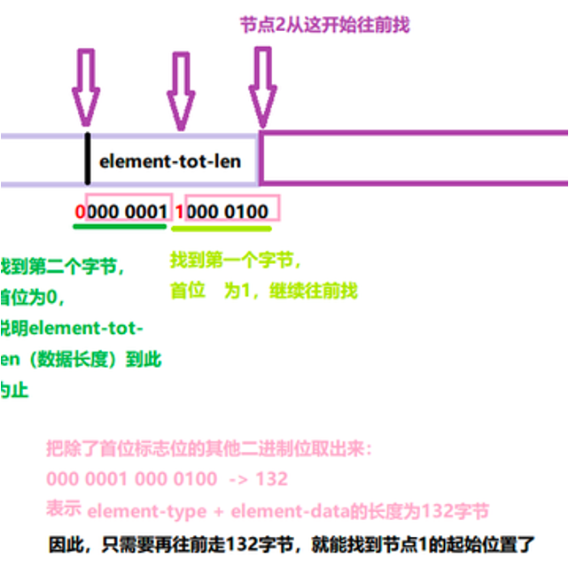

## 5、Redis 对象之 Set

### 5.1 Set 是什么？

Redis 的 Set 是一个不重复、无序的字符串集合，这里额外说明一下，**如果是 INTSET 编码的时候其实是有序的**，
不过一般不应该依赖这个，整体还是看成无序来用比较好。

### 5.2 适用场景

适用于**无序集合场景**，比如**某个用户关注了哪些公众号**，这些信息就可以放进一个集合，Set 还提供了查交集、并集的功能，可以很方便地实现共同关注的能力。

### 5.3 常用操作

- SREM 删除元素。
- DEL 可以删除一个 Set 对象。

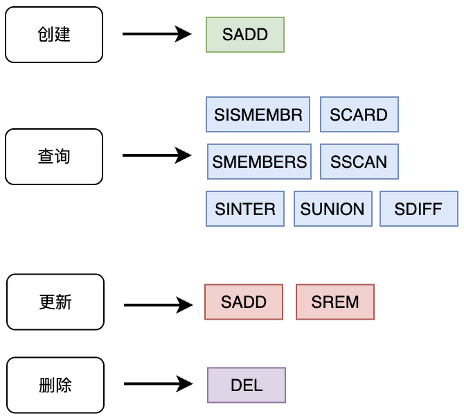

### 5.4 底层实现

#### 5.4.1 编码方式


- 如果集群元素都是整数，且元素数量不超过 512 个，就可以用 INTSET 编码
- 不满足 INTSET 的条件，就需要用 HASHTABLE

INTSET 编码结构：


INTSET 排列比较紧凑，**内存占用少**，但是查询时需要二分查找。

HASHTABLE 编码结构：
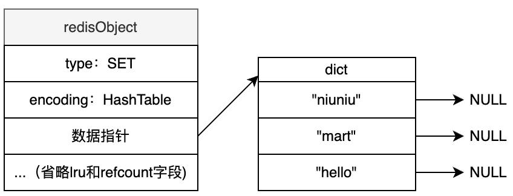

HASHTABLE 查询一个元素的性能很高，能 O(1) 时间就能找到一个元素是否存在。


## 6、Redis 对象之 Hash

### 6.1 是什么？

Redis Hash 是一个 field、value 都为 string 的 hash 表，存储在 Redis 的内存中。

Redis 中每个 hash 可以存储 2(32)-1 键值对（40多亿）。

### 6.2 适用场景

**适用于 O(1) 时间字典查找某个 field 对应数据的场景**，比如任务信息的配置，就可以任务类型为 field，任务配置参数为 value。

### 6.3 常用操作

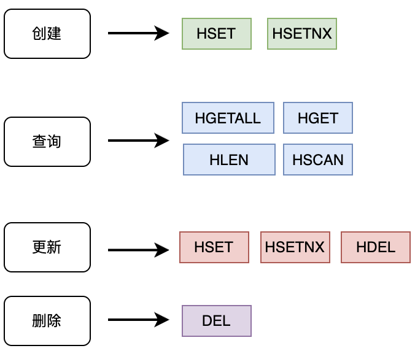

### 6.4 底层实现

#### 6.4.1 编码格式

Hash 底层有两种编码结构，一个是压缩列表，一个是 HASHTABLE。

同时满足以下两个条件，用压缩列表：
- Hash 对象保存的所有值和键的长度都小于 64 字节；
- Hash 对象元素个数少于 512 个。

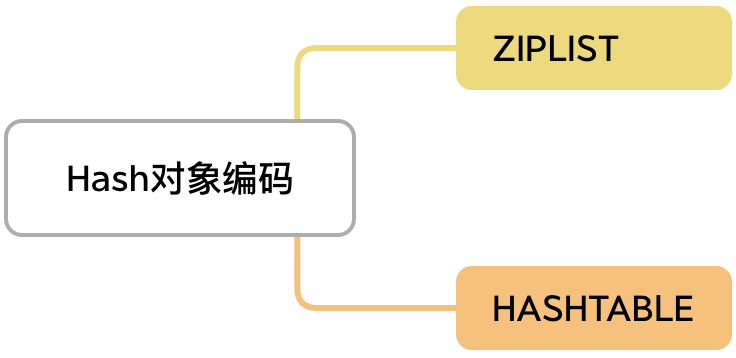

ZIPLIST 之前有讲解过，其实就是在数据量较小时将数据紧凑排列，对应到 Hash，就是将 filed-value 当作 entry 放入 ZIPLIST，结构如下：

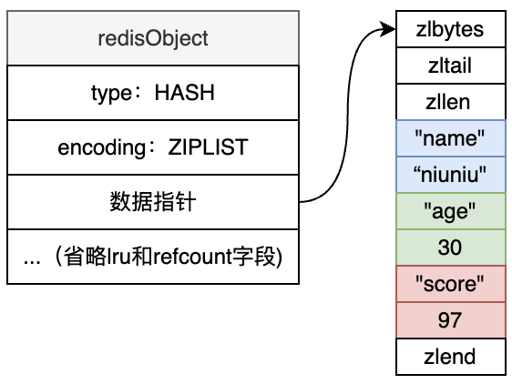

HASHTABLE 在之前无序集合 Set 中也有应用，和 Set 的区别在于，在 Set 中 value 始终为 NULL，但是在 Hash 中，是有对应的值的。

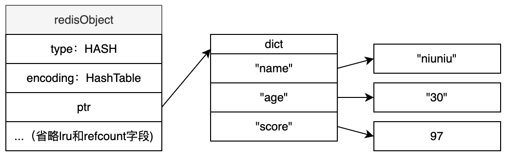

## 7、底层数据结构之 HASHTABLE

### 7.1 HASH 是什么？

HASHTABLE，可以想象成目录，要翻看什么内容，直接通过目录能找到页数，翻过去看。如果没有目录，我们需要一页一页往后翻，效率很低。

在计算机世界里，**HASHTABLE 就扮演着这样一个快速索引的角色**，通过 HASHTABLE 我们可以只用 O(1) 时间复杂度就能快速找到 key 对应的 value。

### 7.2 HASHTABLE 结构

```text
// from Redis 5.0.5
/* This is our hash table structure.  */
typedef struct dictht {
    dictEntry **table;
    unsigned long size;
    unsigned long sizemask;
    unsigned long used;
} dictht;
```


最外层是一个封装的 dictht 结构，其中字段含义如下：
- table：指向**实际 hash 存储**。存储可以看做**一个数组**，所以是 *table 的表示，在 C 语言中 *table 可以表示一个数组。
- size：**哈希表大小**。实际就是 dictEntry 有多少元素空间。
- sizemask: **哈希表大小的掩码表示**，总是等于 size-1。这个属性和哈希值一起决定一个键应该被放到 table 数组的哪个索引上面，规则 Index = hash&sizemask。
- used：**表示已经使用的节点数量**。通过这个字段可以很方便地查询到目前 HASHTABLE 元素总量。

### 7.3 Hash 表渐进式扩容

渐进式扩容顾名思义就是一点一点慢慢扩容，而不是一股脑直接做完，那具体流程是怎样的呢？

其实为了实现渐进式扩容，Redis 中没有直接把 dictht 暴露给上层，而是再封装了一层：

```text
// from Redis 5.0.5
typedef struct dict {
    dictType *type;
    void *privdata;
    dictht ht[2];
    long rehashidx; /* rehashing not in progress if rehashidx == -1 */
    unsigned long iterators; /* number of iterators currently running */
} dict;
```

可以看到 dict 结构里面，包含了 2 个 dictht 结构，也就是 2 个 HASHTABLE 结构。dictEntry 是链表结构，也就是**用拉链法解决 Hash 冲突**，用的是**头插法**

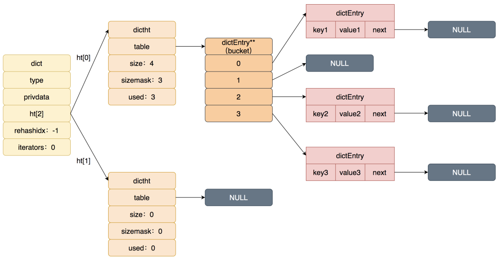

实际上平常使用的就是一个 HASHTABLE，在触发扩容之后，就会两个 HASHTABLE 同时使用，详细过程是这样的：

当向字典添加元素时，发现需要扩容就会进行 Rehash。Rehash 的流程大概分成三步：
- 首先，为新 Hash 表 ht[1] 分配空间。新表大小为第一个大于等于原表 2 倍 used 的 2 次方幂。字典的偏移索引从静默状态 -1，设置为 0，表示 Rehash 工作正式开始。
  - 个例子，原表如果 used=500， 2倍就是 1000，那第一个大于 1000 的 2 次方幂则为 1024。此时字典同时持有 ht[0] 和 ht[1] 两个哈希表。
- 然后，迁移 ht[0] 数据到 ht[1]。
  - 在 Rehash 进行期间，**每次对字典执行增删查改操作**，程序会顺带**迁移当前 rehashidx 在 ht[0] 上的对应的数据，并更新偏移索引（rehashidx）**。与此同时，部分情况周期函数也会进行迁移，如果 rehashidx 刚好在一个已删除的空位置上，会往后找 10 个（防止因为连续碰到空位置导致主线程操作被阻塞）。
- 随着字典操作的不断执行，最终在某个时间点上，ht[0] 的所有键值对都会被 Rehash 至 ht[1]，此时再将 ht[1] 和 ht[0] 指针对象互换，同时把偏移索引的值设为 -1，表示 Rehash 操作已完成。

注意：
- 迁移过程中新增元素时放到 ht[1]，删改查先遍历 ht[0]，再遍历 ht[1]
- 迁移一个数据这个说法，其实严格来说，应该是迁移一个 bucket，在迁移一个 bucket 的时候，会沿着链表把链表上的元素都一起迁移到新哈希表里去

### 7.4 扩容时机

Redis 有一个负载因子的概念。设负载因子为 k，那么 k = ht[0].used/ht[0].size，也就是**使用空间和总空间大小的比例**。

- 负载因子大于等于 1，如果此时服务器没有执行 BGSAVE 或 BGREWRITEAOF 这两个命令，就会发生扩容。复制命令对Redis的影响我们后面在原理篇再讲。
  - 负载因子大于等于 1，说明此时空间已经非常紧张。**新数据是在链表上叠加的（拉链法解决哈希冲突）**，越来越多的数据其实无法在 O(1) 时间复杂度找到，还需要遍历一次链表，
- 负载因子大于 5，这时候说明 HASHTABLE 真的**已经不堪重负了**，此时即使是有复制命令在进行，也要进行 Rehash 扩容。

### 7.5 缩容

扩容之后，但后面数据不再需要，被删除了，此时多余的空间就是一种浪费。

缩容过程其实和扩容是相似的，也是渐进式缩容。

Redis 还是用负载因子来控制什么时候缩容：
- 当负载因子小于 0.1，即负载率小于 10%，且没在执行 BGSAVE 或 BGREWRITEAOF 这两个复制命令，则进行缩容，新表大小为第一个大于等于原表 used 的 2 次方幂。

