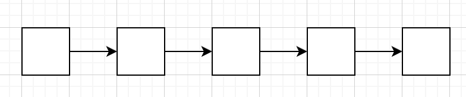
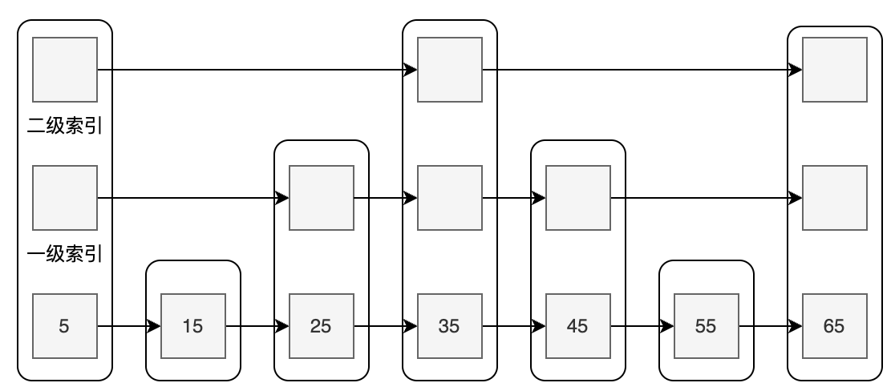
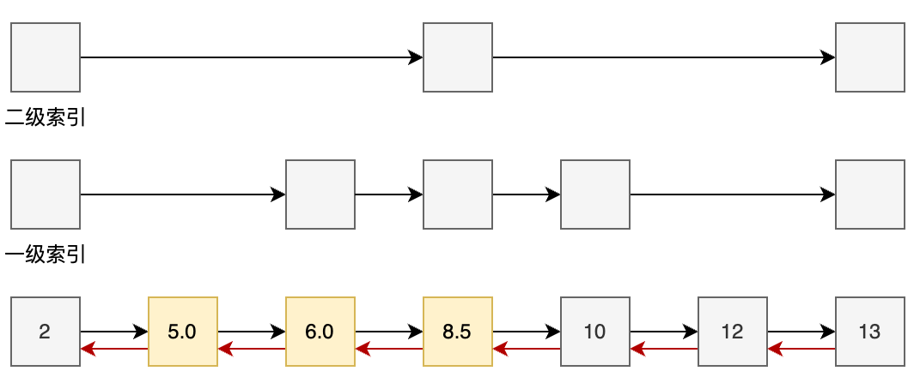

## 一、Redis 对象

## 1、底层数据结构之 跳表

### 1.1 跳表是什么

跳表是 Redis 有序集合 ZSet 底层的数据结构，也是 ZSet 的灵魂所在。

跳表本质上还是链表，普通链表结构如下：


优点：

- 结构简单清晰

缺点：

- 查询某个节点的效率较低

在**有序集合场景**，无论是查找还是添加删除元素，我们是**需要能快速通过 score 定位到具体位置**，如果用链表那时间复杂度其实就是
O(N)，N 是节点个数。

**为了提升查找的性能**，Redis 就引入了跳表：

- 跳表在链表的基础上，**给链表增加了多级的索引**，**通过索引可以一次实现多个节点的跳跃**，提高性能。

跳表的结构：


图中的每个节点不止只有一层，在遍历的时候，可以一次走多个节点。理论上，层次越高平均步长越大，但并不完全像示意图一样是绝对均衡的，节点的层高其实是概率随机的。

为了理解这个结构有什么好处，我们分几个场景来分析：

场景一：查找分数为 45 的数据

如果只有原始的链表，那需要走 4 步，如果有图中的二级索引，只用走一步，那如何找 45 呢？

- 首先就是从第 1 个节点出发，通过二级索引走到 35
- 再查看到下一个节点是 65，已经超过了，所以降低到下方的索引，也就是一级索引
- 往后走一次就可以找到 45

场景二：插入一条score为36的数据

- 首先，定位到第一个比 score 大的位置，这里是 45，定位方式和查询类似，不再赘述
- 然后，构造一个新的节点，这里**我们假设节点层高随机到 3**，具体随机算法我们后面会介绍，目前不用太关注
- 最后，**将各层链表补齐**，其实就是在每一层进行链接，效果如图


标准的跳表（Redis 不是用的标准的跳表，下面会讲）有如下限制：

1. score值不能重复；
2. 只有向前指针，没有回退指针。

在 Redis 中，跳表是用来支持有序集合的，所以 Redis 对跳表做了一些优化，就包括 **score 可以重复**、**增加回退指针**，下面我们来看看
Redis 的跳表。

### 1.2 Redis 的跳表实现

我们直接看这个示意图，score 可以重复并且我们的每个节点多了一下回退指针。


Redis 跳表单个节点的定义：

```text
// from Redis 7.0.8
/* ZSETs use a specialized version of Skiplists */
typedef struct zskiplistNode {
    sds ele;
    double score;
    struct zskiplistNode *backward;
    struct zskiplistLevel {
        struct zskiplistNode *forward;
        unsigned long span;
    } level[];
} zskiplistNode;
```

- ele：很熟悉的 SDS 结构，用来**存储数据**。
- score：**节点的分数**，浮点型数据
- backward：**指向上一个节点的回退指针**，**支持从表尾向表头遍历**，也就是 ZREVRANGE 这个命令
- level：是个 zskiplistLevel 结构体数组，zskiplistLevel **这个结构体包含了两个字段**，数组结构就表示每个节点都可能是个多层结构。
    - forward：指向该层下个能跳到的节点
    - span：记录了距离下个节点的步数


### 1.3 Redis 跳表单个节点有几层？

层次的决定，需要比较随机，才能在各个场景表现出较为平均的性能，这里 Redis 使用**概率均衡的思路**来确定新插入节点的层数：

Redis 跳表决定每一个节点，是否能增加一层的概率为 25%，而最大层数限制在 Redis 5.0 是 64 层，在 Redis 7.0 是 32 层。

### 1.4 Redis 跳表的性能优化了多少

跳表的查找过程，其实是走高层，行得通跳过去，行不通走相对下层，很像二叉树的另一种表现形式，实际上他们性能也是差不多的，平均时间复杂度都是
O(logn)，
区别是二叉树最坏情况下也是 O(logn) 比较稳定，而**跳表的最坏时间复杂度是 O(N)**。当然，实际的生产过程中，体现出来的基本都是跳表的平均时间复杂度。

有序集合无论是**查找、增加还是删除元素**，都是需要先定位到数据位置，所以跳表将这三个操作的时间复杂度，都从 O(N) 降低到了
log(N)。

## 2、Redis 对象之 ZSet

### 2.1 是什么？

ZSet 就是有序集合，也叫 Sorted Set，是一组按关联积分有序的字符串集合。这里的分数是个抽象概念，任何指标都可以抽象为分数，以满足不同场景。​

积分相同的情况下，按字典序排序。

### 2.2 适用场景

用于需要排序集合的场景，**最为典型的就是游戏排行榜**。

### 2.3 常用操作


### 2.4 底层实现

#### 2.4.1 编码方式

ZSet 底层编码有两种

- 一种是 ZIPLIST，用于数据量比较小时候的内存节省。
- 一种是 SKIPLIST + HASHTABLE，这种编码方式**查询性能更优**，字典和跳表都指向同一份数据。

ZIPLIST 结构示意：


如果满足如下规则，ZSet 就用 ZIPLIST 编码：

1. 列表对象保存的所有字符串对象长度都小于 64 字节；
2. 列表对象元素个数少于 128 个。

两个条件任何一条不满足，编码结构就用 SKIPLIST + HASHTABLE。

SKIPLIST 结构示意：


SKIPLIST 是一种可以快速查找的多级链表结构，通过 SKIPLIST 可以快速定位到数据所在。它的排名操作、范围查询性能都很高，

除了 SKIPLIST，Redis 还使用了 HASHTABLE 来配合查询，这样可以在 O(1) 时间复杂度查到成员的分数值。


### 2.5 面试问题

#### 2.5.1 ZSet 为什么用跳表而不是 B+ 树

**分析**

这个问题可以结合跳表和 B+ 树的结构，以及 B+ 树是为了解决什么问题而被作为 MySQL 的索引结构来回答。

B+ 树：

- 多路平衡查找树，由于是多叉树所以层数低，可以减少磁盘访问
- 数据只储存在叶子节点中，非叶子节点只储存索引值，使得一次 IO 读取的数据量很大

**这样的设计使得 B+ 树非常适合作为磁盘数据库索引的结构。**

Redis 是内存型数据库，要求的是高效率以及低内存，显然 Redis 对 B+ 树层数低的优点并不感冒。

跳表：

- 占用内存更少、实现更加简单。
- 跳表的插入性能更高，虽然两者的插入平均时间复杂度相当，但是跳表插入数据后只需要修改前进和后退指针即可，而 B+
  树还需要维护树的平衡，比如超过该叶子节点的最大值，此时这个节点就会分裂成两个叶子节点，然后需要更新节点指针，来保持树的一个平衡。

**回答**

B+ 树的数据都存在叶子节点中，而且它是多叉树，相同数据量下多叉树的层高比二叉树低，**这两个特点使得它适合磁盘存储**。而 Redis
是一个内存数据库，B+ 树层高低的优势荡然无存，所以选择了**实现更加简单的跳表**。
而且**跳表的插入性能更**高，虽然两者的插入平均时间复杂度相当，但是跳表插入数据后只需要修改前进和后退指针即可，**而 B+
树还需要维护树的平衡**，细节上有额外开销。

#### 2.5.2 ZSet 为什么用跳表而不是用红黑树

首先，跳表的实现简单，维护起来也简单。这是最核心的一个原因，其它不见得有明显优势。

其次，跳表的内存使用、缓存局部性都不比平衡树差，所以结合简单这个核心原因，作者就选择了跳表。

## 3、Redis 对象之 Stream（不重要，基本不考）

### 3.1 是什么？

Stream 是 Redis 5.0 版本新增加的操作对象。**Stream 可以看作一个拥有持久化能力的轻量级消息队列**。

### 3.2 适用场景

Stream 可以作为**轻量级队列**，**可以支持生产消费场景**，可以说是 Redis 中相对于完善的消息队列了。

### 3.3 常用操作

先介绍一个概念，

- 流ID：流ID 可以独一无二地标志一个 Stream

流 ID 可以自定义，也可以由 Redis 自动生成，组成部分如下：

- 毫秒时间：如果因为机器原因，导致机器时间回退到比之前流ID更早的时间，就使用最近的一条流ID时间。
- 序列号：如果同一毫秒的并发请求，序列号就会递增。

示例如下：

```text
127.0.0.1:6379> XADD strmniuniu * f1 msg1 f2 msg2 
"1674872888169-0"
127.0.0.1:6379> XADD strmniuniu * f3 msg3 f4 msg4
"1674872913750-0"
```

如果由于某些原因，用户需要自定义流ID，就像前面所说的，XADD 命令可以带上一个显式的 ID:

```text
127.0.0.1:6379> XADD strmniuniu 123456 f5 msg5
(error) ERR The ID specified in XADD is equal 
or smaller than the target stream top item
```

可以看到，因为之前我们用 * 自动生成了两条记录，现在随手写的 123456 没之前记录的毫秒时间大，就插入不进去了。

那我们换一个新的流来测试自定义流ID：

```text
127.0.0.1:6379> XADD strmmart 123456 f5 msg5​
"123456-0"
```

可以看到，同样的语句在新的流就能成功。如果非要在已经有自动生成流ID数据的流中插入自定义流ID，我们需要业务调整自定义ID不小于之前的流ID，

**实际上，尽量不要混用自动生成ID和自定义ID，不然自定义ID还需要去额外关注默认ID生成的数据，相互耦合。**

Redis Streams 支持按 ID 进行范围查询。由于 ID 与生成的时间相关，因此可以很容易地按时间范围进行查询。

#### 3.3.1 群组操作

除了常规的读写操作，Stream 还支持按群组操作，这里单独列出来。如果了解过 Kafka 的同学，应该知道 Kafka
也有消费者组的概念，虽然实现南辕北辙，但逻辑上很相似。

Stream 群组具备如下特性：

1. 群组里可以多个成员，成员名称由消费方自定义，组内唯一即可。
2. 同个群组共享消息，消息被其中一个消费者消费之后，其它消费者不会再重复消费。
3. 不在群组内的客户端，也可以通过 XREAD 命令来和群组一起消费，即群组和非群组可以混用，这个时候其实把不在群组的客户端理解为一个单独的群组。

群组最核心的操作有 3 个：

- XGROUP 用于创建，摧毁或者管理消费者组。
- XREADGROUP 用于通过消费者组从一个 Stream 中读取。
- XACK 是允许消费者将待处理消息标记为已正确处理的命令。

## 4、Redis 对象之其它操作对象（不重要，基本不考）

### 4.1 Bitmaps 位图

Bitmap 提供二进制位操作，可以设置位的值，可以获取位的值。

举个例子，你需要存储一个 uint8 的二进制数据，并支持更改他的位值，比如原来这个 uint8 是 10000000，你想将其最后一位改为 1，变成
10000001，就可以用 Bitmaps 对象。

**应用场景：**

- 假设有 1000 个传感器，需要记录每小时这 1000 个传感器是否有上报，就可以用 Bitmaps。
- 统计用户信息，活跃，不活跃！登录，未登录！打卡。两个状态的，都可以使用 Bitmaps！

### 4.2 HyperLogLog 基数

基数，就是不重复的元素。

Redis 2.8.9 版本就更新了 Hyperloglog 数据结构！ Redis Hyperloglog 基数统计的算法！

**优点：** 占用的内存是固定，2^64 不同的元素的技术，只需要废 12KB 内存！如果要从内存角度来比较的话 Hyperloglog 首选！

传统的方式， set 保存用户的id，然后就可以统计 set 中的元素数量作为标准判断 ! 这个方式如果保存大量的用户
id，就会比较麻烦（占内存）！我们的目的是为了计数，而不是保存用户 id；

**应用场景：**

- 网页的 UV （一个人访问一个网站多次，但是还是算作一个人！）

### 4.3 Geospatial 地理位置

在 Redis 的 3.2 版本中加入了地理空间 Geospatial 的功能，在特定的地理应用里能发挥作用。

**应用场景：** 朋友的定位，附近的人，打车距离计算。

## 5、对象过期时间

Redis 的过期时间是给一个 key，指定一个时间点，等达到这个时间，数据就被认为是过期数据，可以由 Redis 进行回收。

### 5.1 为什么要过期时间

如果不是需要常驻的数据，设置过期时间，可以有效地节约内存。另外，有些场景功能也需要过期时间支持，比如缓存，如果存在时间过久，
就可能导致和数据源数据差距过大，而设置过期时间，可以很方便的清除缓存以便后续再次加载进去。又比如分布式锁，就是需要一定时间之后，
数据自动消失，以实现最大占据时间的特性。

### 5.2 如何设置过期时间

如果是简单的字符串对象，可以使用如下语法：

- SET key value EX seconds：设置多少秒之后过期
- SET key value PX milliseconds：设置多少毫秒之后过期
- TTL key：查看还有多久过期

更通用的过期命令是 EXPIRE，它可以对所有数据对象设置过期时间，EXPIRE 也分秒和毫秒：

1. EXPIRE key seconds ：设置一个 key 的过期时间，**单位秒**
2. PEXPIRE key milliseconds：设置一个 key 的过期时间，**单位毫秒**

设置过期时间之后会有个字典，专门记录这些 Key 和过期时间的关系，这里不展开说，后面在讲 Redis 内存的时候会详细分析。

### 5.3 键过期了多久删除

过期之后的键实际上不是立刻删除的，有三种删除策略：

- 定时删除：在设置键的过期时间的同时，创建一个定时器，让定时器在键的过期时间来临时，立即执行对键的删除操作，**定时删除对内存比较友好，但是对
  CPU 不友好**，如果某个时间段比较多的 Key 过期，可能会影响命令处理性能。
- 惰性删除：使用时，发现 Key 过期了，再进行删除。这个策略的思路是对应用而言，只要不访问，过期不过期业务都无所谓，但是*
  *这样的代价就是如果某些 Key 一直不来访问，那本该过期的 Key，就变成常驻的 Key**。**这种策略对 CPU 最友好，对内存不太友好。**
- 定期删除：每隔一段时间，程序就对数据库进行一次检查，每次删除一部分过期键，这属于一种**渐进式兜底策略**。

定时删除实现起来其实没有想象的容易，主要考虑是如果出现异常，有 Key
遗漏了怎么办，以及如果程序重启，原来的定时器就随重启消失了，那就需要在启动时对过期键进行一些操作，可能是重建定时器，这些都是额外的工作，而且引入了多余的复杂度。

从实际功能而言，其实并不需要那么实时，所以惰性删除是可以考虑的，但是出于应删尽删的考虑，要保证最终没有漏网之鱼，那就需要加上定期删除作为兜底。所以
**Redis 过期键采用的是 惰性删除 + 定期删除 二者结合的方式进行删除的**。

定期删除需要关注两个问题：

1. 定期删除的频率：取决于 **Redis 周期任务**的执行频率，周期任务里面会做关闭过期客户端、删除过期 Key 的一系列任务，可以用
   INFO 查看周期任务频率
2. 每次删除的数量：每次删除 20 个，同时检查过期 key 数量占比，大于 25%，则再抽出 20 个来检查，重复流程，时间上限为 25ms。

## 6. 对象引用计数

### 6.1 引用计数是什么？

引用计数，是记录某个了内存对象被引用了多少次，它是计算机里一种内存管理技术。

- 引用计数 > 0，就代表这个对象还在被引用
- 引用计数 = 0，说明这个对象已经没有被引用，可以对其进行释放

### 6.2 Redis 对象的引用计数

我们前面有介绍 redisObject 的结构定义，其中有个字段叫 refcount，这个 refcount 就是 Redis 中的引用计数。

```text
typedef struct redisObject {
    unsigned type:4;
    unsigned encoding:4;
    unsigned lru:LRU_BITS; /* LRU time (relative to global lru_clock) or
                            * LFU data (least significant 8 bits frequency
                            * and most significant 16 bits access time). */
    int refcount;
    void *ptr;
} robj;
```

当 refcount 减少到 0，就会触发对象的释放。Redis 的引用计数，**目前是为整数数据服务的**，且只为 0-9999 服务。

Redis 初始化服务器时，会创建 0-9999 的字符串对象，同时 refcount 会被初始化为 OBJ_SHARED_REFCOUNT（常量 INT_MAX：int32
的最大值）。当服务器新创建的键需要用到值为 0-9999 的字符串对象时，服务器就会使用这些共享对象，而不是新创建对象。

为什么只做 0-9999 的字符串对象池呢，关键因素有两点：

1. 0-9999 的整数，被使用的几率是很大的，复用是有场景的。
2. 整数存储空间比较小，而每个 redisObject 内部结构至少占 16 字节，这比整数本身占据的空间还大，频繁分配整数是比较大的开销
3. 要复用对象，就需要进行数值比较，而整数对象进行比较，成本最低，如果是其它字符串，需要遍历字符串所有字符，而其它如List、ZSet的对比成本就更高了。

### 6.3 引用计数这个字段就用在这？

这里看起来有一点不合理，为什么不直接共享 0-9999 的数据是不是可以呢，而需要多引入一个引用计数的字段。在r edisObject 头里面增加了一个
refCount，足足有 4 字节，在其它地方都是一点一点节约内存，这里加个字段，每个对象都多 4 字节。

这个是大家稍微了解 Redis Object 结构之后，可能会有的疑问，事实上，对于外部能操作的对象，refcount 还真没啥用，就 0-9999
的区间可以复用，而且这个数值还是统一在 INT_MAX，不会更改，refcount 可以说没有意义。

但是，在 Redis 内部很多场景，其实是用 refcount 来进行引用计数的，最大的作用其实是最大的应用是传递参数，避免拷贝，
这个后面我们会分析，这里我们只要了解这个字段还是有意义的，以及不是在对外操作对象场景发挥真正的作用。