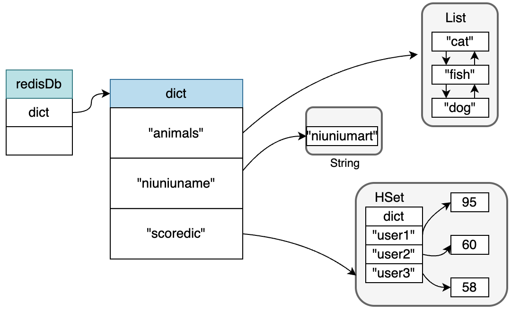
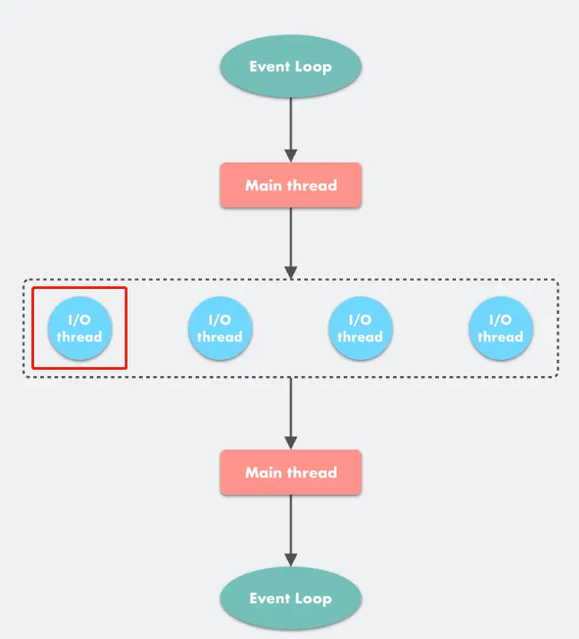
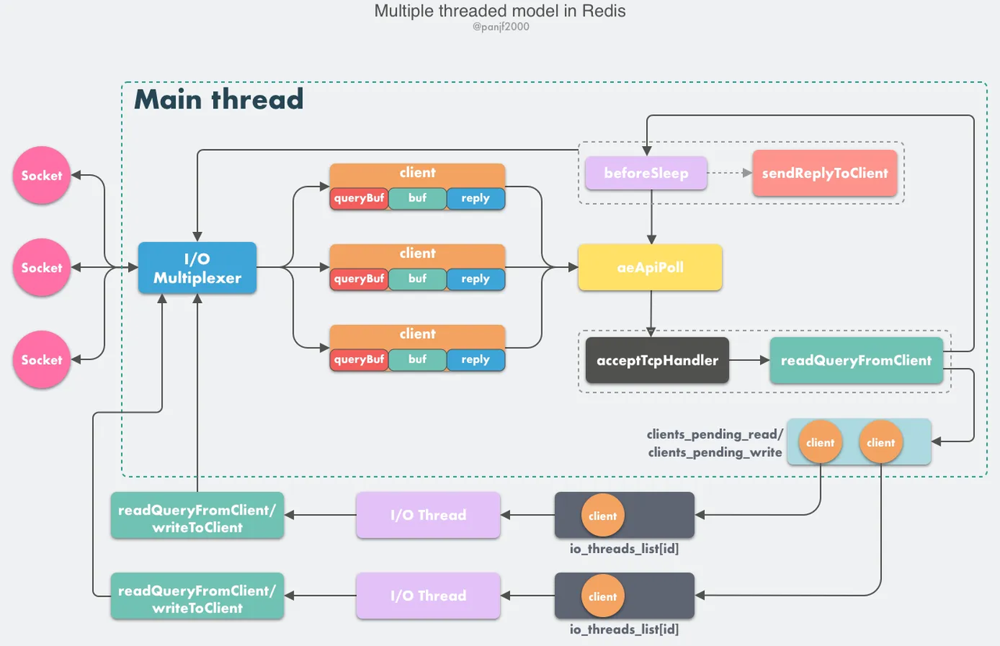
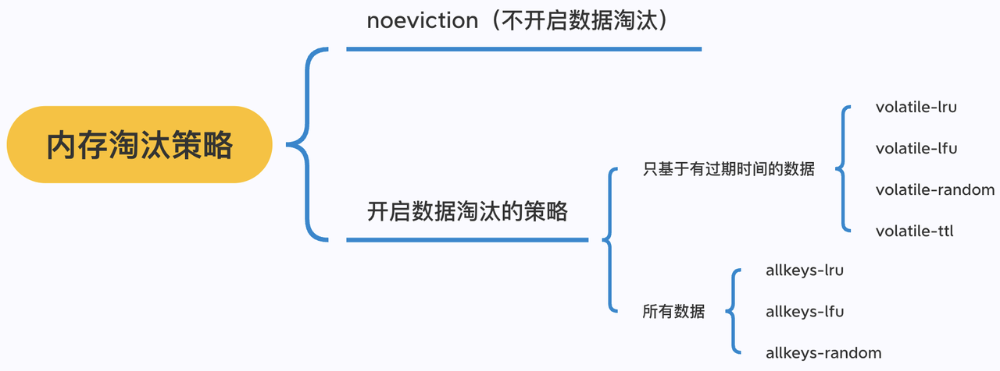
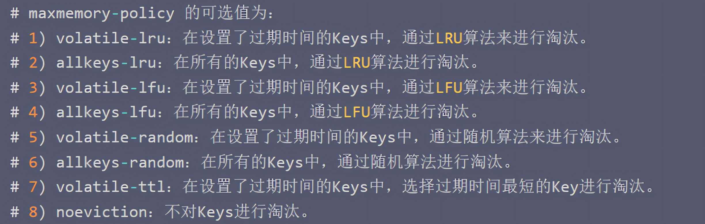
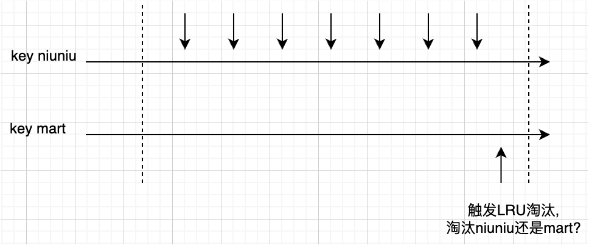

## 一、Redis 是怎么运作的

## 1、Redis 在内存中是怎么存储的

### 1.1 数据库结构

```text
// from Redis 5.0.5

/* Redis database representation. There are multiple databases identified
 * by integers from 0 (the default database) up to the max configured
 * database. The database number is the 'id' field in the structure. */
typedef struct redisDb {
    dict *dict;                 /* The keyspace for this DB */
    dict *expires;              /* Timeout of keys with a timeout set */
    dict *blocking_keys;        /* Keys with clients waiting for data (BLPOP)*/
    dict *ready_keys;           /* Blocked keys that received a PUSH */
    dict *watched_keys;         /* WATCHED keys for MULTI/EXEC CAS */
    int id;                     /* Database ID */
    long long avg_ttl;          /* Average TTL, just for stats */
    list *defrag_later;         /* List of key names to attempt to defrag one by one, gradually. */
} redisDb;
```

redisDb 该结构就代表 Redis 数据库结构，Redis 的各种操作对象（String、Hast、Set、Zet...），就是存储在 dict 数据结构里。

dic 其实就是我们前面介绍的 Hash 对象结构，平常添加对象，就是往 dict 中添加 key-value 对。

dict 结构如下：

```text
typedef struct dict {
    dictType *type;
    void *privdata;
    dictht ht[2];
    long rehashidx; /* rehashing not in progress if rehashidx == -1 */
    unsigned long iterators; /* number of iterators currently running */
} dict;
```

redisDb 即数据库对象，指向了数据字典，字典里包含了我们平常存储的 k-v 数据，k 是字符串对象，value 支持任意 Redis 对象。

整体结构图如下：


#### 1.2 常见操作

##### 1.2.1 添加数据

就是将键值对，添加到 dict 结构字典中去，Key 必须为 String 对象，Value 为任何类型的对象都可以。

比如，如果我们使用命令：SET hellomsg "hello mart"，键空间会变成如下结构。


##### 1.2.2 查询数据

数据查询很清晰，在 dict 找到对应的 key，即完成了查询。

##### 1.2.3 更新数据

对已经存在的 Key 对象的任何变更操作，都是更新。比如针对 String 对象赋予新值，比如给 List 对象增减元素。

举个例子，使用命令 RPUSH animals bird，成功后得到的结构如下：


##### 1.2.4 删除数据

删除即把 Key 和 Value 都从 dict 结构里删除。比如我们在原有基础上，使用命令：

DEL scoredic，成功之后的结构会如下：


#### 1.3 过期键

过期键是存在 redisDb 的 expires 字段上。

假设上面例子的 Key，都设置了过期时间，那么其结构如下：


注意，这里的 dict 中和 expires 中 Key 对象，实际都是存储的 String 对象指针（也就是 dict 里面的元素是字符串对象的地址），
所以并不是会重复占用内容，Redis 对内存的使用都是很珍惜的。

## 2、Redis 是单线程，还是多线程？（重点理解）

Redis 是一个能高效处理请求的组件，一般而言，对这种组件，我们都需要了解其并发模型是怎样的，
比如 Nginx 是多进程模型，Mysql 是多线程模型，那 Redis 又是什么呢？多线程模型吗？

先说结论：**核心处理逻辑，Redis 一直都是单线程的。**

**其它辅助模块也会有一些多线程、多进程的功能**，比如：

- 复制模块用的多进程
- 某些**异步流程**从 4.0 开始用的多线程，例如 UNLINK、FLUSHALL ASYNC、FLUSHDB ASYNC 等非阻塞的删除操作
- 网络 I/O 解包从 6.0 开始用的是多线程

但是这种分支模块，都只是辅助，最核心的还是处理架构，这块 Redis 始终是单线程的。

### 2.1 Redis 为何选择单线程？

Redis 的定位，是内存 k-v 存储，是做**短平快的热点数据处理**，一般来说执行会很快，
执行本身不应该成为瓶颈，而**瓶颈通常在网络 I/O**，**处理逻辑多线程并不会有太大收益**。

同时，**Redis 本身秉持简洁高效的理念**，代码的简单性、可维护性是 Redis 一直以来的追求，**引入多线程带来的复杂性远比想象的要大
**，而且多线程本身也会引入额外成本，下面我们分析一下。

#### 2.1.1 多线程引入的复杂性是极大的

首先，多线程引入之后，**Redis 原来的顺序执行特性就不复存在**，为了支持事务的原子性、隔离性，Redis 就不得不引入一些很复杂的实现；

其次，Redis 的数据结构，可以说是极其高效，在单线程模式下做了很多特性的优化，如果引入多线程，**那么所有底层数据结构都要改造为线程安全，这会是极其复杂的工作
**；

而且，**多线程模式也使得程序调试更加复杂和麻烦**，会带来额外的开发成本及运营成本，也更容易犯错。

所以，引入多线程，会带来很大的复杂度，对于**追求简洁的 Redis** 而言，这是一个需要非常谨慎的事，事实上，Redis 6.0 之后为 I/O
处理引入了多线程来提高性能，
核心处理逻辑还是保留单线程，但是即使这样，6.0 之后的复杂性还是多了许多，更别说完全改成多线程处理了。

#### 2.1.2 多线程带来额外的成本

除了引入复杂度，多线程还会带来额外的成本。包括：

1. **上下文切换成本**，多线程调度需要切换线程上下文，这个操作先存储当前线程的本地数据、程序指针等，然后载入另一个线程数据，*
   *这种内核操作的成本不可忽视**。
2. **同步机制的开销**，一些公共资源，在单线程模式下直接访问就行了，**多线程需要通过加锁等方式去进行同步**，这也是**不可忽视的
   CPU 开销**；
3. 一个线程本身也占据内存大小，对 Redis 这种内存数据库而言，内存非常珍贵，**多线程本身带来的内存使用的成本也需要谨慎决策**。

所以综合来看，多线程其实会带来非常多的成本，如果将处理模块改为多线程，即使在性能上，可能也很难有一个很高的预期，毕竟 Redis
单线程的处理，已经够快了。

### 2.2 Redis 处理过程-源码解析（稍微了解即可）

上一节我们整体介绍了 Redis 的处理过程，为了加深理解，本节我们通过源码的形式，进行深入分析，大家注意一下，
面试时候一般不会直接讨论源码的，但是通过学习源码，可以帮助我们更好的理解，如果基础比较薄弱的同学，也可以先跳过本节，
不影响后续的学习，等二刷的时候再看看。

### 2.3 面试问题

#### 2.3.1 为什么单线程还能这么快

**分析：**

内存、数据结构、多路复用，三个方面

**回答：**

- Redis 是内存数据库，内存操作本身就很快
- 同时 Redis选了了高效的数据结构，很多对象底层有多种实现以应对不同的场景，追求性能的极致。
- 最后 Redis 采用了多路复用的机制，使其在网络 IO 操作中能并发处理大量的客户端请求，实现高吞吐量

## 3、多线程是怎么回事（需要了解）

随着时代的发展，很多业务的请求量都达到了一个曾经难以想象的高度，网络 I/O 操作确实成为了瓶颈，
而之前 Redis 处理流程中读取请求、发送回包都属于 I/O 操作，所以 Redis 引入了多线程来处理网络 I/O，
仍然使用单线程框架来执行 Redis 命令，这样既保持了 Redis 核心的单线程处理架构，完全兼容以前的实现，
又引入了多线程解决提升网络 I/O 的性能。

下面我们看一下 Redis 多线程的设计思路，如下图。


再详细一点， 如下图：




> [多线程是怎么回事（需要了解）](https://ls8sck0zrg.feishu.cn/wiki/wikcniustSxgJNYcpCQZnjsiEUf "多线程是怎么回事（需要了解）")

## 4、内存满了怎么办

### 4.1 Redis 可以存多少数据

使用 maxmemory 配置内存，默认是被注释掉的，也就是默认值是 0。
- 32 位的操作系统中，默认值位 3G。因为 32 位的机器最大只支持 4GB 的内存，而系统本身就需要一定的内存资源来支持运行，默认 3G 相对合理。
- 64 位机器不会限制内存的使用。

我们也可以主动配置 maxmemory，maxmemory 支持各单位：
- maxmemory 1024 （默认字节)
- maxmemory 1024KB 
- maxmemory 1024MB
- maxmemory 1204GB

当 Redis 存储超过这个配置值，则触发 Redis 内存淘汰。

### 4.2 怎么淘汰

Redis 支持多种淘汰策略，大的方向有两个。

一个是 noeviction，默认就是这种策略，此时如果内存达到 maxmemory，则写入操作会失败，但不会淘汰已有数据。

第二个是多种淘汰策略，主要支持 LRU，LFU，RANDOM, TTL 这几个方式：
- lru：根据 LRU（Least recently used，最近最少使用）算法尝试回收最长时间未使用的
- lfu：根据 LFU（Least Frequently Use）驱逐最不常用的键，lfu 是在 4.0 引入的
- random：回收随机的键使得新添加的数据有空间存放
- ttl：回收在过期集合的键，并且优先回收存活时间（TTL）较短的键，使得新添加的数据有空间存放

这四种策略，可以选择时 volatile，也就是设置了过期时间的 Key，或者是 allkeys，即全部的 Key，所以一共有 8 种淘汰方式。






### 4.3 选择哪种淘汰算法

淘汰算法根据业务需求决定，比如：
- 如果数据非常重要，不能丢失，那就选择不淘汰，这种情况会导致写入失败，有完善的告警机制配合人工介入。
- 如果是缓存场景，业务方一般使用 LRU/LFU 这种灵活的淘汰策略，这两种淘汰算法也是我们后面需要重点关注的。

### 4.4 淘汰时机

什么时候触发淘汰呢，实际上，**每次运行读写命令的时候**，都会调用 processCommand 函数，
processCommand 中又会调用 freeMemoryIfNeeded，这时候就会尝试去释放一定内存，策略就按我们上述配置的策略。

## 5、内存淘汰算法-LRU

LRU 一直以来都是一个非常流行的资源淘汰算法，为了减少内存消耗，Redis 使用了近似 LRU。

LRU：最近最久未使用，即记录每个 Key 的最近访问时间，维护一个访问时间的数据

### 5.1 Redis 用 LRU 算法会有什么问题

如果为所有数据维护一个顺序列表，实际就是做一个双向链表，但是如果 Redis 数据稍微多些，
这个链表就是巨大的成本，对于 Redis 而言，内存是最宝贵的，所以 Redis 选择了近似 LRU 算法。

### 5.2 Redis 近似 LRU 算法

维护一个全局链表，对 Redis 来说是巨大的成本，**所以 Redis 选择采样的方式来**做，也就是近似 LRU 算法。

#### 5.2.1 算法概述

在 LRU 模式，redisObject 对象中 lru 字段存储的是 key 被访问时 Redis 的时钟 server.lruclock，当 key 被访问的时候，Redis 会更新这个 key 的 redisObject 的 lru 字段。

注意，Redis 为了保证核心单线程服务性能，缓存了 Unix 操作系统时钟，默认每 100 毫秒更新一次，缓存的值是 Unix时间戳取模2^24

近似 LRU 算法在现有数据结构的基础上采用**随机采样的方式**来淘汰元素，当内存不足时，就执行一次近似 LRU 算法。

具体步骤：
- 随机采样 n 个 key，这个采样个数默认为 5
- 然后根据时间戳淘汰掉最旧的那个 key
- 如果淘汰后内存还是不足，就继续随机采样来淘汰

#### 5.2.2 采样范围

Redis 可以选择范围策略，有两种：
1. allkeys：所有key中随机采样。
2. volatile：从有过期时间的key随机采样。

分别对应 allkeys-lru, volatitle-lru。

#### 5.2.3 淘汰池优化

近似 LRU，优点在于节约了内存，缺点就是不是一个完整的 LRU，**随机采样得到的结果，其实不是全局真正的最久未访问，在数据量大的情况，尤其是这样。**

Redis3.0 对近似 LRU 算法进行了一些优化。

> ps：lru 字段表示的时间戳越小，就代表这个 key 空闲的时间越大，就越应该被淘汰

新算法会维护一个大小为 16 的候选池，池中的数据根据访问时间进行排序。第一次随机选取的 key 都会放入池中，然后淘汰掉最久未访问的，比如第一次选了 5 个，淘汰了 1 个，剩下 4 个继续留在池子里。
- 如果池子未满，那不管空闲时间大还是小，都需要填充到池子里面
- 如果池子满了，每次随机选取的 key 只有空闲时间 > 当前池子里面最小空闲时间的 key 时才会放入池中，然后将池中空闲时间最大的 key 进行淘汰

通过池子存储，其表现也会非常接近真正的 LRU。

## 6、内存淘汰算法-LFU

LFU 淘汰算法：即Least Frequently Used，**最不频繁淘汰算法**，顾名思义，优先淘汰活跃最低，使用频率最低的。

### 6.1 为什么 4.0 引入 LFU

LRU 本身已经能解决大部分问题，但是脱离频率，只谈最近访问，在部分场景是得不到我们希望的结果，比如：



如上所示，key niuniu 频率很高，key mart 虽然是最近访问的，但是实际频率低(我们假设没有其他 key 的干扰)，如果内存满了，会淘汰 key niuniu

但如果用 LFU 的话，会淘汰 key mart，可以保留频率较高的 key niuniu

希望按访问频率来进行淘汰，这其实是一个很正常的需求，LFU 就是专门做这个事的。

### 6.2 LFU

如果使用 LRU，那么 redisObject 中 lru 字段，就是用来存储最近访问时间的，这个字段长度是 LRU_BITS，
这个值一直都是 24 位。

如果是 LFU，**因为 LRU、LFU 是不会同时开启的**，**所以两者可以说是互斥**，基于这个情况，**加上节约内存的考虑**，
Redis 在 LFU 策略下复用 lru 字段，还是用它来表示 LFU 的信息，不过将 24 拆解，
高 16bit 存储 ldt(Last Decrement Time)，低 8bit 存储 logc(Logistic Counter)


如图所示，高的 16 位保存了上次访问时间戳，因为少了 8 位，所以 LFU 下时间精度是 1 分钟，
不然用秒的话 2^16 次方只能表示 65536 秒（大约 18 小时），后 8 位存储的是一个访问计数。

一个 Key 是否活跃，就是这两个字段综合决定的。

如果上一次访问时间很久，那么访问计数就会衰减，这里为什么要衰减，因为访问的热度一直在变，
比如一个 Key，他原来是 255，夸张一点，一年没访问了，不该归零么。

而本身访问，会增加访问计数。当然，最后起作用的就是访问计数。

LFU 数据更新（发生在某个 Key 被访问到）：

**第一步：计算次数衰减。**

因为无论是多快，相对于上次访问，一定有时间间隔，根据间隔，来计算你应该减少的次数。使用的函数就是 LFUDecrAndReturn。

为什么要衰减，因为只是简单的增加访问计数的方法并不完美，访问的热度一直在变，比如一个Key，他原来是255，夸张一点，一年没访问了，不该归零么。

**第二步：一定概率增加访问计数**

次数不足 5 次（默认为 5），那一定会增加，如果大于 5 次，小于 255 次（只有 8 位，255 是最大值），会一定概率加 1，原来的次数越大，越困难。

除了原来的次数影响之外，还有一个 lfu-log-factor 参数可以被设置的。也就是说，可以通过 lfu-log-factor 参数来调节难度，
这个越大，难度也越大，如果为 0，那么每次必然 +1，很快就能 255。

为什么是一定概率增加访问计数？

**避免热点数据占据过多的缓存空间，而其他非热门的数据很快淘汰出缓存**。通过使用一定概率增加访问次数，可以让其他不那么热门但仍然有访问可能性的数据项有机会留在缓存中，提高整体缓存的命中率。

**第三步：更新**

当前时间更新到高16位，次数更新到低8位。
