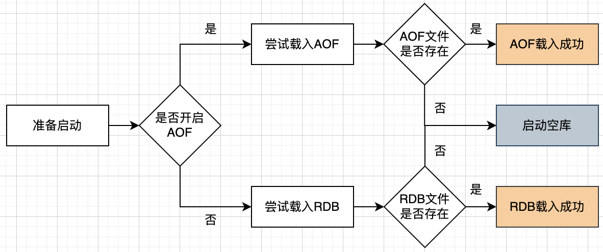
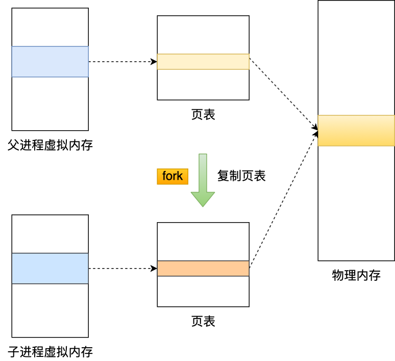
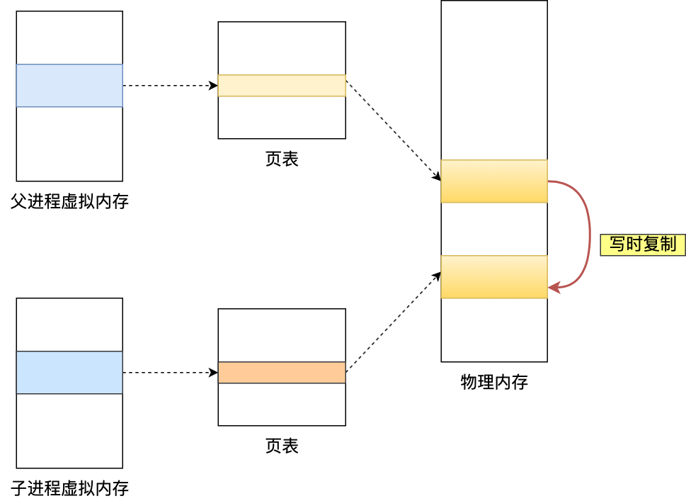
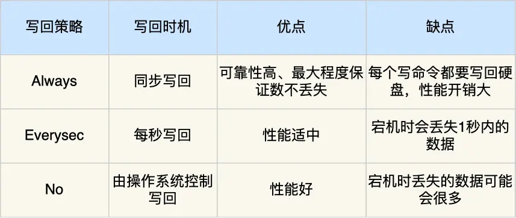
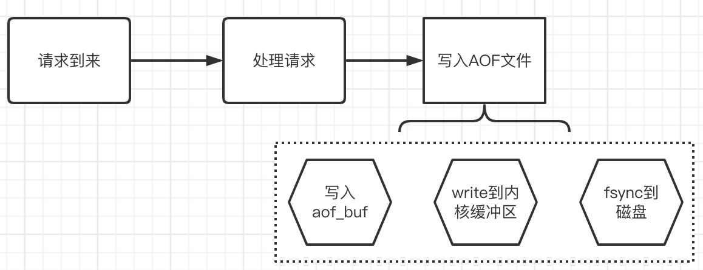
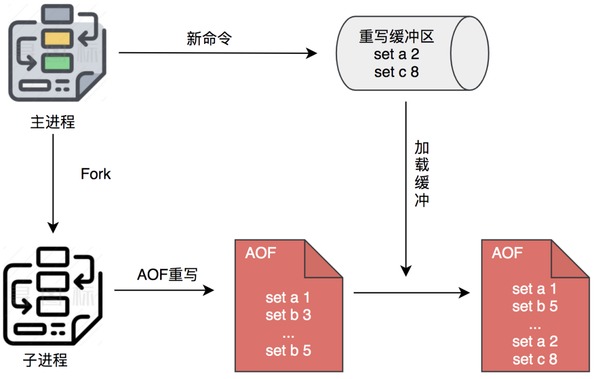
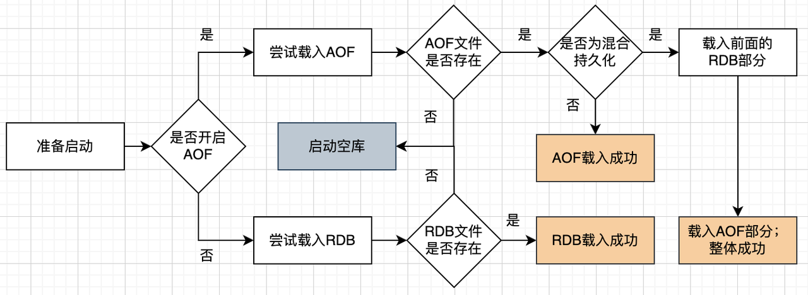
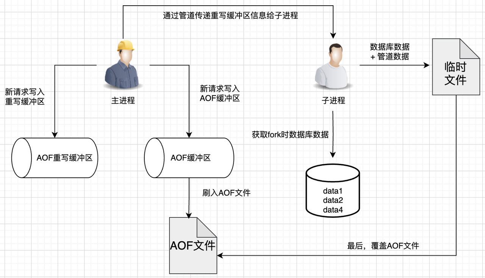

## 一、Redis 数据丢失怎么办

## 1、持久化介绍

### 1.1 持久化是什么

Redis 是跑在内存里的，当程序重启或者服务崩溃，数据就会丢失，如果业务场景希望重启之后数据还在，就需要持久化，即把数据保存到可永久保存的存储设备中。

### 1.2 持久化方式

Redis 提供两种方式来持久化：

- RDB（Redis Database）：默认开启。记录 Redis 某个时刻的全部数据，**这种方式本质就是数据快照**，直接保存二进制数据到磁盘，后续通过加载
  RDB 文件恢复数据。
- AOF（Append Only File）：默认关闭。记录执行的每条命令，重启之后通过重放命令来恢复数据，**AOF 本质是记录操作日志**
  ，后续通过日志重放恢复数据。

RDB 是快照恢复，AOF 是日志恢复，这是两者本质区别，我们甚至都不用去学习他们具体的实现，也能推测出他们如有下差别：

- 体积方面：相同数据量下，RDB 体积更小，因为 RDB 是记录的二进制紧凑型数据
- 恢复速度：RDB 是数据快照，可以直接加载，而 AOF 文件恢复，相当于重放情况，RDB 显然会更快
- 数据完整性：AOF 记录了每条日志，RDB 是间隔一段时间记录一次，**用 AOF 恢复数据通常会更为完整**。

### 1.3 用 RDB 好，还是 AOF 好。

还是根据业务场景来：

- 缓存数据且并不是一个海量访问：可以不用开持久化
- 对数据非常重视：可以同时开启 RDB 和 AOF。



AOF 默认关闭，如果开启 AOF，Redis 恢复的时候就会采用 AOF 进行恢复，如果此时没有 AOF 文件，也不会采用 RDB 文件进行恢复，
但是我们可以手动采用 RDB 进行恢复。

为什么这里开启 AOF 之后，就不自动采用 RDB 进行恢复了？

原因就是既然开启了 AOF 就是说明你想要 AOF 少丢数据的能力，所以即使没有 AOF 文件也不会用 RDB，这样异常你也能发现及时处理，
不然后者丢了数据就是潜在风险

这里说下为什么 RDB 是几分钟才做一次持久化：虽然可以通过 fork 出的子进程来做全量快照，但是如果每一秒一次，
会导致很大的性能开销，可能这一秒的快照都没完成，下一秒又 fork 出一个子进程来做快照，
所以 **RDB 的快照触发间隔是比较难确定的，原则上就是不能太短，一般都是几分钟以上**。

实际源码中，判断如果上一轮 RDB 没有完成，这一轮 RDB 也是不会开始的

### 1.4 面试题

#### 1.4.1 RDB 和 AOF 本质区别是什么？(背背回答，尝试说出自己更深的理解，不要拖沓)

本质区别就是 RDB 是使用快照进行持久化，AOF 是日志。比如：

- **文件类型**：RDB 生成的是 二进制文件（快照），AOF 生成的是 文本文件（追加日志）
- **安全性**：缓存宕机时，RDB 容易丢失较多的数据，AOF 根据策略决定，比如可以配置 1s 刷盘一次，就只丢 1s 内的数据（下一节会详细讲这个策略）
- **文件恢复速度**：由于 RDB 是二进制文件，所以恢复速度也比 AOF 更快
- **操作的开销**：每一次 RDB 保存都是一次全量保存，操作比较重，通常设置至少间隔几分钟保存一次数据。而 AOF
  的刷盘是一次追加操作，操作比较轻，通常设置策略为每一秒进行一次刷盘

## 2、 RDB 详解

### 2.1 怎么开启 RDB 持久化

配置文件：

```text
save 900 1
save 300 10
save 60 10000
```

这里的配置语法是 save interval num，表示每间隔 interval 秒，至少有 num 条写数据操作，写数据操作指增加、删除及更新，就会激活
RDB 持久化。

上面有 3 条 save 配置，他们的意思分别是：

- 每 900s，有 1 条写数据操作；
- 每 300s，有 10 条写数据操作；
- 每 60s，有 10000 写数据操作。

只要满足其中一个条件，就达到了 RDB 持久化的条件

这三条配置不是我们增加，是默认就存在的，这就是说 redis 默认已经开启了 RDB 持久化。

### 2.2 RDB 文件存哪里

下面的参数决定了文件会存到哪里

```text
 # The filename where to dump the DB
 dbfilename dump.rdb

 # The working directory.
 dir /Users/niuniumart/code/redis
```

### 2.3 什么时候进行持久化

Redis 持久化会在下面三种情况下进行：

- 主动执行命令 save：执行了 save 命令，就会在主线程生成 RDB 文件，由于和执行操作命令在同一个线程，所以**如果写入 RDB
  文件的时间太长，会阻塞主线程，这个命令慎用**。
- 主动执行命令 bgsave：和 save 不同，会创建一个子进程来生成 RDB 文件，这样可以避免主线程的阻塞。
- 达到持久化配置阈值：周期函数里会检查是否达到策略，达到就触发 background save（不是通过命令去触发的，而是直接触发后台进程）
- 在程序**正常关闭的时候**执行：在关闭时，Redis 会启动一次阻塞式持久化，以记录更全的数据

### 2.4 RDB 具体做了什么

从整体上，是做了以下事项：

1. Fork 出一个子进程来专门做 RDB 持久化
2. 子进程写数据到临时的 RDB 文件
3. 写完之后，用新 RDB 文件替换旧的 RDB 文件。

受益于写时复制技术，执行 RDB持久化过程中，Redis 依然可以继续处理操作命令的，也就是数据是能被修改的。

具体而言：fork 创建子进程之后，通过写时复制技术，子进程和父进程是共享同一片内存数据的，因为创建子进程的时候，
会复制父进程的页表，但是页表指向的物理内存还是一个。



只有在发生修改内存数据的情况时，物理内存才会被复制一份。



就是这样，Redis 使用 bgsave 对当前内存中的所有数据做快照，这个操作是由 bgsave 子进程在后台完成的，
**执行时不会阻塞父进程中的主线程，这就使得主线程同时可以修改数据。**

这样的**目的**是为了**减少创建子进程时的性能损耗，从而加快创建子进程的速度**，毕竟创建子进程的过程中，是可能阻塞主线程的。

**可以看到，复制期间，读数据互不影响，如果有写操作发生，则主进程复制一份内存，在这个复制的内存基础上，
主进程再修改原来的数据，子进程持久化的依然是修改之前的数据。**

## 3、 AOF 详解

配置：

```text
appendonly no

# The name of the append only file (default: "appendonly.aof")

appendfilename "appendonly.aof"
```

appendonly 设置为 yes，即可打开 AOF。

打开之后，Redis 每条更改数据的操作都会记录到 AOF 文件中，当你重启，AOF 会助你重建状态，相当于就是请求全部重放一次，所以 AOF
恢复起来会比较慢。

### 3.1 AOF 写入流程

从上面的描述，我们可以看出，执行请求时，每条日志都会写入到 AOF。


Redis 提供的 3 种刷盘策略，以便根据需要进行不同的选择。

- appendfsync always：**每次请求都刷入 AOF**，用官方的话说，非常慢，非常安全
- appendfsync everysec：**每秒刷一次盘**，用官方的话来说就是足够快了，但是在崩溃场景下你可能会丢失 1 秒的数据。
- appendfsync no：**不主动刷盘，让操作系统自己刷**，一般情况 Linux 会每 30 秒刷一次盘，这种策略下，可以说对性能的影响最小，但是如果发生崩溃，可能会丢失相对比较多的数据



### 3.2 写入 AOF 细节

写入 AOF，其实是分了好几步来的。

**第一步：**其实是**将数据写入AOF缓存**中，这个缓存名字是aof_buf，其实就是一个sds数据

**第二步：aof_buf 对应数据刷入磁盘缓冲区**，什么时候做这个事情呢？事实上，Redis 源码中一共有 4 个时机，
会调用一个叫 flushAppendOnlyFile 的函数，这个函数会使用 write 函数来将数据写入操作系统缓冲区：

- 处理完事件处理后，等待下一次事件到来之前，也就是 beforeSleep 中。
- 周期函数 serverCron 中，这也是我们打过很多次交道的老朋友了
- 服务器退出之前的准备工作时
- 通过配置指令关闭 AOF 功能时

**第三步：刷盘，** 即调用系统的 flush 函数，刷盘其实还是在 flushAppendOnlyFile 函数中，是在 write 之后，
但是不一定调用了 flushAppendOnlyFile，flush 就一定会被调用，这里其实是支持一个刷盘时机的配置：

- 如果是 appendfsync always 策略，那么就立刻调用 redis_fsync 刷盘，
- 如果是 AOF_FSYNC_EVERYSEC 策略，满足条件后会用 aof_background_fsync 使用后台线程异步刷盘。

一个相对宏观的完整写入示意图：


### 3.3 AOF 重写

AOF 是不断写入的，这很容易带来一个疑问，如此下去 AOF 不是会不断膨胀吗？

针对这个问题，Redis 采用了重写的方式来解决：

重写是**通过读取服务器当前的数据库状态来实现的**，通过尽量少的命令来表示当前数据库的状态

Redis 可以在 AOF 文件体积变得过大时，自动地在后台 Fork 一个子进程，专门对 AOF 进行重写。
**说白了，就是针对相同 Key 的操作，进行合并，比如同一个 Key 的 set 操作，那就是后面覆盖前面。**

在重写过程中，Redis 不但将新的操作记录在原有的 AOF 缓冲区，而且还会记录在 AOF 重写缓冲区。
一旦新 AOF 文件创建完毕，Redis 就会将重写缓冲区内容，追加到新的 AOF 文件，再用新 AOF 文件替换原来的 AOF 文件。



AOF 重写条件也是配置决定，默认如下，同时满足这两个条件则重写。

```text
# 相比上次重写时候数据增长100%
auto-aof-rewrite-percentage 100
# 超过
auto-aof-rewrite-min-size 64mb
```

也就是说，触发重写的条件如下（周期函数来检查和触发，需要同时满足）：

- 大小超过 64MB
- 相比上次重写时的数据大一倍

### 3.4 面试题目

#### 3.4.1 简单描述 AOF 重写流程(很重要，务必要学)

**回答**

- 我将 AOF 重写流程理解成 “一次拷贝，两处缓冲”
- 一次拷贝：重写发生时，主进程 会 fork 出一个子进程，子进程和主进程共享 Redis 物理内存，让子进程将这些内存数据写入重写日志
- 两处缓冲：当重写时，有新的写入命令执行，会由主进程分别写入 AOF 缓冲和 AOF 重写缓冲; 
  - AOF 缓冲用于保证此时发生宕机，原来的 AOF 日志也是完整的，可用于恢复。
  - AOF 重写缓冲用于保证新的 AOF 文件 也不会丢失 最新的写入操作。
- 额外补充：在重写时 AOF 重写缓冲会通过管道传送给子进程，再由子进程刷入新的 AOF 日志（此时，AOF 重写完成）

### 3.5 AOF 优化-混合持久化

#### 3.5.1 混合持久化是什么？

混合部署听名字似乎是同时开启 RDB 和 AOF，实际上不是的，**混合部署实际发生在 AOF 重写阶段**，将当前状态保存为 RDB 二进制内容，
写入新的 AOF 文件，再将重写缓冲区的内容追加到新的 AOF 文件，最后替代原有的 AOF 文件。

此时的 AOF 文件，就不再单纯的是日志数据，而是**二进制数据+日志数据的混合体**，所以叫混合持久化。

其实就是相当于重写的时候使用了 RDB 的格式，在写入新数据的时候还是以 AOF 的形式写入，这样的话兼顾了两者的优点：
- RDB 优点：
  - 同等数据，体积更小
  - 恢复的时候速度更快
- AOF 优点：
  - 丢失数据少

##### 3.5.2 如何开启

redis 配置文件：aof-use-rdb-preamble。5.0 之后默认是打开的，所以 5.0 之后只要 AOF 配置开启，默认就是混合持久化。

#### 3.5.3 混合持久化开启之后，服务启动时如何加载持久化数据

混合持久化还是属于 AOF，所以如果有混合持久化，那肯定是优先使用混合持久化的数据。

完整的具体加载流程如下：


### 3.6 AOF 优化-MP 方案(不要求看，但面试可以吹，Redis 7.0 优化)

Redis AOF 文件随着不断膨胀，会通过重写机制来减少 AOF 文件大小。功能上，倒是没啥问题，但是从性能和方案上来说，
AOF 重写功能都显得比较粗糙，这也是正常的，持久化作为一个相对分支的模块，在前期没有花费太多精力去优化完全可以理解，
随着 Redis 不断完善，AOF 重写功能终于在 **7.0** 得到了一个很大程度的优化。

#### 3.6.1 原有 AOF 重写方案弊端

我们详细分析下原有的方案：



优势：
- 方案容易想到，前期快速实现

劣势：
- **占用主进程 CPU 时间**。1）在重写期间额外向 aof_rewrite_buf 写数据；2）通过管道向子进程发送 aof_rewrite_buf 中的数据；
3）以及子进程结束后将剩余 aof_rewrite_buf 写入临时文件，这都是需要消耗 CPU 时间的，而 Redis 核心执行是单线程的，
CPU 资源的损耗会带来响应速度的降低。

这里也提下，通过管道传递信息给子进程，让子进程写磁盘，这已经是 3.2 引入的优化了，更早版本是主进程直接写，这样更容易影响正常请求
- **额外的内存开销**。在 AOF 重写期间，主进程会将 fork 之后的数据变化同时写进 aof_buf 和 aof_rewrite_buf 中。
- **额外磁盘开销**。主进程除了会将执行过的写命令写到 aof_buf 之外，还会写一份到 aof_rewrite_buf 中。
aof_buf 最终写入老文件，aof_rewrite_buf 最终写入新 AOF 文件，这**相当于是两次磁盘消耗**，而数据明明是一样的。

为了解决上述问题，我们需要先认清为什么问题的本质是有两个不太合理的设计：
1. 同时向 aof_buf 和 aof_rewrite_buf 写入
2. 父子进程传输文件数据（父进程通过管道将 aof 重写缓冲区的数据传输给子进程，子进程再将数据写入到新的文件）

#### 3.6.2 MP-AOF 方案概述

MP-AOF，全称 Multi Part AOF，也就是多部 件AOF，通俗点说就是原来是一个 AOF 文件，现在变成了多个 AOF 文件的配合。MP-AOF 文件核心有两个 Part 组成：
1. BASE AOF文件，基础 AOF 文件，记录了基本的命令
2. INCR AOF文件，记录了在重写过程中新增的操作命令

这两个部件，就可以一起组成完整的 AOF 操作记录，

原来是一个 AOF 文件，里面包含了操作的命令记录，MP-AOF 则是提出了 BASE AOF 和 INCR AOF 两种文件的组合，一个 BASE AOF 结合 INCR AOF，一起来表示所有的操作命令。

我们来看看这种新模型下的流程：


现在在重写阶段：
- 在主进程中写 AOF 缓冲区即可，AOF 缓冲区的数据最终落入新打开的 2.INCR AOF 文件，
- 至于子进程，就根据 fork 时数据库的数据，重写并生成新的一个 2.BASE.AOF 文件。

写完之后也不需要覆盖原有的文件，只需要更新 manifest 文件，manifest 是文件清单，描述了当前有效的 BASE AOF、INCR AOF 是哪个。

对于之前的文件，Redis 将它们标记为 HISTORY AOF，这些 HISTORY AOF 会被 Redis 异步删除掉。

这里为了给大家加深印象，也额外说下，上面的 1.INCR.AOF，2.BASE.AOF 只是为了方便描述和记忆，他的名字其实不是这个，实际的名字长这样子：


至于 manifest 里面的内容，实际是长这样子：


> PS：appendonly.aof.1.base.rdb 是因为 7.0 默认开启了混合持久化，所以 base 后缀是 rdb，这里不冲突，不开启他就还是 aof。

通过上述讲解，我们可以看到：
1. 我们在 AOF 重写期间不再需要 aof_rewrite_buf
2. 我们也不再需要父子进程通过管道传输操作数据

如此一来，CPU、内存、磁盘的性能损耗会降低很多，甚至代码复杂度也会降低，整体更为简单清晰，这也符合 Redis 的简洁的理念。

