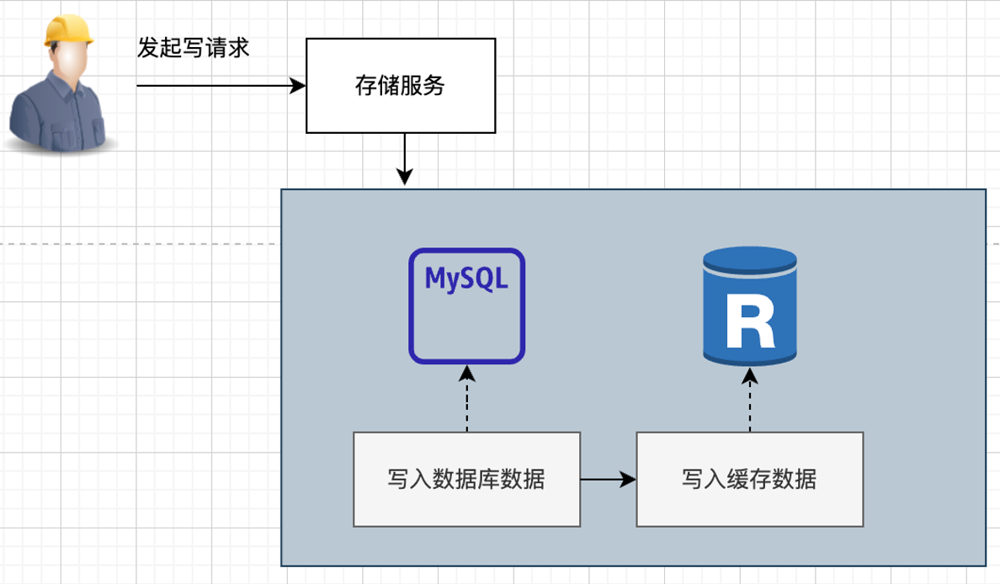
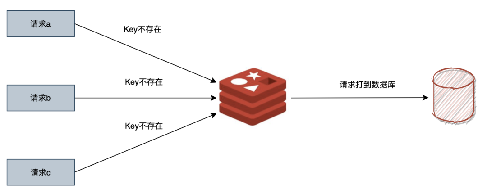
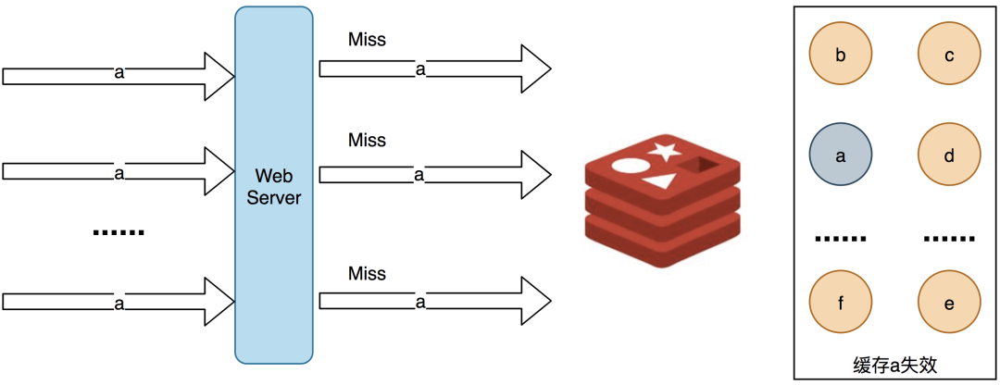
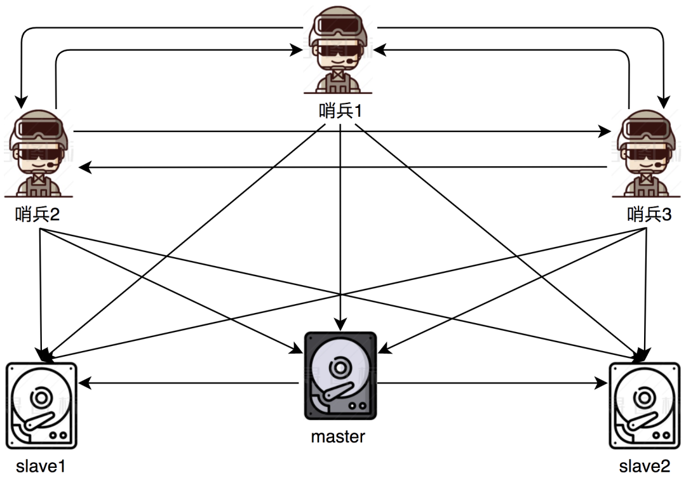

## 一、场景应用（重点是缓存和分布式锁）

## 1、 场景应用之缓存

### 1.1 缓存基础

Redis由于性能高效，通常可以做数据库存储的缓存，比如给将 MySQL 的热点数据存储在 Redis 中。

### 1.2 怎么做

一般而言，缓存分为两种：

- **服务器端缓存**：服务器端缓存即服务端将数据存入 Redis，可以在访问 DB 之后，将从 DB 得到数据的缓存起来
- **客户端缓存**：对服务端远程调用之后，将结果存储在客户端，这样下次请求相同数据时就能直接拿到结果，
  不会再远程调用，提高性能节省网络带宽。

> 注意：这里的客户端指的是广义的客户端。比如服务 A 调用服务 B，对服务 B 而言服务 A 就是客户端。

用服务端还是客户端呢？

其实是需要分析具体瓶颈在哪里，当然，如果按通常的经验，从服务角度来看，在目前的微服务架构下，
每个服务其实都应该缓存一些热点数据，以减轻热点数据频繁请求给自己带来的压力，
毕竟微服务也要有一定的互不信任原则。

> 互不信任原则：假设请求先到服务 A，再到服务 B，A可能已经做过数据检查了，B 服务不信任 A 需要再做一次检查。

至于客户端缓存，这个就更看场景了，频繁请求的数据，就有必要做缓存。

下面我们以服务端缓存的视角，来进行缓存分析。

### 1.3 缓存的几种模式

缓存一般有如下几种模式：

- Cache-Aside Pattern：旁路缓存模式
- Read Through Cache Pattern：读穿透模式
- Write Through Cache Pattern：写穿透模式
- Write Behind Pattern：又叫 Write Back，异步缓存写入模式

#### 1.3.1 Cache Aside

Cache Aside，即旁路缓存模式，是最常见的模式，**应用服务把缓存当作数据库的旁路，直接和缓存进行交互**。

读操作的流程如下：

应用服务收到查询请求后，先查询数据是否在缓存上，如果在，就用缓存数据直接打包返回，如果不存在，就去访问数据库，
从数据库查询，并放到缓存中，除了查库后加载这种模式，如果业务有需要，还可以预加载数据到缓存。

说完读操作，我们再看看写操作的流程：

在写操作的时候，Cache Aside 模式是一般是先更新数据库，然后直接删除缓存，为什么不直接更新呢？
因为更新相比删除会更容易造成**时序性问题**，这里有同学问时序性问题是什么？举个例子：

thread1 更新 mysql 为 5 -> thread2 更新 mysql 为 3 -> thread2 更新缓存为 3 -> thread1 更新缓存为 5，最终正确的数据因为时序性被覆盖了。

Cache Aside **适用于读多写少的场景**，比如用户信息、新闻报道等，一旦写入缓存，几乎不会进行修改。
**该模式的缺点是可能会出现缓存和数据库不一致的情况**。

#### 1.3.2 Read Through

Read-Through，读穿透模式，**和 Cache Aside 模式的区别主要在于应用服务不再和缓存直接交互，而是直接访问数据服务，**
这个数据服务可以理解为一个代理，即单独起这么一个服务，由它来访问数据库和缓存，作为使用者来看，不知道里面到底有没有缓存，
数据服务会自己来根据情况查询缓存或者数据库。

查询的时候，和 Cache Aside 一样，也是缓存中有，就用从缓存中获得的数据，没有就查 DB，只不过这些由数据服务托管保存，而对应用服务是透明的。

相比 Cache Aside，**Read Through 的优势是缓存对业务透明，业务代码更简洁**。
**缺点是缓存命中时性能不如 Cache Aside，相比直接访问缓存，还会多一次服务间调用**。

#### 1.3.3 Write Through

在 Cache Aside 中，应用程序需要维护两个数据存储：一个缓存，一个数据库。
这对于应用程序来说，更新操作比较麻烦，还要先更新数据库，再去删除缓存。

WriteThrough 模式相当于做了一层封装：

由这个存储服务先写入 MySQL，再同步写入 Redis，这样及时加载或更新了缓存数据。

可以理解为，应用程序认为后端就是一个单一的存储，而存储自身维护自己的 Cache。

当使用 Write-Through 时，一般都配合使用 Read-Through 来使用。Write-Through 的潜在使用场景是银行系统。

Write-Through 适用情况有：

- 对缓存及时性要求更高（写入就加载了缓存，当然这种模式可能会有时序性问题）
- 不能忍受数据丢失（相对 Write-Behind 而言）和数据不一致，当然 Cache Aside 也是如此

在使用 Write-Through 时要特别注意的是缓存的有效性管理，**否则会导致大量的缓存占用内存资源**，因为这种模式下只要写入数据就加载了缓存。

#### 1.3.4 Write-Behind

Write-Behind 和 Write-Through 相同点都是写入时候会更新数据库、也会更新缓存。

不同点在于 Write-Through 会把数据立即写入数据库中，然后写缓存，安全性很高。

而 Write-Behind 是先写缓存，然后异步把数据一起写入数据库，这个异步写操作是 Write-Behind 的最大特点。

在 write-behind 缓存中，数据的读取和更新通过缓存进行，与 write-through 缓存不同，更新的数据并不会立即传到数据库。
相反，在缓存中一旦进行更新操作，缓存就会跟踪脏记录列表，并定期将当前的脏记录集刷新到数据库中。作为额外的性能改善，
缓存会合并这些脏记录。合并意味着如果相同的记录被更新，或者在缓冲区内被多次标记为脏数据，则只保证最后一次更新。
对于那些值更新非常频繁，例如金融市场中的股票价格等场景，这种方式能够很大程度上改善性能。如果股票价格每秒钟变化 100 次，
则意味着在 30 秒内会发生 30 x 100 次更新。合并将其减少至只有一次。

异步写操作极大地降低了请求延迟并减轻了数据库的负担，但是代价是安全性不够，比如先写入了 Redis，
更新操作先放在存储服务内存中，但是还没异步写入 MySQL 之前，存储服务崩溃了，那么数据也就丢失了。

适用于读少写多场景

#### 1.3.5 4 种模式怎么选择

各有优势，但是Cache-Aside Pattern，旁路缓存模式是最常见，最易用的，在业务开发中，其他模式很少会用到

> 参考链接：
>
> [极端事务处理模式：Write-behind 缓存](https://www.infoq.cn/article/write-behind-caching "极端事务处理模式：Write-behind 缓存")
>
> [人人都要知道的，Redis缓存使用的三种模式](https://zhuanlan.zhihu.com/p/662186392 "人人都要知道的，Redis缓存使用的三种模式")

## 2、缓存异常场景

### 2.1 缓存穿透（大量请求查不到，即：缓存无数据，数据库也无数据）

缓存穿透的概念很简单，用户想要查询一个数据，发现 redis 内存数据库没有，也就是缓存没有命中，于是向持久层数据库查询，
发现也没有，于是本次查询失败。当用户很多的时候，缓存都没有命中（**比如秒杀的时候**），于是都去请求了持久层数据库。
这会给持久层数据库造成很大的压力，这时候就相当于出现了**缓存穿透**。

在流量大时，可能 DB 就挂掉了，要是有人利用不存在的 key 频繁攻击我们的应用，这就是漏洞。

如发起为 id 为 “-1” 的数据或 id 为特别大不存在的数据。这时的用户很可能是攻击者，攻击会导致数据库压力过大。

解决方案：

1. 接口层增加校验，如用户鉴权校验，id 做基础校验，id<=0 的直接拦截；
2. 从缓存取不到的数据，在数据库中也没有取到，这时也可以将 key-value 对写为 key-null，缓存有效时间可以设置短点，如 30
   秒（设置太长会导致正常情况也没法使用）。这样可以防止攻击用户反复用同一个 id 暴力攻击
3. 布隆过滤器。bloomfilter 就类似于一个 hash set，用于快速判某个元素是否存在于集合中，其典型的应用场景就是快速判断一个 key
   是否存在于某容器，不存在就直接返回。布隆过滤器的关键就在于 hash 算法和容器大小。

#### 2.1.1 布隆过滤器

布隆过滤器是一种比较巧妙的概率型数据结构，**特点是高效地插入和查询**，可以用来告诉我们 “某样东西一定不存在或者可能存在”

布隆过滤器原理：布隆过滤器底层是一个 64 位的整型，将字符串用多个 Hash 函数映射不同的二进制位置，将整型中对应位置设置为 1。

在查询的时候，如果一个字符串所有 Hash 函数映射的值都存在，那么数据**可能存在**。为什么说可能呢，就是**因为其他字符可能占据该值，点亮对应位置
**。

可以看到，布隆过滤器优缺点都很明显，优点是空间、时间消耗都很小，缺点是结果不是完全准确。

> 参考链接：
>
> [详解布隆过滤器的原理，使用场景和注意事项](https://zhuanlan.zhihu.com/p/43263751 "详解布隆过滤器的原理，使用场景和注意事项")
>
> [英文博客](URL "英文博客")
> [英文博客](URL "英文博客")
> [英文博客](URL "英文博客")
> [英文博客](URL "英文博客")

### 2.2 缓存击穿（对某些热键 key，即：缓存无数据，数据库有数据，key 比较集中）

缓存击穿是指缓存中没有但数据库中有的数据（一般是缓存时间到期），这时由于并发用户特别多，同时读缓存没读到数据，
又同时去数据库去取数据，引起数据库压力瞬间增大，造成过大压力。

缓存击穿，**一般指是指热键在过期失效的一瞬间，还没来得及重新产生，就有海量数据，直达数据库**。

解决方案：

1. **热点数据支持续期**，持续访问的数据可以不断续期，避免因为过期失效而被击穿
2. **发现缓存失效，重建缓存加互斥锁**，当线程查询缓存发现缓存不存在就会尝试加锁，线程争抢锁，
   拿到锁的线程就会进行查询数据库，然后重建缓存，争抢锁失败的线程，你可以加一个睡眠然后循环重试
    - 在 go 中，最好的方式是使用 singleflight，就是本地机器多个请求访问同一个缓存的话只派一个代表去，就不会出现大量请求同步更新同一个缓存的情况了

> [singleflight](https://www.liwenzhou.com/posts/Go/singleflight/ "singleflight")

### 2.3 缓存雪崩（缓存大面积失效，即：缓存无数据，数据库有数据，key 比较分散）

缓存雪崩顾名思义，是指**大量的应用请求因为异常无法在 Redis 缓存中进行处理**，像雪崩一样，直接打到数据库。
这里异常的原因，也可以说雪崩的原因，主要是：

- **缓存中数据大批量到过期时间**，而查询数据量巨大，引起数据库压力过大甚至宕机

其实在一些资料里，会把 Redis 宕机算进来，原因是 Redis 宕机了也就无法处理缓存请求，但这里会觉得有些牵强，如果这里能算，
缓存击穿不也可以算？所以这里建议是不把宕机考虑到雪崩里去。

和缓存击穿不同的是，缓存击穿指一条热点数据在 Redis 没得到及时重建，缓存雪崩是一大批数据在 Redis 同时失效

例子：比如马上就要到双十二零点，很快就会迎来一波抢购，这波商品时间比较集中的放入了缓存，假设缓存一个小时，
那么到了凌晨一点钟的时候，这批商品的缓存就都过期了。而对这批商品的访问查询，都落到了数据库上，对于数据库而言，
就会产生周期性的压力波峰。于是所有的请求都会达到存储层，存储层的调用量会暴增，造成存储层也会挂掉的情况。

解决方案：

1. **缓存数据的过期时间设置随机**，防止同一时间大量数据过期现象发生。
2. **重建缓存加互斥锁**，当线程拿到缓存发现缓存不存在就会尝试加锁，线程争抢锁，拿到锁的线程就会进行查询数据库，然后重建缓存，争抢锁失败的线程，你可以加一个睡眠然后循环重试
3. **数据预热**：数据加热的含义就是在正式部署之前，我先把可能的数据先预先访问一遍，这样部分可能大量访问的数据就会加载到缓存中。在即将发生大并发访问前手动触发加载缓存不同的
   key ，设置不同的过期时间，让缓存失效的时间尽量均匀

## 3、缓存一致性怎么保证

大的方向有三：

1. 更新 MySQL 即可，不管 Redis，以过期时间兜底
    - 优点：
        - redis原生接口，开发成本低，易于实现；​
        - 管理成本低，出问题的概率会比较小。
    - 缺点：
        - 完全依赖过期时间，时间太短容易造成缓存频繁失效，
        - 如果读请求非常频繁，且过期时间设置较长，则会产生很多脏数据，会有较长时间不一致。
2. 更新 MySQL 之后，操作 Redis
    - 更新 Redis：不推荐，因为网络等原因可能有时序性问题
    - 删除 Redis：等待下次访问再加载回来。如果删除失败可以忽略，因为有过期时间兜底，保证最终一致性。
    - 优点：
        - 相对方案一，达成最终一致性的延迟更小；
        - 实现成本较低，只是在方案一的基础上，增加了删除逻辑。
    - 缺点：
        - 如果更新mysql成功，删除redis却失败，就退化到了方案一；
        - 在更新时候需要额外操作Redis，带来了损耗。
3. 异步将 MySQL 的更新同步到 Redis：把我们搭建的消费服务作为 mysql 的一个 slave，订阅 mysql 的 binlog 日志，
   解析日志内容，再更新到 redis。此方案（阿里巴巴开源的 canal 组件）和业务完全解耦，redis 的更新对业务方透明，可以减少心智成本。
    - 优点：
        - 和业务完全解耦，在更新mysql时，不需要做额外操作；
        - 无时序性问题，可靠性强。
    - 缺点：
        - 引入了消息队列这种算比较重的组件，还要单独搭建一个同步服务，维护他们是非常大的额外成本
        - 同步服务如果压力比较大，或者崩溃了，那么在较长时间内，redis 中都是老旧数据

### 3.1 方案选型

1. 首先确认产品上对延迟性的要求，如果要求极高，且数据有可能变化，别用缓存。
2. 通常来说，过期时间兜底是行之有效的办法，根据实时性期待不一样，可以增加个删除逻辑，提升一致性。
3. 从解耦层面来看，可以使用订阅 binlog 的模式来更新，缺点就是重，比较适合的场景是数据不过期场景

## 4、分布式锁(很重要)

### 4.1 分布式锁是什么？

分布式锁就是分布式场景下的锁，比如多台不同机器上的进程，去竞争同一项资源，就是分布式锁。

### 4.2 分布式锁有哪些特性？

- **互斥性**：锁的目的是获取资源的使用权，所以只让一个竞争者持有锁，这一点要尽可能保证；
- **安全性**：避免锁因为异常永远不被释放。当一个竞争者在持有锁期间内，由于意外崩溃而导致未能主动解锁，其持有的锁也能够被兜底释放，并保证后续其它竞争者也能加锁；
- **对称性**：同一个锁，加锁和解锁必须是同一个竞争者。不能把其他竞争者持有的锁给释放了。
- **可靠性**：需要有一定程度的异常处理能力、容灾能力。

### 4.3 分布式锁的常用实现方式

分布式锁，一般会依托第三方组件来实现，而利用 Redis 实现则是工作中应用最多的一种。

#### 4.3.1 最简化版本

使用 setnx key value：

- 如果 key 不存在，则会将 key 设置为 value，并返回 1
- 如果 key 存在，不会有任务影响，返回 0。

基于这个特性，我们就可以用 setnx 实现加锁的目的：

- 通过 setnx 加锁，加锁之后其他服务无法加锁
- 用完之后，再通过 delete 解锁，深藏功与名

问题：

- 如果获取锁的服务挂掉了，那么锁就一直得不到释放，就像石沉大海，杳无音信。所以，我们需要一个超时来兜底。

#### 4.3.2 优化

##### 4.3.2.1 优化一：支持过期时间

使用 set key value nx ex seconds：

- nx 表示具备 setnx 特定
- ex 表示增加了过期时间，最后一个参数就是过期时间的值

我们来试想一下如下场景：服务 A 获取了锁，由于业务流程比较长，或者网络延迟、GC 卡顿等原因，导致锁过期，而业务还会继续进行。
这时候，业务 B 已经拿到了锁，准备去执行，这个时候服务 A 恢复过来并做完了业务，就会释放锁，而 B 却还在继续执行。

所以存在一个问题：

- 会存在服务 A 释放掉服务 B 的锁的可能

##### 4.3.2.2 优化而二：给锁加上归属

所以我们需要给锁加上**归属**，将 value 值设置为线程对应 uuid，表明该锁是哪个线程的，同时在解锁的时候判断解锁的锁对象是不是当前线程的锁。

此时，我们完整的流程是：

1. 竞争者获取锁
2. 执行任务
3. 执行完毕后检查锁是不是自己的
4. 最后进行释放

这些操作不是原子化的。可能锁获取时还是自己的，删除时却已经是别人的了。

比如：

1. A 获取 lock 的值，这时候值还是 A 的线程 uuid
2. 然后在执行释放锁的间隙，lock 过期了，然后线程 B 加锁
3. 然后 A 释放锁，就导致 A 释放了 B 的锁

##### 4.3.2.3 优化三：引入 Lua，保证原子性

所以，引入 Lua。

有了 Lua 的特性，Redis 才真正在分布式锁、秒杀等场景，有了用武之地，下面便是改造之后的流程：

到了这一步，分布式锁的前三个特性：**对称性、安全性、互斥性**，就满足了。

#### 4.3.3 可靠性如何保证

分布式锁的四大特性还剩下可靠性没有解决。

针对一些异常场景，包括 Redis 挂掉了、业务执行时间过长、网络波动等情况，我们来一起分析如何处理。

**容灾考虑：**

前面我们谈及的内容，基本是基于单机考虑的，如果 Redis 挂掉了，那锁就不能获取了。这个问题该如何解决呢？

一般来说，有两种方法：**主从容灾**和**多级部署**。

##### 4.3.3.1 主从容灾

最简单的一种方式，就是为 Redis 配置从节点，当主节点挂了，用从节点顶包。

但是主从切换，需要人工参与，会提高人力成本。
不过 Redis 已经有成熟的解决方案，也就是哨兵模式，可以灵活自动切换，不再需要人工介入。

通过增加从节点的方式，虽然一定程度解决了单点的容灾问题，但并不是尽善尽美的，由于同步有时延，
Slave 可能会损失掉部分数据，分布式锁可能失效，这就会发生短暂的多机获取到执行权限。

有没有更可靠的办法呢？

##### 4.3.3.2 多机部署

如果对一致性的要求高一些，可以尝试多机部署，比如 Redis 的 RedLock，大概的思路就是多个机器，
通常是奇数个，达到一半以上同意加锁才算加锁成功，这样，可靠性会向 ETCD 靠近。

现在假设有 5 个 Redis 主节点，基本保证它们不会同时宕掉，获取锁和释放锁的过程中，客户端会执行以下操作：

1. 向 5 个 Redis 申请加锁；
2. 只要超过一半，也就是 3 个 Redis 返回成功，那么就是获取到了锁。如果超过一半失败，需要向每个 Redis 发送解锁命令；
3. 由于向 5 个 Redis 发送请求，会有一定时耗，所以锁剩余持有时间，需要减去请求时间。这个可以作为判断依据，如果剩余时间已经为
   0，那么也是获取锁失败；
4. 使用完成之后，向 5 个 Redis 发送解锁请求。

**这种模式的好处在于**，如果挂了 2 台 Redis，整个集群还是可用的，给了运维更多时间来修复。

另外，多说一句，单点 Redis 的所有手段，这种多机模式都可以使用，比如为每个节点配置哨兵模式，*
*由于加锁是一半以上同意就成功，那么如果单个节点进行了主从切换，单个节点数据的丢失，就不会让锁失效了。这样增强了可靠性**。

**可靠性深究**

是不是有 RedLock，就一定能保证可靠的分布式锁？

这里先说结论：由于分布式系统中的三大困境（简称 NPC），所以没有完全可靠的分布式锁！

让我们来看看 RedLock 在 NPC 下的表现。

- **N：Network Delay（网络延迟）** 当分布式锁获得返回包的时间过长，此时可能虽然加锁成功，但是已经时过境迁，锁可能很快过期。RedLock
  算了做了些考量，也就是前面所说的锁剩余持有时间，需要减去请求时间，如此一来，就可以一定程度解决网络延迟的问题。
- **P：Process Pause（进程暂停）**
    1. 比如发生 GC，获取锁之后 GC 了，处于 GC 执行中，然后锁超时。
    2. 其他锁获取，这种情况几乎无解。这时候GC回来了，那么两个进程就获取到了同一个分布式锁。
- **C：Clock Drift（时钟漂移）**
    1. 如果竞争者 A，获得了 RedLock，在 5 台分布式机器上都加上锁。
    2. 为了方便分析，我们直接假设 5 台机器都发生了时钟漂移，锁瞬间过期了。
    3. 这时候竞争者 B 拿到了锁，此时 A 和 B 拿到了相同的执行权限。

根据上述的分析，可以看出，RedLock 也不能扛住 NPC 的挑战，因此，单单从分布式锁本身出发，完全可靠是不可能的。要实现一个相对可靠的分布式锁机制，还是需要和业务的配合，
**业务本身要幂等可重入**，这样的设计可以省却很多麻烦。

### 4.4 总结

对分布式锁不要强依赖，没有绝对可靠的分布式锁，分布式锁需要与业务的联动配合更加切实可行，脱离了业务，就是空中楼阁，不着实地。

Red Lock 这种比较重的方案，在生产中其实用得不多，本身就不能完全可靠，业务上又基本做了幂等，没必要搞这么复杂。

## 5、事务(不是很重要，但Lua要知道怎么用)

### 5.1 Multi

多个操作被看作一个整体，即事务。

事务通常具备原子性。

Redis 原生有 Multi 命令，可以开启事务。

原生事务其实是由 MULTI, EXEC, DISCARD and WATCH 这四个命令配合完成的。

- MULTI：开启事务
- EXEC：执行事务
- DISCARD：放弃事务

Watch是干啥的？

watch 用来提前来观察数据，具体来说，它用于监视一个(或多个) key ，如果在事务执行之前这个(或这些) key 被其他命令所改动，那么事务将被打断。

所以 **watch 命令可以决定事务是执行还是回滚**，一般的操作是：

- 在 multi 命令之前使用 watch 命令监控某些键值对
- 然后使用 multi 命令开启事务
- 执行各类对数据结构进行操作的命令，这些命令会进入先入先出队列中

当 redis 使用 exec 命令执行事务的时候：

- 首先会比较被 watch 的键值对有没有发生变化
- 如果产生变化则回滚事务
- 没有变化则执行事务中的命令
- 无论事务执行与否，最终都会取消执行事务之前的 watch 命令。

**原理：** Redis 服务存储了一个结构体，**里面包含了队列里的命令列表**，先入先出。执行的时候**顺序执行。**

#### 5.1.1 Multi 事务具备原子性吗？

不具备，只是通过单线程的特性，让其它操作切不进来。但是中途如果因为崩溃，或者自己有问题，还是可能只做了一半。

#### 5.1.2 Multi 三宗罪

弱原子：

1. 事务开启后，每个命令其实都是一次调用，浪费资源；
2. 因为这些命令执行之间是有时间的，还需要 Watch 提前来观察，这也太难用了
3. 通常来说失败了会中断后续流程，而 Multi 失败会继续，这容易让人疑惑

MULTI 可以说是 Redis 关于事务的过渡方案，无论是原子性、功能性、易用性都比较差，事实上，也很少会有团队在生产环境使用 MULTI。

事实上，Redis 在 2.6 版本之后，引入了 LUA 做事务，用官网的话来说用 LUA 会更简单、更快。

### 5.2 Lua 做事务

Lua 是一种用标准 C 语言编写的轻量的脚本语言，其设计目的是为了嵌入应用程序中，从而为应用程序提供灵活的扩展和定制功能。

Redis 是 2.6 版本通过内嵌支持 Lua 环境。执行脚本的常用命令为 EVAL。

### 5.2.1 Lua 事务分析

我们来对比下原生的 Multi 事务：

- 可以编写 if else 这种选择逻辑
- **事务中间如果失败，会中断后续执行**，失败前的任务还是已经执行了，不会回滚
- 使用方便，开启 Lua 就可以执行事务，不像 Mutil 还需要 Watch 来保证执行开始时状态未改变

## 6、消息队列

### 6.1 消息队列是什么

消息队列，就是传递消息的队列，消息队列有着**先入先出**的特性，
消息队列一般用于**异步流程、消息分发、流量削锋**等问题，可以通过消息队列**实现高性能、高可用、高扩展**的架构。

### 6.2 Redis 能做消息队列？

某些场景，其实我们并不是一定需要有多可靠、多完善的消息队列，
比如发用消息队列发短信，我们肯定也经常遇到过，短信没收到的场景吧？没收到重试就行了。

所以，轻量级消息队列也有了市场需要，Redis 就很适合来做一个不那么完善的消息队列。
在 Redis 中，一般有 3 种方案来做一个轻量级消息队列。

#### 6.2.1 List 做消息队列

List 在数据对象章节我们已经详细介绍过，他本身是一个双端列表，命令也可以支持先入先出，从功能上，
我们完全可以在一个服务将数据放进 List，另一个服务来进行接受处理，这就是一个典型的生产消费模式。

如何用 List 来生产消费：

1. 用 RPUSH 往队列末尾增加元素
2. 用 LPOP 从队头取出元素，实现先入先出【无法知道确切的消费时机】
    - BRPOP、BLPOP：阻塞版 POP 命令。这里我们还是用 BLPOP 从队头消费，**如果没有消息，就会阻塞，直到达到超时时间**
      ，如果等待过程中，消息过来了，就会消费消息

现在，我们可以阻塞式消费了，但这个消息队列还是太薄弱了，

- 最明显一点，是没有 ACK 机制，即消费者取消息之后，消息就出队列了，如果消费失败，消息还得想办法放回去。
- 同时，也不支持多人消费。

这里继续做下去的话，有几种方式：

1. 先用 LRANGE 读队列信息，消费完成之后，再 POP，**但这样消息可能被多个消费者消费，没办法实现一个消费组的逻辑**。
2. POP 之后，扔到另一个队列，消费确认了，就删除该信息，但如果是失败情况，那就将数据放置回队头，这需要用 lua 来做原子性，这样*
   *业务开发实属复杂**。

#### 6.2.2 Pub/Sub 生产订阅模式

除了用 List 这样比较底层的对象做消息队列，Redis 还提供了发布订阅模式来实现消息的传递，示意图如下：

当订阅者订阅某个频道，如果生产者将消息发送到这个频道，订阅者就能收到该消息，这种模式**支持多个消费者订阅相同的频道，互不干扰。
**

订阅者还支持订阅模式，即一个模式信息，**比如 chan*，就能订阅所有 chan 开头的频道**。

PUB/SUB 来实现消息队列，也有两个不足：

1. 没有 ACK 功能
2. 不支持持久化，Redis 重启消息会全部丢失，所以 **PUB/SUB 比较适合处理不那么重要的消息**

#### 6.2.3 Stream 做消息队列

Redis5.0 中发布了 Stream 类型，它提供了消息的持久化，消费组等功能，可以说基本的消息队列能力它都具备了。

#### 6.2.4 几种方式对比

List，不需要 ACK，不需要消费组，可用

PUB/SUB，不需要 ACK，不需要持久化，可用

Stream，需要 ACK，需要消费组，需要持久化，可用

Stream 功能最全，但是相对完备的消息队列中间件比如 Kafka，可靠性还是很大差距，不支持至少一次语意，因为 Redis
本身的数据持久化都是有时间空隙的，如果对数据的可靠要求比较强，还是需要用完整的消息中间件。

Redis 这三种，是三种不同功能要求下的消息传递手段，Stream 相对来说在轻量级里相对完善。

## 7、限流器

限流算法：

- 计数器算法：给一段时间内的请求加阈值
- 滑动窗口算法：根据当前时间向后推算得到时间段，而不是一开始就定好的时间段
- 漏桶算法：把流量放入桶中，限制桶的出口速率保持稳定均匀
- 令牌桶算法：用一个桶装令牌，随时间均匀生产令牌放入桶中，请求过来了先从桶中拿令牌，拿不到就拒绝（放弃或者加入队列）

四种算法对比：|

- **复杂性**：令牌桶 >= 漏桶 > 滑动窗口 > 计数器，但实际上限流算法都不复杂，并且都有现成的实现，生产时候还是以实际需求为主，复杂性不用考虑太多。
- **均匀度**：令牌桶和漏桶，其实都属于流量整形算法，流量整形是说指不管流量到达的速率多么不稳定，在接收流量后，都可以将其匀速输出。而滑动窗口算法，计数器算法，只是限制了一段时间的个数，没有流量整形的效率，均匀度会低一些。
- **容忍突发流量**：指的是限流策略允许流量在短时间内突增，且在突增结束后不会影响后续流量的正常限流，这一块的话只有令牌桶支持。

|      | 复杂性 | 均匀度 | 突发流量处理 |
|------|-----|-----|--------|
| 计数器  | 低   | 不均匀 | 不支持    |
| 滑动窗口 | 低   | 不均匀 | 不支持    |
| 漏桶   | 中   | 强均匀 | 不支持    |
| 令牌桶  | 中   | 均匀  | 支持     |

生产中怎么选：

**在实际生产中，令牌桶因为其均匀性及突发流量容忍性，更受青睐**。

而唯一可以和令牌桶 battle 的漏桶，漏桶没有针对突发流量的处理，严格限制，个人感觉这不是缺陷而是特性，并不是每个场景，都需要支持突发流量的，**如果要很严格限定流量，漏桶会是最好的选择**。

至于计数器和滑动窗口算法，优势就是简单，但限流算法实际都不复杂，所以这个优势就很不明显了，生产上不建议使用。

限流是开发领域一个非常重要的话题，毕竟流控做好了，才不容易过载，才能有个稳定的系统。

