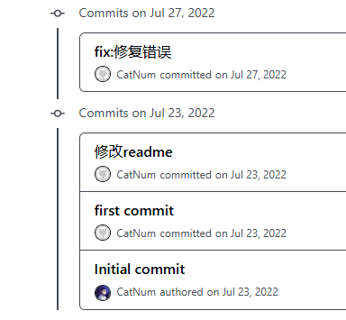
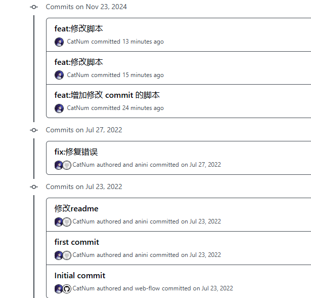

## 一、GitHub 提交中如何展示账号头像及相关信息？

    在 GitHub 上，我们提交代码时，提交会带上我们的 git 配置用户名及邮箱，但是 GitHub 的提交是不会校验提交是由哪个账号用户提交的，所以如果没有相应的配置，
在仓库的提交记录中，会出现很多的小灰头像。
    如下所示：



    这会造成我们不知道这条记录是由谁提交的，大家也不会知道你提交了这行代码。
    而最下面的提交会显示头像，是一位我们当初创建该仓库是在 GitHub 网页上手动创建的，所以会关联账号。

### 1、如何绑定提交中的用户名和自己的 GitHub 账号

GitHub 的账号是通过 邮箱来进行绑定的。

我们只需要将本地的 git 配置中的 email 更改为 GitHub 账号的邮箱，就可以了。

改完之后，我们发现，提交中的头像已经变成了 GitHub 账号的头像。



但是在下面的几个提交中，出现了两个头像。这是因为 git 中有两套与 commit 相关的变量。
即 `GIT_COMMITTER_NAME ` 和 `GIT_AUTHOR_NAME`

(1) GIT_AUTHOR_NAME
- 作者（Author）：代表最初编写提交内容的人。
- 用途：用于记录是谁创建了提交的内容。
- 场景：
  - 一般情况下，作者是当前实际撰写代码并执行 git commit 的用户。
  - 如果你基于别人的补丁或代码提交内容再提交（例如 git am 应用补丁或修改历史），可以通过设置 GIT_AUTHOR_NAME 来指定实际作者。

(2) GIT_COMMITTER_NAME 
- 提交者（Committer）：代表实际在版本库中创建此提交的人。
- 用途：用于记录是谁执行了提交操作。
- 场景：
  - 一般情况下，提交者和作者是同一个人。
  - 但在某些操作（例如 git rebase、git cherry-pick 或 git commit --amend）中，提交者可能不同于作者，因为这些操作会修改提交历史，提交操作本身是由当前用户完成的。

### 2、如何修改历史提交中的用户名和邮箱？

脚本如下：
```shell
#!/bin/sh

## 1. 执行rename.sh （windows 下可以在 git bash 里面执行）
## 2. 通过 git log 查看是否已修改完毕
## 3. 同步远程仓库 git push origin --force --all

git filter-branch -f --env-filter '

# OLD_EMAIL=""
# OLD_NAME="anini"
CORRECT_NAME="CatNum"
CORRECT_EMAIL="yxl19991104@gmail.com"

if [ "$GIT_COMMITTER_EMAIL" != "$CORRECT_NAME" ] || [ "$GIT_COMMITTER_NAME" != "$CORRECT_NAME" ]
then
    export GIT_COMMITTER_NAME="$CORRECT_NAME"
    export GIT_COMMITTER_EMAIL="$CORRECT_EMAIL"
fi

if [ "$GIT_AUTHOR_EMAIL" != "$CORRECT_EMAIL" ] || [ "$GIT_AUTHOR_NAME" != "$CORRECT_EMAIL" ]
then
    export GIT_AUTHOR_NAME="$CORRECT_NAME"
    export GIT_AUTHOR_EMAIL="$CORRECT_EMAIL"
fi

' -- --branches --tags
```

修改了历史提交中的用户名和邮箱之后，我们需要保证之后的提交记录也是正确的。

但是有时候我们会遇到一种情况：即在一台机器上向两套远程仓库提交代码，那么如何动态管理 git 账户及邮箱呢？

有一个方法是可以设置单个项目的用户名和邮箱，但是当维护的服务多了之后，就会非常麻烦了，而且容易忘记。

git 提供了根据文件夹来设置用户名和邮箱的功能，我们只需要在项目根目录下创建一个 .gitconfig 文件，里面配置好用户名和邮箱，就可以了。

### 3、如何根据文件夹设置用户名和邮箱？


#### 3.1 Git 配置文件层级

git 分为三个层级的配置：
- 系统层级: /etc/gitconfig，作用于系统中每位用户的 Git 配置。
- 用户层级: ~/.gitconfig，作用于具体用户的 Git 配置。
- 项目层级: .git/config，作用于具体仓库，只对该仓库有效。

#### 3.2 [includeIf]

通过设置该配置项，可以向满足条件的仓库使用指定的配置文件。

语法如下：
```shell
[includeIf "<keyword>:<data>"]
  path = path/to/gitconfig
```

其中支持的 keyword 关键词有gitdir、gitdir/i、onbranch：
- gitdir: 如果仓库的路径符合该条件，则使用该配置文件；
- gitdir/i：gitdir 的大小写不敏感版本。
- onbranch：如果仓库的分支符合该条件，则使用该配置文件。

所以如果我们想根据目录来动态管理用户名和邮箱，我们需要找到对应系统上的用户级别 git 配置文件，然后添加上下面的配置：

```shell
[includeIf "gitdir:~/GitHub/"]
  path = ~/GitHub/.gitconfig
```

然后在 GitHub 目录下添加一个 .gitconfig 文件，里面配置好用户名和邮箱，就可以了。

注意：
- includeIf "gitdir:~/GitHub/" 中 gitdir: 后不能有任何除路径之外的任何字符，包括空格。

更改完之后，可以使用 `git config --list --show-origin` 来查看是否配置成功

