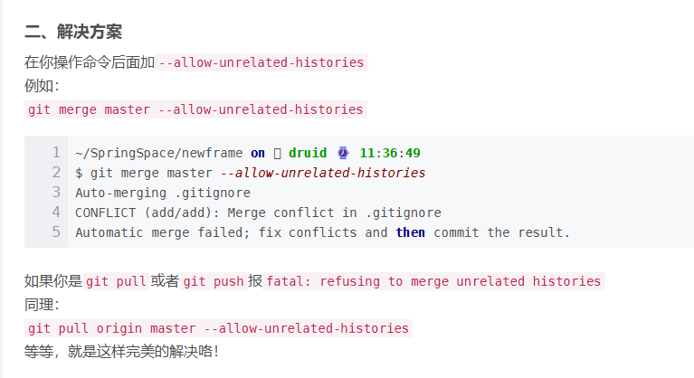

[git中的各种撤销操作](https://segmentfault.com/a/1190000011910766)
| [push和commit的撤销](https://blog.51cto.com/u_15328720/3384011)
| [git区间-查看分支提交记录](https://blog.csdn.net/weixin_35193131/article/details/113491119)

# 一、git 常用指令

| <div style="width: 120pt">指令</div>                                  | <div style="width: 260pt">参数</div>                                                                                                          | <div style="width: 260pt">描述</div>                                                  | 示例 |
|---------------------------------------------------------------------|---------------------------------------------------------------------------------------------------------------------------------------------|-------------------------------------------------------------------------------------|----|
| git init                                                            |                                                                                                                                             | 在当前目录新建一个git代码库                                                                     |    |
| git reset                                                           | --soft:修改HEAD指向，不会修改本地代码 </br>--hard:修改本地代码为指定版本                                                                                            | 撤销git push操作                                                                        |    |
| git log                                                             | --pretty:可以控制日志输出内容的详尽程度 </br>-p:可以显示提交记录的差异                                                                                                | 默认展示所有提交记录，可以选择远程仓库和分支，也可以选择                                                        |    |
| git status                                                          | -s:简短显示                                                                                                                                     | 显示工作区和暂存区的差异                                                                        |    |
| git push                                                            | --force:强制推，当进行版本回退的时候使用                                                                                                                    | 更新操作                                                                                |    |
| git checkout                                                        | -b:创建新分支并切换到该分支  -vv:获取本地分支和远程分支的关联情况                                                                                                       | 切换分支                                                                                |    |
| git checkout -f                                                     |                                                                                                                                             | 【放弃工作区和暂存区的所有修改】                                                                    |    |
| git checkout --filename                                             | git checkout -- . 撤销所有文件工作区修改                                                                                                               | 【撤销工作区的修改】可以将工作区的代码（N）恢复为之前的版本（N-1），需要指定文件目录。如果后悔可以在IDE中右击选择历史记录升版本到N。只能修改被git追踪的文件 |    |
| git stash                                                           | save "注解":指定注解 </br>list:展示存储的修改记录 </br>pop:将修改拿出来并删除记录 </br>apply:将修改拿出来且不删除记录 drop:删除指定记录 clear:清空记录 </br>show:展示与当前分支差异 [-p 可以显示文件具体的修改] | 【工作区修改暂存到堆栈】可以将git以跟踪的工作区中的修改代码暂存到内存中（先进后出），也可以在之后拿出来                               |    |
| git remote                                                          |                                                                                                                                             | 查看远程仓库                                                                              |    |
| [git fetch](https://blog.csdn.net/qh_java/article/details/77969010) |                                                                                                                                             | 拉取远程代码                                                                              |    |
| git merge                                                           |                                                                                                                                             | 合并指定分支到当前分支                                                                         |    |
| git pull                                                            |                                                                                                                                             | git pull 相当于 git fetch+git merge                                                    |    |
| git remote prune origin                                             |                                                                                                                                             | 在本地删除远程库中已经删除的分支                                                                    |    |
| git commit --amend                                                  |                                                                                                                                             | 进入最后一次 commit 的详情信息中更改                                                              |    |
|                                                                     |                                                                                                                                             |                                                                                     |    |
|                                                                     |                                                                                                                                             |                                                                                     |    |

```shell
git reset --soft HEAD^      # 撤销上次的 commit 
```

```text
Git 创建远程分支:
git checkout -b my-test  //在当前分支下创建my-test的本地分支分支
git push origin my-test  //将my-test分支推送到远程
git branch --set-upstream-to=origin/my-test //将本地分支my-test关联到远程分支my-test上   
git branch -a //查看远程分支 
```

```text
Git 推送本地分支到指定远程分支：
git push <remote_name> <local_branch_name>:<remote_branch_name> // <remote_name>：远程仓库的名称，默认是origin。

- 如果远程分支不存在，这条命令将会创建它。

- 如果远程分支已经存在，Git默认会拒绝推送，以防止覆盖远程分支上的更改。如果你确定要强制推送（覆盖远程分支），可以使用--force选项（慎用），
```

```text
Git 拉取远程 tag 分支代码：
git checkout -b new-branch-name v1.0.0
```

## 1.1 如何合并指定文件和目录

[博客](https://juejin.cn/post/6844903598241873928)

```text
前提条件：当前在 v2.1.2 分支，v2.1.1 分支的 pkg/object 目录下有文件更新需要合并到 v2.1.2 分支
使用命令 git checkout release-v2.1.1 pkg/object ，则可以完成将 pkg/object 目录从 v2.1.1 合并到 v2.1.2 
```

# 二、git 遇到的问题

## 2.1 git pull 超时

情况：之前 `git` 正常，没有做什么配置。突然有一天拉代码就超时了，本来以为是网络问题，但是 `github`
正常访问，且换网、第二天再拉还是不行；遂怀疑是不是 `ssh` 有问题了，
尝试 `http` 克隆代码，也不行。遂网上查询，看到很多讲代理的帖子。

前提条件：

1. 使用 clash
2. 开启系统代理

解决方法：[在 HTTPS 端口使用 SSH](https://docs.github.com/zh/authentication/troubleshooting-ssh/using-ssh-over-the-https-port "在 HTTPS 端口使用 SSH")

## 2.2 如何更新提交信息中的用户名和邮箱，以及如何批量修改

> 参考链接：
>
> [git奇淫技巧：如何修改commit历史记录的名字(我的github头像怎么没了😱)](https://juejin.cn/post/7256346521644548151 "git奇淫技巧：如何修改commit历史记录的名字(我的github头像怎么没了😱)")

2024/11/22 二次更新

之前的脚本在我使用自己的电脑时，没有产生本来的效果。（之前应该是在公司电脑上更换的用户名和邮箱）。
1
遂找了新的脚本，参考链接如下：

> [[Github实战]批量修改git commit记录中的用户名和邮箱](https://blog.csdn.net/aaaadong/article/details/120729288" [Github实战]批量修改git commit记录中的用户名和邮箱")

使用这种类型的脚本，会有一个问题：
1. 我在 A 电脑和 B 电脑上同时拉取仓库最新代码
2. 在 A 电脑上使用批量修改脚本，修改用户名和邮箱，提交到远程仓库
3. 在 B 电脑进行拉取（git pull），会报错 `fatal: refusing to merge unrelated histories`

本来我也纳闷，因为是一个仓库，但是后来我想到，应该是因为我修改了 用户名 和 邮箱 导致的。

然后我就对比了一下本地和远程的 commit，确实不一样。

在想到之前，我谷歌了相关问题的解决方案，如下：


根据如下的方式解决之后，推送到远程之后，我发现我最新的提交中的变更文件有很多之前已经发生的变更（也就是以前的提交）。同时，我的远程仓库的 commit 
数量从 280+ 变更到了 400+，具体我也不记得了，但是现在想来应该是 2倍左右 的变动。

至于为什么 `最新的 commit 会包含之前提交的变更` 以及 `为什么 commit数量 会有大概 2倍 的变动`。

大概是因为这个忽略报错的命令，会将我 B 电脑上的 `变更之前的 commit `和 A 电脑上
`变更之后的 commit `合并提交到远程仓。虽然 commit 内容相同，但是因为 commit 号不同，所以相加了。

**所以，发生了错误尽量不要粗鲁的去解决它，而是要找到为什么会这样的原因，然后再从根本上解决问题。**


## 2.3 如何将 Github 的提交中的用户名和你的 Github 账号关联起来

当你在本地创建提交并将其推送到 GitHub 时，Git 会使用你的配置中的电子邮件地址作为提交的作者信息。GitHub 会根据提交的电子邮件地址来识别并关联这个提交到你的 GitHub 账号。

## 2.4 Windows 环境下，将 Goland  的 Terminal 设置为 git bash，中文乱码问题部分解决 

1. 进入 Git 安装目录的 etc 目录下
2. 打开 bash.bashrc 文件，将如下文字加入
```text
export LANG="zh_CN.UTF-8"
export LC_ALL="zh_CN.UTF-8"
```

> 参考链接：
>
> [Windows系统下，GoLand中选定Git Bash终端，中文乱码的解决对策 转载](https://blog.51cto.com/u_15080026/4329974 "Windows系统下，GoLand中选定Git Bash终端，中文乱码的解决对策 转载")