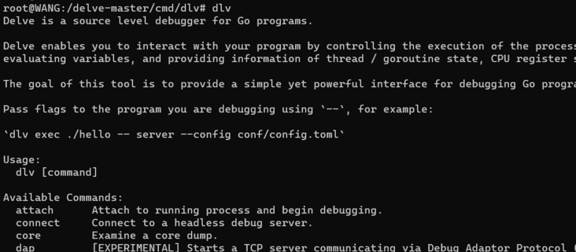
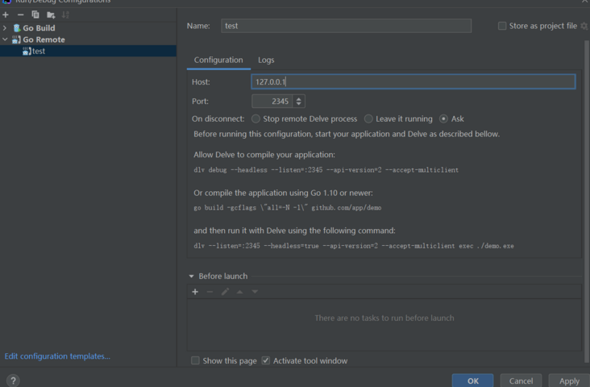

# dlv + Goland 远程调试

远程调试就是使用使用本地 IDE 来调试远程服务器上的服务。本地打断点，调用远程服务的接口。本地就会停在断点。

相当于 debug 远程服务。优点是可以保持环境的一致性。

## dlv 的安装

git 仓库：https://github.com/derekparker/delve

将 div 安装到远程服务器。Linux下的安装：

git 仓库中有两种安装方式：

1. 使用 go get

```text 
go get github.com/go-delve/delve/cmd/dlv
```

这种方式我没有安装成功，不太了解需要在哪个目录下使用该命令来进行安装。

2. 使用库安装

```text
$ git clone https://github.com/go-delve/delve.git $GOPATH/src/github.com/go-delve/delve
$ cd $GOPATH/src/github.com/go-delve/delve
$ make install
```

这里我是 clone 到我项目所在目录。

安装完成之后验证：



## dlv + Goland 的使用

1. 打包：
```text
go build -gcflags "all=-N -l" test1.go
```
2. 运行
```text
dlv --listen=:2345 --headless=true --api-version=2 --accept-multiclient exec ./test1
```

> 注：dlv 运行的服务只能使用 kill 来讲进程杀死的方式来终止服务

3. 本地Goland配置
其中 Host 设置我对应服务器 IP, Port 为对应端口

